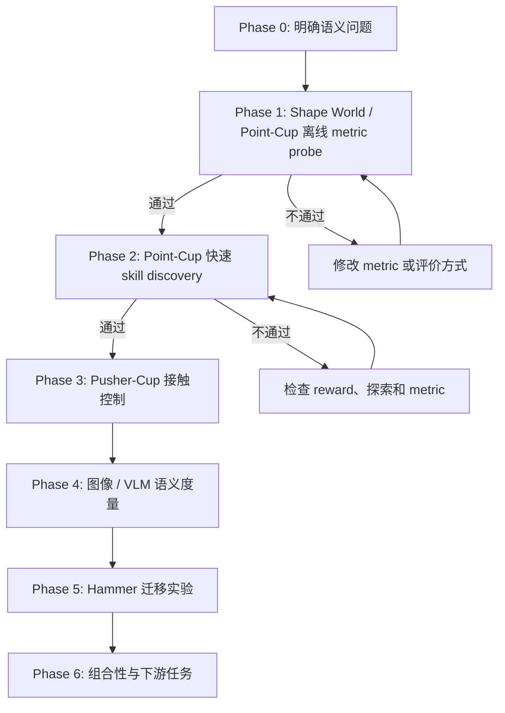

# Semantic Skill Discovery: Experiment Flow

> [当前状态]
> 分支：`codex/skill-discovery`
>
> 当前阶段：Phase 1，`Semantic Shape World / Point-Cup` 第一轮 metric sanity check 已跑通，但尚未通过完整 gate。
>
> 当前动作：把第一轮对照扩展到 5 个 seed，并把过于简单的 kNN audit 改成带强 nuisance variation 的检验；此阶段不训练 Hammer，也不调用 VLM。

## 一眼看完整流程



核心顺序是：先证明“什么距离才有意义”，再证明它能指导快速 skill discovery，之后才付出 Hammer 和 VLM 的训练成本。

## 核心研究问题

普通 unsupervised skill discovery 在 raw state space 中扩大覆盖范围。这个目标容易优先覆盖体积大的行为区域，而忽略体积小但语义关键的事件。

最小例子：一个球可以位于二维平面的任意位置，“球在杯子里”只占很小的几何区域，但对人来说，“杯内”和“杯外”应当是两个同等重要的语义状态。

我们要检验：

1. 使用 semantic representation `phi` 计算轨迹差异，能否比 raw-state distance 更公平地覆盖稀有语义模式？
2. 这个 representation 能否保留可控、与物体交互有关的行为，而不是只产生视觉上不同但不可执行的状态？
3. 离线验证过的 metric 放入 skill discovery reward 后，是否真的产生更可解释、可组合的技能？

暂定主假设：

`raw state diversity -> geometric coverage`

`semantic diversity + controllability -> meaningful behavior coverage`

## 为什么不先跑 Hammer

Hammer 同时包含高维机械臂控制、接触动力学、长时间 PPO 训练、视频采集和 VLM 推理。若结果失败，很难判断是 metric、探索、控制、物理环境还是训练稳定性出了问题。

因此 Hammer 现在是迁移阶段，不是概念验证阶段。小环境会把变量逐层加回来：

| 阶段 | 控制难度 | 接触 | 图像 / VLM | 主要问题 |
| --- | ---: | ---: | ---: | --- |
| Shape World / Point-Cup offline | 无训练 | 否 | 否 | metric 是否表达我们要的语义 |
| Point-Cup discovery | 很低 | 否 | 否 | metric 是否能指导探索 |
| Pusher-Cup | 低 | 是 | 可选 | 语义行为是否可控且需要交互 |
| Visual probe | 低 | 是 | 是 | foundation-model space 是否接近 oracle |
| Hammer | 高 | 是 | 是 | 方法能否迁移到真实研究环境 |

## Phase 0：研究定义

状态：`完成初稿`

我们暂时把一个“有意义的 skill”定义为：

1. 它对应可区分的轨迹级行为，而不只是不同的静态 pose。
2. 它改变任务相关对象或对象关系，而不只是机械臂关节在大空间里运动。
3. 它位于环境中可执行的 manipulation subspace。
4. 一组 skills 应当公平覆盖稀有和常见的 semantic equivalence classes。
5. 在后期实验中，这些 skills 应能被高层策略选择或组合来完成任务。

这个定义连接旧笔记中的四条线索：DIAYN/DADS 的可区分性、LSD/CSD/METRA 的距离度量、LGSD 的 language space、RGSD 的 reference-grounded feasible manifold。

## Phase 1：Semantic Shape World / Point-Cup 离线 Metric Probe

状态：`进行中，第一轮单 seed 对照完成`

### 环境形式

这不是 Isaac Lab 环境，也不依赖刚体或软体物理。它是一个可参数化的二维关系图形：

- 图节点：`ball`、`cup`，后续可增加 `pusher`、`obstacle`。
- 节点属性：位置、大小、颜色和形状参数。
- 关系边：`outside`、`near`、`crossing`、`inside`，后续增加 `touching` 和 `pushing`。
- 转移：直接、确定性的几何规则。
- 画面：从图状态直接栅格化为小尺寸 RGB 图像，供后续 visual/VLM probe 使用。

环境接口从第一天就接受 layout 参数，因此杯子的位置、半径、开口方向和形状可以改变。但第一轮固定布局，只验证 metric。形变在第二轮作为 held-out generalization 测试，不作为第一轮训练变量。

### Point-Cup 模式

- 世界：二维正方形 `[-1, 1] x [-1, 1]`。
- 对象：一个可移动的球和一个固定小杯区。
- 动作：二维位移，直接控制球；每步动作有最大幅度。
- Episode：64 control steps。
- 杯区面积约为世界面积的 1% 到 3%，故 `inside` 是几何上稀有的状态。
- 第一版无物理引擎、无神经网络、无 GPU 依赖，目标是几秒内生成可复现实验数据。
- 第一版杯区固定；通过 gate 后再测试大小、长宽比、位置和开口方向变化。

### 数据集

生成两个互不混用的数据池：

1. `discovery_pool`：随机动作产生的自然不平衡数据，用于模拟 raw exploration。
2. `balanced_audit`：脚本策略均匀生成 `outside`、`boundary-crossing`、`inside` 轨迹，只用于评价 metric。

每条轨迹保存：

- `states`: 球的 `(x, y)`。
- `actions`: 每步二维动作。
- `semantic_labels`: `outside`、`entering`、`inside`、`leaving`。
- `frames`: 可选的俯视 RGB 图像，留给 Phase 4。
- `seed` 和环境配置。

### 第一轮 metric

| 名称 | 定义 | 作用 |
| --- | --- | --- |
| Raw L2 | 标准化后的 `(x, y)` 欧氏距离 | 现有 volume-based baseline |
| Random feature | 固定随机投影后的距离 | 负对照 |
| Semantic oracle | 语义类别距离 + 很小的类内几何距离 | 理想上界，不是最终方法 |
| Object transition | 对 `delta state` 与 inside/outside relation 编码 | 检查轨迹级表示是否优于静态状态 |

Oracle 的作用是先验证完整实验逻辑。如果连 oracle 都不能改善语义覆盖，问题在评价或 reward 设计，不应开始 VLM 或 Hammer。

### 离线评价

1. `Balanced kNN accuracy`：距离最近的轨迹是否具有相同语义。
2. `Rare semantic recall`：在固定数量 representative trajectories 下，是否选到稀有 `inside` 和 crossing 事件。
3. `Semantic coverage entropy`：各语义类的访问是否均衡。
4. `Geometric coverage`：避免 semantic metric 通过坍缩到一个点取得虚假高分。
5. `Nuisance invariance`：同一语义类内的大位置变化不应压过 inside/outside 的差异。

### Phase 1 Gate

同时满足以下条件才进入训练：

- Oracle 对 rare semantic recall 明显优于 Raw L2。
- Oracle 的 semantic coverage entropy 更高。
- Oracle 没有完全丢掉几何覆盖；暂定至少保留 Raw L2 的 70%。
- 结果在至少 5 个随机种子上方向一致。
- 自动标签随机抽样 30 条轨迹，人工查看没有系统性错误。

产物计划：

- `skill_discovery/point_cup.py`
- `skill_discovery/generate_point_cup_dataset.py`
- `skill_discovery/evaluate_metrics.py`
- `outputs/skill_discovery/point_cup/<run_id>/config.json`
- `outputs/skill_discovery/point_cup/<run_id>/metrics.json`
- `outputs/skill_discovery/point_cup/<run_id>/metric_comparison.svg`

### 独立运行环境

小环境不使用 `isaaclab510`。独立 Conda 环境位于：

`/home/wang100/data/conda/envs/skill-discovery`

当前仅安装 Python 3.11 和 NumPy。测试命令：

```bash
/home/wang100/data/conda/envs/skill-discovery/bin/python -m unittest skill_discovery.test_point_cup
```

### 第一轮结果

Run：`point_cup_probe_20260722_022926`

候选池共 4096 条自然不平衡随机轨迹：`outside=3847`、`inside=14`、`entering=31`、`leaving=204`。平衡审计数据的自动观察类别与生成意图 100% 一致。

| Metric | 代表轨迹类覆盖 | Rare recall | 语义熵 | 几何覆盖 | Inter / intra distance |
| --- | ---: | ---: | ---: | ---: | ---: |
| Raw L2 | 0.50 | 0.33 | 0.207 | 0.574 | 1.25 |
| Random feature | 0.50 | 0.33 | 0.325 | 0.562 | 1.22 |
| Object transition | 0.50 | 0.33 | 0.207 | 0.543 | 1.42 |
| Semantic oracle | **1.00** | **1.00** | **0.813** | **0.598** | **20.33** |

第一轮支持的有限结论：当候选数据中 rare modes 存在但数量很少时，Raw L2 的代表点选择主要追逐几何极值；oracle metric 能选到四类语义，同时没有牺牲本轮几何覆盖。

第一轮不能支持的结论：这还不能证明 learned metric 或 VLM 有效，也不能证明 semantic reward 能训练出对应 policy。


> [失败记录]
> 第一版随机动作幅度单一，候选池中没有持续 `inside` 轨迹，导致任何 metric 都不可能得到完整 rare recall。第二版只扩大随机动作幅度分布，没有做类别平衡，候选池出现 14 条持续 inside 轨迹后再进行比较。

> [失败记录]
> 当前 balanced kNN accuracy 对四种 metric 都是 1.0，因为脚本生成的四类轨迹在运动模式上太容易区分。这个指标只能作为数据管线 sanity check，不能作为 metric 优劣证据。下一轮会加入相同语义下的大位置/形状变化，以及不同语义下很小的像素和几何变化。

## Phase 2：Point-Cup 快速 Skill Discovery

状态：`等待 Phase 1`

这一阶段才开始训练，但环境和网络都很小，目标运行时间是分钟级而不是小时或天。

最小对照：

1. Random policy。
2. Raw-state kNN entropy reward。
3. Semantic-oracle kNN entropy reward。
4. 若需要，再加 DIAYN-style discriminator baseline。

所有方法使用相同策略网络、步数、seed 和优化器。主要曲线：

- `inside_rate`
- `enter_exit_count`
- `semantic_entropy`
- `xy_coverage`
- `skill_semantic_mutual_information`

### Phase 2 Gate

- Semantic reward 在多个 seed 上提高 inside/outside 的均衡覆盖。
- 产生的差异来自策略行为，而不是 reset distribution。
- 不同 latent skill 对应稳定、可复现的轨迹模式。
- Raw baseline 仍作为几何覆盖的参照，不隐藏其可能更强的指标。

## Phase 3：Pusher-Cup 规则接触控制

状态：`等待 Phase 2`

将“直接控制球”改成“控制一个二维 pusher，只有图形重叠或接触时球才按规则移动”。它仍然不是物理模拟，只加入最小 manipulation constraint：

- 状态：pusher pose、ball pose 和速度。
- 动作：pusher 的二维速度或位移。
- 语义事件：approach、contact、push、enter cup、leave cup。
- 失败模式：只让 pusher 自己进入杯区，球没有发生语义变化。
- 接触转移：使用确定性几何规则，例如接触时把 pusher 位移的一部分传给 ball，不计算质量、摩擦、碰撞求解或软体形变。

这一步检验 semantic metric 是否与 controllability/object interaction 对齐。若 oracle reward 仍只产生无效动作，就需要在 metric 中加入 object transition 或 reachability constraint。

## Phase 4：图像与 VLM Metric

状态：`等待小环境通过`

在 Point-Cup/Pusher-Cup 上先比较：

1. Raw pixels。
2. 预训练 visual embedding。
3. Vision-language embedding，prompt 固定并缓存。
4. 使用少量 reference trajectories 做 contrastive calibration。
5. Oracle semantic metric，作为上界。

VLM 只离线编码关键帧或短 clip，并缓存 embedding，不放在每个 RL step 在线调用。这样可以把最慢部分从训练 loop 中移走。

关键问题不是“VLM 能不能看出杯子”，而是它的距离排序是否满足：

`different meaningful modes > same mode with nuisance variation`

## Phase 5：迁移到 Hammer

状态：`后续`

只有小环境已经回答以下问题后才进入 Hammer：metric 有效、reward 可训练、object interaction 不会被绕过、视觉 embedding 可以缓存。

Hammer 第一版会复用现有 Isaac Lab 轨迹 logger，而不是从零重建数据管线。已有 logger 会保存 robot、object、goal、action、policy observation 和对应视频路径。

初始 Hammer 语义事件候选：

- no object interaction
- reach / contact
- object perturbation
- lift
- transport
- near-target placement
- drop / release

注意：旧环境的 `successes` counter 曾经允许“接近目标但没有真正举起 hammer”的 false positive，因此它不能直接作为语义 ground truth。Hammer gate 必须使用 object motion、lift 条件与视频抽查。

## Phase 6：组合性与下游任务

状态：`远期`

最终不只看 skill 是否不同，还要看它们能否被调用和组合：

- 训练高层 policy 选择 latent skill。
- 比较 raw skill discovery 与 semantic skill discovery 的下游 sample efficiency。
- 测试训练时没有直接出现的目标组合。
- 检查 semantic classes 的公平覆盖是否真的带来任务收益。

## 异步协作格式

后续消息和本文件记录统一使用下面的标签：

> [计划]
> 下一段准备做什么，以及为什么现在做。

> [进度]
> 已经完成什么，当前运行到哪里。

> [结果]
> 有证据支持的结论，附 run id 和文件路径。

> [问题 Q-XXX | 阻塞 / 非阻塞]
> 需要你判断的研究选择。非阻塞问题会写明默认假设，我会继续推进；你之后回复时可以改变方向。

> [方向变化]
> 你或实验结果改变了路线。先写变化和原因，再修改后续计划。

> [失败记录]
> 失败的假设、命令、指标和原因。保留它，避免以后重复跑。

每次开始新的大阶段前，至少更新：当前状态、阶段目标、唯一变化变量、pass/fail gate 和产物路径。每次实验完成后，至少记录 run id、配置、结果和下一步决定。

## 当前问题队列

> [问题 Q-001 | 非阻塞]
> 在最小 Point-Cup 中，暂时把 `inside` 和 `outside` 当作同等重要的两个语义类，即使它们的几何体积差很多。默认按这个定义继续。

> [问题 Q-002 | 非阻塞]
> 第一轮先使用 semantic oracle 验证实验结构，再加入 VLM。这样能区分“实验结构失败”和“VLM metric 失败”。默认按这个顺序继续。

> [问题 Q-003 | 非阻塞]
> 环境支持形状变化，但第一轮使用固定杯区；通过 metric sanity check 后，再把 cup size、aspect ratio、position 和 opening direction 作为 held-out 变化。默认按这个顺序继续。

## 决策记录

### D-001：先验证 metric，再训练大环境

- 日期：2026-07-22
- 决定：Hammer 从第一阶段移到迁移阶段。
- 原因：Hammer 训练慢，并同时引入高维控制、接触、RL 稳定性和 VLM 成本，失败时不可诊断。
- 新路线：Point-Cup offline -> Point-Cup training -> Pusher-Cup -> visual/VLM -> Hammer。

### D-002：保留 oracle 上界

- 日期：2026-07-22
- 决定：第一轮使用手工 semantic oracle，但只作为 sanity-check upper bound。
- 原因：先证明“如果 metric 正确，pipeline 是否能产生预期结果”。最终方法仍要用可学习或 foundation-model representation。

### D-003：使用可参数化图形环境，不使用物理引擎

- 日期：2026-07-22
- 决定：小环境使用纯 NumPy 的关系图状态和直接栅格渲染，不使用 Isaac Lab。
- 原因：第一阶段只需要检验 semantic metric；物理控制和昂贵渲染会增加不必要的变量。
- 形变策略：接口支持变形，第一轮固定形状，第二轮才把形变作为泛化测试。

## 实验日志

### 2026-07-22：项目启动

> [进度]
> 阅读旧 Skill Discovery 笔记并核对 SimToolReal 代码。建立分支 `codex/skill-discovery`。

> [方向变化]
> 原计划直接复用 Hammer 轨迹做 metric probe。根据训练时间与变量耦合问题，改为先做 Point-Cup/Pusher-Cup 小环境，Hammer 后移。

> [方向变化]
> 小环境进一步明确为无物理的 Semantic Shape World。图形和关系可以参数化变化，但形变不是首轮必要条件。

> [计划]
> 下一步实现 Point-Cup 环境、数据生成器和最小 raw-vs-oracle metric 对照。完成后把真实 run id、曲线和结论写回本文件。
