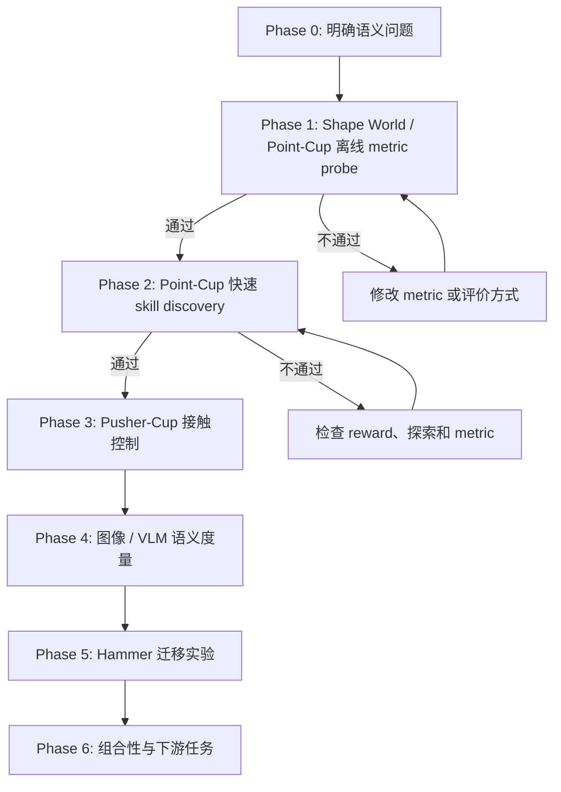

# Semantic Skill Discovery: Experiment Flow

> [当前状态]
> 分支：`codex/skill-discovery`
>
> 当前阶段：Phase 2 已完成。5-seed 数值 gate 和 deterministic policy rollout visual audit 均通过，准备进入 Phase 3。
>
> 当前动作：Pusher-Cup 环境单元测试和 scripted visual audit 已通过；下一步运行 offline reachability audit。仍不训练 Hammer、不调用 VLM，也不使用物理引擎。

## 一眼看完整流程



核心顺序是：先证明“什么距离才有意义”，再证明它能指导快速 skill discovery，之后才付出 Hammer 和 VLM 的训练成本。

## 核心研究问题

普通 unsupervised skill discovery 在 raw state space 中扩大覆盖范围。这个目标容易优先覆盖体积大的行为区域，而忽略体积小但语义关键的事件。

最小例子：一个球可以位于二维平面的任意位置，“球在杯子里”只占很小的几何区域，但对人来说，“杯内”和“杯外”应当是两个同等重要的语义状态。

我们要检验：

1. 使用 semantic representation `phi` 计算轨迹差异，能否比 raw-state distance 更公平地覆盖稀有语义模式？
2. 这个 representation 能否保留可控、与物体交互有关的行为，而不是只产生视觉上不同但不可执行的状态？
3. 离线验证过的 metric 放入 skill discovery reward 后，是否真的产生更可解释、可组合的技能？

暂定主假设：

`raw state diversity -> geometric coverage`

`semantic diversity + controllability -> meaningful behavior coverage`

## 为什么不先跑 Hammer

Hammer 同时包含高维机械臂控制、接触动力学、长时间 PPO 训练、视频采集和 VLM 推理。若结果失败，很难判断是 metric、探索、控制、物理环境还是训练稳定性出了问题。

因此 Hammer 现在是迁移阶段，不是概念验证阶段。小环境会把变量逐层加回来：

| 阶段 | 控制难度 | 接触 | 图像 / VLM | 主要问题 |
| --- | ---: | ---: | ---: | --- |
| Shape World / Point-Cup offline | 无训练 | 否 | 否 | metric 是否表达我们要的语义 |
| Point-Cup discovery | 很低 | 否 | 否 | metric 是否能指导探索 |
| Pusher-Cup | 低 | 是 | 可选 | 语义行为是否可控且需要交互 |
| Visual probe | 低 | 是 | 是 | foundation-model space 是否接近 oracle |
| Hammer | 高 | 是 | 是 | 方法能否迁移到真实研究环境 |

## Phase 0：研究定义

状态：`完成初稿`

我们暂时把一个“有意义的 skill”定义为：

1. 它对应可区分的轨迹级行为，而不只是不同的静态 pose。
2. 它改变任务相关对象或对象关系，而不只是机械臂关节在大空间里运动。
3. 它位于环境中可执行的 manipulation subspace。
4. 一组 skills 应当公平覆盖稀有和常见的 semantic equivalence classes。
5. 在后期实验中，这些 skills 应能被高层策略选择或组合来完成任务。

这个定义连接旧笔记中的四条线索：DIAYN/DADS 的可区分性、LSD/CSD/METRA 的距离度量、LGSD 的 language space、RGSD 的 reference-grounded feasible manifold。

## Phase 1：Semantic Shape World / Point-Cup 离线 Metric Probe

状态：`完成`

### 环境形式

这不是 Isaac Lab 环境，也不依赖刚体或软体物理。它是一个可参数化的二维关系图形：

- 图节点：`ball`、`cup`，后续可增加 `pusher`、`obstacle`。
- 节点属性：位置、大小、颜色和形状参数。
- 关系边：`outside`、`near`、`crossing`、`inside`，后续增加 `touching` 和 `pushing`。
- 转移：直接、确定性的几何规则。
- 画面：从图状态直接栅格化为小尺寸 RGB 图像，供后续 visual/VLM probe 使用。

环境接口从第一天就接受 layout 参数，因此杯子的位置、半径、开口方向和形状可以改变。但第一轮固定布局，只验证 metric。形变在第二轮作为 held-out generalization 测试，不作为第一轮训练变量。

### Point-Cup 模式

- 世界：二维正方形 `[-1, 1] x [-1, 1]`。
- 对象：一个可移动的球和一个固定小杯区。
- 动作：二维位移，直接控制球；每步动作有最大幅度。
- Episode：64 control steps。
- 杯区面积约为世界面积的 1% 到 3%，故 `inside` 是几何上稀有的状态。
- 第一版无物理引擎、无神经网络、无 GPU 依赖，目标是几秒内生成可复现实验数据。
- 第一版杯区固定；通过 gate 后再测试大小、长宽比、位置和开口方向变化。

### 数据集

生成两个互不混用的数据池：

1. `discovery_pool`：随机动作产生的自然不平衡数据，用于模拟 raw exploration。
2. `balanced_audit`：脚本策略均匀生成 `outside`、`boundary-crossing`、`inside` 轨迹，只用于评价 metric。

每条轨迹保存：

- `states`: 球的 `(x, y)`。
- `actions`: 每步二维动作。
- `semantic_labels`: `outside`、`entering`、`inside`、`leaving`。
- `frames`: 可选的俯视 RGB 图像，留给 Phase 4。
- `seed` 和环境配置。

### 第一轮 metric

| 名称 | 定义 | 作用 |
| --- | --- | --- |
| Raw L2 | 标准化后的 `(x, y)` 欧氏距离 | 现有 volume-based baseline |
| Random feature | 固定随机投影后的距离 | 负对照 |
| Semantic oracle | 语义类别距离 + 很小的类内几何距离 | 理想上界，不是最终方法 |
| Object transition | 对 `delta state` 与 inside/outside relation 编码 | 检查轨迹级表示是否优于静态状态 |

Oracle 的作用是先验证完整实验逻辑。如果连 oracle 都不能改善语义覆盖，问题在评价或 reward 设计，不应开始 VLM 或 Hammer。

### 离线评价

1. `Balanced kNN accuracy`：距离最近的轨迹是否具有相同语义。
2. `Rare semantic recall`：在固定数量 representative trajectories 下，是否选到稀有 `inside` 和 crossing 事件。
3. `Semantic coverage entropy`：各语义类的访问是否均衡。
4. `Geometric coverage`：避免 semantic metric 通过坍缩到一个点取得虚假高分。
5. `Nuisance invariance`：同一语义类内的大位置变化不应压过 inside/outside 的差异。

### Phase 1 Gate

同时满足以下条件才进入训练：

- Oracle 对 rare semantic recall 明显优于 Raw L2。
- Oracle 的 semantic coverage entropy 更高。
- Oracle 没有完全丢掉几何覆盖；暂定至少保留 Raw L2 的 70%。
- 结果在至少 5 个随机种子上方向一致。
- 自动标签随机抽样 30 条轨迹，人工查看没有系统性错误。

产物计划：

- `skill_discovery/point_cup.py`
- `skill_discovery/generate_point_cup_dataset.py`
- `skill_discovery/evaluate_metrics.py`
- `outputs/skill_discovery/point_cup/<run_id>/config.json`
- `outputs/skill_discovery/point_cup/<run_id>/metrics.json`
- `outputs/skill_discovery/point_cup/<run_id>/metric_comparison.svg`

### 独立运行环境

小环境不使用 `isaaclab510`。独立 Conda 环境位于：

`/home/wang100/data/conda/envs/skill-discovery`

当前仅安装 Python 3.11 和 NumPy。测试命令：

```bash
/home/wang100/data/conda/envs/skill-discovery/bin/python -m unittest skill_discovery.test_point_cup
```

### 第一轮结果

Run：`point_cup_probe_20260722_022926`

候选池共 4096 条自然不平衡随机轨迹：`outside=3847`、`inside=14`、`entering=31`、`leaving=204`。平衡审计数据的自动观察类别与生成意图 100% 一致。

| Metric | 代表轨迹类覆盖 | Rare recall | 语义熵 | 几何覆盖 | Inter / intra distance |
| --- | ---: | ---: | ---: | ---: | ---: |
| Raw L2 | 0.50 | 0.33 | 0.207 | 0.574 | 1.25 |
| Random feature | 0.50 | 0.33 | 0.325 | 0.562 | 1.22 |
| Object transition | 0.50 | 0.33 | 0.207 | 0.543 | 1.42 |
| Semantic oracle | **1.00** | **1.00** | **0.813** | **0.598** | **20.33** |

第一轮支持的有限结论：当候选数据中 rare modes 存在但数量很少时，Raw L2 的代表点选择主要追逐几何极值；oracle metric 能选到四类语义，同时没有牺牲本轮几何覆盖。

第一轮不能支持的结论：这还不能证明 learned metric 或 VLM 有效，也不能证明 semantic reward 能训练出对应 policy。


> [失败记录]
> 第一版随机动作幅度单一，候选池中没有持续 `inside` 轨迹，导致任何 metric 都不可能得到完整 rare recall。第二版只扩大随机动作幅度分布，没有做类别平衡，候选池出现 14 条持续 inside 轨迹后再进行比较。

> [失败记录]
> 当前 balanced kNN accuracy 对四种 metric 都是 1.0，因为脚本生成的四类轨迹在运动模式上太容易区分。这个指标只能作为数据管线 sanity check，不能作为 metric 优劣证据。下一轮会加入相同语义下的大位置/形状变化，以及不同语义下很小的像素和几何变化。

### 五个 Seed 与 Nuisance Audit

Aggregate run：`point_cup_multiseed_20260722_0234`

Seeds：`7, 17, 27, 37, 47`

Nuisance audit 使用 12 个 held-out layouts。Positive pair 是同一语义和同一 canonical behavior 在不同 cup position / aspect ratio 下的轨迹；negative pair 是同一 layout 中几何上接近但语义不同的轨迹。

| Metric | Rare recall | 语义熵 | 几何覆盖 | Cross-layout kNN | Nuisance triplet |
| --- | ---: | ---: | ---: | ---: | ---: |
| Raw L2 | 0.267 ± 0.133 | 0.213 ± 0.119 | 0.615 ± 0.025 | 0.326 ± 0.037 | 0.030 ± 0.028 |
| Random feature | 0.333 ± 0.000 | 0.281 ± 0.100 | 0.602 ± 0.033 | 0.326 ± 0.044 | 0.025 ± 0.022 |
| Object transition | 0.333 ± 0.211 | 0.306 ± 0.198 | 0.552 ± 0.012 | 0.583 ± 0.044 | 0.633 ± 0.122 |
| Semantic oracle | **1.000 ± 0.000** | **0.829 ± 0.032** | 0.597 ± 0.021 | **1.000 ± 0.000** | **1.000 ± 0.000** |

每个 seed 都通过预先写下的 numeric gate。Oracle 保留的几何覆盖是 Raw 的约 97%，高于 70% gate。

30 条分层抽样轨迹同时覆盖 fixed 与 nuisance layouts。联系表每行依次为 start / middle / final；左侧颜色为灰色 outside、蓝色 inside、绿色 entering、橙色 leaving。人工查看和 manifest 均为 30/30 匹配。


完整汇总：`outputs/skill_discovery/point_cup/point_cup_multiseed_20260722_0234/summary.json`

> [结果]
> Phase 1 gate 通过。这个结论只证明 oracle semantic metric 的离线排序符合预期；它还没有证明该 metric 能通过 policy optimization 发现 rare mode。

## Phase 2：Point-Cup 快速 Skill Discovery

状态：`完成`

这一阶段才开始训练，但环境和网络都很小，目标运行时间是分钟级而不是小时或天。

### 第一轮训练设计

第一轮只使用两个 skills，因为当前最小语义关系是 binary `inside/outside`。若先放四个 skills，会强迫方法在并不存在的语义类中制造差异。

采用小型 tabular DIAYN-style mutual-information objective：

- Policy：`skill x discretized (x, y) -> 9 discrete actions` 的 logits table。
- Optimizer：batched REINFORCE，带 per-skill moving baseline 和固定 epsilon exploration。
- Reset：球从杯外同一小区域开始，避免 reset distribution 替策略制造语义差异。
- Raw discriminator input：episode 终点的二维 grid cell。
- Semantic discriminator input：episode 终点的 `inside/outside` relation。
- Intrinsic reward：`log q(z | feature) - log p(z)`。
- 唯一变化变量：discriminator 使用哪一种 feature。

这个实验不是最终算法，而是最小因果检验：当训练算法完全相同时，替换 representation 是否会把两个 skills 从“两个几何终点”改成“一个杯内、一个杯外”。

最小对照：

1. Random policy。
2. Raw endpoint DIAYN。
3. Semantic relation DIAYN。

所有方法使用相同策略网络、步数、seed 和优化器。主要曲线：

- `inside_rate`
- `enter_exit_count`
- `semantic_entropy`
- `xy_coverage`
- `skill_semantic_mutual_information`

同时记录 `endpoint_grid_mutual_information`，避免只展示 semantic 方法占优的指标。

### Phase 2 Gate

- Semantic reward 在多个 seed 上提高 inside/outside 的均衡覆盖。
- 产生的差异来自策略行为，而不是 reset distribution。
- 不同 latent skill 对应稳定、可复现的轨迹模式。
- Raw baseline 仍作为几何覆盖的参照，不隐藏其可能更强的指标。
- 首轮预注册的可读 gate：Semantic 方法中一个 skill 的 final inside rate 至少 0.8，另一个至多 0.2；5 个 seed 中至少 4 个满足。
- 若 Semantic 方法只偶然进入一次杯内但无法稳定复现，则判定失败。

### Phase 2 结果

Aggregate run：`tabular_diayn_multiseed_20260722_0243`

Seeds：`7, 17, 27, 37, 47`。每种方法每个 seed 都训练 400 iterations，并使用 1024 个无探索 evaluation episodes / skill。表中为 5-seed mean；`stable pass` 同时要求 evaluation gate 和最后 20 个训练 iterations 的稳定性 gate 通过。

| Method | High inside | Low inside | Semantic MI (bits) | Endpoint-grid MI (bits) | XY coverage | Stable pass |
| --- | ---: | ---: | ---: | ---: | ---: | ---: |
| Random policy | 0.0648 | 0.0609 | 0.00008 | 0.0177 | 0.4397 | 0 / 5 |
| Raw endpoint DIAYN | 0.0988 | **0.0000** | 0.0559 | **0.9950** | **0.4653** | 0 / 5 |
| Semantic relation DIAYN | **0.9846** | 0.0016 | **0.9351** | 0.9551 | 0.3866 | **5 / 5** |

这个结果没有把 raw baseline 的优势藏起来：它在 endpoint-grid MI 和 XY coverage 上最好，说明它确实学会了把两个 skills 放到不同几何终点。可是这些终点几乎都在杯外；它没有稳定发现几何体积很小的 `inside` relation。Semantic 方法牺牲了一部分 XY coverage，但 5 个 seed 都稳定地产生一个入杯 skill 和一个杯外 skill，同时保留了 0.955 bits 的 endpoint-grid MI。

Visual audit 重新加载 seed 7 的保存策略，关闭 epsilon exploration，每个 skill rollout 64 次，并展示其中 3 次的 5 个时间点。左侧第一条颜色依次表示 Random（灰）、Raw（蓝）、Semantic（绿）；第二条颜色表示 skill 0（橙）和 skill 1（紫）。抽样入杯率分别为 Random `0.0625/0.0313`、Raw `0.0000/0.0313`、Semantic `1.0000/0.0000`。人工查看确认 semantic skill 0 的展示轨迹确实把红球移入蓝色杯区，并非指标误判。


完整汇总：`outputs/skill_discovery/point_cup_training/tabular_diayn_multiseed_20260722_0243/summary.json`

> [结果]
> Phase 2 gate 通过。这只支持“在固定布局的直接控制 toy environment 中，semantic representation 改变了 discovery 的行为类别”这一有限结论；它还没有证明这些语义状态需要 object interaction，或能迁移到图像、VLM、Hammer。

## Phase 3：Pusher-Cup 规则接触控制

状态：`环境与 visual audit 通过，进行 reachability audit`

将“直接控制球”改成“控制一个二维 pusher，只有图形重叠或接触时球才按规则移动”。它仍然不是物理模拟，只加入最小 manipulation constraint：

- 状态：pusher pose、ball pose 和速度。
- 动作：pusher 的二维速度或位移。
- 语义事件：approach、contact、push、enter cup、leave cup。
- 失败模式：只让 pusher 自己进入杯区，球没有发生语义变化。
- 接触转移：使用确定性几何规则，例如接触时把 pusher 位移的一部分传给 ball，不计算质量、摩擦、碰撞求解或软体形变。

这一步检验 semantic metric 是否与 controllability/object interaction 对齐。若 oracle reward 仍只产生无效动作，就需要在 metric 中加入 object transition 或 reachability constraint。

### Phase 3 首轮实现计划

这一步仍保持二维图形环境，不退化成一维轨道，也不加入 Isaac Lab：

1. `Environment correctness`：pusher 在二维平面直接移动；仅当 pusher 与 ball 图形接触时，当前 pusher displacement 才传给 ball。先用 scripted trajectories 验证未接触、接触、持续推动、球入杯和边界裁剪。
2. `Render audit`：固定渲染 pusher、ball、cup 与 contact 状态。人工检查至少一条成功 push-in 轨迹和一条 pusher 自己经过 cup、ball 未移动的反例。
3. `Offline reachability audit`：随机策略和 scripted policies 共同生成数据，确认三个语义类都真实可达，而不是由标签器伪造。
4. `Skill discovery`：扩展现有 tabular DIAYN trainer 到 3 skills。Policy 对所有方法看到相同的离散 raw graph state `(pusher_x, pusher_y, ball_x, ball_y)`；只改变 discriminator feature。
5. `Multi-seed comparison`：一个 seed 做信号检查，通过后运行 5 seeds 的 Random / Raw / Semantic 对照，并保存曲线、策略、数值汇总和 deterministic rollout contact sheet。

首轮 semantic trajectory class 固定为：

- `no_contact`：整条轨迹没有接触，ball 没有被操作。
- `contact_without_inside`：至少接触并移动 ball，但终点没有入杯。
- `ball_inside`：ball 终点在杯内；pusher 自己的位置不能代替 ball 状态。

Raw discriminator 使用 terminal `(pusher_x, pusher_y, ball_x, ball_y)` grid cell；Semantic discriminator只使用上面的三类轨迹事件。两者的 policy、reset、动作、训练步数、optimizer 和随机种子保持一致。

### Phase 3 Gate

- scripted environment tests 与人工 render audit 均通过。
- Semantic 方法的三个 skills 可以按 permutation 分别匹配三个语义类，每个匹配类的频率暂定至少 0.70。
- `ball_inside` skill 的 final inside rate 至少 0.70，并且 ball displacement 明显大于零，排除只移动 pusher 的假成功。
- 最后 20 个 iterations 中，至少 80% 满足 specialization gate。
- 5 个 seeds 中至少 4 个通过；Random 和 Raw 的几何覆盖、terminal MI 仍完整报告。
- 若随机探索完全采不到 `ball_inside`，先记录失败并调整 exploration/reset curriculum，不修改标签或在结果出来后放宽 gate。

首轮 cup 与对象尺寸固定。环境 API 继续支持 cup position / axes、ball radius、pusher radius 和 transfer ratio 的变化；只有固定布局 gate 通过后，才把这些变化作为 held-out nuisance/generalization audit。

这批实验仍是纯 NumPy CPU workload，单次运行预计秒到分钟级；此时分配 GPU 只会增加启动和数据搬运开销。等 Phase 4 引入 neural visual encoder 或 Phase 5 回到 Isaac Lab 时，再按可用 GPU 并行分 seed。

### Environment Correctness 结果

Run：`environment_audit_20260722_025259`

- 11 项 Point-Cup、trainer 和 Pusher-Cup 单元测试全部通过。
- scripted `no_contact` 的 ball path length 为 `0.000`。
- scripted `contact_without_inside` 的 ball path length 为 `0.110`，终点仍在杯外。
- scripted `ball_inside` 的 ball path length 为 `0.495`，终点真实位于杯内。
- false-positive 反例中 pusher 终点位于杯内，但 ball path length 为 `0.000`，标签仍为 `no_contact`。

联系表每行是一个脚本、每列依次为 step `0/4/8/12/20/25/32`。橙色圆是 pusher，接触瞬间变绿；红色圆是 ball，蓝色椭圆是 cup。人工查看与自动 manifest 的 5 项 checks 全部一致。


> [结果]
> 最小接触规则和 ball-based success definition 通过。这个结果只证明环境可表达三个事件，不证明无监督探索能够发现它们。

## Phase 4：图像与 VLM Metric

状态：`等待小环境通过`

在 Point-Cup/Pusher-Cup 上先比较：

1. Raw pixels。
2. 预训练 visual embedding。
3. Vision-language embedding，prompt 固定并缓存。
4. 使用少量 reference trajectories 做 contrastive calibration。
5. Oracle semantic metric，作为上界。

VLM 只离线编码关键帧或短 clip，并缓存 embedding，不放在每个 RL step 在线调用。这样可以把最慢部分从训练 loop 中移走。

关键问题不是“VLM 能不能看出杯子”，而是它的距离排序是否满足：

`different meaningful modes > same mode with nuisance variation`

## Phase 5：迁移到 Hammer

状态：`后续`

只有小环境已经回答以下问题后才进入 Hammer：metric 有效、reward 可训练、object interaction 不会被绕过、视觉 embedding 可以缓存。

Hammer 第一版会复用现有 Isaac Lab 轨迹 logger，而不是从零重建数据管线。已有 logger 会保存 robot、object、goal、action、policy observation 和对应视频路径。

初始 Hammer 语义事件候选：

- no object interaction
- reach / contact
- object perturbation
- lift
- transport
- near-target placement
- drop / release

注意：旧环境的 `successes` counter 曾经允许“接近目标但没有真正举起 hammer”的 false positive，因此它不能直接作为语义 ground truth。Hammer gate 必须使用 object motion、lift 条件与视频抽查。

## Phase 6：组合性与下游任务

状态：`远期`

最终不只看 skill 是否不同，还要看它们能否被调用和组合：

- 训练高层 policy 选择 latent skill。
- 比较 raw skill discovery 与 semantic skill discovery 的下游 sample efficiency。
- 测试训练时没有直接出现的目标组合。
- 检查 semantic classes 的公平覆盖是否真的带来任务收益。

## 异步协作格式

后续消息和本文件记录统一使用下面的标签：

> [计划]
> 下一段准备做什么，以及为什么现在做。

> [进度]
> 已经完成什么，当前运行到哪里。

> [结果]
> 有证据支持的结论，附 run id 和文件路径。

> [问题 Q-XXX | 阻塞 / 非阻塞]
> 需要你判断的研究选择。非阻塞问题会写明默认假设，我会继续推进；你之后回复时可以改变方向。

> [方向变化]
> 你或实验结果改变了路线。先写变化和原因，再修改后续计划。

> [失败记录]
> 失败的假设、命令、指标和原因。保留它，避免以后重复跑。

每次开始新的大阶段前，至少更新：当前状态、阶段目标、唯一变化变量、pass/fail gate 和产物路径。每次实验完成后，至少记录 run id、配置、结果和下一步决定。

## 当前问题队列

> [问题 Q-001 | 非阻塞]
> 在最小 Point-Cup 中，暂时把 `inside` 和 `outside` 当作同等重要的两个语义类，即使它们的几何体积差很多。默认按这个定义继续。

> [问题 Q-002 | 非阻塞]
> 第一轮先使用 semantic oracle 验证实验结构，再加入 VLM。这样能区分“实验结构失败”和“VLM metric 失败”。默认按这个顺序继续。

> [问题 Q-003 | 非阻塞]
> 环境支持形状变化，但第一轮使用固定杯区；通过 metric sanity check 后，再把 cup size、aspect ratio、position 和 opening direction 作为 held-out 变化。默认按这个顺序继续。

> [问题 Q-004 | 非阻塞]
> Phase 2 首轮使用两个 skills 对应当前 binary semantic relation，不人为增加四类。通过后再在 Pusher-Cup 中扩展 approach/contact/push/inside 等轨迹语义。默认按这个顺序继续。

> [问题 Q-005 | 非阻塞]
> Phase 3 首轮使用三个 skills，对应 `no_contact / contact_without_inside / ball_inside`。这比立即增加 approach、leave-cup 等更多类别更容易判断接触约束是否真正有效。默认按这个定义继续。

> [问题 Q-006 | 非阻塞]
> Pusher-Cup 保持真正的二维控制，但首轮固定对象布局和尺寸；形状/位置变化只作为 gate 通过后的 held-out audit。默认按这个顺序继续。

## 决策记录

### D-001：先验证 metric，再训练大环境

- 日期：2026-07-22
- 决定：Hammer 从第一阶段移到迁移阶段。
- 原因：Hammer 训练慢，并同时引入高维控制、接触、RL 稳定性和 VLM 成本，失败时不可诊断。
- 新路线：Point-Cup offline -> Point-Cup training -> Pusher-Cup -> visual/VLM -> Hammer。

### D-002：保留 oracle 上界

- 日期：2026-07-22
- 决定：第一轮使用手工 semantic oracle，但只作为 sanity-check upper bound。
- 原因：先证明“如果 metric 正确，pipeline 是否能产生预期结果”。最终方法仍要用可学习或 foundation-model representation。

### D-003：使用可参数化图形环境，不使用物理引擎

- 日期：2026-07-22
- 决定：小环境使用纯 NumPy 的关系图状态和直接栅格渲染，不使用 Isaac Lab。
- 原因：第一阶段只需要检验 semantic metric；物理控制和昂贵渲染会增加不必要的变量。
- 形变策略：接口支持变形，第一轮固定形状，第二轮才把形变作为泛化测试。

### D-004：Phase 1 Gate 通过

- 日期：2026-07-22
- 证据：5 个 seed 全部通过 numeric gate，30 条轨迹人工与自动标签检查通过。
- 限定结论：oracle metric 的离线排序正确；policy optimization 尚未验证。

### D-005：Phase 2 先使用两个 Skills

- 日期：2026-07-22
- 决定：第一轮只比较 binary inside/outside relation，不人为构造更多语义类。
- 方法：同一 tabular DIAYN trainer，只替换 discriminator feature。
- Gate：5 个 seed 中至少 4 个形成稳定 inside/outside specialization。

### D-006：Phase 2 Gate 通过

- 日期：2026-07-22
- 证据：Semantic 方法 5/5 seeds 通过，mean high/low inside rate 为 `0.9846/0.0016`；Raw 为 `0.0988/0.0000`。
- 公平性检查：Raw 的 endpoint-grid MI 和 XY coverage 高于 Semantic，已同时报告。
- Visual audit：重新加载保存策略并关闭探索后，64-rollout 抽样和展示轨迹均确认真正入杯。
- 限定结论：只在固定布局、直接控制 Point-Cup 中成立；object interaction 尚未验证。

### D-007：Phase 3 使用规则式二维 Pusher-Cup

- 日期：2026-07-22
- 决定：加入二维 pusher 与确定性接触传递，但不加入物理引擎或软体形变。
- 原因：它只增加“必须通过另一个对象进行控制”这一项变量，仍能快速定位失败原因。
- Gate：3 个 semantic classes、5 seeds、策略轨迹人工审计；固定布局通过后才测形状变化。

## 实验日志

### 2026-07-22：项目启动

> [进度]
> 阅读旧 Skill Discovery 笔记并核对 SimToolReal 代码。建立分支 `codex/skill-discovery`。

> [方向变化]
> 原计划直接复用 Hammer 轨迹做 metric probe。根据训练时间与变量耦合问题，改为先做 Point-Cup/Pusher-Cup 小环境，Hammer 后移。

> [方向变化]
> 小环境进一步明确为无物理的 Semantic Shape World。图形和关系可以参数化变化，但形变不是首轮必要条件。

> [计划]
> 下一步实现 Point-Cup 环境、数据生成器和最小 raw-vs-oracle metric 对照。完成后把真实 run id、曲线和结论写回本文件。

### 2026-07-22：Phase 1 完成

> [结果]
> 五个 seed 中 oracle rare recall、cross-layout kNN 和 nuisance triplet 均为 1.0；Raw L2 分别为 0.267、0.326 和 0.030 的均值。Oracle 几何覆盖保留约 97%。

> [结果]
> 30 条 fixed/nuisance 轨迹的 start/middle/final 联系表已经检查，语义转移和 manifest 30/30 一致。

> [计划]
> 下一步实现两技能 tabular DIAYN。先跑一个 seed 验证 learning signal 与曲线，再运行 5-seed raw-vs-semantic 对照。

### 2026-07-22：Phase 2 完成

> [结果]
> 15 个训练 runs 完成。Semantic 在 5/5 seeds 形成稳定 inside/outside specialization；Raw 在 terminal geometry 上更可区分，但没有稳定发现杯内 rare mode。

> [结果]
> deterministic rollout contact sheet 已人工检查。指标中的高 success 对应红球真正进入杯区，不是 reset、探索噪声或错误 success definition。

> [计划]
> 下一步严格按 Phase 3 预注册顺序推进：先实现和测试二维规则接触环境，再做 scripted visual/reachability audit；只有环境证据通过后才开始 3-skill training。

### 2026-07-22：Phase 3 环境审计

> [结果]
> Pusher-Cup contact-transfer 单元测试与四条 scripted 轨迹的 visual audit 通过。特别保留了“pusher 入杯、ball 未移动”的反例，并被正确判为失败。

> [计划]
> 下一步量化自然随机探索中的三类频率，并用独立 scripted audit 确认每一类都通过真实 rollout 可达。通过后才实现 3-skill trainer。
