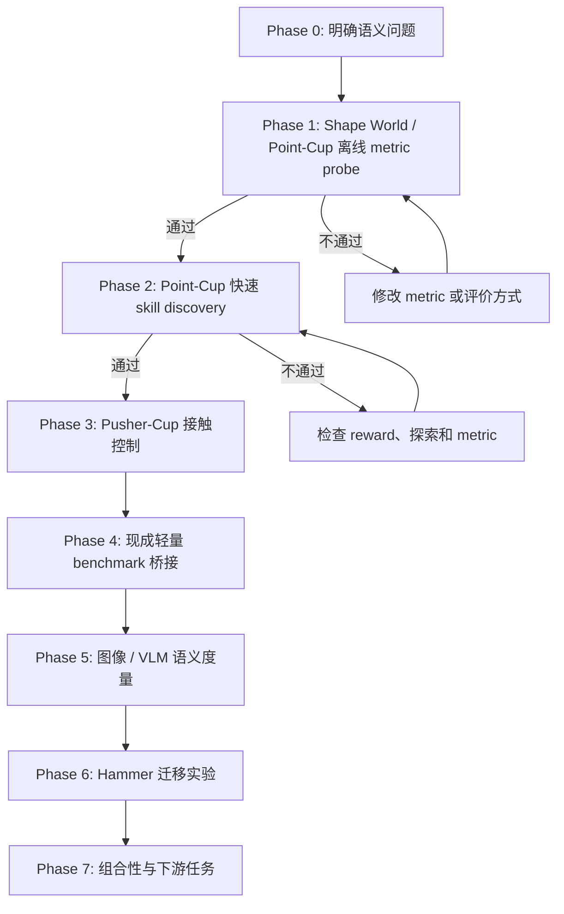

# Semantic Skill Discovery: Experiment Flow

> [当前状态]
> 分支：`codex/skill-discovery`
>
> 当前阶段：Phase 3 fixed-layout gate 已通过但 layout generalization 失败；Phase 4A 官方 MiniGrid 环境审计已通过，Phase 4B 正在定位长时序 PPO 的部署失败。
>
> 当前动作：Phase 5C seed-7 visual-cluster reward gate 已通过。下一步不重复跑等价 multi-seed，先处理 audit style shift 下 safe recall 仅 0.219 的 representation gap。

## 一眼看完整流程



核心顺序是：先证明“什么距离才有意义”，再证明它能指导快速 skill discovery，之后才付出 Hammer 和 VLM 的训练成本。

## 核心研究问题

普通 unsupervised skill discovery 在 raw state space 中扩大覆盖范围。这个目标容易优先覆盖体积大的行为区域，而忽略体积小但语义关键的事件。

最小例子：一个球可以位于二维平面的任意位置，“球在杯子里”只占很小的几何区域，但对人来说，“杯内”和“杯外”应当是两个同等重要的语义状态。

我们要检验：

1. 使用 semantic representation `phi` 计算轨迹差异，能否比 raw-state distance 更公平地覆盖稀有语义模式？
2. 这个 representation 能否保留可控、与物体交互有关的行为，而不是只产生视觉上不同但不可执行的状态？
3. 离线验证过的 metric 放入 skill discovery reward 后，是否真的产生更可解释、可组合的技能？

暂定主假设：

`raw state diversity -> geometric coverage`

`semantic diversity + controllability -> meaningful behavior coverage`

## 为什么不先跑 Hammer

Hammer 同时包含高维机械臂控制、接触动力学、长时间 PPO 训练、视频采集和 VLM 推理。若结果失败，很难判断是 metric、探索、控制、物理环境还是训练稳定性出了问题。

因此 Hammer 现在是迁移阶段，不是概念验证阶段。小环境会把变量逐层加回来：

| 阶段 | 控制难度 | 接触 | 图像 / VLM | 主要问题 |
| --- | ---: | ---: | ---: | --- |
| Shape World / Point-Cup offline | 无训练 | 否 | 否 | metric 是否表达我们要的语义 |
| Point-Cup discovery | 很低 | 否 | 否 | metric 是否能指导探索 |
| Pusher-Cup | 低 | 是 | 可选 | 语义行为是否可控且需要交互 |
| MiniGrid / MuJoCo public bridge | 低到中 | 任务相关 | 可选 | 结论是否离开自建环境仍成立 |
| Visual probe | 低到中 | 是 | 是 | foundation-model space 是否接近 oracle |
| Hammer | 高 | 是 | 是 | 方法能否迁移到真实研究环境 |

## Phase 0：研究定义

状态：`完成初稿`

我们暂时把一个“有意义的 skill”定义为：

1. 它对应可区分的轨迹级行为，而不只是不同的静态 pose。
2. 它改变任务相关对象或对象关系，而不只是机械臂关节在大空间里运动。
3. 它位于环境中可执行的 manipulation subspace。
4. 一组 skills 应当公平覆盖稀有和常见的 semantic equivalence classes。
5. 在后期实验中，这些 skills 应能被高层策略选择或组合来完成任务。

这个定义连接旧笔记中的四条线索：DIAYN/DADS 的可区分性、LSD/CSD/METRA 的距离度量、LGSD 的 language space、RGSD 的 reference-grounded feasible manifold。

## Phase 1：Semantic Shape World / Point-Cup 离线 Metric Probe

状态：`完成`

### 环境形式

这不是 Isaac Lab 环境，也不依赖刚体或软体物理。它是一个可参数化的二维关系图形：

- 图节点：`ball`、`cup`，后续可增加 `pusher`、`obstacle`。
- 节点属性：位置、大小、颜色和形状参数。
- 关系边：`outside`、`near`、`crossing`、`inside`，后续增加 `touching` 和 `pushing`。
- 转移：直接、确定性的几何规则。
- 画面：从图状态直接栅格化为小尺寸 RGB 图像，供后续 visual/VLM probe 使用。

环境接口从第一天就接受 layout 参数，因此杯子的位置、半径、开口方向和形状可以改变。但第一轮固定布局，只验证 metric。形变在第二轮作为 held-out generalization 测试，不作为第一轮训练变量。

### Point-Cup 模式

- 世界：二维正方形 `[-1, 1] x [-1, 1]`。
- 对象：一个可移动的球和一个固定小杯区。
- 动作：二维位移，直接控制球；每步动作有最大幅度。
- Episode：64 control steps。
- 杯区面积约为世界面积的 1% 到 3%，故 `inside` 是几何上稀有的状态。
- 第一版无物理引擎、无神经网络、无 GPU 依赖，目标是几秒内生成可复现实验数据。
- 第一版杯区固定；通过 gate 后再测试大小、长宽比、位置和开口方向变化。

### 数据集

生成两个互不混用的数据池：

1. `discovery_pool`：随机动作产生的自然不平衡数据，用于模拟 raw exploration。
2. `balanced_audit`：脚本策略均匀生成 `outside`、`boundary-crossing`、`inside` 轨迹，只用于评价 metric。

每条轨迹保存：

- `states`: 球的 `(x, y)`。
- `actions`: 每步二维动作。
- `semantic_labels`: `outside`、`entering`、`inside`、`leaving`。
- `frames`: 可选的俯视 RGB 图像，留给 Phase 4。
- `seed` 和环境配置。

### 第一轮 metric

| 名称 | 定义 | 作用 |
| --- | --- | --- |
| Raw L2 | 标准化后的 `(x, y)` 欧氏距离 | 现有 volume-based baseline |
| Random feature | 固定随机投影后的距离 | 负对照 |
| Semantic oracle | 语义类别距离 + 很小的类内几何距离 | 理想上界，不是最终方法 |
| Object transition | 对 `delta state` 与 inside/outside relation 编码 | 检查轨迹级表示是否优于静态状态 |

Oracle 的作用是先验证完整实验逻辑。如果连 oracle 都不能改善语义覆盖，问题在评价或 reward 设计，不应开始 VLM 或 Hammer。

### 离线评价

1. `Balanced kNN accuracy`：距离最近的轨迹是否具有相同语义。
2. `Rare semantic recall`：在固定数量 representative trajectories 下，是否选到稀有 `inside` 和 crossing 事件。
3. `Semantic coverage entropy`：各语义类的访问是否均衡。
4. `Geometric coverage`：避免 semantic metric 通过坍缩到一个点取得虚假高分。
5. `Nuisance invariance`：同一语义类内的大位置变化不应压过 inside/outside 的差异。

### Phase 1 Gate

同时满足以下条件才进入训练：

- Oracle 对 rare semantic recall 明显优于 Raw L2。
- Oracle 的 semantic coverage entropy 更高。
- Oracle 没有完全丢掉几何覆盖；暂定至少保留 Raw L2 的 70%。
- 结果在至少 5 个随机种子上方向一致。
- 自动标签随机抽样 30 条轨迹，人工查看没有系统性错误。

产物计划：

- `skill_discovery/point_cup.py`
- `skill_discovery/generate_point_cup_dataset.py`
- `skill_discovery/evaluate_metrics.py`
- `outputs/skill_discovery/point_cup/<run_id>/config.json`
- `outputs/skill_discovery/point_cup/<run_id>/metrics.json`
- `outputs/skill_discovery/point_cup/<run_id>/metric_comparison.svg`

### 独立运行环境

小环境不使用 `isaaclab510`。独立 Conda 环境位于：

`/home/wang100/data/conda/envs/skill-discovery`

当前仅安装 Python 3.11 和 NumPy。测试命令：

```bash
/home/wang100/data/conda/envs/skill-discovery/bin/python -m unittest skill_discovery.test_point_cup
```

### 第一轮结果

Run：`point_cup_probe_20260722_022926`

候选池共 4096 条自然不平衡随机轨迹：`outside=3847`、`inside=14`、`entering=31`、`leaving=204`。平衡审计数据的自动观察类别与生成意图 100% 一致。

| Metric | 代表轨迹类覆盖 | Rare recall | 语义熵 | 几何覆盖 | Inter / intra distance |
| --- | ---: | ---: | ---: | ---: | ---: |
| Raw L2 | 0.50 | 0.33 | 0.207 | 0.574 | 1.25 |
| Random feature | 0.50 | 0.33 | 0.325 | 0.562 | 1.22 |
| Object transition | 0.50 | 0.33 | 0.207 | 0.543 | 1.42 |
| Semantic oracle | **1.00** | **1.00** | **0.813** | **0.598** | **20.33** |

第一轮支持的有限结论：当候选数据中 rare modes 存在但数量很少时，Raw L2 的代表点选择主要追逐几何极值；oracle metric 能选到四类语义，同时没有牺牲本轮几何覆盖。

第一轮不能支持的结论：这还不能证明 learned metric 或 VLM 有效，也不能证明 semantic reward 能训练出对应 policy。


> [失败记录]
> 第一版随机动作幅度单一，候选池中没有持续 `inside` 轨迹，导致任何 metric 都不可能得到完整 rare recall。第二版只扩大随机动作幅度分布，没有做类别平衡，候选池出现 14 条持续 inside 轨迹后再进行比较。

> [失败记录]
> 当前 balanced kNN accuracy 对四种 metric 都是 1.0，因为脚本生成的四类轨迹在运动模式上太容易区分。这个指标只能作为数据管线 sanity check，不能作为 metric 优劣证据。下一轮会加入相同语义下的大位置/形状变化，以及不同语义下很小的像素和几何变化。

### 五个 Seed 与 Nuisance Audit

Aggregate run：`point_cup_multiseed_20260722_0234`

Seeds：`7, 17, 27, 37, 47`

Nuisance audit 使用 12 个 held-out layouts。Positive pair 是同一语义和同一 canonical behavior 在不同 cup position / aspect ratio 下的轨迹；negative pair 是同一 layout 中几何上接近但语义不同的轨迹。

| Metric | Rare recall | 语义熵 | 几何覆盖 | Cross-layout kNN | Nuisance triplet |
| --- | ---: | ---: | ---: | ---: | ---: |
| Raw L2 | 0.267 ± 0.133 | 0.213 ± 0.119 | 0.615 ± 0.025 | 0.326 ± 0.037 | 0.030 ± 0.028 |
| Random feature | 0.333 ± 0.000 | 0.281 ± 0.100 | 0.602 ± 0.033 | 0.326 ± 0.044 | 0.025 ± 0.022 |
| Object transition | 0.333 ± 0.211 | 0.306 ± 0.198 | 0.552 ± 0.012 | 0.583 ± 0.044 | 0.633 ± 0.122 |
| Semantic oracle | **1.000 ± 0.000** | **0.829 ± 0.032** | 0.597 ± 0.021 | **1.000 ± 0.000** | **1.000 ± 0.000** |

每个 seed 都通过预先写下的 numeric gate。Oracle 保留的几何覆盖是 Raw 的约 97%，高于 70% gate。

30 条分层抽样轨迹同时覆盖 fixed 与 nuisance layouts。联系表每行依次为 start / middle / final；左侧颜色为灰色 outside、蓝色 inside、绿色 entering、橙色 leaving。人工查看和 manifest 均为 30/30 匹配。


完整汇总：`outputs/skill_discovery/point_cup/point_cup_multiseed_20260722_0234/summary.json`

> [结果]
> Phase 1 gate 通过。这个结论只证明 oracle semantic metric 的离线排序符合预期；它还没有证明该 metric 能通过 policy optimization 发现 rare mode。

## Phase 2：Point-Cup 快速 Skill Discovery

状态：`完成`

这一阶段才开始训练，但环境和网络都很小，目标运行时间是分钟级而不是小时或天。

### 第一轮训练设计

第一轮只使用两个 skills，因为当前最小语义关系是 binary `inside/outside`。若先放四个 skills，会强迫方法在并不存在的语义类中制造差异。

采用小型 tabular DIAYN-style mutual-information objective：

- Policy：`skill x discretized (x, y) -> 9 discrete actions` 的 logits table。
- Optimizer：batched REINFORCE，带 per-skill moving baseline 和固定 epsilon exploration。
- Reset：球从杯外同一小区域开始，避免 reset distribution 替策略制造语义差异。
- Raw discriminator input：episode 终点的二维 grid cell。
- Semantic discriminator input：episode 终点的 `inside/outside` relation。
- Intrinsic reward：`log q(z | feature) - log p(z)`。
- 唯一变化变量：discriminator 使用哪一种 feature。

这个实验不是最终算法，而是最小因果检验：当训练算法完全相同时，替换 representation 是否会把两个 skills 从“两个几何终点”改成“一个杯内、一个杯外”。

最小对照：

1. Random policy。
2. Raw endpoint DIAYN。
3. Semantic relation DIAYN。

所有方法使用相同策略网络、步数、seed 和优化器。主要曲线：

- `inside_rate`
- `enter_exit_count`
- `semantic_entropy`
- `xy_coverage`
- `skill_semantic_mutual_information`

同时记录 `endpoint_grid_mutual_information`，避免只展示 semantic 方法占优的指标。

### Phase 2 Gate

- Semantic reward 在多个 seed 上提高 inside/outside 的均衡覆盖。
- 产生的差异来自策略行为，而不是 reset distribution。
- 不同 latent skill 对应稳定、可复现的轨迹模式。
- Raw baseline 仍作为几何覆盖的参照，不隐藏其可能更强的指标。
- 首轮预注册的可读 gate：Semantic 方法中一个 skill 的 final inside rate 至少 0.8，另一个至多 0.2；5 个 seed 中至少 4 个满足。
- 若 Semantic 方法只偶然进入一次杯内但无法稳定复现，则判定失败。

### Phase 2 结果

Aggregate run：`tabular_diayn_multiseed_20260722_0243`

Seeds：`7, 17, 27, 37, 47`。每种方法每个 seed 都训练 400 iterations，并使用 1024 个无探索 evaluation episodes / skill。表中为 5-seed mean；`stable pass` 同时要求 evaluation gate 和最后 20 个训练 iterations 的稳定性 gate 通过。

| Method | High inside | Low inside | Semantic MI (bits) | Endpoint-grid MI (bits) | XY coverage | Stable pass |
| --- | ---: | ---: | ---: | ---: | ---: | ---: |
| Random policy | 0.0648 | 0.0609 | 0.00008 | 0.0177 | 0.4397 | 0 / 5 |
| Raw endpoint DIAYN | 0.0988 | **0.0000** | 0.0559 | **0.9950** | **0.4653** | 0 / 5 |
| Semantic relation DIAYN | **0.9846** | 0.0016 | **0.9351** | 0.9551 | 0.3866 | **5 / 5** |

这个结果没有把 raw baseline 的优势藏起来：它在 endpoint-grid MI 和 XY coverage 上最好，说明它确实学会了把两个 skills 放到不同几何终点。可是这些终点几乎都在杯外；它没有稳定发现几何体积很小的 `inside` relation。Semantic 方法牺牲了一部分 XY coverage，但 5 个 seed 都稳定地产生一个入杯 skill 和一个杯外 skill，同时保留了 0.955 bits 的 endpoint-grid MI。

Visual audit 重新加载 seed 7 的保存策略，关闭 epsilon exploration，每个 skill rollout 64 次，并展示其中 3 次的 5 个时间点。左侧第一条颜色依次表示 Random（灰）、Raw（蓝）、Semantic（绿）；第二条颜色表示 skill 0（橙）和 skill 1（紫）。抽样入杯率分别为 Random `0.0625/0.0313`、Raw `0.0000/0.0313`、Semantic `1.0000/0.0000`。人工查看确认 semantic skill 0 的展示轨迹确实把红球移入蓝色杯区，并非指标误判。


完整汇总：`outputs/skill_discovery/point_cup_training/tabular_diayn_multiseed_20260722_0243/summary.json`

> [结果]
> Phase 2 gate 通过。这只支持“在固定布局的直接控制 toy environment 中，semantic representation 改变了 discovery 的行为类别”这一有限结论；它还没有证明这些语义状态需要 object interaction，或能迁移到图像、VLM、Hammer。

## Phase 3：Pusher-Cup 规则接触控制

状态：`Phase 4A 通过；Phase 4B v1 失败，准备 balanced-oracle control diagnostic`

将“直接控制球”改成“控制一个二维 pusher，只有图形重叠或接触时球才按规则移动”。它仍然不是物理模拟，只加入最小 manipulation constraint：

- 状态：pusher pose、ball pose 和速度。
- 动作：pusher 的二维速度或位移。
- 语义事件：approach、contact、push、enter cup、leave cup。
- 失败模式：只让 pusher 自己进入杯区，球没有发生语义变化。
- 接触转移：使用确定性几何规则，例如接触时把 pusher 位移的一部分传给 ball，不计算质量、摩擦、碰撞求解或软体形变。

这一步检验 semantic metric 是否与 controllability/object interaction 对齐。若 oracle reward 仍只产生无效动作，就需要在 metric 中加入 object transition 或 reachability constraint。

### Phase 3 首轮实现计划

这一步仍保持二维图形环境，不退化成一维轨道，也不加入 Isaac Lab：

1. `Environment correctness`：pusher 在二维平面直接移动；仅当 pusher 与 ball 图形接触时，当前 pusher displacement 才传给 ball。先用 scripted trajectories 验证未接触、接触、持续推动、球入杯和边界裁剪。
2. `Render audit`：固定渲染 pusher、ball、cup 与 contact 状态。人工检查至少一条成功 push-in 轨迹和一条 pusher 自己经过 cup、ball 未移动的反例。
3. `Offline reachability audit`：随机策略和 scripted policies 共同生成数据，确认三个语义类都真实可达，而不是由标签器伪造。
4. `Skill discovery`：扩展现有 tabular DIAYN trainer 到 3 skills。Policy 对所有方法看到相同的离散 raw graph state `(pusher_x, pusher_y, ball_x, ball_y)`；只改变 discriminator feature。
5. `Multi-seed comparison`：一个 seed 做信号检查，通过后运行 5 seeds 的 Random / Raw / Semantic 对照，并保存曲线、策略、数值汇总和 deterministic rollout contact sheet。

首轮 semantic trajectory class 固定为：

- `no_contact`：整条轨迹没有接触，ball 没有被操作。
- `contact_without_inside`：至少接触并移动 ball，但终点没有入杯。
- `ball_inside`：ball 终点在杯内；pusher 自己的位置不能代替 ball 状态。

Raw discriminator 使用 terminal `(pusher_x, pusher_y, ball_x, ball_y)` grid cell；Semantic discriminator只使用上面的三类轨迹事件。两者的 policy、reset、动作、训练步数、optimizer 和随机种子保持一致。

### Phase 3 Gate

- scripted environment tests 与人工 render audit 均通过。
- Semantic 方法的三个 skills 可以按 permutation 分别匹配三个语义类，每个匹配类的频率暂定至少 0.70。
- `ball_inside` skill 的 final inside rate 至少 0.70，并且 ball displacement 明显大于零，排除只移动 pusher 的假成功。
- 最后 20 个 iterations 中，至少 80% 满足 specialization gate。
- 5 个 seeds 中至少 4 个通过；Random 和 Raw 的几何覆盖、terminal MI 仍完整报告。
- 若随机探索完全采不到 `ball_inside`，先记录失败并调整 exploration/reset curriculum，不修改标签或在结果出来后放宽 gate。

首轮 cup 与对象尺寸固定。环境 API 继续支持 cup position / axes、ball radius、pusher radius 和 transfer ratio 的变化；只有固定布局 gate 通过后，才把这些变化作为 held-out nuisance/generalization audit。

这批实验仍是纯 NumPy CPU workload，单次运行预计秒到分钟级；此时分配 GPU 只会增加启动和数据搬运开销。等 Phase 4 引入 neural visual encoder 或 Phase 5 回到 Isaac Lab 时，再按可用 GPU 并行分 seed。

### Environment Correctness 结果

Run：`environment_audit_20260722_025259`

- 11 项 Point-Cup、trainer 和 Pusher-Cup 单元测试全部通过。
- scripted `no_contact` 的 ball path length 为 `0.000`。
- scripted `contact_without_inside` 的 ball path length 为 `0.110`，终点仍在杯外。
- scripted `ball_inside` 的 ball path length 为 `0.495`，终点真实位于杯内。
- false-positive 反例中 pusher 终点位于杯内，但 ball path length 为 `0.000`，标签仍为 `no_contact`。

联系表每行是一个脚本、每列依次为 step `0/4/8/12/20/25/32`。橙色圆是 pusher，接触瞬间变绿；红色圆是 ball，蓝色椭圆是 cup。人工查看与自动 manifest 的 5 项 checks 全部一致。


> [结果]
> 最小接触规则和 ball-based success definition 通过。这个结果只证明环境可表达三个事件，不证明无监督探索能够发现它们。

### Offline Reachability 结果

Run：`reachability_audit_20260722_025515`

5 个 seeds 各运行 8192 条固定 reset 的自然随机轨迹，共 40,960 episodes：

| Class | Mean rate | Total count |
| --- | ---: | ---: |
| `no_contact` | 0.79490 | 32,559 |
| `contact_without_inside` | 0.20508 | 8,400 |
| `ball_inside` | 0.0000244 | 1 |

独立 scripted audit 对每个 intent 运行 512 条带轻微动作扰动的轨迹，三个 class 的 recall 均为 1.0，confusion matrix 为严格对角矩阵。环境可达，但自然随机探索中的 `ball_inside` 约四万分之一，是一个真实的 rare mode。

### Training Signal Check v1：失败

Run：`pusher_diayn_semantic_seed7_20260722_025919`

800 iterations、512 episodes / skill / iteration。Evaluation 关闭探索，每个 skill 运行 2048 episodes：

- skill 0：`contact_without_inside=0.9961`，mean ball path `0.2244`。
- skill 1：`no_contact=1.0000`。
- skill 2：再次坍缩为 `no_contact=1.0000`。
- 最佳 permutation 的 matched rates 为 `0.9961 / 1.0000 / 0.0000`。
- Semantic MI 为 `0.9161 bits`，但 specialization gate 和 last-20 stability gate 均失败。
- 800 个训练 iterations 中有 408 个出现至少一条入杯轨迹，但单个 iteration 的最高 inside rate 仅 `0.0078`，信号不足以形成可复现 policy。

> [失败记录]
> v1 能稳定分开 `no_contact` 与 `contact_without_inside`，却无法把约四万分之一的 `ball_inside` 事件放大成第三个 skill。高 semantic MI 不能替代三类 gate；本轮明确判失败。

### Training v2 预注册调整

唯一变化是 exploration 的时间相关性：

- v1 的 epsilon action 每一步独立采样，形成近似随机游走。
- v2 在触发 epsilon exploration 时，随机选一个 action 并持续 12 steps。
- burst action 不读取 cup、ball、class 或 reward，不是 scripted push-right policy。
- Random、Raw、Semantic 三种方法使用完全相同的 burst 规则。
- deterministic evaluation 仍设置 epsilon 为 0，不允许 burst 帮忙完成任务。
- 环境、reset、3 classes、policy table、discriminator feature、训练预算和 Phase 3 gate 全部不变。

先只重跑 semantic seed 7。若仍失败，则不继续堆训练预算；下一项诊断将比较“终点 reward credit assignment”与“轨迹事件首次发生时的 reward”，并在修改前再次写计划。

> [失败记录]
> 首次 v1 运行在 sampler 中遇到 float32 cumulative probability 略小于 1，产生越界 action id 9。sampler 已显式裁到合法 action 范围并加入回归测试；上述 v1 结果来自修复后从头运行，不受这个程序错误影响。

### Training Signal Check v2：仍失败

Run：`pusher_diayn_semantic_seed7_20260722_030257`

12-step random burst 提高了 exploration coverage，但没有产生第三个稳定 skill：

- 最佳 matched rates：`1.0000 / 0.9546 / 0.0000`。
- evaluation 中最高 final inside rate 为 `0.0449`。
- 最后 20 iterations 的 specialization gate fraction 仍为 `0.0`。
- 关闭 exploration 的独立诊断显示，contact skill 有 `0.2769` 的轨迹曾经进入 cup，但只有 `0.0449` 最终留在 cup；terminal-only class 抹掉了大部分 transient entering events。

> [失败记录]
> 与语义无关的 persistent exploration 让策略更常到达杯区，但 terminal DIAYN 仍停在两个有效 classes。v2 不通过 Phase 3 gate，不通过增加 iterations 追结果。

### Training v3：Balanced Semantic Oracle 诊断计划

原始项目假设不仅要求 MI，还明确要求 `fairly covering semantic equivalence classes`。v3 因此先测试一个诊断上界：

- 三个 skills 与三个 semantic classes 做一一匹配；映射由 seed 决定的随机 permutation 产生，class 名称不绑定固定 skill id。
- 每条 trajectory 仅在终点 class 匹配该 skill 的当前 target class 时得到 oracle reward。
- 仍使用 v2 相同的 12-step task-agnostic exploration、policy、reset、episode length、训练预算和 evaluation gate。
- Random、Raw DIAYN、Semantic DIAYN 保留为对照；新增方法明确命名为 `Semantic balanced oracle`。
- 它使用人工 class identity，因此只回答“若公平覆盖目标明确，当前控制器能不能学会三类”，不能回答 learned metric 或 unsupervised objective 是否成立。

若 oracle 仍失败，问题主要在 sparse credit/control，应改 transition-level reward 或 curriculum。若 oracle 通过而 Semantic DIAYN 失败，问题主要在 MI objective 的局部最优，下一步应实现无需 class label 的 semantic spread / balanced assignment，而不是继续调环境。

### Training v3 结果：Deterministic 通过，完整 Gate 未通过

Run：`pusher_diayn_semantic_balanced_seed7_20260722_030718`

Seeded target permutation 为 `[no_contact, ball_inside, contact_without_inside]`。关闭探索的 2048 episodes / skill evaluation：

| Target | Matched rate | Contact rate | Final inside | Mean ball path |
| --- | ---: | ---: | ---: | ---: |
| `no_contact` | 0.9644 | 0.0356 | 0.0000 | 0.0028 |
| `ball_inside` | 0.8970 | 1.0000 | 0.8970 | 0.5483 |
| `contact_without_inside` | 0.9736 | 1.0000 | 0.0264 | 0.3613 |

Semantic MI 为 `1.2882 bits`，terminal graph MI 为 `1.4019 bits`。Deterministic specialization gate 通过，说明当前控制、探索数据和 terminal reward 足以学会真正的入杯 policy。

完整 gate 仍未通过：v3 尾段 `epsilon=0.08` 时一次 burst 持续 12 steps，因此训练 batch 中实际被随机动作占据的比例远高于 8%；last-20 specialization fraction 为 `0.0`。这不是隐藏掉的测量问题，当前预注册 full gate 明确判失败。

### Training v3b 预注册调整

- 唯一变化：`epsilon_end: 0.08 -> 0.00`，仍从 `0.35` 线性退火。
- burst length、oracle targets、policy、环境、reset、800 iterations、512 episodes / skill、evaluation 和 thresholds 均不变。
- 目的：让最后 20 个 training batches 测量 learned policy，而不是持续注入的 12-step random macro-actions。
- v3b 仍只是 oracle diagnostic；即使 full gate 通过，也不能作为最终方法。

### Training v3b 结果：单 Seed 诊断通过

Run：`pusher_diayn_semantic_balanced_seed7_20260722_030919`

- Deterministic matched rates：`0.9995 / 0.9917 / 0.9927`。
- 入杯 skill final inside rate：`0.9917`；mean ball path：`0.5268`。
- Semantic MI：`1.5376 bits`；terminal graph MI：`1.4270 bits`。
- Last-20 specialization fraction：`1.0`，mean matched rate：`0.9637`。
- Evaluation gate 与 training stability gate 均通过。

Visual audit 重新加载保存策略、关闭探索，并对每个 skill rollout 128 次。抽样 matched rates 为 `1.0000 / 0.9844 / 0.9922`。联系表中每个 skill 展示 3 条轨迹和 7 个时间点；人工确认 no-contact skill 不移动 ball、inside skill 真正把 ball 推入 cup、contact skill 移动 ball 但停在杯外。


> [结果]
> v3b 单 seed 诊断通过。这证明显式公平覆盖的 oracle objective 能控制当前环境，但不证明无监督 semantic spread 已解决；Phase 3 方法 gate 仍保持未完成。

### Multi-seed 诊断计划

- Seeds：`7, 17, 27, 37, 47`。
- Methods：Random policy、Raw endpoint DIAYN、Semantic terminal-class DIAYN、Semantic balanced oracle。
- 每项：800 iterations、512 episodes / skill / iteration、2048 deterministic evaluation episodes / skill。
- 所有方法共享 12-step exploration burst，并从 epsilon `0.35` 线性退火到 `0.00`。
- 共 20 个 runs；使用 4 个并行 CPU processes。代码是纯 NumPy，GPU 在这里没有可执行 kernel，因此不占用 4 张 GPU。
- Oracle diagnostic gate：至少 4/5 seeds 同时通过 deterministic evaluation 与 last-20 stability；所有 baseline 的 semantic MI、terminal graph MI、pusher/ball coverage 和真实轨迹一并报告。
- 即使 oracle 5/5 通过，也只定位 objective gap；下一大步必须先写出无需人工 class target 的 balanced semantic spread 计划，不能直接跳到公开 benchmark 声称方法已完成。

### Multi-seed 诊断结果

Aggregate run：`pusher_multiseed_20260722_0312`

| Method | Mean matched | Min matched | Highest inside | Semantic MI | Terminal graph MI | Pusher coverage | Ball coverage | Stable pass |
| --- | ---: | ---: | ---: | ---: | ---: | ---: | ---: | ---: |
| Random | 0.3369 | 0.0002 | 0.0003 | 0.0002 | 0.0356 | 0.5877 | 0.2123 | 0 / 5 |
| Raw DIAYN | 0.6253 | 0.0333 | 0.0351 | 0.6864 | **1.5850** | 0.9111 | 0.1901 | 0 / 5 |
| Semantic DIAYN | 0.6612 | **0.0000** | 0.0157 | 0.9150 | 0.8581 | 0.8889 | **0.3778** | 0 / 5 |
| Semantic balanced oracle | **0.9940** | **0.9917** | **0.9917** | **1.5320** | 1.3984 | **0.9284** | 0.3531 | **5 / 5** |

Balanced oracle 的 class-specific matched means 为 `no_contact=0.9963`、`contact_without_inside=0.9940`、`ball_inside=0.9917`，入杯 skill mean ball path 为 `0.5282`，last-20 gate 每个 seed 都是 1.0。

Raw DIAYN 的 terminal graph MI 达到 3 skills 的理论上限 `log2(3)=1.5850`，是最强几何终点分离 baseline；它仍没有发现稳定入杯。Semantic DIAYN 在 5 个 seeds 中都精确学到 no-contact 和 contact，但第三个 skill 重复已有 class，说明高 MI 本身不保证公平 semantic coverage。

四种方法的 seed 7 deterministic audit 每个 skill 展示 2 条轨迹。人工确认 Random 是随机移动，Raw 主要把 pusher/ball 送到不同几何终点，Semantic DIAYN 只有两个语义模式，只有 Balanced oracle 同时产生三种真实 object-interaction behaviors。


完整汇总：`outputs/skill_discovery/pusher_cup_training/pusher_multiseed_20260722_0312/summary.json`

> [结果]
> Oracle diagnostic gate 通过，Phase 3 method gate 明确保持失败。证据定位到 objective gap：人工指定公平覆盖时控制可行，plain MI 不会自动公平覆盖稀有 semantic class。

### Training v4：无 Target Semantic Spread 计划

令 `c = phi(tau)` 为 trajectory 的 semantic class，`K=3`。保留 DIAYN reward，并显式提高整体 semantic occupancy entropy：

`r = log q(z | c) - log p(z) + lambda * [-log(K * p(c))]`

- 第一项保持 skill 可区分性。
- 第二个 coverage term 对高于均匀占比的 class 给负值，对低于均匀占比的 rare class 给正值。
- `p(c)` 使用带 pseudocount 和 exponential decay 的全 population moving counts。
- 首轮固定 `lambda=1.0`，不做看结果后的 sweep。
- 不设 skill-to-class mapping、不使用 seeded target permutation；哪个 skill 占据哪个 class 完全由训练产生。
- Semantic representation 仍是人工 oracle class，因此这是“objective probe”，还不是 learned/VLM representation 结果。
- 环境、burst exploration、epsilon `0.35 -> 0.00`、policy、reset、800 iterations、训练量和 Phase 3 gate 全部保持不变。

这个目标等价于在 MI 外额外提高一次 `H(C)` 权重，直接对应原始笔记中的 `fairly covering semantic equivalence classes`，而不是事后给每个 skill 指定 goal。

先跑 seed 7：若 evaluation 和 last-20 gate 都通过，再跑 5 seeds；若所有 skills 一起追逐 rare class 或仍停在两类，则判简单 entropy reweighting 失败，下一步再考虑 continuous semantic distance / population optimal transport，不调 `lambda` 追单点成功。

### Training v4 单 Seed 结果：通过

Run：`pusher_diayn_semantic_spread_seed7_20260722_032008`

- 无 skill-to-class target；输出中的 `balanced_target_classes` 为 `null`。
- Deterministic matched rates：`1.0000 / 0.9961 / 0.9795`。
- 入杯 skill final inside rate：`0.9795`；mean ball path：`0.5456`。
- Semantic MI：`1.5244 bits`；terminal graph MI：`1.4614 bits`。
- Last-20 specialization fraction：`1.0`；mean matched rate：`0.9562`。
- 最后一轮 population coverage reward 已接近均衡后的 0；按 skill 分别为 `-0.0194 / -0.0695 / +0.0935`，rare inside class 仍得到轻微正 reweighting。

128-rollout visual audit matched rates 为 `1.0000 / 0.9922 / 0.9609`。人工确认三个 skills 真实对应 no-contact、contact-but-outside 和 ball-inside。


> [结果]
> 这是第一个不指定 class target 而通过完整单-seed gate 的方法结果。representation 仍是 oracle class，所以只能称为 semantic objective proof，不是 VLM 方法完成。

### Training v4 Multi-seed Gate

- Seeds：`7, 17, 27, 37, 47`，配置与单 seed 完全一致。
- 只新增 5 个 `semantic_spread` runs；Random、Raw、Semantic DIAYN、Balanced oracle 复用 `pusher_multiseed_20260722_0312`，避免重复计算。
- Method gate：至少 4/5 seeds 同时通过 deterministic evaluation 和 last-20 stability；三类 mean matched rates 均至少 0.70；inside skill mean ball path 至少 0.40；代表 seed visual audit 通过。
- 继续完整报告 geometry/coverage 指标，特别检查 semantic spread 是否通过坍缩 ball geometry 换取三类成功。
- 若通过，Phase 3 固定-layout method gate 才标记完成；下一步先做 held-out layout/shape nuisance，再进入公开 MiniGrid bridge。

### Training v4 Multi-seed 结果：Fixed-layout Gate 通过

Aggregate run：`pusher_spread_multiseed_20260722_0322`

- 5/5 seeds 同时通过 deterministic evaluation 与 last-20 stability。
- Mean matched rate：`0.9922`；mean minimum matched rate：`0.9805`。
- Class-specific means：`no_contact=1.0000`、`contact_without_inside=0.9960`、`ball_inside=0.9805`。
- Semantic MI：`1.5263 bits`；terminal graph MI：`1.4561 bits`。
- Inside ball path：`0.5454`；pusher terminal coverage：`0.9111`。
- Ball terminal coverage：`0.0938`，显著低于 Semantic DIAYN 的 `0.3778`。该方法覆盖了语义 classes，但类内 ball geometry 较窄；这是限制，不作为无关指标删除。

五方法 seed 7 visual audit 通过。Semantic spread 抽样 matched rates 为 `1.0000 / 0.9922 / 0.9688`，画面确认入杯 skill 真实推动 red ball 进入 cup。


完整汇总：`outputs/skill_discovery/pusher_cup_training/pusher_spread_multiseed_20260722_0322/summary.json`

> [结果]
> `phase_3_method_gate_passed=true`，但范围严格限定为 fixed layout + oracle semantic representation。Learned/VLM representation、layout generalization 和公开 benchmark 尚未完成。

### Held-out Layout Audit 计划

不重新训练，直接加载 5 个 semantic-spread policies，在 12 个训练中未出现的 layouts 上 evaluation：

- 9 个 position layouts：cup `x in {0.25, 0.35, 0.45}`，`y in {-0.20, 0.00, 0.20}`，axes 固定 `(0.14, 0.16)`。
- 3 个 shape layouts：center 固定 `(0.35, 0.00)`，axes 分别 `(0.10, 0.20)`、`(0.20, 0.10)`、`(0.18, 0.18)`。
- 每个 policy/layout 使用 512 deterministic episodes / skill；不改 policy observation，也不做 adaptation。
- Generalization gate：12 个 layouts 中至少 9 个保持三类 matched rates 均至少 0.70，且 inside skill ball path 至少 0.40；5 seeds 中至少 4 个满足。
- 同时保存 base-layout control，确认加载/evaluation 管线没有改变原结果。

当前 policy 只观察 absolute pusher/ball grid，没有 cup layout input，因此这个 audit 很可能失败。失败仍有价值：它能证明 fixed-layout semantic coverage 不等于 relational generalization。根据“尽快使用现成环境”的方向，若失败将记录为限制并把 relative/layout-aware observation 要求带入 MiniGrid bridge，不在自建环境继续做长超参循环。

### Held-out Layout Audit 结果：失败

Artifact：`pusher_spread_multiseed_20260722_0322/layout_generalization_audit.json`

- Base-layout control：5/5 policies 均保持通过，排除加载或 evaluator 改变。
- 每个 seed 都只通过 4/12 layouts；要求是至少 9/12，因此 seeds passed 为 0/5。
- 通过项一致：训练中心 `(0.35, 0.00)` 的原尺寸，以及同中心的三个 axes/shape variations。
- 所有 `y=+/-0.20` position shifts 失败；`x=0.25/0.45` 且 `y=0` 也失败。
- Seed 7 例子：base matched rates `1.000/0.992/0.984`；center `(0.25,0)` 的 inside matched rate 仅 `0.020`，center `(0.45,0)` 仅 `0.123`。

联系表的 12 行按 9 个 position layouts、3 个 shape layouts 排列；绿条为通过、红条为失败。画面确认 shifted layouts 中 ball 常经过后离开、停在旧 center 附近或根本没有对准新 y，而不是 evaluator 标签错误。


> [失败记录]
> Fixed-layout semantic spread 不具有 relational layout generalization。根因与接口一致：policy state 只有 absolute pusher/ball grid，没有 cup center/axes。当前结论不能外推到位置变化。

> [方向变化]
> 不在自建环境继续加入 relative observation、domain randomization 和新 sweep。把“policy 必须观察 task-relevant relation/layout”作为公开 benchmark 的设计要求，立即转入 MiniGrid bridge。

## Phase 4：现成轻量 Benchmark 桥接

状态：`Phase 4A 通过；Phase 4B v1/v2 失败，准备低熵 control diagnostic`

自建 Point/Pusher-Cup 只用于初期因果检验，不作为最终实验证据。通过后按“简单到复杂”迁移到公开环境：

1. 首选 `MiniGrid-DoorKey-8x8-v0`：公开、快速、离散 7-action、局部 `7x7x3` image observation；语义事件天然包含取 key、开 door、到 goal。官方说明它是 sparse-reward 且适合 curiosity/curriculum 实验：[MiniGrid DoorKey documentation](https://minigrid.farama.org/main/environments/minigrid/DoorKeyEnv/)。
2. 若 DoorKey 上仍能复现 representation effect，再进入 `Pusher-v5`：公开 Gymnasium MuJoCo 环境，23 维 observation、7 维 torque action、100-step episode，任务是用多关节臂把 cylinder 推到 target：[Gymnasium Pusher documentation](https://gymnasium.farama.org/environments/mujoco/pusher/)。
3. `FetchPush-v4` 作为更接近机械臂但更复杂的备选；它用 4 维 Cartesian gripper displacement、默认 50 steps：[Gymnasium-Robotics FetchPush documentation](https://robotics.farama.org/main/envs/fetch/push/)。只有 Pusher-v5 无法表达所需事件或接口更适合复用时才选它，不并行扩张范围。

Bridge gate 会在实际安装前冻结：现成环境版本、semantic events、raw/semantic 唯一变化变量、训练预算、至少 5 seeds、原生 reward 与我们指标的关系，以及 deterministic 视频审计。所有新依赖继续安装在 `/home/wang100/data/conda/envs/`，不占 home 目录。

### Phase 4A：MiniGrid DoorKey 环境审计计划

先不训练，按以下顺序验证官方环境与语义定义：

1. 在 `/home/wang100/data/conda/envs/skill-discovery` 安装并记录 `minigrid`、`gymnasium`、`pygame` 精确版本；不写入 home Conda 路径。
2. Smoke test `MiniGrid-DoorKey-5x5-v0` 与主实验 `MiniGrid-DoorKey-8x8-v0`：reset、7 个官方 actions、partial symbolic observation、`rgb_array` render、seed reproducibility。
3. 不修改 MiniGrid dynamics，读取官方 grid/object state 定义四个 mutually exclusive trajectory stages：
   - `navigation_only`：尚未拿 key。
   - `key_acquired`：携带 key、door 仍 locked/closed。
   - `door_opened`：door 已 open、尚未到 goal。
   - `goal_reached`：原生 environment termination/reward 成功。
4. 写一个只用于 audit 的 shortest-path scripted solver，真实执行 pickup/toggle/forward actions，依次经过四个 stages；它不进入 skill-discovery training data。
5. 5 seeds 随机策略 reachability audit，报告四个 stages 的自然频率，决定训练探索预算。

Phase 4A Gate：

- 两个 registered env ids 都能 reset/step/render；相同 seed 的 grid/object placement 可复现。
- Scripted solver 真实执行官方 actions，并在一个 episode 中依次触发 key acquired、door opened、goal reached；原生 reward/termination 与 goal stage 一致。
- 随机 rollout 与 scripted rollout 分开统计，不能把 solver 数据冒充 discovery。
- 自动 semantic stages 与至少一张完整 trajectory contact sheet 人工一致。

只有 4A 通过后才写训练计划。训练时所有方法必须观察 layout-relevant MiniGrid observation；不会重演 Pusher-Cup 隐藏 cup location 的接口错误。Native task reward 只用于 evaluation，不进入 unsupervised discovery reward。

### Phase 4A 结果：通过

Run：`doorkey_audit_20260722_033722`

安装位置：`/home/wang100/data/conda/envs/skill-discovery`

版本：`minigrid 3.1.0`、`gymnasium 1.3.0`、`pygame-ce 2.5.7`。

- 5x5 与 8x8 都是官方 registered env，7 actions、`7x7x3` partial observation；RGB render 分别为 `160x160`、`256x256`。
- 相同 seed 的 full grid encoding、agent position 和 direction 可复现。
- BFS audit solver 只调用官方 left/right/forward/pickup/toggle actions。5 个 seeds 中，5x5 使用 8-12 actions，8x8 使用 13-22 actions；全部依次触发四 stages、原生 terminated=true、truncated=false、reward 约 0.96-0.98。
- 8x8 随机策略共 2560 episodes 的 furthest-stage counts：`navigation=218`、`key=1972`、`door=310`、`goal=60`。Native random goal success 为 2.34%，比 Pusher-Cup inside 更容易，但仍是最稀有 stage。

联系表两行分别为 5x5 与 8x8，四列为 reset/navigation、key acquired、door opened、goal reached。人工检查：黄色 key 被实际 pickup，黄色 locked door 被实际 toggle/open，红色 agent 最后进入绿色 goal。


> [结果]
> Phase 4A gate 通过。公开环境、semantic stage 定义、原生 success 与画面一致，可以开始写训练 wrapper；solver 数据不会进入训练。

> [失败记录]
> 首次 2560-episode audit 完整运行后，`action_space.n` 的 `numpy.int64` 导致 JSON serialization 失败。加入 NumPy scalar encoder 后，用 5 个 CPU processes 原样重跑 512 episodes / seed，45 秒完成；上面的结果来自修复后完整 run。

### Phase 4B：5x5 PPO Signal Check 计划

先在官方 `MiniGrid-DoorKey-5x5-v0` 验证训练接口，再进入 8x8：

1. 使用官方 `FullyObsWrapper`，policy observation 为完整 `5x5x3` object/color/state encoding、agent direction 与 one-hot skill。它包含 layout information，避免 Pusher-Cup absolute-state 的不可辨识错误。
2. 使用 Stable-Baselines3 PPO 的 `MlpPolicy` 与 vectorized env；RL update 不再手写。官方 PPO 和 vector-env 接口参考：[SB3 PPO](https://stable-baselines3.readthedocs.io/en/master/modules/ppo.html)、[SB3 vectorized environments](https://stable-baselines3.readthedocs.io/en/master/guide/vec_envs.html)。
3. 4 个 skills 对应四个可能的 trajectory stages，但不预设映射。每个 vector env 固定一个 skill，4 skills 均匀分配；每个 episode layout 由官方 reset seed 生成。
4. Gym wrapper 把 native reward 保存到 `info`，training reward 置零；中央 VecEnv reward wrapper 只在 episode end 根据 furthest stage 计算 intrinsic reward。
5. Methods 保持同一 PPO/config：Random、Raw terminal observation DIAYN、Semantic stage DIAYN、Semantic spread。Balanced oracle 只在方法失败时作为诊断，不先运行。

首轮固定配置：

- 5x5、seed 7、8 envs（2 / skill）。
- `250,000` total timesteps、`n_steps=256`、`batch_size=256`、`n_epochs=4`。
- MLP `[256, 256]`、learning rate `2.5e-4`、entropy coefficient `0.01`。
- CPU PyTorch；MiniGrid step 是主要瓶颈，小 MLP 不占 GPU。长命令使用工具允许的最长等待窗口。

执行顺序与 gate：

- 先实现 Gym/VecEnv wrapper tests：observation 包含 layout+skill；四 stages 的 terminal info 正确；native reward 不泄漏进 training reward；四 skills episode 数均衡。
- 先跑 Semantic spread seed 7。Deterministic evaluation 每 skill 256 episodes，最佳 stage permutation 每类至少 0.70，goal skill 至少 0.70，且 last checkpoints 稳定，才运行同 seed baselines。
- 保存 stage curves、PPO checkpoint、config、evaluation、完整 deterministic videos/contact sheet。
- 若 5x5 通过，再在开始前单独写 8x8 的 1M-step、5-seed 计划；不直接把 5x5 结果外推。

### Phase 4B Infrastructure 结果

新增 data-env 版本：`torch 2.13.0+cpu`、`stable-baselines3 2.9.0`。

- Official FullyObs grid 被 one-hot 编码为 object/color/state，不使用 hidden cup/goal shortcut。
- Skill one-hot 单独拼接；Raw discriminator feature 明确排除 skill id。
- 22 项完整测试通过，包括 SB3 `check_env`、native reward isolation、stage info、rare-stage coverage reward。
- 4096-step end-to-end smoke 在约 6 秒内完成，成功保存 PPO policy、reward counts、checkpoint evaluation 与 SVG。

### Phase 4B Training v1：失败

Run：`doorkey5_ppo_semantic_spread_seed7_20260722_034516`

250,000 timesteps，训练主体用时 `280.4s`。Final deterministic 256 episodes / skill：

- 最佳 matched stage rates：`1.0000 / 0.0273 / 0.0000 / 0.0000`。
- Door 与 goal stages 都没有 deterministic skill；native goal success 全部为 0。
- 5 个 checkpoint 没有一次通过，last-checkpoint stability 失败。
- Deterministic policy modes 大量选择 drop/done/no-op-like actions，所有 episode 都跑满 250 steps。

训练期间并不是没看到 rare events：1059 个 completed training episodes 的 furthest-stage counts 为 `navigation=205`、`key=457`、`door=251`、`goal=146`。Reward model 最终 global stage probabilities 约为 `0.244/0.417/0.221/0.119`，coverage term 确实提高了后两类；但每个 stage 的 `q(skill | stage)` 仍在约 `0.19-0.31`，没有形成 skill-stage 关联。

> [失败记录]
> MiniGrid v1 的失败不是 reachability 或 reward leakage，而是 global semantic entropy 生效、per-skill MI symmetry 没打破。Pusher-Cup 的无 target spread 结果不能直接迁移到随机 layout + neural PPO。

### Phase 4B Training v2：Balanced Oracle 诊断计划

- 新增 objective `semantic_balanced`，用 seed 产生四 stages 的随机 permutation；skill id 与具体 stage 名不固定。
- Terminal reward 仅为“furthest stage 是否等于该 skill target”；native reward 仍不进入 training。
- PPO、FullyObs observation、7 actions、layout randomization、250k timesteps、8 envs、network、seed 与 evaluation gate全部保持 v1 相同。
- 不限制 drop/done actions，不加 curriculum，不延长预算，确保只诊断 objective symmetry。
- 若 oracle deterministic gate 通过：控制/PPO 可行，下一步设计无 target 的 prototype/assignment symmetry breaking。
- 若 oracle 仍失败：先解决 long-horizon credit/action interface，再讨论 semantic objective。

### Phase 4B Training v2 结果：确定性 Gate 失败

Run：`doorkey5_ppo_semantic_balanced_seed7_20260722_035431`

250,000 timesteps，训练主体用时 `279.9s`。Seeded target permutation 为 skill `0/1/2/3 -> goal/key/door/navigation`。

- 训练 stochastic rollouts 确实访问了所有阶段；skill 0 的 343 个终局中有 178 个到达 goal，说明 full observation、动作接口和 PPO 至少具有任务可达性。
- Final deterministic 256 episodes / skill 的最佳 matched rates 为 `0.0938 / 0.2031 / 0.9336 / 0.0000`；所有 deterministic native goal success 都为 0，checkpoint stability 与 signal gate 均失败。
- 独立 stochastic evaluation（64 episodes / skill）中，target-goal skill 0 的 native success 为 **0.9844**，但四技能最佳 matched rates 为 `0.9844 / 0.0000 / 0.6719 / 0.0000`。其余 policies 几乎总会越过 key，不能稳定停在 navigation/key 阶段。
- 因此 balanced terminal reward 已学到一个高成功率 stochastic goal controller，却没有产生四个可确定性部署的阶段技能。当前证据同时指向高 action entropy/终局 credit 与 stage-stopping objective，而不是环境不可达。

> [失败记录]
> Balanced oracle 没有通过预注册的 deterministic gate，不能据 stochastic goal success 宣称 Phase 4B 成功。尤其是随机采样 98.4% 与 deterministic 0% 的巨大差异，说明当前 policy distribution 的能力没有凝结到 argmax 行为。

### Phase 4B Training v2b：移除 Entropy Bonus 计划

下一轮仍使用官方 5x5、balanced target permutation、seed 7、250k timesteps、8 envs、terminal reward、网络与全部 evaluation gate。**唯一训练变量**为 `ent_coef: 0.01 -> 0.0`：

- 若 target-goal skill 的 deterministic success 与四类 matched gate 同时通过，说明 v2 的主要问题是 entropy regularization；之后才回到无 target 方法。
- 若 stochastic/deterministic gap 缩小但 navigation/key skills 仍失败，下一步改为 stage-transition/potential reward，解决“到达后无法停留”的终局 credit；不追加训练步数追结果。
- 若 goal controller 也退化，则 entropy 不是单一根因，保留失败并直接进入 transition-level objective，不做系数 sweep。

### Phase 4B Training v2b 结果：失败

Run：`doorkey5_ppo_semantic_balanced_ent0_seed7_20260722_041428`

250,000 timesteps，训练主体用时 `282.4s`；target permutation 与 v2 相同。

- Final deterministic 最佳 matched rates 为 `0.1836 / 0.0000 / 0.8789 / 0.0000`，所有 native goal success 为 0。
- Final stochastic 最佳 matched rates 为 `0.4375 / 0.3438 / 0.3281 / 0.2812`；target-goal skill 0 的 native success 为 `0.4375`，明显低于 v2 的 `0.9844`。
- 5 个 deterministic checkpoints 都没有 door/goal success；训练 stochastic rollouts 仍访问四 stages，但 skill-stage 分布接近混合。

> [失败记录]
> `ent_coef=0` 没有把 stochastic 能力凝结成 deterministic skills，反而削弱了稀疏奖励下的 goal 探索。停止 entropy 调参；v2b 证明 entropy 不是单一根因。

### Phase 4B Training v3：Stage-Transition Potential 计划

相对 v2 恢复 `ent_coef=0.01`，其余 PPO/环境/seed/预算/gate 不变；唯一 objective 变化是把 episode-end target indicator 改为阶段变化当下的 potential difference：

`Phi(stage, target) = stage / target`，当 `target > 0` 且 `stage <= target`

`Phi(stage, target) = 1 - (stage - target) / (3 - target)`，当 `stage > target`

navigation target 的特例为 `Phi(stage, 0) = 1 - stage / 3`

`r_t = Phi(furthest_stage_t, target) - Phi(furthest_stage_(t-1), target)`

- Potential 始终位于 `[0,1]` 且 target 处为 1；到达 target 的累计正收益统一为 1，继续越过 key/door target 会即时扣回，避免不同 target 的 reward scale 不一致。
- navigation target 初始不发正奖励，但任何后续语义推进都会即时受罚。
- 只在真实 key pickup、door open、goal reach 导致 furthest stage 改变时非零；native reward 仍只用于 evaluation。
- 若 deterministic 四类 gate 通过，说明 v2 的主障碍是 terminal credit/stopping；若 goal 通过但中间类失败，下一步专门处理可终止 skill option；若仍没有 goal，则停止 balanced-oracle PPO 调参并评估 imitation warm start 或 action abstraction。

### Phase 4B Training v3 结果：失败并暂停 DoorKey

Run：`doorkey5_ppo_semantic_balanced_transition_seed7_20260722_042543`

250,000 timesteps，训练主体用时 `285.8s`。

- Final deterministic 最佳 matched rates 为 `0.0000 / 0.0000 / 0.3125 / 1.0000`；这里的 1.0 是 navigation，door/goal 都为 0。
- Final stochastic rollout 几乎全部终止在 `key_acquired`：四 skills 的 key rates 为 `1.0000 / 1.0000 / 0.9844 / 0.9375`，native goal 全部为 0。
- 训练终局共约 1010 episodes，`key_acquired=889`、`door_opened=95`、`goal=18`。Immediate reward 成功放大了第一段 pickup，却使所有 skill 追逐容易的部分进度，仍不能建立后续控制。

> [失败记录]
> DoorKey v1-v3 已依次排查 global coverage、balanced terminal target、entropy 和 stage-transition credit。继续改 reward 或预算会变成同一 benchmark 的调参循环，因此按预注册规则暂停；DoorKey 保留为后续需要 action abstraction / imitation warm start 的 harder benchmark。

## Phase 4C：FrozenLake 最小 Public Graphical Bridge

状态：`环境审计与 balanced control 通过；准备 semantic spread`

这个阶段不是替代 DoorKey，而是在它前面补回用户要求的“足够简单、非物理、基于图形”的第一层公开环境：

1. 使用已安装 Gymnasium 的官方 `FrozenLake-v1`、默认 4x4 map、4 个离散动作；第一轮 `is_slippery=False`，不同时引入控制噪声。
2. Episode 上限固定 32 steps，三种 mutually exclusive trajectory outcomes 为 `safe_timeout`、`hole_terminal`、`goal_terminal`。
3. Native goal reward 只写入 evaluation info，不进入 discovery training。
4. Policy observation 使用 agent tile one-hot + skill one-hot；第一轮固定官方 map，只做 public dynamics signal check，不声称 layout generalization。
5. 使用 tabular Q-learning，不使用 neural PPO；这里要隔离 semantic objective，而不是再次测试 optimizer。

Phase 4C Gate 与顺序：

- 先验证官方 env reset/step/render、seed reproducibility，并用真实动作分别产生 safe timeout、hole、goal；保存 contact sheet。
- 5 seeds random reachability 报告三类自然频率，scripted actions 只用于 audit，不进入训练。
- Balanced oracle control 先跑单 seed；deterministic evaluation 三类都必须稳定复现，再运行无 target semantic spread。
- Semantic spread 使用 `DIAYN + outcome occupancy entropy`，固定 coverage weight 1.0；至少 5 seeds 中 4 seeds 三类均通过，才称 public fixed-map signal 成立。
- 通过后增加 `is_slippery=True` 或 map variation，一次只增加一个变量；不直接返回 Hammer。

### Phase 4C 环境审计结果：通过

Run：`frozenlake_audit_20260722_0444`

- Gymnasium `FrozenLake-v1`：固定 4x4 map、16 states、4 actions、`is_slippery=false`、32-step limit，RGB render 为 `256x256`。
- 5 seeds 的 scripted real actions 全部正确产生 safe timeout、hole terminal 和 native goal terminal；goal 路径只需 6 steps。
- 10,000 random episodes 的 outcome counts 为 `safe_timeout=30`、`hole_terminal=9819`、`goal_terminal=151`。Hole 占 98.19%，两个语义结果都很稀有，适合检验 occupancy bias。
- 联系表三行依次显示 timeout、落洞、到宝箱；人工检查状态、终止类型和 native reward 一致。


### Phase 4C Balanced Control 结果：通过

Run：`frozenlake_semantic_balanced_seed7_20260722_0452`

30,000 episodes，tabular Q-learning 用时 `14.9s`。Seeded target mapping 为 skill `0/1/2 -> goal/safe/hole`。

- Final deterministic matched outcome rates 为 `1.0 / 1.0 / 1.0`，goal native success 为 1.0。
- 三类 trajectory lengths 分别为 goal 6、safe timeout 32、hole 2 steps。
- Last 5 checkpoint stability gate 通过；policy rollout 画面与数值一一对应。


> [结果]
> FrozenLake 的官方 dynamics、三 outcome evaluator 与 tabular control 上界均正常。下一项只移除人工 target mapping，改用与 Pusher-Cup 相同的 `semantic DIAYN + outcome occupancy entropy`，其他配置不变。

### Phase 4C Semantic Spread v1：Final Pass，Stability Fail

Run：`frozenlake_semantic_spread_seed7_20260722_0455`

- Final deterministic matched outcome rates 为 `1.0 / 1.0 / 1.0`，goal native success 为 1.0；policy rollout 画面确认 goal、safe、hole 都是真实执行。
- 28k、29k、30k 三个 checkpoints 全部通过；26k 仍缺 hole，27k 仍缺 safe，故代码中冻结的 last-5 stability gate 为 false，整体 signal gate 明确失败。
- 原配置 epsilon 在 27k（总预算的 90%）才归零，30k 内客观上只有 3 个完整 zero-exploration checkpoints，无法满足 last-5 gate。


> [失败记录]
> 不把最终 checkpoint 的 1.0 事后等同于稳定通过，也不把 stability gate 从 5 改成 3。v1 判定为 final policy 成功但完整 signal gate 失败。

### Phase 4C Semantic Spread v1b：Zero-Exploration Stability 计划

- 总预算仍为 30k，objective/reward/coverage weight/seed/Q-learning/evaluation/gate 均不变。
- 唯一变量：`epsilon_decay_fraction: 0.90 -> 0.80`，即 24k 后 epsilon 为 0，留下 6 个完整 checkpoint 检验 last-5 stability。
- 若 v1b 通过，再冻结该配置运行 5 seeds；若仍失败，判 semantic spread policy oscillation，不继续 sweep。

### Phase 4C Semantic Spread v1b 结果：通过

Run：`frozenlake_semantic_spread_eps80_seed7_20260722_0501`

- Final deterministic matched rates 为 `1.0 / 1.0 / 1.0`，goal native success 1.0。
- Last-5 checkpoint stability 与完整 signal gate 均通过。
- 无人工 target mapping；最终 skill `0/1/2 -> hole/goal/safe`。三行 rollout 画面确认真实落洞、走到宝箱、持续安全到 timeout。


> [计划]
> 固定 30k、epsilon decay 0.8、coverage weight 1.0 和全部 gate，不做 sweep；补四个预注册 seeds。至少 4/5 完整 signal gate 通过才进入 slippery dynamics。

### Phase 4C Semantic Spread Multi-seed：通过

Run group：`frozenlake_semantic_spread_multiseed_20260722_0510`

- Seeds `7/17/27/37/47` 全部通过 final 3-outcome specialization、native goal 和 last-5 stability，完整 gate 为 **5/5**。
- 每个 seed 的三类 matched rate mean 与 minimum 都为 `1.0 / 1.0 / 1.0`。
- Skill permutation 随 seed 变化，排除固定 skill id 对应语义标签；联合重放 15 个 policies 均与 outcome 标签一致。


### Phase 4C Frozen Baseline 计划

固定 v1b 的 30k episodes、epsilon decay 0.8、Q-learning、5 seeds 与全部 evaluation，只替换 objective：

- Random：零 intrinsic reward，检查初始/探索偏置。
- Raw terminal DIAYN：按 terminal tile state 区分 skill，不加 semantic occupancy。
- Plain Semantic DIAYN：按三 outcome 区分 skill，不加 occupancy entropy。
- Semantic spread：使用刚完成的 frozen runs，不重跑。

比较每种方法的 5-seed full-gate pass count、三 outcome matched rates、goal native success 和联合画面。Baseline 无需“必须失败”；若它也通过，结论必须收窄为本环境不需要 occupancy correction。

### Phase 4C Frozen Baseline 结果

Run group：`frozenlake_baselines_20260722_0515`

| Method | Full gate | Safe mean | Hole mean | Goal mean | 结论 |
| --- | ---: | ---: | ---: | ---: | --- |
| Random | 0/5 | 0.000 | 1.000 | 0.038 | 几乎全部落洞 |
| Raw terminal DIAYN | 0/5 | 0.000 | 1.000 | 0.400 | 区分多个 raw terminal tiles，但不保留 safe outcome |
| Plain Semantic DIAYN | **5/5** | **1.000** | **1.000** | **1.000** | 三类稳定分化 |
| Semantic spread | **5/5** | **1.000** | **1.000** | **1.000** | 三类稳定分化，但本环境未显示对 plain semantic 的额外收益 |

联合重放人工检查与指标一致：Raw 的 15 个 skills 主要落入不同 holes，plain Semantic 与 Semantic spread 每个 seed 都各有 safe、hole、goal。


> [结果]
> Fixed deterministic public environment 支持 representation hypothesis：Raw endpoint diversity 追逐多个 hole tiles，而 trajectory-level semantic outcome 能公平表示 safe/hole/goal。它不支持“occupancy entropy 在所有环境都必要”；plain Semantic 已足够。

## Phase 4D：FrozenLake Slippery Dynamics Audit

状态：`环境审计通过；balanced control 配置已冻结`

唯一新增变量为 `is_slippery=true`；map、32-step horizon、三 outcome 定义与 native reward isolation 不变。训练前先完成：

1. 验证官方 transition kernel 的随机性与 seed reproducibility。
2. 10,000 random episodes 报告 safe/hole/goal 自然频率。
3. 使用官方 `env.unwrapped.P` 做 32-step finite-horizon dynamic programming，分别计算最大 safe-timeout、hole-terminal、goal-terminal 概率上界；不把 scripted deterministic path 当作成功证据。
4. 对每个 DP policy 做至少 5 seeds x 512 episodes Monte Carlo，确认 empirical rate 接近计算上界，并保存代表画面。
5. 只有审计通过后，才按可控上界定义 balanced oracle 和 semantic methods 的 class-specific gate；不沿用 deterministic 0.95 gate。

### Phase 4D Slippery Audit 结果：通过

Run：`frozenlake_slippery_audit_20260722_0542`

- 同 seed 的 stochastic state sequence 可复现；官方 transition kernel 被直接用于 DP，没有自建 dynamics。
- 10,000 random episodes：`safe=0.0032`、`hole=0.9835`、`goal=0.0133`。
- 32-step DP probability upper bound 与 2,560-episode empirical replay：safe `1.0000 / 1.0000`、hole `0.999997 / 1.0000`、goal `0.3733 / 0.3547`；三类误差都小于 0.05 gate。
- 代表图确认 stochastic policy 分别保持安全、落洞、到达宝箱；goal 的低概率是 horizon + slip 的环境限制，不是 evaluator 漏检。


### Phase 4D Balanced Control 计划

- 相对 Phase 4C 唯一环境变化为 `is_slippery=true`；map 与 32-step horizon 不变。
- 先运行 seeded balanced target、100k episodes、epsilon decay 0.8、tabular Q-learning；evaluation 使用 1024 episodes / skill，避免 goal rate 的小样本波动。
- Class-specific gate 冻结为 safe `>=0.95`、hole `>=0.95`、goal `>=0.30`。Goal gate 是 DP upper bound 0.3733 的约 80%，且低于 Monte Carlo 0.3547。
- Last-5 checkpoints 必须全部达到各自 gate；native goal success 同样 `>=0.30`。
- 先跑 seed 7。若 balanced control 失败，不运行 semantic methods，先记录 stationary-policy/learning gap；若通过，再冻结相同配置比较 Raw、Semantic、Semantic spread。

### Phase 4D Balanced Control v1：Final Pass，Stability Fail

Run：`frozenlake_slippery_balanced_seed7_20260722_0551`

- Final 1024 episodes / skill：safe `1.0000`、hole `1.0000`、goal/native goal `0.3711`，全部达到 class-specific gate，goal 接近 DP upper bound `0.3733`。
- Last checkpoints 中 safe/hole 已稳定为 1.0；goal 在不同 evaluation seed sets 上为 `0.3057/0.2969/0.2871/0.3662/0.3564`，其中两次低于 0.30，last-5 gate 失败。
- 当前 callback 每个 checkpoint 都把 episode index 加入 evaluation seed；在 stochastic environment 中，这会让 stability 同时包含 policy drift 与 Monte Carlo set drift。

> [失败记录]
> v1 完整 signal gate 保持失败，不能只报告 final 0.371。Control 本身已接近环境上界，但当前 checkpoint stability evaluator 不适用于低概率 stochastic outcome。

### Phase 4D Balanced Control v1b：Common-Random-Numbers 计划

- 训练 objective、seed、100k budget、Q-learning、epsilon、1024 episodes / skill 和三类 gates 全部不变。
- 唯一变化：所有 checkpoints 使用同一组 evaluation transition seeds；final evaluation 继续使用独立 seed set。
- 若 last-5 与 final 都通过，说明 v1 失败来自 evaluator variance；若仍失败，再诊断 constant learning-rate policy oscillation，不运行 semantic methods。

### Phase 4D Balanced Control v1b 结果：Policy Oscillation

Run：`frozenlake_slippery_balanced_crn_seed7_20260722_0603`

- Final 独立 set 仍为 safe/hole/goal `1.000/1.000/0.371`，但 common evaluation set 上 goal 在 85k/90k/95k 为 `0.306/0.291/0.396`。
- 因为测试 transition seeds 固定，差异来自 learned greedy action policy 改变；last-5 gate 仍失败。
- 当前 `alpha=0.15` 为 deterministic FrozenLake 沿用的常数。Stochastic returns 下，即使 epsilon 已归零，持续的大步更新仍能让 Q action ranking 来回切换。

> [失败记录]
> CRN 没有修复 gate，故 v1 的不稳定不是纯 Monte Carlo measurement noise。Semantic methods 继续保持未运行。

### Phase 4D Balanced Control v2：Visit-decay Q-learning 计划

- 相对 v1b 唯一训练变化：每个 `(skill,state,action)` 的 step size 从常数 0.15 改为 `visit_count^-0.6`；该 exponent 满足 tabular stochastic approximation 的常用递减条件。
- 100k budget、epsilon、balanced targets、CRN evaluation、1024 episodes 和 class gates 不变。
- 若 final + last-5 通过，冻结该 learner 进入 semantic comparison；若仍失败，停止本阶段 tabular optimizer 调整，保留 DP policy ceiling 与 learning gap。

### Phase 4D Balanced Control v2 结果：通过

Run：`frozenlake_slippery_balanced_visit_decay_seed7_20260722_0614`

- Final safe/hole/goal rates 为 `1.0000 / 1.0000 / 0.3691`，全部超过 `0.95 / 0.95 / 0.30` gate。
- Goal 达到 DP upper bound `0.3733` 的 98.9%；native goal 与 semantic outcome rate 一致。
- Last-5 CRN checkpoints 全部通过，完整 signal gate true；画面确认三种 stochastic trajectory outcome 真实发生。


> [结果]
> v1/v1b 的不稳定来自 stochastic Q-learning 使用常数大步长，而非环境不可控或 evaluator 错误。Visit-count decay 后 stationary policy 能接近 finite-horizon DP ceiling。

### Phase 4D Objective Comparison 计划

固定 v2 的 100k episodes、visit-count `N^-0.6`、epsilon decay 0.8、CRN、1024 eval、class gates 和 seed 7。仅依次替换 objective：Raw terminal DIAYN、Plain Semantic DIAYN、Semantic spread。

- Balanced 只作为 control upper-bound，不纳入无监督方法胜负。
- 若 Semantic/Spread 单 seed 至少一个通过，再为有希望的方法补 5 seeds；Raw 无论结果均完整报告。
- 若三种无 target objectives 都失败，不调整 gates 或 learner，转向 stochastic representation/objective diagnosis。

### Phase 4D Objective Comparison Seed-7 结果

| Method | Safe | Hole | Goal | Last-5 | Full gate |
| --- | ---: | ---: | ---: | ---: | ---: |
| Raw terminal DIAYN | 1.000 | 0.961 | 0.000 | fail | fail |
| Plain Semantic DIAYN | **1.000** | **1.000** | **0.372** | pass | **pass** |
| Semantic spread | 0.558 | 0.979 | 0.362 | fail | fail |

- Raw 仍把多个 skills 用于不同 hole behavior，没有 goal skill。
- Plain Semantic 的 goal rate `0.3721` 几乎等于 DP ceiling `0.3733`，三 outcome 与 last-5 都通过。
- Spread 的两个 skills 同时追逐 rare goal，导致没有可稳定保持 safe 的 skill。Global occupancy bonus 在 stochastic rare-event 下过度补偿，是一个明确反例。
- 重新渲染器按最终 assignment 搜索代表轨迹并记录 seed offset；若 assigned outcome 概率为 0，则明确标记 not found，不再用一条随机 sample 冒充代表画面。


> [结果]
> 当前最稳的无 target 方法是 Plain Semantic DIAYN，不是 Semantic spread。下一步只补 Plain Semantic 4 个 seeds；不调 spread weight 追结果。

### Phase 4D Plain Semantic Multi-seed：通过但有 Collapse Seed

Run group：`frozenlake_slippery_semantic_multiseed_20260722_0710`

- Seeds `7/17/27/37` 通过 final class-specific gate 与 last-5 stability；goal rates 分别为 `0.372/0.365/0.411/0.370`。
- Seed 47 稳定失败：两个 skills 都是 safe timeout，剩余 skill 为 hole/goal mixture；final safe/hole/goal matched rates 为 `1.000/0.799/0.000`，last-5 一直失败。
- 预注册要求为至少 4/5，故 Phase 4D Plain Semantic gate 通过；failure seed 不被均值隐藏。
- Outcome-aligned 5-seed mean：safe `1.000`、hole `0.958`、goal `0.304`。Goal mean 被 seed-47 的 0 明显拉低。

联合重放最后一行对应 seed 47；第三列 assigned goal 无成功 sample，renderer 明确回退显示实际 safe outcome，顶部蓝条与 manifest 的 `assigned_outcome_found=false` 一致。


> [结果]
> 在相同 public graphical task 上，semantic trajectory outcome representation 从 deterministic 延伸到 stochastic dynamics；但仍有 1/5 symmetry collapse。Global occupancy entropy 不能作为通用修复，因为它在 seed 7 反而复制 rare-goal skills。

## Phase 5：图像与 VLM Metric

状态：`Phase 5A 离线 visual probe 计划已冻结`

在 Point-Cup/Pusher-Cup 上先比较：

1. Raw pixels。
2. 预训练 visual embedding。
3. Vision-language embedding，prompt 固定并缓存。
4. 使用少量 reference trajectories 做 contrastive calibration。
5. Oracle semantic metric，作为上界。

VLM 只离线编码关键帧或短 clip，并缓存 embedding，不放在每个 RL step 在线调用。这样可以把最慢部分从训练 loop 中移走。

关键问题不是“VLM 能不能看出杯子”，而是它的距离排序是否满足：

`different meaningful modes > same mode with nuisance variation`

### Phase 5A：FrozenLake Cached Visual Probe

先利用 Phase 4D 已审计的官方 renderer 与 DP policies 构造平衡数据，不训练 policy：

1. 每个 outcome 采集 5 seeds x 128 条真实 stochastic trajectories；保存 start/middle/final frames、state/action sequence 和 outcome，DP policy 只用于 dataset generation。
2. Train/audit 严格分 seed；比较 raw pixels、固定随机 projection、pretrained visual embedding、prompted vision-language scores 与 semantic oracle。
3. 评价 balanced kNN、cross-seed retrieval、same-outcome trajectory nuisance invariance 和 rare goal representative recall。
4. 先缓存所有 RGB 与 embedding，再做 metric；任何 foundation model 都不进入 env step loop。
5. Oracle 与 raw/pixel 管线先通过后才下载/运行 pretrained encoder；若图像标签或 split 有误，不消耗 GPU。

Phase 5A 第一 gate：平衡 RGB dataset、manifest 与 30 条随机视觉抽样一致；raw pixels/random projection/oracle 的离线结果可复现。完成后再选择一个公开 pretrained visual encoder，不同时比较多个大模型。

### Phase 5A Cached RGB Dataset 结果：通过

Run：`frozenlake_visual_dataset_20260722_0730`

- 1,920 trajectories：5 generation seeds x 3 outcomes x 128；safe/hole/goal 各 640。
- Train seeds `7/17/27` 共 1152，audit seeds `37/47` 共 768；每个 split 内三类完全平衡且 seeds 不重叠。
- 缓存三帧 `start/middle/final`，每帧 64x64 RGB；完整 state/action/length/native reward 同步保存，压缩文件约 3 MB。
- Sanity：safe length 恒 32；hole terminal states 只为 `5/7/11/12`；goal terminal 只为 15 且 native reward mean 1.0。
- 30 条 triptych 视觉抽样人工检查通过，六行依次为 safe、hole、goal 各两行。


> [失败记录]
> 小数据单测最初在 2 seeds 时用 `ceil(0.6N)` 将全部 seeds 放进 train，audit 为空。已限制 train seed count 至多 `N-1`，测试与正式 split 均通过。

### Phase 5A Visual Metric v1：通过管线，但任务过易

Run：`frozenlake_visual_metrics_20260722_0752`

| Representation | Cross-seed 1-NN | Nuisance triplet | Rare safe/goal recall |
| --- | ---: | ---: | ---: |
| Raw terminal state | 1.000 | 0.997 | 1.000 |
| Raw 3-frame pixels | 1.000 | 1.000 | 1.000 |
| Random pixel projection | 1.000 | 1.000 | 1.000 |
| Semantic oracle | 1.000 | 1.000 | 1.000 |

> [失败记录]
> Farthest-point helper 在所有剩余距离并列为 0 时会重复选择同一 index。现已用 selected mask 修复并加 regression test；v1 指标来自修复后重算。

> [问题]
> FrozenLake final sprite 直接显示完整 outcome，generation-seed split 不改变 renderer style，导致 raw pixels 已达到 ceiling。当前结果只能证明数据/metric 管线正确，不能证明 pretrained visual representation 有用。

### Phase 5A Visual Metric v2：Audit-only Nuisance 计划

- Train frames 保持原始官方 renderer；只对 audit seeds 37/47 应用固定、可复现且不改变 outcome 的 mild color/brightness shift 与最多 3-pixel translation。
- 输出 transformed audit sample，人工确认 agent、holes、goal 仍可辨认。
- 原样重算 raw pixels、random projection 与 oracle；semantic labels/state/action 不变。
- 若 raw 明显下降而 oracle 保持 1.0，再选择一个 pretrained visual encoder；若 raw 仍接近 1.0，停止在 FrozenLake 上堆大模型，转用视觉 nuisance 更自然的 Pusher-Cup。

### Phase 5A Visual Metric v2 结果：Nuisance Gap 成立

Run：`frozenlake_visual_metrics_nuisance_20260722_0802`

| Representation | Cross-seed 1-NN | Nuisance triplet | Oracle/data relation |
| --- | ---: | ---: | --- |
| Raw terminal state | 1.000 | 0.997 | 非视觉参考，不受 style 影响 |
| Raw 3-frame pixels | **0.371** | **0.371** | 从 v1 的 1.0 明显下降 |
| Random pixel projection | 0.441 | 0.441 | 仍不具备 invariance |
| Semantic oracle | **1.000** | **1.000** | 标签与 split 未被变换破坏 |

Audit sample 中 seeds 37/47 使用两种固定 mild palettes 与最多 3-pixel translation；人工检查 agent、holes、goal 与三帧时间顺序仍清晰。


### Phase 5A DINOv2-small Probe 计划

- 唯一 encoder：Hugging Face `facebook/dinov2-small`；使用 frozen pretrained weights，不 fine-tune。官方文档将 DINOv2 定义为可用于下游 feature extraction 的 vision foundation model：[Transformers DINOv2 documentation](https://huggingface.co/docs/transformers/model_doc/dinov2)。
- 新环境：`/home/wang100/data/conda/envs/skill-vision`；`HF_HOME` 与 Torch cache 均放 `/home/wang100/data/`，不占 home。
- 使用 CUDA GPU 0 批量编码 5,760 张缓存帧；每帧 CLS/pooler embedding L2 normalize，三帧按时间顺序 concatenate，缓存为一个 `.npz`。
- Train 使用原始 seeds 7/17/27；audit 使用相同 deterministic nuisance 后的 37/47。模型不看 outcome labels。
- 原样复用 cross-seed 1-NN、triplet 与 representative metrics。Gate 冻结为 1-NN 和 triplet 都至少比 raw pixels `0.371` 高 `0.15`（即 `>=0.521`）；否则记录 domain mismatch，不换第二个模型追结果。

### Phase 5A DINOv2-small 结果：通过

Run：`frozenlake_dinov2_small_20260722_0825`

独立环境：`/home/wang100/data/conda/envs/skill-vision`。版本：Torch `2.7.1+cu118`、Torchvision `0.22.1+cu118`、Transformers `4.53.3`、NumPy `2.4.4`；模型/cache 均位于 `/home/wang100/data/`。

- GPU 0（RTX 2080 Ti）以 FP16/batch 64 编码 5,760 frames，用时 `15.4s`。
- 缓存 shape：frame embeddings `5760 x 384`；三帧按时间 concatenate 后 trajectory embeddings `1920 x 1152`。
- Cross-seed 1-NN 与 nuisance triplet 均为 **0.8372**，超过冻结 threshold `0.5211`；raw pixels 为 0.3711。
- Outcome recall：safe `0.5117`、hole `1.0000`、goal `1.0000`。主要残余错误是不同 style 下的 safe trajectories，不是 rare goal。
- Imbalanced representative selection 为 safe/hole/goal `3/7/2`，三类覆盖与 rare safe/goal recall 均通过。


> [结果]
> 一个 frozen pretrained visual encoder 在不看 labels、不 fine-tune 的条件下恢复了大部分 audit-style invariance。它仍未达到 oracle，尤其 safe mode 跨 style 容易混淆。

## Phase 5B：Unsupervised Visual Prototype Audit

状态：`通过，存在 audit-safe style collapse`

先不把 DINO embedding 放入 RL reward；用 train seeds 的无标签 trajectory embeddings 做 `K=3` clustering，audit seeds 只预测 cluster。Outcome labels 仅在训练后用于 Hungarian alignment 和评价：

- 同时比较 raw pixels、random projection、DINOv2；K、initializations 与 seed 一致。
- 报告 audit aligned accuracy、NMI、每 cluster size、每 outcome recall 和 collapse。
- Gate：DINO audit aligned accuracy `>=0.70`，所有三个 clusters 非空，且至少高于 raw pixels `0.15`。
- 若通过，cluster id 才成为下一轮 visual semantic reward 候选；若失败，下一步只做少量 reference prototype calibration，不把 labels 偷放进“无监督”方法。

### Phase 5B K=3 Clustering 结果：通过

Run：`frozenlake_visual_clusters_20260722_0842`

| Representation | Audit aligned accuracy | NMI | ARI | Audit clusters nonempty |
| --- | ---: | ---: | ---: | ---: |
| Raw pixels | 0.414 | 0.093 | 0.023 | no |
| Random projection | 0.349 | 0.033 | 0.032 | no |
| DINOv2-small | **0.740** | **0.704** | **0.567** | **yes** |
| Semantic oracle | 1.000 | 1.000 | 1.000 | yes |

- KMeans 只看 train embeddings；outcome labels 在拟合后才用于 3! mapping 与评价。
- DINO train clusters 为 `384/384/384`，事后 aligned accuracy 1.0；audit clusters 为 `56/456/256`。
- DINO audit recall：safe `0.2188`、hole `1.0000`、goal `1.0000`。Style-shifted safe 是唯一显著 collapse，不能被总 accuracy 隐藏。
- Raw/random 在 audit 中各有一个空 cluster，未通过结构 gate。


> [结果]
> Frozen DINO embeddings 在原始 train style 中自然形成三类 outcome clusters，并在 audit style shift 下保留 hole/goal、部分丢失 safe。它已达到“visual reward 候选”门槛，但还不是 style-robust oracle replacement。

## Phase 5C：Frozen Visual Cluster Reward Bridge

状态：`seed-7 visual-cluster reward gate 通过`

1. 从 train dataset 的 frame embeddings 构建 finite lookup：active safe tile、terminal hole tile、terminal goal 各自的 frozen DINO frame vector；保存 KMeans centers。
2. 用 state trajectory 的 start/middle/final keys 查询三帧、拼接并预测 cluster id；不在线 render/DINO，不读取 outcome label。
3. 先在完整 cached train dataset 重建 cluster assignments，要求与直接 DINO KMeans prediction 一致率 `>=0.99`。
4. 通过后给 FrozenLake trainer 新增 `visual_cluster` objective：reward 只使用预测 cluster id 做 plain DIAYN，native/semantic outcome 只用于 evaluation。
5. 第一轮沿用 Phase 4D seed 7、100k visit-decay 与 class-specific gates。若失败，记录 visual-cluster reward gap，不用 oracle label修补 cluster。

### Phase 5C Lookup 结果：通过

Run：`frozenlake_visual_lookup_20260722_0905`；finite-key audited rerun：`frozenlake_visual_lookup_audited_20260722_062534`

- Coverage：11 个 active safe states、holes `5/7/11/12`、goal `15` 全部存在。
- Lookup shape `3 x 16 x 384`，cluster centers `3 x 1152`；未覆盖项保持空并由 coverage gate 阻止使用。
- 1,152 train trajectories 重建 cluster agreement `1.0000`；direct-vs-lookup trajectory cosine mean/min `0.9990 / 0.9955`。
- Cache 只含 rendered-state DINO vectors 与无标签 KMeans centers，不保存 outcome-to-cluster mapping。

### Phase 5C Seed-7 Visual Cluster Training 计划

- Objective 新名称 `visual_cluster`：每个 episode 用 state trajectory 查询 frozen start/middle/final embeddings，最近 center 产生 cluster id，再按 plain DIAYN `log q(skill|cluster)` 奖励。
- Terminal frame type 从 renderer state key（active/hole/goal）查询，不把 semantic outcome id 传给 reward model；outcome/native reward 只在 evaluation 与审计计数中使用。
- 完全复用 Phase 4D Plain Semantic seed 7：slippery 4x4、100k、visit-decay、epsilon 0.8、CRN 1024 eval、safe/hole/goal gates `0.95/0.95/0.30`。
- 若 final + last-5 通过，视觉 cluster 可以替代本环境 oracle label；若失败，不用 outcome mapping修复 reward，转向 reference calibration。

### Phase 5C Seed-7 Visual Cluster 结果：通过

Run：`frozenlake_slippery_visual_cluster_visit_decay_seed7_20260722_062028`

- Final safe/hole/goal matched rates 为 `1.000 / 1.000 / 0.3721`；goal 达到 DP ceiling `0.3733` 的 99.7%。
- 从 65k 到 100k 的 8 个 CRN checkpoints 连续通过；last-5 rates 均为 `1.000 / 1.000 / 0.3848`，final 与 stability gates 都为 true。
- 100k 训练 episode 的 predicted cluster counts 为 `19,857 / 6,001 / 74,142`；reward model 没有读取 outcome/native reward。
- 代表 rollout 分别真实 timeout、到达 goal、落入 hole，三项都找到 assigned outcome，不存在失败视频冒充成功。
- 穷举全部 176 种可用 start/middle/final key 后，safe/hole/goal 分别只映射到 cluster `0/2/1`；三个集合互异。
- 与已有相同 seed/config 的 Plain Semantic Q-table 逐元素完全相同，最大绝对差 `0.0`。因此不重复运行等价的 4 个 seeds；已有 semantic 4/5 结果同时说明该目标仍有 symmetry-collapse 风险。


> [结果]
> Frozen DINO+KMeans cluster 在原始 renderer 内可以无 outcome label 地替代 semantic class reward，并达到 stochastic control ceiling。但 finite lookup 已严格恢复 outcome partition，这还是受控桥接，不是开放视觉或跨 style 的解决方案。

> [计划]
> 下一步针对 audit safe recall `0.219` 做 reference calibration：只在 frozen embeddings 上使用少量 train-style reference trajectories，不重训 encoder；先预注册 held-out audit gate，再决定是否值得迁移到更复杂图形环境。

## Phase 6：迁移到 Hammer

状态：`后续`

只有小环境已经回答以下问题后才进入 Hammer：metric 有效、reward 可训练、object interaction 不会被绕过、视觉 embedding 可以缓存。

Hammer 第一版会复用现有 Isaac Lab 轨迹 logger，而不是从零重建数据管线。已有 logger 会保存 robot、object、goal、action、policy observation 和对应视频路径。

初始 Hammer 语义事件候选：

- no object interaction
- reach / contact
- object perturbation
- lift
- transport
- near-target placement
- drop / release

注意：旧环境的 `successes` counter 曾经允许“接近目标但没有真正举起 hammer”的 false positive，因此它不能直接作为语义 ground truth。Hammer gate 必须使用 object motion、lift 条件与视频抽查。

## Phase 7：组合性与下游任务

状态：`远期`

最终不只看 skill 是否不同，还要看它们能否被调用和组合：

- 训练高层 policy 选择 latent skill。
- 比较 raw skill discovery 与 semantic skill discovery 的下游 sample efficiency。
- 测试训练时没有直接出现的目标组合。
- 检查 semantic classes 的公平覆盖是否真的带来任务收益。

## 异步协作格式

后续消息和本文件记录统一使用下面的标签：

> [计划]
> 下一段准备做什么，以及为什么现在做。

> [进度]
> 已经完成什么，当前运行到哪里。

> [结果]
> 有证据支持的结论，附 run id 和文件路径。

> [问题 Q-XXX | 阻塞 / 非阻塞]
> 需要你判断的研究选择。非阻塞问题会写明默认假设，我会继续推进；你之后回复时可以改变方向。

> [方向变化]
> 你或实验结果改变了路线。先写变化和原因，再修改后续计划。

> [失败记录]
> 失败的假设、命令、指标和原因。保留它，避免以后重复跑。

每次开始新的大阶段前，至少更新：当前状态、阶段目标、唯一变化变量、pass/fail gate 和产物路径。每次实验完成后，至少记录 run id、配置、结果和下一步决定。

## 当前问题队列

> [问题 Q-001 | 非阻塞]
> 在最小 Point-Cup 中，暂时把 `inside` 和 `outside` 当作同等重要的两个语义类，即使它们的几何体积差很多。默认按这个定义继续。

> [问题 Q-002 | 非阻塞]
> 第一轮先使用 semantic oracle 验证实验结构，再加入 VLM。这样能区分“实验结构失败”和“VLM metric 失败”。默认按这个顺序继续。

> [问题 Q-003 | 非阻塞]
> 环境支持形状变化，但第一轮使用固定杯区；通过 metric sanity check 后，再把 cup size、aspect ratio、position 和 opening direction 作为 held-out 变化。默认按这个顺序继续。

> [问题 Q-004 | 非阻塞]
> Phase 2 首轮使用两个 skills 对应当前 binary semantic relation，不人为增加四类。通过后再在 Pusher-Cup 中扩展 approach/contact/push/inside 等轨迹语义。默认按这个顺序继续。

> [问题 Q-005 | 非阻塞]
> Phase 3 首轮使用三个 skills，对应 `no_contact / contact_without_inside / ball_inside`。这比立即增加 approach、leave-cup 等更多类别更容易判断接触约束是否真正有效。默认按这个定义继续。

> [问题 Q-006 | 非阻塞]
> Pusher-Cup 保持真正的二维控制，但首轮固定对象布局和尺寸；形状/位置变化只作为 gate 通过后的 held-out audit。默认按这个顺序继续。

> [问题 Q-007 | 非阻塞]
> 自建 toy environment 通过后，先迁移到公开 `MiniGrid-DoorKey-8x8-v0`，再进入公开 MuJoCo `Pusher-v5`，最后才是 Isaac Lab Hammer。默认按这个由简单到复杂的顺序继续。

## 决策记录

### D-001：先验证 metric，再训练大环境

- 日期：2026-07-22
- 决定：Hammer 从第一阶段移到迁移阶段。
- 原因：Hammer 训练慢，并同时引入高维控制、接触、RL 稳定性和 VLM 成本，失败时不可诊断。
- 新路线：Point-Cup offline -> Point-Cup training -> Pusher-Cup -> visual/VLM -> Hammer。

### D-002：保留 oracle 上界

- 日期：2026-07-22
- 决定：第一轮使用手工 semantic oracle，但只作为 sanity-check upper bound。
- 原因：先证明“如果 metric 正确，pipeline 是否能产生预期结果”。最终方法仍要用可学习或 foundation-model representation。

### D-003：使用可参数化图形环境，不使用物理引擎

- 日期：2026-07-22
- 决定：小环境使用纯 NumPy 的关系图状态和直接栅格渲染，不使用 Isaac Lab。
- 原因：第一阶段只需要检验 semantic metric；物理控制和昂贵渲染会增加不必要的变量。
- 形变策略：接口支持变形，第一轮固定形状，第二轮才把形变作为泛化测试。

### D-004：Phase 1 Gate 通过

- 日期：2026-07-22
- 证据：5 个 seed 全部通过 numeric gate，30 条轨迹人工与自动标签检查通过。
- 限定结论：oracle metric 的离线排序正确；policy optimization 尚未验证。

### D-005：Phase 2 先使用两个 Skills

- 日期：2026-07-22
- 决定：第一轮只比较 binary inside/outside relation，不人为构造更多语义类。
- 方法：同一 tabular DIAYN trainer，只替换 discriminator feature。
- Gate：5 个 seed 中至少 4 个形成稳定 inside/outside specialization。

### D-006：Phase 2 Gate 通过

- 日期：2026-07-22
- 证据：Semantic 方法 5/5 seeds 通过，mean high/low inside rate 为 `0.9846/0.0016`；Raw 为 `0.0988/0.0000`。
- 公平性检查：Raw 的 endpoint-grid MI 和 XY coverage 高于 Semantic，已同时报告。
- Visual audit：重新加载保存策略并关闭探索后，64-rollout 抽样和展示轨迹均确认真正入杯。
- 限定结论：只在固定布局、直接控制 Point-Cup 中成立；object interaction 尚未验证。

### D-007：Phase 3 使用规则式二维 Pusher-Cup

- 日期：2026-07-22
- 决定：加入二维 pusher 与确定性接触传递，但不加入物理引擎或软体形变。
- 原因：它只增加“必须通过另一个对象进行控制”这一项变量，仍能快速定位失败原因。
- Gate：3 个 semantic classes、5 seeds、策略轨迹人工审计；固定布局通过后才测形状变化。

### D-008：自建环境后加入公开 Benchmark Bridge

- 日期：2026-07-22
- 决定：Point/Pusher-Cup 只承担初期实验；后续先迁移到 MiniGrid DoorKey，再迁移到 Gymnasium MuJoCo Pusher，之后才进入 Hammer。
- 原因：自建环境便于控制变量，公开现成环境提供更有说服力和可复现的外部证据。
- 约束：每次只增加一层复杂性；不会同时启动多个不同 benchmark 造成无法诊断的结果。

### D-009：Pusher-Cup Training v1 失败并调整无语义探索

- 日期：2026-07-22
- v1 结果：两个 classes 稳定，`ball_inside` matched rate 为 0，Phase 3 gate 失败。
- v2 唯一调整：所有方法共享 12-step random action burst；evaluation 不使用 burst。
- 不变项：环境、标签、reset、policy、训练预算和 pass threshold。

### D-010：v2 失败后使用 Balanced Oracle 定位 Objective 问题

- 日期：2026-07-22
- v2 结果：persistent exploration 增加 entering，但第三类 matched rate 仍为 0。
- 诊断：deterministic trajectories 中 ever-inside 为 `0.2769`，final-inside 仅 `0.0449`。
- 下一步：加入一一覆盖三类的 oracle reward 上界；明确不把它称为无监督方法。
- 判断逻辑：oracle 通过意味着控制可行而 DIAYN objective 失败；oracle 失败意味着先解决 sparse transition credit。

### D-011：Balanced Oracle 可控，但探索尾段污染 Stability Gate

- 日期：2026-07-22
- v3 deterministic：三类 matched rates 均高于 0.89，入杯 ball path 为 0.548，诊断目标实现。
- v3 full gate：last-20 fraction 为 0，未通过。
- 原因：8% 的 burst 触发概率配合 12-step persistence，使尾段 batch 仍包含大量随机宏动作。
- v3b 唯一调整：epsilon 退火到 0；不修改方法目标和 pass threshold。

### D-012：Balanced Oracle v3b 单 Seed 诊断通过

- 日期：2026-07-22
- 数值：三类 deterministic matched rates 全部高于 0.99，last-20 gate fraction 为 1.0。
- 视觉：128-rollout 抽样与 9 条展示轨迹确认 ball 真正发生对应交互。
- 限定：这是人工 semantic class target 的 oracle upper bound，不是最终 unsupervised method。
- 下一步：固定配置运行 5-seed、4-method comparison，检验结论稳定性。

### D-013：Oracle 5/5 通过，Plain MI 5/5 缺失稀有类

- 日期：2026-07-22
- Oracle：5/5 full gate，三类最低 matched rate 均值 0.9917。
- Semantic DIAYN：0/5，ball-inside matched rate 每个 seed 均为 0。
- Raw DIAYN：terminal graph MI 达理论上限，但 highest inside mean 仅 0.0351。
- 决定：Phase 3 仍不通过；下一步用无 target 的 class-frequency entropy term 检验 semantic spread objective。

### D-014：v4 使用 MI 加显式 Semantic Occupancy Entropy

- 日期：2026-07-22
- Objective：`DIAYN reward - log(K p(c))`，coverage weight 固定为 1.0。
- 不使用：skill-class target、scripted training episode、goal reward 或结果后超参 sweep。
- 判定：先单 seed；失败则转向 continuous distance / OT，而不是降低 gate。

### D-015：v4 无 Target 单 Seed Gate 通过

- 日期：2026-07-22
- 数值：三类 matched rates 全部高于 0.97，last-20 fraction 为 1.0。
- 视觉：128-rollout 抽样与 9 条轨迹一致，ball interaction 真实。
- 限定：使用 oracle semantic class representation，但不使用 class target。
- 下一步：固定 `lambda=1.0` 运行 5 seeds，不做 sweep。

### D-016：v4 Fixed-layout Phase 3 Method Gate 通过

- 日期：2026-07-22
- 证据：Semantic spread 5/5 seeds；三类 minimum matched rate mean 0.9805；visual audit 通过。
- 优势：不使用 skill-class target，显式 occupancy entropy 修复了 plain MI 的 rare-class 缺失。
- 限制：oracle semantic class、fixed layout，且 ball terminal coverage 降至 0.0938。
- 下一步：只做 held-out layout audit；不通过则带着限制进入公开 benchmark，而不是在 toy environment 继续扩张。

### D-017：Layout Generalization 失败，停止扩张 Toy Environment

- 日期：2026-07-22
- 结果：每个 seed 4/12 layouts，0/5 seeds 通过；base control 与同中心 shape variations 正常。
- 根因：absolute policy observation 缺少 cup layout，位置变化不可辨识。
- 决定：不在 Pusher-Cup 继续 domain-randomization 调参；将 layout-aware observation 作为公开 MiniGrid 的硬要求。
- 下一步：安装官方 MiniGrid，先完成 DoorKey smoke、scripted semantic audit 和 random reachability。

### D-018：MiniGrid Phase 4A Gate 通过

- 日期：2026-07-22
- 版本：MiniGrid 3.1.0 / Gymnasium 1.3.0；5x5/8x8 seed、actions、render 均验证。
- Scripted：2 个 env sizes x 5 seeds 全部经过四 stages 并获得原生 success。
- Random 8x8：2560 episodes 中 60 个 goal success，四 stages 都自然出现。
- 下一步：官方 FullyObs layout + skill observation，SB3 PPO 先做 5x5 semantic-spread single-seed signal check。

### D-019：MiniGrid Semantic Spread PPO v1 失败

- 日期：2026-07-22
- Final：matched `1.000/0.027/0/0`，deterministic native success 为 0。
- 训练 coverage：四 stages 都被采到，goal 146 episodes；global occupancy 更均衡。
- 失败定位：`q(skill|stage)` 近似均匀，没有 per-skill specialization。
- 下一步：balanced oracle 保持 PPO/config 不变，区分 symmetry objective 与 long-horizon control。

### D-020：Balanced Oracle v2 学到 Stochastic Goal，但确定性分化失败

- 日期：2026-07-22
- Deterministic：四类 matched rates 为 `0.094/0.203/0.934/0`，native goal 为 0，gate 失败。
- Stochastic：target-goal skill native success 为 0.984，但 navigation/key 两类 matched rate 为 0，仍不满足技能发现目标。
- 定位：环境与 PPO 能产生 goal 行为；当前 high-entropy policy、terminal credit 和 stage stopping 共同妨碍稳定部署。
- 下一步：只把 entropy coefficient 从 0.01 降至 0；若仍失败，转向 transition-level shaping，不做系数或预算 sweep。

### D-021：v2b 排除 Entropy 单因，转向 Transition Credit

- 日期：2026-07-22
- Deterministic：door/goal 仍为 0；stochastic target-goal success 从 v2 的 0.984 降至 0.438。
- 结论：entropy bonus 不是 deterministic failure 的单一原因，且对 sparse goal exploration 有帮助。
- 决定：不扫描 entropy；恢复 0.01，只把 target reward 提前到真实 semantic stage transition，并用归一化 potential difference 处罚 overshoot。

### D-022：DoorKey v3 失败，插入 FrozenLake 最小公开桥接

- 日期：2026-07-22
- v3 结果：stochastic policies 几乎全停在 key，door/goal deterministic 与 stochastic success 都为 0。
- 结论：transition reward 解决第一段 credit，但 DoorKey 的层级控制仍压过当前 semantic objective 问题。
- 决定：暂停 DoorKey reward/预算调参；先用官方 FrozenLake 4x4、三 outcome、tabular Q-learning 验证最小 public-environment signal。

### D-023：FrozenLake 支持 Semantic Representation，不支持 Spread 必要性

- 日期：2026-07-22
- 证据：Semantic 与 Semantic spread 均 5/5；Random 与 Raw terminal DIAYN 均 0/5。
- Raw failure：safe mean 0，goal mean 0.4，画面显示 skills 主要区分多个 hole tiles。
- 结论：trajectory outcome representation 在本 public fixed map 有效；occupancy entropy 相对 plain semantic 没有额外收益。
- 下一步：只增加 slippery dynamics，先计算 class-specific controllability ceilings，再定义训练 gate。

### D-024：Slippery Gate 4/5，通过后转入离线视觉表示

- 日期：2026-07-22
- Control：DP goal ceiling 0.373；visit-decay balanced learner final 0.369 且 last-5 通过。
- Methods：Raw seed 7 无 goal；Semantic seed 7 通过；Spread seed 7 复制 goal-like skills并缺 safe。
- Multi-seed：Plain Semantic 4/5 通过，seed 47 稳定 symmetry collapse。
- 决定：不调 spread weight 或失败 seed；进入 cached visual probe，先验证数据/像素/oracle，再使用一个 pretrained encoder。

### D-025：DINOv2 恢复 Audit-style Invariance

- 日期：2026-07-22
- Nuisance baseline：raw pixels/random projection 1-NN 为 0.371/0.441，oracle 1.0。
- DINOv2-small：1-NN/triplet 0.837，hole/goal recall 1.0，safe recall 0.512。
- 决定：不换第二个 encoder；先检验无标签 K=3 clusters 是否对应 outcomes，再决定能否作为 reward representation。

### D-026：DINO K=3 Gate 通过，先做有限 Lookup 再训练

- 日期：2026-07-22
- DINO KMeans：train accuracy 1.0；audit aligned accuracy 0.740、NMI 0.704，三个 clusters 非空。
- 限制：audit safe recall 0.219，style shift 会把 safe 并入 goal cluster。
- 决定：先从 cached frame embeddings 构建无在线 GPU lookup，并要求重建 cluster assignment >=0.99；通过后才运行 visual-cluster DIAYN。

### D-027：Visual Cluster Reward 通过，但只视为 Renderer 内桥接

- 日期：2026-07-22
- Seed-7 final safe/hole/goal 为 `1.000/1.000/0.372`，last-5 与完整 signal gate 通过。
- 176 种 finite keys 全部形成 outcome 到 cluster 的一一映射；visual 与 semantic Q-table 完全相同。
- 决定：不重复计算数学等价的 multi-seed；不把结果外推为跨 style 视觉理解。下一步用少量 frozen reference calibration 处理 audit safe recall 0.219。

## 实验日志

### 2026-07-22：项目启动

> [进度]
> 阅读旧 Skill Discovery 笔记并核对 SimToolReal 代码。建立分支 `codex/skill-discovery`。

> [方向变化]
> 原计划直接复用 Hammer 轨迹做 metric probe。根据训练时间与变量耦合问题，改为先做 Point-Cup/Pusher-Cup 小环境，Hammer 后移。

> [方向变化]
> 小环境进一步明确为无物理的 Semantic Shape World。图形和关系可以参数化变化，但形变不是首轮必要条件。

> [计划]
> 下一步实现 Point-Cup 环境、数据生成器和最小 raw-vs-oracle metric 对照。完成后把真实 run id、曲线和结论写回本文件。

### 2026-07-22：Phase 1 完成

> [结果]
> 五个 seed 中 oracle rare recall、cross-layout kNN 和 nuisance triplet 均为 1.0；Raw L2 分别为 0.267、0.326 和 0.030 的均值。Oracle 几何覆盖保留约 97%。

> [结果]
> 30 条 fixed/nuisance 轨迹的 start/middle/final 联系表已经检查，语义转移和 manifest 30/30 一致。

> [计划]
> 下一步实现两技能 tabular DIAYN。先跑一个 seed 验证 learning signal 与曲线，再运行 5-seed raw-vs-semantic 对照。

### 2026-07-22：Phase 2 完成

> [结果]
> 15 个训练 runs 完成。Semantic 在 5/5 seeds 形成稳定 inside/outside specialization；Raw 在 terminal geometry 上更可区分，但没有稳定发现杯内 rare mode。

> [结果]
> deterministic rollout contact sheet 已人工检查。指标中的高 success 对应红球真正进入杯区，不是 reset、探索噪声或错误 success definition。

> [计划]
> 下一步严格按 Phase 3 预注册顺序推进：先实现和测试二维规则接触环境，再做 scripted visual/reachability audit；只有环境证据通过后才开始 3-skill training。

### 2026-07-22：Phase 3 环境审计

> [结果]
> Pusher-Cup contact-transfer 单元测试与四条 scripted 轨迹的 visual audit 通过。特别保留了“pusher 入杯、ball 未移动”的反例，并被正确判为失败。

> [计划]
> 下一步量化自然随机探索中的三类频率，并用独立 scripted audit 确认每一类都通过真实 rollout 可达。通过后才实现 3-skill trainer。

### 2026-07-22：Phase 3 Reachability 与 Training v1

> [结果]
> Reachability gate 通过，但 40,960 条随机轨迹仅 1 条入杯，确认它是极稀有事件。Semantic training v1 只能稳定学到 no-contact 与 contact，第三类失败。

> [方向变化]
> 下一轮不改变语义或降低 gate，只把 iid epsilon exploration 改成不读取任务状态的 12-step persistent action burst。自建环境通过后新增公开 MiniGrid / MuJoCo bridge，避免最终结论只依赖 toy world。

### 2026-07-22：Phase 3 Training v2 仍失败

> [结果]
> Persistent burst 提高了进入杯区的频率，但 Semantic DIAYN 仍只有两个稳定 classes。deterministic policy 会经过 cup，却大多继续把 ball 推出，terminal gate 失败。

> [计划]
> 下一步运行 balanced semantic oracle 上界。它将公平覆盖要求显式化，只用于区分 objective failure 与 control/credit failure，不作为最终算法结果。

### 2026-07-22：Balanced Oracle v3 诊断

> [结果]
> Deterministic evaluation 三类均超过 0.89，证明控制与 sparse credit 可行；Semantic DIAYN 的失败定位到 objective/local optimum。由于训练尾段 persistent exploration，last-20 gate 仍失败。

> [计划]
> v3b 只把 epsilon 退火终点降到 0，确认 learned policy 在最后 20 个无探索 batch 中是否稳定；不改变 oracle targets、环境或 gate。

### 2026-07-22：Balanced Oracle v3b 单 Seed 通过

> [结果]
> 数值、last-20 stability 和 deterministic visual audit 全部通过。三种行为真实对应 ball 不动、ball 推动但杯外、ball 入杯。

> [计划]
> 下一步运行 5 seeds x 4 methods 的冻结对照。仅在 oracle 至少 4/5 稳定且 baseline 公平报告后，才设计无 class target 的 semantic spread objective。

### 2026-07-22：Oracle Multi-seed 诊断完成

> [结果]
> Balanced oracle 5/5 通过；Semantic DIAYN 与 Raw DIAYN 都是 0/5。数值和四方法 visual audit 一致，objective gap 在 seed 间稳定。

> [计划]
> 下一步实现 `MI + semantic occupancy entropy`，不使用 class target，coverage weight 固定为 1.0。先跑 seed 7，失败不做超参 sweep。

### 2026-07-22：Semantic Spread v4 单 Seed 通过

> [结果]
> `MI - log(K p(c))` 在无 class target 条件下通过数值、last-20 和 visual audit。三个 skills 对应三种真实 object relation。

> [计划]
> 下一步只补 5 个 semantic-spread seeds，并与已有 20 个 frozen baseline/oracle runs 联合汇总。通过后才把 Phase 3 fixed-layout method gate 标为完成。

### 2026-07-22：Semantic Spread v4 Multi-seed 通过

> [结果]
> 5/5 seeds、last-20 和五方法 visual audit 全部通过，Phase 3 fixed-layout method gate 完成。Ball geometry coverage 较低的限制已保留。

> [计划]
> 下一步只加载现有 policies 做 12-layout zero-shot audit。预计 absolute observation 会限制泛化；无论结果如何，之后转入公开 MiniGrid bridge。

### 2026-07-22：Held-out Layout Audit 失败

> [失败记录]
> 5 个 policies 都仅通过 4/12 layouts。Shape changes 在固定 center 可容忍，cup position shifts 全面失败，画面与 absolute-observation 根因一致。

> [计划]
> 停止扩张自建环境。下一步在 data Conda env 安装官方 MiniGrid，完成 DoorKey 5x5/8x8 smoke、scripted stage audit 与随机 reachability；训练计划在这些证据之后再写。

### 2026-07-22：MiniGrid DoorKey Phase 4A 通过

> [结果]
> 官方 5x5/8x8 smoke、seed reproducibility、四 stage scripted audit 与 2560-episode random reachability 全部完成；画面与原生 reward/termination 一致。

> [计划]
> 下一步安装 CPU PyTorch 与 SB3，先写并测试 fully-observed skill wrapper 和 centralized intrinsic reward。第一项训练只跑 5x5 semantic spread seed 7、250k steps。

### 2026-07-22：MiniGrid 5x5 PPO v1 失败

> [失败记录]
> 250k Semantic spread 改善 global stage occupancy，但 deterministic skills 只剩 navigation/少量 key，door/goal 为 0。训练期间 rare stages 真实出现，问题是 skill posterior 没有分化。

> [计划]
> 下一步只替换为 seeded balanced-oracle terminal objective，原样重跑 250k。它只做 control/symmetry diagnosis，不作为最终方法。

### 2026-07-22：MiniGrid 5x5 Balanced Oracle v2 失败

> [结果]
> 250k 训练中 target-goal skill 多次成功；独立 stochastic evaluation 达到 98.4% native success，证明任务可控。相同 checkpoint 的 deterministic goal success 为 0，其他三个 stages 也没有形成稳定一一分化。

> [失败记录]
> Stochastic goal controller 不是四技能 deterministic discovery gate。Balanced oracle v2 明确判失败，不能用训练中的 goal 频率代替部署验证。

> [计划]
> v2b 保持所有条件不变，只把 PPO `ent_coef` 从 0.01 改为 0.0。若仍失败，下一轮直接处理 transition credit/stage stopping，不延长训练或扫描系数。

### 2026-07-22：MiniGrid Balanced Oracle v2b 失败

> [失败记录]
> `ent_coef=0` 后 deterministic door/goal 仍为 0，stochastic goal success 反而降至 43.8%。Entropy 不是单一根因，停止该方向的系数 sweep。

> [计划]
> v3 恢复 0.01 entropy，只将 terminal target reward 替换成即时、归一化的 stage-transition potential difference。先写精确单元测试和短 smoke，再运行同一 250k gate。

### 2026-07-22：MiniGrid Stage-Transition v3 失败并降阶

> [失败记录]
> Immediate potential 让所有 stochastic skills 几乎都学会拿 key，但没有一个学会开门或到 goal。继续调整 DoorKey reward 已无法干净回答 semantic metric 问题。

> [方向变化]
> DoorKey 后移为 harder benchmark。下一步先实现官方 FrozenLake-v1 固定 4x4 map，以 tabular Q-learning 验证 safe/hole/goal 三类 public graphical outcome；通过后再逐步增加 slippery dynamics 或 layout variation。

### 2026-07-22：FrozenLake Fixed-map Public Gate 通过

> [结果]
> 环境/scripted/random audit、balanced control、semantic spread 5 seeds 和三组 baseline 全部完成。Semantic 与 spread 均 5/5，Random/Raw 均 0/5；多 seed 画面与数值一致。

> [方向变化]
> 结论收窄为 semantic outcome representation 有效，不能声称 occupancy term 在该环境必要。下一步只审计 `is_slippery=true` 的 outcome 概率上界，不先套用 deterministic gate。

### 2026-07-22：FrozenLake Slippery Gate 通过

> [结果]
> DP/Monte Carlo audit、balanced learner 收敛诊断、seed-7 objective comparison 与 Plain Semantic 5-seed runs 全部完成。Plain Semantic 4/5 通过；Raw 和 spread 的失败模式均由数值与画面确认。

> [失败记录]
> Seed 47 没有 goal skill；spread seed 7 复制 rare-goal skills并缺 safe。两者保留，不通过调 weight 或重跑 seed 消除。

> [计划]
> 下一阶段只生成平衡的 cached RGB trajectory dataset，先跑 raw pixels/random projection/oracle 离线 metric 与30条视觉抽样；数据 gate 后才选择一个 pretrained visual encoder。

### 2026-07-22：FrozenLake DINOv2 Visual Gate 通过

> [结果]
> 1,920 条 cached RGB trajectories 与 split/data gate 通过；audit-only style shift 使 raw pixels 降至 0.371，DINOv2-small 恢复到 0.837，超过预注册 0.521 threshold。

> [失败记录]
> 原始无 style shift probe 中 raw pixels 已满分，无法比较 encoder；farthest-point helper 还会重复 tied indices。两者均记录并修复后才运行 DINO。

> [计划]
> 下一步只对缓存 DINO trajectories 做无标签 K=3 clustering，并用 outcome labels 事后评价；通过前不进入 online reward。

### 2026-07-22：DINOv2 K=3 Cluster Gate 通过

> [结果]
> DINO train clusters 完美平衡，audit accuracy/NMI 为 0.740/0.704；raw/random audit 都出现空 cluster。Labels 只用于事后 alignment。

> [问题]
> Audit safe recall 仅0.219，说明 cluster representation 对 style shift 尚不公平。下一步只验证原始 renderer 的 finite embedding lookup，不声称跨 style reward 已解决。

> [计划]
> 构建 start/middle/final state-to-DINO lookup 与 KMeans center cache，先要求 cached train assignment 重建 >=0.99，再开始 seed-7 visual-cluster reward。

### 2026-07-22：Visual Cluster Reward Bridge 通过

> [结果]
> Lookup reconstruction 1.0，seed-7 100k visual-cluster DIAYN 的 final 与 last-5 gates 都通过；数值和三条 rollout 画面一致。

> [问题]
> 穷举 finite keys 后 visual clusters 与 outcomes 严格一一对应，Q-table 也与 semantic run 完全相同。它证明视觉表示可接入 reward，但没有解决此前记录的 audit style shift。

> [计划]
> 下一步冻结 DINO encoder，只用少量 train-style reference trajectories 校准距离/cluster，并在未参与校准的 audit seeds 上评价 safe/hole/goal recall；不先增加物理或控制复杂度。
