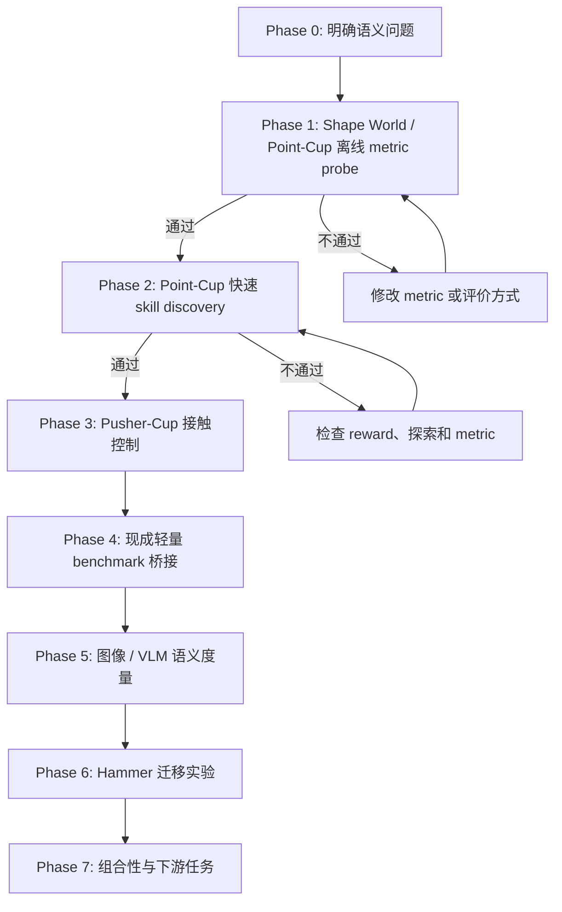

# Semantic Skill Discovery: Experiment Flow

> [当前状态]
> 分支：`codex/skill-discovery`
>
> 当前阶段：小环境路线已完成到Taxi-v4 full-domain visual gate；现有Hammer数据审计完成。`isaaclab510` physics smoke通过，但host与Docker的RTX rendering均在当前4x RTX 2080 Ti机器上启动即崩溃，Hammer视觉gate被硬件阻断。
>
> 当前动作：停止RTX参数试错；先用`isaaclab510`在四张卡完成四条无渲染env0状态rollout，验证旧checkpoint是否真实移动/抬升hammer。新视频和object-centric/VLM gate保持未完成，不把state-only结果冒充视觉结果。

## 一眼看完整流程



核心顺序是：先证明“什么距离才有意义”，再证明它能指导快速 skill discovery，之后才付出 Hammer 和 VLM 的训练成本。

## 核心研究问题

普通 unsupervised skill discovery 在 raw state space 中扩大覆盖范围。这个目标容易优先覆盖体积大的行为区域，而忽略体积小但语义关键的事件。

最小例子：一个球可以位于二维平面的任意位置，“球在杯子里”只占很小的几何区域，但对人来说，“杯内”和“杯外”应当是两个同等重要的语义状态。

我们要检验：

1. 使用 semantic representation `phi` 计算轨迹差异，能否比 raw-state distance 更公平地覆盖稀有语义模式？
2. 这个 representation 能否保留可控、与物体交互有关的行为，而不是只产生视觉上不同但不可执行的状态？
3. 离线验证过的 metric 放入 skill discovery reward 后，是否真的产生更可解释、可组合的技能？

暂定主假设：

`raw state diversity -> geometric coverage`

`semantic diversity + controllability -> meaningful behavior coverage`

## 为什么不先跑 Hammer

Hammer 同时包含高维机械臂控制、接触动力学、长时间 PPO 训练、视频采集和 VLM 推理。若结果失败，很难判断是 metric、探索、控制、物理环境还是训练稳定性出了问题。

因此 Hammer 现在是迁移阶段，不是概念验证阶段。小环境会把变量逐层加回来：

| 阶段 | 控制难度 | 接触 | 图像 / VLM | 主要问题 |
| --- | ---: | ---: | ---: | --- |
| Shape World / Point-Cup offline | 无训练 | 否 | 否 | metric 是否表达我们要的语义 |
| Point-Cup discovery | 很低 | 否 | 否 | metric 是否能指导探索 |
| Pusher-Cup | 低 | 是 | 可选 | 语义行为是否可控且需要交互 |
| MiniGrid / MuJoCo public bridge | 低到中 | 任务相关 | 可选 | 结论是否离开自建环境仍成立 |
| Visual probe | 低到中 | 是 | 是 | foundation-model space 是否接近 oracle |
| Hammer | 高 | 是 | 是 | 方法能否迁移到真实研究环境 |

## Phase 0：研究定义

状态：`完成初稿`

我们暂时把一个“有意义的 skill”定义为：

1. 它对应可区分的轨迹级行为，而不只是不同的静态 pose。
2. 它改变任务相关对象或对象关系，而不只是机械臂关节在大空间里运动。
3. 它位于环境中可执行的 manipulation subspace。
4. 一组 skills 应当公平覆盖稀有和常见的 semantic equivalence classes。
5. 在后期实验中，这些 skills 应能被高层策略选择或组合来完成任务。

这个定义连接旧笔记中的四条线索：DIAYN/DADS 的可区分性、LSD/CSD/METRA 的距离度量、LGSD 的 language space、RGSD 的 reference-grounded feasible manifold。

## Phase 1：Semantic Shape World / Point-Cup 离线 Metric Probe

状态：`完成`

### 环境形式

这不是 Isaac Lab 环境，也不依赖刚体或软体物理。它是一个可参数化的二维关系图形：

- 图节点：`ball`、`cup`，后续可增加 `pusher`、`obstacle`。
- 节点属性：位置、大小、颜色和形状参数。
- 关系边：`outside`、`near`、`crossing`、`inside`，后续增加 `touching` 和 `pushing`。
- 转移：直接、确定性的几何规则。
- 画面：从图状态直接栅格化为小尺寸 RGB 图像，供后续 visual/VLM probe 使用。

环境接口从第一天就接受 layout 参数，因此杯子的位置、半径、开口方向和形状可以改变。但第一轮固定布局，只验证 metric。形变在第二轮作为 held-out generalization 测试，不作为第一轮训练变量。

### Point-Cup 模式

- 世界：二维正方形 `[-1, 1] x [-1, 1]`。
- 对象：一个可移动的球和一个固定小杯区。
- 动作：二维位移，直接控制球；每步动作有最大幅度。
- Episode：64 control steps。
- 杯区面积约为世界面积的 1% 到 3%，故 `inside` 是几何上稀有的状态。
- 第一版无物理引擎、无神经网络、无 GPU 依赖，目标是几秒内生成可复现实验数据。
- 第一版杯区固定；通过 gate 后再测试大小、长宽比、位置和开口方向变化。

### 数据集

生成两个互不混用的数据池：

1. `discovery_pool`：随机动作产生的自然不平衡数据，用于模拟 raw exploration。
2. `balanced_audit`：脚本策略均匀生成 `outside`、`boundary-crossing`、`inside` 轨迹，只用于评价 metric。

每条轨迹保存：

- `states`: 球的 `(x, y)`。
- `actions`: 每步二维动作。
- `semantic_labels`: `outside`、`entering`、`inside`、`leaving`。
- `frames`: 可选的俯视 RGB 图像，留给 Phase 4。
- `seed` 和环境配置。

### 第一轮 metric

| 名称 | 定义 | 作用 |
| --- | --- | --- |
| Raw L2 | 标准化后的 `(x, y)` 欧氏距离 | 现有 volume-based baseline |
| Random feature | 固定随机投影后的距离 | 负对照 |
| Semantic oracle | 语义类别距离 + 很小的类内几何距离 | 理想上界，不是最终方法 |
| Object transition | 对 `delta state` 与 inside/outside relation 编码 | 检查轨迹级表示是否优于静态状态 |

Oracle 的作用是先验证完整实验逻辑。如果连 oracle 都不能改善语义覆盖，问题在评价或 reward 设计，不应开始 VLM 或 Hammer。

### 离线评价

1. `Balanced kNN accuracy`：距离最近的轨迹是否具有相同语义。
2. `Rare semantic recall`：在固定数量 representative trajectories 下，是否选到稀有 `inside` 和 crossing 事件。
3. `Semantic coverage entropy`：各语义类的访问是否均衡。
4. `Geometric coverage`：避免 semantic metric 通过坍缩到一个点取得虚假高分。
5. `Nuisance invariance`：同一语义类内的大位置变化不应压过 inside/outside 的差异。

### Phase 1 Gate

同时满足以下条件才进入训练：

- Oracle 对 rare semantic recall 明显优于 Raw L2。
- Oracle 的 semantic coverage entropy 更高。
- Oracle 没有完全丢掉几何覆盖；暂定至少保留 Raw L2 的 70%。
- 结果在至少 5 个随机种子上方向一致。
- 自动标签随机抽样 30 条轨迹，人工查看没有系统性错误。

产物计划：

- `skill_discovery/point_cup.py`
- `skill_discovery/generate_point_cup_dataset.py`
- `skill_discovery/evaluate_metrics.py`
- `outputs/skill_discovery/point_cup/<run_id>/config.json`
- `outputs/skill_discovery/point_cup/<run_id>/metrics.json`
- `outputs/skill_discovery/point_cup/<run_id>/metric_comparison.svg`

### 独立运行环境

小环境不使用 `isaaclab510`。独立 Conda 环境位于：

`/home/wang100/data/conda/envs/skill-discovery`

当前仅安装 Python 3.11 和 NumPy。测试命令：

```bash
/home/wang100/data/conda/envs/skill-discovery/bin/python -m unittest skill_discovery.test_point_cup
```

### 第一轮结果

Run：`point_cup_probe_20260722_022926`

候选池共 4096 条自然不平衡随机轨迹：`outside=3847`、`inside=14`、`entering=31`、`leaving=204`。平衡审计数据的自动观察类别与生成意图 100% 一致。

| Metric | 代表轨迹类覆盖 | Rare recall | 语义熵 | 几何覆盖 | Inter / intra distance |
| --- | ---: | ---: | ---: | ---: | ---: |
| Raw L2 | 0.50 | 0.33 | 0.207 | 0.574 | 1.25 |
| Random feature | 0.50 | 0.33 | 0.325 | 0.562 | 1.22 |
| Object transition | 0.50 | 0.33 | 0.207 | 0.543 | 1.42 |
| Semantic oracle | **1.00** | **1.00** | **0.813** | **0.598** | **20.33** |

第一轮支持的有限结论：当候选数据中 rare modes 存在但数量很少时，Raw L2 的代表点选择主要追逐几何极值；oracle metric 能选到四类语义，同时没有牺牲本轮几何覆盖。

第一轮不能支持的结论：这还不能证明 learned metric 或 VLM 有效，也不能证明 semantic reward 能训练出对应 policy。


> [失败记录]
> 第一版随机动作幅度单一，候选池中没有持续 `inside` 轨迹，导致任何 metric 都不可能得到完整 rare recall。第二版只扩大随机动作幅度分布，没有做类别平衡，候选池出现 14 条持续 inside 轨迹后再进行比较。

> [失败记录]
> 当前 balanced kNN accuracy 对四种 metric 都是 1.0，因为脚本生成的四类轨迹在运动模式上太容易区分。这个指标只能作为数据管线 sanity check，不能作为 metric 优劣证据。下一轮会加入相同语义下的大位置/形状变化，以及不同语义下很小的像素和几何变化。

### 五个 Seed 与 Nuisance Audit

Aggregate run：`point_cup_multiseed_20260722_0234`

Seeds：`7, 17, 27, 37, 47`

Nuisance audit 使用 12 个 held-out layouts。Positive pair 是同一语义和同一 canonical behavior 在不同 cup position / aspect ratio 下的轨迹；negative pair 是同一 layout 中几何上接近但语义不同的轨迹。

| Metric | Rare recall | 语义熵 | 几何覆盖 | Cross-layout kNN | Nuisance triplet |
| --- | ---: | ---: | ---: | ---: | ---: |
| Raw L2 | 0.267 ± 0.133 | 0.213 ± 0.119 | 0.615 ± 0.025 | 0.326 ± 0.037 | 0.030 ± 0.028 |
| Random feature | 0.333 ± 0.000 | 0.281 ± 0.100 | 0.602 ± 0.033 | 0.326 ± 0.044 | 0.025 ± 0.022 |
| Object transition | 0.333 ± 0.211 | 0.306 ± 0.198 | 0.552 ± 0.012 | 0.583 ± 0.044 | 0.633 ± 0.122 |
| Semantic oracle | **1.000 ± 0.000** | **0.829 ± 0.032** | 0.597 ± 0.021 | **1.000 ± 0.000** | **1.000 ± 0.000** |

每个 seed 都通过预先写下的 numeric gate。Oracle 保留的几何覆盖是 Raw 的约 97%，高于 70% gate。

30 条分层抽样轨迹同时覆盖 fixed 与 nuisance layouts。联系表每行依次为 start / middle / final；左侧颜色为灰色 outside、蓝色 inside、绿色 entering、橙色 leaving。人工查看和 manifest 均为 30/30 匹配。


完整汇总：`outputs/skill_discovery/point_cup/point_cup_multiseed_20260722_0234/summary.json`

> [结果]
> Phase 1 gate 通过。这个结论只证明 oracle semantic metric 的离线排序符合预期；它还没有证明该 metric 能通过 policy optimization 发现 rare mode。

## Phase 2：Point-Cup 快速 Skill Discovery

状态：`完成`

这一阶段才开始训练，但环境和网络都很小，目标运行时间是分钟级而不是小时或天。

### 第一轮训练设计

第一轮只使用两个 skills，因为当前最小语义关系是 binary `inside/outside`。若先放四个 skills，会强迫方法在并不存在的语义类中制造差异。

采用小型 tabular DIAYN-style mutual-information objective：

- Policy：`skill x discretized (x, y) -> 9 discrete actions` 的 logits table。
- Optimizer：batched REINFORCE，带 per-skill moving baseline 和固定 epsilon exploration。
- Reset：球从杯外同一小区域开始，避免 reset distribution 替策略制造语义差异。
- Raw discriminator input：episode 终点的二维 grid cell。
- Semantic discriminator input：episode 终点的 `inside/outside` relation。
- Intrinsic reward：`log q(z | feature) - log p(z)`。
- 唯一变化变量：discriminator 使用哪一种 feature。

这个实验不是最终算法，而是最小因果检验：当训练算法完全相同时，替换 representation 是否会把两个 skills 从“两个几何终点”改成“一个杯内、一个杯外”。

最小对照：

1. Random policy。
2. Raw endpoint DIAYN。
3. Semantic relation DIAYN。

所有方法使用相同策略网络、步数、seed 和优化器。主要曲线：

- `inside_rate`
- `enter_exit_count`
- `semantic_entropy`
- `xy_coverage`
- `skill_semantic_mutual_information`

同时记录 `endpoint_grid_mutual_information`，避免只展示 semantic 方法占优的指标。

### Phase 2 Gate

- Semantic reward 在多个 seed 上提高 inside/outside 的均衡覆盖。
- 产生的差异来自策略行为，而不是 reset distribution。
- 不同 latent skill 对应稳定、可复现的轨迹模式。
- Raw baseline 仍作为几何覆盖的参照，不隐藏其可能更强的指标。
- 首轮预注册的可读 gate：Semantic 方法中一个 skill 的 final inside rate 至少 0.8，另一个至多 0.2；5 个 seed 中至少 4 个满足。
- 若 Semantic 方法只偶然进入一次杯内但无法稳定复现，则判定失败。

### Phase 2 结果

Aggregate run：`tabular_diayn_multiseed_20260722_0243`

Seeds：`7, 17, 27, 37, 47`。每种方法每个 seed 都训练 400 iterations，并使用 1024 个无探索 evaluation episodes / skill。表中为 5-seed mean；`stable pass` 同时要求 evaluation gate 和最后 20 个训练 iterations 的稳定性 gate 通过。

| Method | High inside | Low inside | Semantic MI (bits) | Endpoint-grid MI (bits) | XY coverage | Stable pass |
| --- | ---: | ---: | ---: | ---: | ---: | ---: |
| Random policy | 0.0648 | 0.0609 | 0.00008 | 0.0177 | 0.4397 | 0 / 5 |
| Raw endpoint DIAYN | 0.0988 | **0.0000** | 0.0559 | **0.9950** | **0.4653** | 0 / 5 |
| Semantic relation DIAYN | **0.9846** | 0.0016 | **0.9351** | 0.9551 | 0.3866 | **5 / 5** |

这个结果没有把 raw baseline 的优势藏起来：它在 endpoint-grid MI 和 XY coverage 上最好，说明它确实学会了把两个 skills 放到不同几何终点。可是这些终点几乎都在杯外；它没有稳定发现几何体积很小的 `inside` relation。Semantic 方法牺牲了一部分 XY coverage，但 5 个 seed 都稳定地产生一个入杯 skill 和一个杯外 skill，同时保留了 0.955 bits 的 endpoint-grid MI。

Visual audit 重新加载 seed 7 的保存策略，关闭 epsilon exploration，每个 skill rollout 64 次，并展示其中 3 次的 5 个时间点。左侧第一条颜色依次表示 Random（灰）、Raw（蓝）、Semantic（绿）；第二条颜色表示 skill 0（橙）和 skill 1（紫）。抽样入杯率分别为 Random `0.0625/0.0313`、Raw `0.0000/0.0313`、Semantic `1.0000/0.0000`。人工查看确认 semantic skill 0 的展示轨迹确实把红球移入蓝色杯区，并非指标误判。


完整汇总：`outputs/skill_discovery/point_cup_training/tabular_diayn_multiseed_20260722_0243/summary.json`

> [结果]
> Phase 2 gate 通过。这只支持“在固定布局的直接控制 toy environment 中，semantic representation 改变了 discovery 的行为类别”这一有限结论；它还没有证明这些语义状态需要 object interaction，或能迁移到图像、VLM、Hammer。

## Phase 3：Pusher-Cup 规则接触控制

状态：`Phase 4A 通过；Phase 4B v1 失败，准备 balanced-oracle control diagnostic`

将“直接控制球”改成“控制一个二维 pusher，只有图形重叠或接触时球才按规则移动”。它仍然不是物理模拟，只加入最小 manipulation constraint：

- 状态：pusher pose、ball pose 和速度。
- 动作：pusher 的二维速度或位移。
- 语义事件：approach、contact、push、enter cup、leave cup。
- 失败模式：只让 pusher 自己进入杯区，球没有发生语义变化。
- 接触转移：使用确定性几何规则，例如接触时把 pusher 位移的一部分传给 ball，不计算质量、摩擦、碰撞求解或软体形变。

这一步检验 semantic metric 是否与 controllability/object interaction 对齐。若 oracle reward 仍只产生无效动作，就需要在 metric 中加入 object transition 或 reachability constraint。

### Phase 3 首轮实现计划

这一步仍保持二维图形环境，不退化成一维轨道，也不加入 Isaac Lab：

1. `Environment correctness`：pusher 在二维平面直接移动；仅当 pusher 与 ball 图形接触时，当前 pusher displacement 才传给 ball。先用 scripted trajectories 验证未接触、接触、持续推动、球入杯和边界裁剪。
2. `Render audit`：固定渲染 pusher、ball、cup 与 contact 状态。人工检查至少一条成功 push-in 轨迹和一条 pusher 自己经过 cup、ball 未移动的反例。
3. `Offline reachability audit`：随机策略和 scripted policies 共同生成数据，确认三个语义类都真实可达，而不是由标签器伪造。
4. `Skill discovery`：扩展现有 tabular DIAYN trainer 到 3 skills。Policy 对所有方法看到相同的离散 raw graph state `(pusher_x, pusher_y, ball_x, ball_y)`；只改变 discriminator feature。
5. `Multi-seed comparison`：一个 seed 做信号检查，通过后运行 5 seeds 的 Random / Raw / Semantic 对照，并保存曲线、策略、数值汇总和 deterministic rollout contact sheet。

首轮 semantic trajectory class 固定为：

- `no_contact`：整条轨迹没有接触，ball 没有被操作。
- `contact_without_inside`：至少接触并移动 ball，但终点没有入杯。
- `ball_inside`：ball 终点在杯内；pusher 自己的位置不能代替 ball 状态。

Raw discriminator 使用 terminal `(pusher_x, pusher_y, ball_x, ball_y)` grid cell；Semantic discriminator只使用上面的三类轨迹事件。两者的 policy、reset、动作、训练步数、optimizer 和随机种子保持一致。

### Phase 3 Gate

- scripted environment tests 与人工 render audit 均通过。
- Semantic 方法的三个 skills 可以按 permutation 分别匹配三个语义类，每个匹配类的频率暂定至少 0.70。
- `ball_inside` skill 的 final inside rate 至少 0.70，并且 ball displacement 明显大于零，排除只移动 pusher 的假成功。
- 最后 20 个 iterations 中，至少 80% 满足 specialization gate。
- 5 个 seeds 中至少 4 个通过；Random 和 Raw 的几何覆盖、terminal MI 仍完整报告。
- 若随机探索完全采不到 `ball_inside`，先记录失败并调整 exploration/reset curriculum，不修改标签或在结果出来后放宽 gate。

首轮 cup 与对象尺寸固定。环境 API 继续支持 cup position / axes、ball radius、pusher radius 和 transfer ratio 的变化；只有固定布局 gate 通过后，才把这些变化作为 held-out nuisance/generalization audit。

这批实验仍是纯 NumPy CPU workload，单次运行预计秒到分钟级；此时分配 GPU 只会增加启动和数据搬运开销。等 Phase 4 引入 neural visual encoder 或 Phase 5 回到 Isaac Lab 时，再按可用 GPU 并行分 seed。

### Environment Correctness 结果

Run：`environment_audit_20260722_025259`

- 11 项 Point-Cup、trainer 和 Pusher-Cup 单元测试全部通过。
- scripted `no_contact` 的 ball path length 为 `0.000`。
- scripted `contact_without_inside` 的 ball path length 为 `0.110`，终点仍在杯外。
- scripted `ball_inside` 的 ball path length 为 `0.495`，终点真实位于杯内。
- false-positive 反例中 pusher 终点位于杯内，但 ball path length 为 `0.000`，标签仍为 `no_contact`。

联系表每行是一个脚本、每列依次为 step `0/4/8/12/20/25/32`。橙色圆是 pusher，接触瞬间变绿；红色圆是 ball，蓝色椭圆是 cup。人工查看与自动 manifest 的 5 项 checks 全部一致。


> [结果]
> 最小接触规则和 ball-based success definition 通过。这个结果只证明环境可表达三个事件，不证明无监督探索能够发现它们。

### Offline Reachability 结果

Run：`reachability_audit_20260722_025515`

5 个 seeds 各运行 8192 条固定 reset 的自然随机轨迹，共 40,960 episodes：

| Class | Mean rate | Total count |
| --- | ---: | ---: |
| `no_contact` | 0.79490 | 32,559 |
| `contact_without_inside` | 0.20508 | 8,400 |
| `ball_inside` | 0.0000244 | 1 |

独立 scripted audit 对每个 intent 运行 512 条带轻微动作扰动的轨迹，三个 class 的 recall 均为 1.0，confusion matrix 为严格对角矩阵。环境可达，但自然随机探索中的 `ball_inside` 约四万分之一，是一个真实的 rare mode。

### Training Signal Check v1：失败

Run：`pusher_diayn_semantic_seed7_20260722_025919`

800 iterations、512 episodes / skill / iteration。Evaluation 关闭探索，每个 skill 运行 2048 episodes：

- skill 0：`contact_without_inside=0.9961`，mean ball path `0.2244`。
- skill 1：`no_contact=1.0000`。
- skill 2：再次坍缩为 `no_contact=1.0000`。
- 最佳 permutation 的 matched rates 为 `0.9961 / 1.0000 / 0.0000`。
- Semantic MI 为 `0.9161 bits`，但 specialization gate 和 last-20 stability gate 均失败。
- 800 个训练 iterations 中有 408 个出现至少一条入杯轨迹，但单个 iteration 的最高 inside rate 仅 `0.0078`，信号不足以形成可复现 policy。

> [失败记录]
> v1 能稳定分开 `no_contact` 与 `contact_without_inside`，却无法把约四万分之一的 `ball_inside` 事件放大成第三个 skill。高 semantic MI 不能替代三类 gate；本轮明确判失败。

### Training v2 预注册调整

唯一变化是 exploration 的时间相关性：

- v1 的 epsilon action 每一步独立采样，形成近似随机游走。
- v2 在触发 epsilon exploration 时，随机选一个 action 并持续 12 steps。
- burst action 不读取 cup、ball、class 或 reward，不是 scripted push-right policy。
- Random、Raw、Semantic 三种方法使用完全相同的 burst 规则。
- deterministic evaluation 仍设置 epsilon 为 0，不允许 burst 帮忙完成任务。
- 环境、reset、3 classes、policy table、discriminator feature、训练预算和 Phase 3 gate 全部不变。

先只重跑 semantic seed 7。若仍失败，则不继续堆训练预算；下一项诊断将比较“终点 reward credit assignment”与“轨迹事件首次发生时的 reward”，并在修改前再次写计划。

> [失败记录]
> 首次 v1 运行在 sampler 中遇到 float32 cumulative probability 略小于 1，产生越界 action id 9。sampler 已显式裁到合法 action 范围并加入回归测试；上述 v1 结果来自修复后从头运行，不受这个程序错误影响。

### Training Signal Check v2：仍失败

Run：`pusher_diayn_semantic_seed7_20260722_030257`

12-step random burst 提高了 exploration coverage，但没有产生第三个稳定 skill：

- 最佳 matched rates：`1.0000 / 0.9546 / 0.0000`。
- evaluation 中最高 final inside rate 为 `0.0449`。
- 最后 20 iterations 的 specialization gate fraction 仍为 `0.0`。
- 关闭 exploration 的独立诊断显示，contact skill 有 `0.2769` 的轨迹曾经进入 cup，但只有 `0.0449` 最终留在 cup；terminal-only class 抹掉了大部分 transient entering events。

> [失败记录]
> 与语义无关的 persistent exploration 让策略更常到达杯区，但 terminal DIAYN 仍停在两个有效 classes。v2 不通过 Phase 3 gate，不通过增加 iterations 追结果。

### Training v3：Balanced Semantic Oracle 诊断计划

原始项目假设不仅要求 MI，还明确要求 `fairly covering semantic equivalence classes`。v3 因此先测试一个诊断上界：

- 三个 skills 与三个 semantic classes 做一一匹配；映射由 seed 决定的随机 permutation 产生，class 名称不绑定固定 skill id。
- 每条 trajectory 仅在终点 class 匹配该 skill 的当前 target class 时得到 oracle reward。
- 仍使用 v2 相同的 12-step task-agnostic exploration、policy、reset、episode length、训练预算和 evaluation gate。
- Random、Raw DIAYN、Semantic DIAYN 保留为对照；新增方法明确命名为 `Semantic balanced oracle`。
- 它使用人工 class identity，因此只回答“若公平覆盖目标明确，当前控制器能不能学会三类”，不能回答 learned metric 或 unsupervised objective 是否成立。

若 oracle 仍失败，问题主要在 sparse credit/control，应改 transition-level reward 或 curriculum。若 oracle 通过而 Semantic DIAYN 失败，问题主要在 MI objective 的局部最优，下一步应实现无需 class label 的 semantic spread / balanced assignment，而不是继续调环境。

### Training v3 结果：Deterministic 通过，完整 Gate 未通过

Run：`pusher_diayn_semantic_balanced_seed7_20260722_030718`

Seeded target permutation 为 `[no_contact, ball_inside, contact_without_inside]`。关闭探索的 2048 episodes / skill evaluation：

| Target | Matched rate | Contact rate | Final inside | Mean ball path |
| --- | ---: | ---: | ---: | ---: |
| `no_contact` | 0.9644 | 0.0356 | 0.0000 | 0.0028 |
| `ball_inside` | 0.8970 | 1.0000 | 0.8970 | 0.5483 |
| `contact_without_inside` | 0.9736 | 1.0000 | 0.0264 | 0.3613 |

Semantic MI 为 `1.2882 bits`，terminal graph MI 为 `1.4019 bits`。Deterministic specialization gate 通过，说明当前控制、探索数据和 terminal reward 足以学会真正的入杯 policy。

完整 gate 仍未通过：v3 尾段 `epsilon=0.08` 时一次 burst 持续 12 steps，因此训练 batch 中实际被随机动作占据的比例远高于 8%；last-20 specialization fraction 为 `0.0`。这不是隐藏掉的测量问题，当前预注册 full gate 明确判失败。

### Training v3b 预注册调整

- 唯一变化：`epsilon_end: 0.08 -> 0.00`，仍从 `0.35` 线性退火。
- burst length、oracle targets、policy、环境、reset、800 iterations、512 episodes / skill、evaluation 和 thresholds 均不变。
- 目的：让最后 20 个 training batches 测量 learned policy，而不是持续注入的 12-step random macro-actions。
- v3b 仍只是 oracle diagnostic；即使 full gate 通过，也不能作为最终方法。

### Training v3b 结果：单 Seed 诊断通过

Run：`pusher_diayn_semantic_balanced_seed7_20260722_030919`

- Deterministic matched rates：`0.9995 / 0.9917 / 0.9927`。
- 入杯 skill final inside rate：`0.9917`；mean ball path：`0.5268`。
- Semantic MI：`1.5376 bits`；terminal graph MI：`1.4270 bits`。
- Last-20 specialization fraction：`1.0`，mean matched rate：`0.9637`。
- Evaluation gate 与 training stability gate 均通过。

Visual audit 重新加载保存策略、关闭探索，并对每个 skill rollout 128 次。抽样 matched rates 为 `1.0000 / 0.9844 / 0.9922`。联系表中每个 skill 展示 3 条轨迹和 7 个时间点；人工确认 no-contact skill 不移动 ball、inside skill 真正把 ball 推入 cup、contact skill 移动 ball 但停在杯外。


> [结果]
> v3b 单 seed 诊断通过。这证明显式公平覆盖的 oracle objective 能控制当前环境，但不证明无监督 semantic spread 已解决；Phase 3 方法 gate 仍保持未完成。

### Multi-seed 诊断计划

- Seeds：`7, 17, 27, 37, 47`。
- Methods：Random policy、Raw endpoint DIAYN、Semantic terminal-class DIAYN、Semantic balanced oracle。
- 每项：800 iterations、512 episodes / skill / iteration、2048 deterministic evaluation episodes / skill。
- 所有方法共享 12-step exploration burst，并从 epsilon `0.35` 线性退火到 `0.00`。
- 共 20 个 runs；使用 4 个并行 CPU processes。代码是纯 NumPy，GPU 在这里没有可执行 kernel，因此不占用 4 张 GPU。
- Oracle diagnostic gate：至少 4/5 seeds 同时通过 deterministic evaluation 与 last-20 stability；所有 baseline 的 semantic MI、terminal graph MI、pusher/ball coverage 和真实轨迹一并报告。
- 即使 oracle 5/5 通过，也只定位 objective gap；下一大步必须先写出无需人工 class target 的 balanced semantic spread 计划，不能直接跳到公开 benchmark 声称方法已完成。

### Multi-seed 诊断结果

Aggregate run：`pusher_multiseed_20260722_0312`

| Method | Mean matched | Min matched | Highest inside | Semantic MI | Terminal graph MI | Pusher coverage | Ball coverage | Stable pass |
| --- | ---: | ---: | ---: | ---: | ---: | ---: | ---: | ---: |
| Random | 0.3369 | 0.0002 | 0.0003 | 0.0002 | 0.0356 | 0.5877 | 0.2123 | 0 / 5 |
| Raw DIAYN | 0.6253 | 0.0333 | 0.0351 | 0.6864 | **1.5850** | 0.9111 | 0.1901 | 0 / 5 |
| Semantic DIAYN | 0.6612 | **0.0000** | 0.0157 | 0.9150 | 0.8581 | 0.8889 | **0.3778** | 0 / 5 |
| Semantic balanced oracle | **0.9940** | **0.9917** | **0.9917** | **1.5320** | 1.3984 | **0.9284** | 0.3531 | **5 / 5** |

Balanced oracle 的 class-specific matched means 为 `no_contact=0.9963`、`contact_without_inside=0.9940`、`ball_inside=0.9917`，入杯 skill mean ball path 为 `0.5282`，last-20 gate 每个 seed 都是 1.0。

Raw DIAYN 的 terminal graph MI 达到 3 skills 的理论上限 `log2(3)=1.5850`，是最强几何终点分离 baseline；它仍没有发现稳定入杯。Semantic DIAYN 在 5 个 seeds 中都精确学到 no-contact 和 contact，但第三个 skill 重复已有 class，说明高 MI 本身不保证公平 semantic coverage。

四种方法的 seed 7 deterministic audit 每个 skill 展示 2 条轨迹。人工确认 Random 是随机移动，Raw 主要把 pusher/ball 送到不同几何终点，Semantic DIAYN 只有两个语义模式，只有 Balanced oracle 同时产生三种真实 object-interaction behaviors。


完整汇总：`outputs/skill_discovery/pusher_cup_training/pusher_multiseed_20260722_0312/summary.json`

> [结果]
> Oracle diagnostic gate 通过，Phase 3 method gate 明确保持失败。证据定位到 objective gap：人工指定公平覆盖时控制可行，plain MI 不会自动公平覆盖稀有 semantic class。

### Training v4：无 Target Semantic Spread 计划

令 `c = phi(tau)` 为 trajectory 的 semantic class，`K=3`。保留 DIAYN reward，并显式提高整体 semantic occupancy entropy：

`r = log q(z | c) - log p(z) + lambda * [-log(K * p(c))]`

- 第一项保持 skill 可区分性。
- 第二个 coverage term 对高于均匀占比的 class 给负值，对低于均匀占比的 rare class 给正值。
- `p(c)` 使用带 pseudocount 和 exponential decay 的全 population moving counts。
- 首轮固定 `lambda=1.0`，不做看结果后的 sweep。
- 不设 skill-to-class mapping、不使用 seeded target permutation；哪个 skill 占据哪个 class 完全由训练产生。
- Semantic representation 仍是人工 oracle class，因此这是“objective probe”，还不是 learned/VLM representation 结果。
- 环境、burst exploration、epsilon `0.35 -> 0.00`、policy、reset、800 iterations、训练量和 Phase 3 gate 全部保持不变。

这个目标等价于在 MI 外额外提高一次 `H(C)` 权重，直接对应原始笔记中的 `fairly covering semantic equivalence classes`，而不是事后给每个 skill 指定 goal。

先跑 seed 7：若 evaluation 和 last-20 gate 都通过，再跑 5 seeds；若所有 skills 一起追逐 rare class 或仍停在两类，则判简单 entropy reweighting 失败，下一步再考虑 continuous semantic distance / population optimal transport，不调 `lambda` 追单点成功。

### Training v4 单 Seed 结果：通过

Run：`pusher_diayn_semantic_spread_seed7_20260722_032008`

- 无 skill-to-class target；输出中的 `balanced_target_classes` 为 `null`。
- Deterministic matched rates：`1.0000 / 0.9961 / 0.9795`。
- 入杯 skill final inside rate：`0.9795`；mean ball path：`0.5456`。
- Semantic MI：`1.5244 bits`；terminal graph MI：`1.4614 bits`。
- Last-20 specialization fraction：`1.0`；mean matched rate：`0.9562`。
- 最后一轮 population coverage reward 已接近均衡后的 0；按 skill 分别为 `-0.0194 / -0.0695 / +0.0935`，rare inside class 仍得到轻微正 reweighting。

128-rollout visual audit matched rates 为 `1.0000 / 0.9922 / 0.9609`。人工确认三个 skills 真实对应 no-contact、contact-but-outside 和 ball-inside。


> [结果]
> 这是第一个不指定 class target 而通过完整单-seed gate 的方法结果。representation 仍是 oracle class，所以只能称为 semantic objective proof，不是 VLM 方法完成。

### Training v4 Multi-seed Gate

- Seeds：`7, 17, 27, 37, 47`，配置与单 seed 完全一致。
- 只新增 5 个 `semantic_spread` runs；Random、Raw、Semantic DIAYN、Balanced oracle 复用 `pusher_multiseed_20260722_0312`，避免重复计算。
- Method gate：至少 4/5 seeds 同时通过 deterministic evaluation 和 last-20 stability；三类 mean matched rates 均至少 0.70；inside skill mean ball path 至少 0.40；代表 seed visual audit 通过。
- 继续完整报告 geometry/coverage 指标，特别检查 semantic spread 是否通过坍缩 ball geometry 换取三类成功。
- 若通过，Phase 3 固定-layout method gate 才标记完成；下一步先做 held-out layout/shape nuisance，再进入公开 MiniGrid bridge。

### Training v4 Multi-seed 结果：Fixed-layout Gate 通过

Aggregate run：`pusher_spread_multiseed_20260722_0322`

- 5/5 seeds 同时通过 deterministic evaluation 与 last-20 stability。
- Mean matched rate：`0.9922`；mean minimum matched rate：`0.9805`。
- Class-specific means：`no_contact=1.0000`、`contact_without_inside=0.9960`、`ball_inside=0.9805`。
- Semantic MI：`1.5263 bits`；terminal graph MI：`1.4561 bits`。
- Inside ball path：`0.5454`；pusher terminal coverage：`0.9111`。
- Ball terminal coverage：`0.0938`，显著低于 Semantic DIAYN 的 `0.3778`。该方法覆盖了语义 classes，但类内 ball geometry 较窄；这是限制，不作为无关指标删除。

五方法 seed 7 visual audit 通过。Semantic spread 抽样 matched rates 为 `1.0000 / 0.9922 / 0.9688`，画面确认入杯 skill 真实推动 red ball 进入 cup。


完整汇总：`outputs/skill_discovery/pusher_cup_training/pusher_spread_multiseed_20260722_0322/summary.json`

> [结果]
> `phase_3_method_gate_passed=true`，但范围严格限定为 fixed layout + oracle semantic representation。Learned/VLM representation、layout generalization 和公开 benchmark 尚未完成。

### Held-out Layout Audit 计划

不重新训练，直接加载 5 个 semantic-spread policies，在 12 个训练中未出现的 layouts 上 evaluation：

- 9 个 position layouts：cup `x in {0.25, 0.35, 0.45}`，`y in {-0.20, 0.00, 0.20}`，axes 固定 `(0.14, 0.16)`。
- 3 个 shape layouts：center 固定 `(0.35, 0.00)`，axes 分别 `(0.10, 0.20)`、`(0.20, 0.10)`、`(0.18, 0.18)`。
- 每个 policy/layout 使用 512 deterministic episodes / skill；不改 policy observation，也不做 adaptation。
- Generalization gate：12 个 layouts 中至少 9 个保持三类 matched rates 均至少 0.70，且 inside skill ball path 至少 0.40；5 seeds 中至少 4 个满足。
- 同时保存 base-layout control，确认加载/evaluation 管线没有改变原结果。

当前 policy 只观察 absolute pusher/ball grid，没有 cup layout input，因此这个 audit 很可能失败。失败仍有价值：它能证明 fixed-layout semantic coverage 不等于 relational generalization。根据“尽快使用现成环境”的方向，若失败将记录为限制并把 relative/layout-aware observation 要求带入 MiniGrid bridge，不在自建环境继续做长超参循环。

### Held-out Layout Audit 结果：失败

Artifact：`pusher_spread_multiseed_20260722_0322/layout_generalization_audit.json`

- Base-layout control：5/5 policies 均保持通过，排除加载或 evaluator 改变。
- 每个 seed 都只通过 4/12 layouts；要求是至少 9/12，因此 seeds passed 为 0/5。
- 通过项一致：训练中心 `(0.35, 0.00)` 的原尺寸，以及同中心的三个 axes/shape variations。
- 所有 `y=+/-0.20` position shifts 失败；`x=0.25/0.45` 且 `y=0` 也失败。
- Seed 7 例子：base matched rates `1.000/0.992/0.984`；center `(0.25,0)` 的 inside matched rate 仅 `0.020`，center `(0.45,0)` 仅 `0.123`。

联系表的 12 行按 9 个 position layouts、3 个 shape layouts 排列；绿条为通过、红条为失败。画面确认 shifted layouts 中 ball 常经过后离开、停在旧 center 附近或根本没有对准新 y，而不是 evaluator 标签错误。


> [失败记录]
> Fixed-layout semantic spread 不具有 relational layout generalization。根因与接口一致：policy state 只有 absolute pusher/ball grid，没有 cup center/axes。当前结论不能外推到位置变化。

> [方向变化]
> 不在自建环境继续加入 relative observation、domain randomization 和新 sweep。把“policy 必须观察 task-relevant relation/layout”作为公开 benchmark 的设计要求，立即转入 MiniGrid bridge。

## Phase 4：现成轻量 Benchmark 桥接

状态：`Phase 4A 通过；Phase 4B v1/v2 失败，准备低熵 control diagnostic`

自建 Point/Pusher-Cup 只用于初期因果检验，不作为最终实验证据。通过后按“简单到复杂”迁移到公开环境：

1. 首选 `MiniGrid-DoorKey-8x8-v0`：公开、快速、离散 7-action、局部 `7x7x3` image observation；语义事件天然包含取 key、开 door、到 goal。官方说明它是 sparse-reward 且适合 curiosity/curriculum 实验：[MiniGrid DoorKey documentation](https://minigrid.farama.org/main/environments/minigrid/DoorKeyEnv/)。
2. 若 DoorKey 上仍能复现 representation effect，再进入 `Pusher-v5`：公开 Gymnasium MuJoCo 环境，23 维 observation、7 维 torque action、100-step episode，任务是用多关节臂把 cylinder 推到 target：[Gymnasium Pusher documentation](https://gymnasium.farama.org/environments/mujoco/pusher/)。
3. `FetchPush-v4` 作为更接近机械臂但更复杂的备选；它用 4 维 Cartesian gripper displacement、默认 50 steps：[Gymnasium-Robotics FetchPush documentation](https://robotics.farama.org/main/envs/fetch/push/)。只有 Pusher-v5 无法表达所需事件或接口更适合复用时才选它，不并行扩张范围。

Bridge gate 会在实际安装前冻结：现成环境版本、semantic events、raw/semantic 唯一变化变量、训练预算、至少 5 seeds、原生 reward 与我们指标的关系，以及 deterministic 视频审计。所有新依赖继续安装在 `/home/wang100/data/conda/envs/`，不占 home 目录。

### Phase 4A：MiniGrid DoorKey 环境审计计划

先不训练，按以下顺序验证官方环境与语义定义：

1. 在 `/home/wang100/data/conda/envs/skill-discovery` 安装并记录 `minigrid`、`gymnasium`、`pygame` 精确版本；不写入 home Conda 路径。
2. Smoke test `MiniGrid-DoorKey-5x5-v0` 与主实验 `MiniGrid-DoorKey-8x8-v0`：reset、7 个官方 actions、partial symbolic observation、`rgb_array` render、seed reproducibility。
3. 不修改 MiniGrid dynamics，读取官方 grid/object state 定义四个 mutually exclusive trajectory stages：
   - `navigation_only`：尚未拿 key。
   - `key_acquired`：携带 key、door 仍 locked/closed。
   - `door_opened`：door 已 open、尚未到 goal。
   - `goal_reached`：原生 environment termination/reward 成功。
4. 写一个只用于 audit 的 shortest-path scripted solver，真实执行 pickup/toggle/forward actions，依次经过四个 stages；它不进入 skill-discovery training data。
5. 5 seeds 随机策略 reachability audit，报告四个 stages 的自然频率，决定训练探索预算。

Phase 4A Gate：

- 两个 registered env ids 都能 reset/step/render；相同 seed 的 grid/object placement 可复现。
- Scripted solver 真实执行官方 actions，并在一个 episode 中依次触发 key acquired、door opened、goal reached；原生 reward/termination 与 goal stage 一致。
- 随机 rollout 与 scripted rollout 分开统计，不能把 solver 数据冒充 discovery。
- 自动 semantic stages 与至少一张完整 trajectory contact sheet 人工一致。

只有 4A 通过后才写训练计划。训练时所有方法必须观察 layout-relevant MiniGrid observation；不会重演 Pusher-Cup 隐藏 cup location 的接口错误。Native task reward 只用于 evaluation，不进入 unsupervised discovery reward。

### Phase 4A 结果：通过

Run：`doorkey_audit_20260722_033722`

安装位置：`/home/wang100/data/conda/envs/skill-discovery`

版本：`minigrid 3.1.0`、`gymnasium 1.3.0`、`pygame-ce 2.5.7`。

- 5x5 与 8x8 都是官方 registered env，7 actions、`7x7x3` partial observation；RGB render 分别为 `160x160`、`256x256`。
- 相同 seed 的 full grid encoding、agent position 和 direction 可复现。
- BFS audit solver 只调用官方 left/right/forward/pickup/toggle actions。5 个 seeds 中，5x5 使用 8-12 actions，8x8 使用 13-22 actions；全部依次触发四 stages、原生 terminated=true、truncated=false、reward 约 0.96-0.98。
- 8x8 随机策略共 2560 episodes 的 furthest-stage counts：`navigation=218`、`key=1972`、`door=310`、`goal=60`。Native random goal success 为 2.34%，比 Pusher-Cup inside 更容易，但仍是最稀有 stage。

联系表两行分别为 5x5 与 8x8，四列为 reset/navigation、key acquired、door opened、goal reached。人工检查：黄色 key 被实际 pickup，黄色 locked door 被实际 toggle/open，红色 agent 最后进入绿色 goal。


> [结果]
> Phase 4A gate 通过。公开环境、semantic stage 定义、原生 success 与画面一致，可以开始写训练 wrapper；solver 数据不会进入训练。

> [失败记录]
> 首次 2560-episode audit 完整运行后，`action_space.n` 的 `numpy.int64` 导致 JSON serialization 失败。加入 NumPy scalar encoder 后，用 5 个 CPU processes 原样重跑 512 episodes / seed，45 秒完成；上面的结果来自修复后完整 run。

### Phase 4B：5x5 PPO Signal Check 计划

先在官方 `MiniGrid-DoorKey-5x5-v0` 验证训练接口，再进入 8x8：

1. 使用官方 `FullyObsWrapper`，policy observation 为完整 `5x5x3` object/color/state encoding、agent direction 与 one-hot skill。它包含 layout information，避免 Pusher-Cup absolute-state 的不可辨识错误。
2. 使用 Stable-Baselines3 PPO 的 `MlpPolicy` 与 vectorized env；RL update 不再手写。官方 PPO 和 vector-env 接口参考：[SB3 PPO](https://stable-baselines3.readthedocs.io/en/master/modules/ppo.html)、[SB3 vectorized environments](https://stable-baselines3.readthedocs.io/en/master/guide/vec_envs.html)。
3. 4 个 skills 对应四个可能的 trajectory stages，但不预设映射。每个 vector env 固定一个 skill，4 skills 均匀分配；每个 episode layout 由官方 reset seed 生成。
4. Gym wrapper 把 native reward 保存到 `info`，training reward 置零；中央 VecEnv reward wrapper 只在 episode end 根据 furthest stage 计算 intrinsic reward。
5. Methods 保持同一 PPO/config：Random、Raw terminal observation DIAYN、Semantic stage DIAYN、Semantic spread。Balanced oracle 只在方法失败时作为诊断，不先运行。

首轮固定配置：

- 5x5、seed 7、8 envs（2 / skill）。
- `250,000` total timesteps、`n_steps=256`、`batch_size=256`、`n_epochs=4`。
- MLP `[256, 256]`、learning rate `2.5e-4`、entropy coefficient `0.01`。
- CPU PyTorch；MiniGrid step 是主要瓶颈，小 MLP 不占 GPU。长命令使用工具允许的最长等待窗口。

执行顺序与 gate：

- 先实现 Gym/VecEnv wrapper tests：observation 包含 layout+skill；四 stages 的 terminal info 正确；native reward 不泄漏进 training reward；四 skills episode 数均衡。
- 先跑 Semantic spread seed 7。Deterministic evaluation 每 skill 256 episodes，最佳 stage permutation 每类至少 0.70，goal skill 至少 0.70，且 last checkpoints 稳定，才运行同 seed baselines。
- 保存 stage curves、PPO checkpoint、config、evaluation、完整 deterministic videos/contact sheet。
- 若 5x5 通过，再在开始前单独写 8x8 的 1M-step、5-seed 计划；不直接把 5x5 结果外推。

### Phase 4B Infrastructure 结果

新增 data-env 版本：`torch 2.13.0+cpu`、`stable-baselines3 2.9.0`。

- Official FullyObs grid 被 one-hot 编码为 object/color/state，不使用 hidden cup/goal shortcut。
- Skill one-hot 单独拼接；Raw discriminator feature 明确排除 skill id。
- 22 项完整测试通过，包括 SB3 `check_env`、native reward isolation、stage info、rare-stage coverage reward。
- 4096-step end-to-end smoke 在约 6 秒内完成，成功保存 PPO policy、reward counts、checkpoint evaluation 与 SVG。

### Phase 4B Training v1：失败

Run：`doorkey5_ppo_semantic_spread_seed7_20260722_034516`

250,000 timesteps，训练主体用时 `280.4s`。Final deterministic 256 episodes / skill：

- 最佳 matched stage rates：`1.0000 / 0.0273 / 0.0000 / 0.0000`。
- Door 与 goal stages 都没有 deterministic skill；native goal success 全部为 0。
- 5 个 checkpoint 没有一次通过，last-checkpoint stability 失败。
- Deterministic policy modes 大量选择 drop/done/no-op-like actions，所有 episode 都跑满 250 steps。

训练期间并不是没看到 rare events：1059 个 completed training episodes 的 furthest-stage counts 为 `navigation=205`、`key=457`、`door=251`、`goal=146`。Reward model 最终 global stage probabilities 约为 `0.244/0.417/0.221/0.119`，coverage term 确实提高了后两类；但每个 stage 的 `q(skill | stage)` 仍在约 `0.19-0.31`，没有形成 skill-stage 关联。

> [失败记录]
> MiniGrid v1 的失败不是 reachability 或 reward leakage，而是 global semantic entropy 生效、per-skill MI symmetry 没打破。Pusher-Cup 的无 target spread 结果不能直接迁移到随机 layout + neural PPO。

### Phase 4B Training v2：Balanced Oracle 诊断计划

- 新增 objective `semantic_balanced`，用 seed 产生四 stages 的随机 permutation；skill id 与具体 stage 名不固定。
- Terminal reward 仅为“furthest stage 是否等于该 skill target”；native reward 仍不进入 training。
- PPO、FullyObs observation、7 actions、layout randomization、250k timesteps、8 envs、network、seed 与 evaluation gate全部保持 v1 相同。
- 不限制 drop/done actions，不加 curriculum，不延长预算，确保只诊断 objective symmetry。
- 若 oracle deterministic gate 通过：控制/PPO 可行，下一步设计无 target 的 prototype/assignment symmetry breaking。
- 若 oracle 仍失败：先解决 long-horizon credit/action interface，再讨论 semantic objective。

### Phase 4B Training v2 结果：确定性 Gate 失败

Run：`doorkey5_ppo_semantic_balanced_seed7_20260722_035431`

250,000 timesteps，训练主体用时 `279.9s`。Seeded target permutation 为 skill `0/1/2/3 -> goal/key/door/navigation`。

- 训练 stochastic rollouts 确实访问了所有阶段；skill 0 的 343 个终局中有 178 个到达 goal，说明 full observation、动作接口和 PPO 至少具有任务可达性。
- Final deterministic 256 episodes / skill 的最佳 matched rates 为 `0.0938 / 0.2031 / 0.9336 / 0.0000`；所有 deterministic native goal success 都为 0，checkpoint stability 与 signal gate 均失败。
- 独立 stochastic evaluation（64 episodes / skill）中，target-goal skill 0 的 native success 为 **0.9844**，但四技能最佳 matched rates 为 `0.9844 / 0.0000 / 0.6719 / 0.0000`。其余 policies 几乎总会越过 key，不能稳定停在 navigation/key 阶段。
- 因此 balanced terminal reward 已学到一个高成功率 stochastic goal controller，却没有产生四个可确定性部署的阶段技能。当前证据同时指向高 action entropy/终局 credit 与 stage-stopping objective，而不是环境不可达。

> [失败记录]
> Balanced oracle 没有通过预注册的 deterministic gate，不能据 stochastic goal success 宣称 Phase 4B 成功。尤其是随机采样 98.4% 与 deterministic 0% 的巨大差异，说明当前 policy distribution 的能力没有凝结到 argmax 行为。

### Phase 4B Training v2b：移除 Entropy Bonus 计划

下一轮仍使用官方 5x5、balanced target permutation、seed 7、250k timesteps、8 envs、terminal reward、网络与全部 evaluation gate。**唯一训练变量**为 `ent_coef: 0.01 -> 0.0`：

- 若 target-goal skill 的 deterministic success 与四类 matched gate 同时通过，说明 v2 的主要问题是 entropy regularization；之后才回到无 target 方法。
- 若 stochastic/deterministic gap 缩小但 navigation/key skills 仍失败，下一步改为 stage-transition/potential reward，解决“到达后无法停留”的终局 credit；不追加训练步数追结果。
- 若 goal controller 也退化，则 entropy 不是单一根因，保留失败并直接进入 transition-level objective，不做系数 sweep。

### Phase 4B Training v2b 结果：失败

Run：`doorkey5_ppo_semantic_balanced_ent0_seed7_20260722_041428`

250,000 timesteps，训练主体用时 `282.4s`；target permutation 与 v2 相同。

- Final deterministic 最佳 matched rates 为 `0.1836 / 0.0000 / 0.8789 / 0.0000`，所有 native goal success 为 0。
- Final stochastic 最佳 matched rates 为 `0.4375 / 0.3438 / 0.3281 / 0.2812`；target-goal skill 0 的 native success 为 `0.4375`，明显低于 v2 的 `0.9844`。
- 5 个 deterministic checkpoints 都没有 door/goal success；训练 stochastic rollouts 仍访问四 stages，但 skill-stage 分布接近混合。

> [失败记录]
> `ent_coef=0` 没有把 stochastic 能力凝结成 deterministic skills，反而削弱了稀疏奖励下的 goal 探索。停止 entropy 调参；v2b 证明 entropy 不是单一根因。

### Phase 4B Training v3：Stage-Transition Potential 计划

相对 v2 恢复 `ent_coef=0.01`，其余 PPO/环境/seed/预算/gate 不变；唯一 objective 变化是把 episode-end target indicator 改为阶段变化当下的 potential difference：

`Phi(stage, target) = stage / target`，当 `target > 0` 且 `stage <= target`

`Phi(stage, target) = 1 - (stage - target) / (3 - target)`，当 `stage > target`

navigation target 的特例为 `Phi(stage, 0) = 1 - stage / 3`

`r_t = Phi(furthest_stage_t, target) - Phi(furthest_stage_(t-1), target)`

- Potential 始终位于 `[0,1]` 且 target 处为 1；到达 target 的累计正收益统一为 1，继续越过 key/door target 会即时扣回，避免不同 target 的 reward scale 不一致。
- navigation target 初始不发正奖励，但任何后续语义推进都会即时受罚。
- 只在真实 key pickup、door open、goal reach 导致 furthest stage 改变时非零；native reward 仍只用于 evaluation。
- 若 deterministic 四类 gate 通过，说明 v2 的主障碍是 terminal credit/stopping；若 goal 通过但中间类失败，下一步专门处理可终止 skill option；若仍没有 goal，则停止 balanced-oracle PPO 调参并评估 imitation warm start 或 action abstraction。

### Phase 4B Training v3 结果：失败并暂停 DoorKey

Run：`doorkey5_ppo_semantic_balanced_transition_seed7_20260722_042543`

250,000 timesteps，训练主体用时 `285.8s`。

- Final deterministic 最佳 matched rates 为 `0.0000 / 0.0000 / 0.3125 / 1.0000`；这里的 1.0 是 navigation，door/goal 都为 0。
- Final stochastic rollout 几乎全部终止在 `key_acquired`：四 skills 的 key rates 为 `1.0000 / 1.0000 / 0.9844 / 0.9375`，native goal 全部为 0。
- 训练终局共约 1010 episodes，`key_acquired=889`、`door_opened=95`、`goal=18`。Immediate reward 成功放大了第一段 pickup，却使所有 skill 追逐容易的部分进度，仍不能建立后续控制。

> [失败记录]
> DoorKey v1-v3 已依次排查 global coverage、balanced terminal target、entropy 和 stage-transition credit。继续改 reward 或预算会变成同一 benchmark 的调参循环，因此按预注册规则暂停；DoorKey 保留为后续需要 action abstraction / imitation warm start 的 harder benchmark。

## Phase 4C：FrozenLake 最小 Public Graphical Bridge

状态：`环境审计与 balanced control 通过；准备 semantic spread`

这个阶段不是替代 DoorKey，而是在它前面补回用户要求的“足够简单、非物理、基于图形”的第一层公开环境：

1. 使用已安装 Gymnasium 的官方 `FrozenLake-v1`、默认 4x4 map、4 个离散动作；第一轮 `is_slippery=False`，不同时引入控制噪声。
2. Episode 上限固定 32 steps，三种 mutually exclusive trajectory outcomes 为 `safe_timeout`、`hole_terminal`、`goal_terminal`。
3. Native goal reward 只写入 evaluation info，不进入 discovery training。
4. Policy observation 使用 agent tile one-hot + skill one-hot；第一轮固定官方 map，只做 public dynamics signal check，不声称 layout generalization。
5. 使用 tabular Q-learning，不使用 neural PPO；这里要隔离 semantic objective，而不是再次测试 optimizer。

Phase 4C Gate 与顺序：

- 先验证官方 env reset/step/render、seed reproducibility，并用真实动作分别产生 safe timeout、hole、goal；保存 contact sheet。
- 5 seeds random reachability 报告三类自然频率，scripted actions 只用于 audit，不进入训练。
- Balanced oracle control 先跑单 seed；deterministic evaluation 三类都必须稳定复现，再运行无 target semantic spread。
- Semantic spread 使用 `DIAYN + outcome occupancy entropy`，固定 coverage weight 1.0；至少 5 seeds 中 4 seeds 三类均通过，才称 public fixed-map signal 成立。
- 通过后增加 `is_slippery=True` 或 map variation，一次只增加一个变量；不直接返回 Hammer。

### Phase 4C 环境审计结果：通过

Run：`frozenlake_audit_20260722_0444`

- Gymnasium `FrozenLake-v1`：固定 4x4 map、16 states、4 actions、`is_slippery=false`、32-step limit，RGB render 为 `256x256`。
- 5 seeds 的 scripted real actions 全部正确产生 safe timeout、hole terminal 和 native goal terminal；goal 路径只需 6 steps。
- 10,000 random episodes 的 outcome counts 为 `safe_timeout=30`、`hole_terminal=9819`、`goal_terminal=151`。Hole 占 98.19%，两个语义结果都很稀有，适合检验 occupancy bias。
- 联系表三行依次显示 timeout、落洞、到宝箱；人工检查状态、终止类型和 native reward 一致。


### Phase 4C Balanced Control 结果：通过

Run：`frozenlake_semantic_balanced_seed7_20260722_0452`

30,000 episodes，tabular Q-learning 用时 `14.9s`。Seeded target mapping 为 skill `0/1/2 -> goal/safe/hole`。

- Final deterministic matched outcome rates 为 `1.0 / 1.0 / 1.0`，goal native success 为 1.0。
- 三类 trajectory lengths 分别为 goal 6、safe timeout 32、hole 2 steps。
- Last 5 checkpoint stability gate 通过；policy rollout 画面与数值一一对应。


> [结果]
> FrozenLake 的官方 dynamics、三 outcome evaluator 与 tabular control 上界均正常。下一项只移除人工 target mapping，改用与 Pusher-Cup 相同的 `semantic DIAYN + outcome occupancy entropy`，其他配置不变。

### Phase 4C Semantic Spread v1：Final Pass，Stability Fail

Run：`frozenlake_semantic_spread_seed7_20260722_0455`

- Final deterministic matched outcome rates 为 `1.0 / 1.0 / 1.0`，goal native success 为 1.0；policy rollout 画面确认 goal、safe、hole 都是真实执行。
- 28k、29k、30k 三个 checkpoints 全部通过；26k 仍缺 hole，27k 仍缺 safe，故代码中冻结的 last-5 stability gate 为 false，整体 signal gate 明确失败。
- 原配置 epsilon 在 27k（总预算的 90%）才归零，30k 内客观上只有 3 个完整 zero-exploration checkpoints，无法满足 last-5 gate。


> [失败记录]
> 不把最终 checkpoint 的 1.0 事后等同于稳定通过，也不把 stability gate 从 5 改成 3。v1 判定为 final policy 成功但完整 signal gate 失败。

### Phase 4C Semantic Spread v1b：Zero-Exploration Stability 计划

- 总预算仍为 30k，objective/reward/coverage weight/seed/Q-learning/evaluation/gate 均不变。
- 唯一变量：`epsilon_decay_fraction: 0.90 -> 0.80`，即 24k 后 epsilon 为 0，留下 6 个完整 checkpoint 检验 last-5 stability。
- 若 v1b 通过，再冻结该配置运行 5 seeds；若仍失败，判 semantic spread policy oscillation，不继续 sweep。

### Phase 4C Semantic Spread v1b 结果：通过

Run：`frozenlake_semantic_spread_eps80_seed7_20260722_0501`

- Final deterministic matched rates 为 `1.0 / 1.0 / 1.0`，goal native success 1.0。
- Last-5 checkpoint stability 与完整 signal gate 均通过。
- 无人工 target mapping；最终 skill `0/1/2 -> hole/goal/safe`。三行 rollout 画面确认真实落洞、走到宝箱、持续安全到 timeout。


> [计划]
> 固定 30k、epsilon decay 0.8、coverage weight 1.0 和全部 gate，不做 sweep；补四个预注册 seeds。至少 4/5 完整 signal gate 通过才进入 slippery dynamics。

### Phase 4C Semantic Spread Multi-seed：通过

Run group：`frozenlake_semantic_spread_multiseed_20260722_0510`

- Seeds `7/17/27/37/47` 全部通过 final 3-outcome specialization、native goal 和 last-5 stability，完整 gate 为 **5/5**。
- 每个 seed 的三类 matched rate mean 与 minimum 都为 `1.0 / 1.0 / 1.0`。
- Skill permutation 随 seed 变化，排除固定 skill id 对应语义标签；联合重放 15 个 policies 均与 outcome 标签一致。


### Phase 4C Frozen Baseline 计划

固定 v1b 的 30k episodes、epsilon decay 0.8、Q-learning、5 seeds 与全部 evaluation，只替换 objective：

- Random：零 intrinsic reward，检查初始/探索偏置。
- Raw terminal DIAYN：按 terminal tile state 区分 skill，不加 semantic occupancy。
- Plain Semantic DIAYN：按三 outcome 区分 skill，不加 occupancy entropy。
- Semantic spread：使用刚完成的 frozen runs，不重跑。

比较每种方法的 5-seed full-gate pass count、三 outcome matched rates、goal native success 和联合画面。Baseline 无需“必须失败”；若它也通过，结论必须收窄为本环境不需要 occupancy correction。

### Phase 4C Frozen Baseline 结果

Run group：`frozenlake_baselines_20260722_0515`

| Method | Full gate | Safe mean | Hole mean | Goal mean | 结论 |
| --- | ---: | ---: | ---: | ---: | --- |
| Random | 0/5 | 0.000 | 1.000 | 0.038 | 几乎全部落洞 |
| Raw terminal DIAYN | 0/5 | 0.000 | 1.000 | 0.400 | 区分多个 raw terminal tiles，但不保留 safe outcome |
| Plain Semantic DIAYN | **5/5** | **1.000** | **1.000** | **1.000** | 三类稳定分化 |
| Semantic spread | **5/5** | **1.000** | **1.000** | **1.000** | 三类稳定分化，但本环境未显示对 plain semantic 的额外收益 |

联合重放人工检查与指标一致：Raw 的 15 个 skills 主要落入不同 holes，plain Semantic 与 Semantic spread 每个 seed 都各有 safe、hole、goal。


> [结果]
> Fixed deterministic public environment 支持 representation hypothesis：Raw endpoint diversity 追逐多个 hole tiles，而 trajectory-level semantic outcome 能公平表示 safe/hole/goal。它不支持“occupancy entropy 在所有环境都必要”；plain Semantic 已足够。

## Phase 4D：FrozenLake Slippery Dynamics Audit

状态：`环境审计通过；balanced control 配置已冻结`

唯一新增变量为 `is_slippery=true`；map、32-step horizon、三 outcome 定义与 native reward isolation 不变。训练前先完成：

1. 验证官方 transition kernel 的随机性与 seed reproducibility。
2. 10,000 random episodes 报告 safe/hole/goal 自然频率。
3. 使用官方 `env.unwrapped.P` 做 32-step finite-horizon dynamic programming，分别计算最大 safe-timeout、hole-terminal、goal-terminal 概率上界；不把 scripted deterministic path 当作成功证据。
4. 对每个 DP policy 做至少 5 seeds x 512 episodes Monte Carlo，确认 empirical rate 接近计算上界，并保存代表画面。
5. 只有审计通过后，才按可控上界定义 balanced oracle 和 semantic methods 的 class-specific gate；不沿用 deterministic 0.95 gate。

### Phase 4D Slippery Audit 结果：通过

Run：`frozenlake_slippery_audit_20260722_0542`

- 同 seed 的 stochastic state sequence 可复现；官方 transition kernel 被直接用于 DP，没有自建 dynamics。
- 10,000 random episodes：`safe=0.0032`、`hole=0.9835`、`goal=0.0133`。
- 32-step DP probability upper bound 与 2,560-episode empirical replay：safe `1.0000 / 1.0000`、hole `0.999997 / 1.0000`、goal `0.3733 / 0.3547`；三类误差都小于 0.05 gate。
- 代表图确认 stochastic policy 分别保持安全、落洞、到达宝箱；goal 的低概率是 horizon + slip 的环境限制，不是 evaluator 漏检。


### Phase 4D Balanced Control 计划

- 相对 Phase 4C 唯一环境变化为 `is_slippery=true`；map 与 32-step horizon 不变。
- 先运行 seeded balanced target、100k episodes、epsilon decay 0.8、tabular Q-learning；evaluation 使用 1024 episodes / skill，避免 goal rate 的小样本波动。
- Class-specific gate 冻结为 safe `>=0.95`、hole `>=0.95`、goal `>=0.30`。Goal gate 是 DP upper bound 0.3733 的约 80%，且低于 Monte Carlo 0.3547。
- Last-5 checkpoints 必须全部达到各自 gate；native goal success 同样 `>=0.30`。
- 先跑 seed 7。若 balanced control 失败，不运行 semantic methods，先记录 stationary-policy/learning gap；若通过，再冻结相同配置比较 Raw、Semantic、Semantic spread。

### Phase 4D Balanced Control v1：Final Pass，Stability Fail

Run：`frozenlake_slippery_balanced_seed7_20260722_0551`

- Final 1024 episodes / skill：safe `1.0000`、hole `1.0000`、goal/native goal `0.3711`，全部达到 class-specific gate，goal 接近 DP upper bound `0.3733`。
- Last checkpoints 中 safe/hole 已稳定为 1.0；goal 在不同 evaluation seed sets 上为 `0.3057/0.2969/0.2871/0.3662/0.3564`，其中两次低于 0.30，last-5 gate 失败。
- 当前 callback 每个 checkpoint 都把 episode index 加入 evaluation seed；在 stochastic environment 中，这会让 stability 同时包含 policy drift 与 Monte Carlo set drift。

> [失败记录]
> v1 完整 signal gate 保持失败，不能只报告 final 0.371。Control 本身已接近环境上界，但当前 checkpoint stability evaluator 不适用于低概率 stochastic outcome。

### Phase 4D Balanced Control v1b：Common-Random-Numbers 计划

- 训练 objective、seed、100k budget、Q-learning、epsilon、1024 episodes / skill 和三类 gates 全部不变。
- 唯一变化：所有 checkpoints 使用同一组 evaluation transition seeds；final evaluation 继续使用独立 seed set。
- 若 last-5 与 final 都通过，说明 v1 失败来自 evaluator variance；若仍失败，再诊断 constant learning-rate policy oscillation，不运行 semantic methods。

### Phase 4D Balanced Control v1b 结果：Policy Oscillation

Run：`frozenlake_slippery_balanced_crn_seed7_20260722_0603`

- Final 独立 set 仍为 safe/hole/goal `1.000/1.000/0.371`，但 common evaluation set 上 goal 在 85k/90k/95k 为 `0.306/0.291/0.396`。
- 因为测试 transition seeds 固定，差异来自 learned greedy action policy 改变；last-5 gate 仍失败。
- 当前 `alpha=0.15` 为 deterministic FrozenLake 沿用的常数。Stochastic returns 下，即使 epsilon 已归零，持续的大步更新仍能让 Q action ranking 来回切换。

> [失败记录]
> CRN 没有修复 gate，故 v1 的不稳定不是纯 Monte Carlo measurement noise。Semantic methods 继续保持未运行。

### Phase 4D Balanced Control v2：Visit-decay Q-learning 计划

- 相对 v1b 唯一训练变化：每个 `(skill,state,action)` 的 step size 从常数 0.15 改为 `visit_count^-0.6`；该 exponent 满足 tabular stochastic approximation 的常用递减条件。
- 100k budget、epsilon、balanced targets、CRN evaluation、1024 episodes 和 class gates 不变。
- 若 final + last-5 通过，冻结该 learner 进入 semantic comparison；若仍失败，停止本阶段 tabular optimizer 调整，保留 DP policy ceiling 与 learning gap。

### Phase 4D Balanced Control v2 结果：通过

Run：`frozenlake_slippery_balanced_visit_decay_seed7_20260722_0614`

- Final safe/hole/goal rates 为 `1.0000 / 1.0000 / 0.3691`，全部超过 `0.95 / 0.95 / 0.30` gate。
- Goal 达到 DP upper bound `0.3733` 的 98.9%；native goal 与 semantic outcome rate 一致。
- Last-5 CRN checkpoints 全部通过，完整 signal gate true；画面确认三种 stochastic trajectory outcome 真实发生。


> [结果]
> v1/v1b 的不稳定来自 stochastic Q-learning 使用常数大步长，而非环境不可控或 evaluator 错误。Visit-count decay 后 stationary policy 能接近 finite-horizon DP ceiling。

### Phase 4D Objective Comparison 计划

固定 v2 的 100k episodes、visit-count `N^-0.6`、epsilon decay 0.8、CRN、1024 eval、class gates 和 seed 7。仅依次替换 objective：Raw terminal DIAYN、Plain Semantic DIAYN、Semantic spread。

- Balanced 只作为 control upper-bound，不纳入无监督方法胜负。
- 若 Semantic/Spread 单 seed 至少一个通过，再为有希望的方法补 5 seeds；Raw 无论结果均完整报告。
- 若三种无 target objectives 都失败，不调整 gates 或 learner，转向 stochastic representation/objective diagnosis。

### Phase 4D Objective Comparison Seed-7 结果

| Method | Safe | Hole | Goal | Last-5 | Full gate |
| --- | ---: | ---: | ---: | ---: | ---: |
| Raw terminal DIAYN | 1.000 | 0.961 | 0.000 | fail | fail |
| Plain Semantic DIAYN | **1.000** | **1.000** | **0.372** | pass | **pass** |
| Semantic spread | 0.558 | 0.979 | 0.362 | fail | fail |

- Raw 仍把多个 skills 用于不同 hole behavior，没有 goal skill。
- Plain Semantic 的 goal rate `0.3721` 几乎等于 DP ceiling `0.3733`，三 outcome 与 last-5 都通过。
- Spread 的两个 skills 同时追逐 rare goal，导致没有可稳定保持 safe 的 skill。Global occupancy bonus 在 stochastic rare-event 下过度补偿，是一个明确反例。
- 重新渲染器按最终 assignment 搜索代表轨迹并记录 seed offset；若 assigned outcome 概率为 0，则明确标记 not found，不再用一条随机 sample 冒充代表画面。


> [结果]
> 当前最稳的无 target 方法是 Plain Semantic DIAYN，不是 Semantic spread。下一步只补 Plain Semantic 4 个 seeds；不调 spread weight 追结果。

### Phase 4D Plain Semantic Multi-seed：通过但有 Collapse Seed

Run group：`frozenlake_slippery_semantic_multiseed_20260722_0710`

- Seeds `7/17/27/37` 通过 final class-specific gate 与 last-5 stability；goal rates 分别为 `0.372/0.365/0.411/0.370`。
- Seed 47 稳定失败：两个 skills 都是 safe timeout，剩余 skill 为 hole/goal mixture；final safe/hole/goal matched rates 为 `1.000/0.799/0.000`，last-5 一直失败。
- 预注册要求为至少 4/5，故 Phase 4D Plain Semantic gate 通过；failure seed 不被均值隐藏。
- Outcome-aligned 5-seed mean：safe `1.000`、hole `0.958`、goal `0.304`。Goal mean 被 seed-47 的 0 明显拉低。

联合重放最后一行对应 seed 47；第三列 assigned goal 无成功 sample，renderer 明确回退显示实际 safe outcome，顶部蓝条与 manifest 的 `assigned_outcome_found=false` 一致。


> [结果]
> 在相同 public graphical task 上，semantic trajectory outcome representation 从 deterministic 延伸到 stochastic dynamics；但仍有 1/5 symmetry collapse。Global occupancy entropy 不能作为通用修复，因为它在 seed 7 反而复制 rare-goal skills。

## Phase 5：图像与 VLM Metric

状态：`Phase 5A 离线 visual probe 计划已冻结`

在 Point-Cup/Pusher-Cup 上先比较：

1. Raw pixels。
2. 预训练 visual embedding。
3. Vision-language embedding，prompt 固定并缓存。
4. 使用少量 reference trajectories 做 contrastive calibration。
5. Oracle semantic metric，作为上界。

VLM 只离线编码关键帧或短 clip，并缓存 embedding，不放在每个 RL step 在线调用。这样可以把最慢部分从训练 loop 中移走。

关键问题不是“VLM 能不能看出杯子”，而是它的距离排序是否满足：

`different meaningful modes > same mode with nuisance variation`

### Phase 5A：FrozenLake Cached Visual Probe

先利用 Phase 4D 已审计的官方 renderer 与 DP policies 构造平衡数据，不训练 policy：

1. 每个 outcome 采集 5 seeds x 128 条真实 stochastic trajectories；保存 start/middle/final frames、state/action sequence 和 outcome，DP policy 只用于 dataset generation。
2. Train/audit 严格分 seed；比较 raw pixels、固定随机 projection、pretrained visual embedding、prompted vision-language scores 与 semantic oracle。
3. 评价 balanced kNN、cross-seed retrieval、same-outcome trajectory nuisance invariance 和 rare goal representative recall。
4. 先缓存所有 RGB 与 embedding，再做 metric；任何 foundation model 都不进入 env step loop。
5. Oracle 与 raw/pixel 管线先通过后才下载/运行 pretrained encoder；若图像标签或 split 有误，不消耗 GPU。

Phase 5A 第一 gate：平衡 RGB dataset、manifest 与 30 条随机视觉抽样一致；raw pixels/random projection/oracle 的离线结果可复现。完成后再选择一个公开 pretrained visual encoder，不同时比较多个大模型。

### Phase 5A Cached RGB Dataset 结果：通过

Run：`frozenlake_visual_dataset_20260722_0730`

- 1,920 trajectories：5 generation seeds x 3 outcomes x 128；safe/hole/goal 各 640。
- Train seeds `7/17/27` 共 1152，audit seeds `37/47` 共 768；每个 split 内三类完全平衡且 seeds 不重叠。
- 缓存三帧 `start/middle/final`，每帧 64x64 RGB；完整 state/action/length/native reward 同步保存，压缩文件约 3 MB。
- Sanity：safe length 恒 32；hole terminal states 只为 `5/7/11/12`；goal terminal 只为 15 且 native reward mean 1.0。
- 30 条 triptych 视觉抽样人工检查通过，六行依次为 safe、hole、goal 各两行。


> [失败记录]
> 小数据单测最初在 2 seeds 时用 `ceil(0.6N)` 将全部 seeds 放进 train，audit 为空。已限制 train seed count 至多 `N-1`，测试与正式 split 均通过。

### Phase 5A Visual Metric v1：通过管线，但任务过易

Run：`frozenlake_visual_metrics_20260722_0752`

| Representation | Cross-seed 1-NN | Nuisance triplet | Rare safe/goal recall |
| --- | ---: | ---: | ---: |
| Raw terminal state | 1.000 | 0.997 | 1.000 |
| Raw 3-frame pixels | 1.000 | 1.000 | 1.000 |
| Random pixel projection | 1.000 | 1.000 | 1.000 |
| Semantic oracle | 1.000 | 1.000 | 1.000 |

> [失败记录]
> Farthest-point helper 在所有剩余距离并列为 0 时会重复选择同一 index。现已用 selected mask 修复并加 regression test；v1 指标来自修复后重算。

> [问题]
> FrozenLake final sprite 直接显示完整 outcome，generation-seed split 不改变 renderer style，导致 raw pixels 已达到 ceiling。当前结果只能证明数据/metric 管线正确，不能证明 pretrained visual representation 有用。

### Phase 5A Visual Metric v2：Audit-only Nuisance 计划

- Train frames 保持原始官方 renderer；只对 audit seeds 37/47 应用固定、可复现且不改变 outcome 的 mild color/brightness shift 与最多 3-pixel translation。
- 输出 transformed audit sample，人工确认 agent、holes、goal 仍可辨认。
- 原样重算 raw pixels、random projection 与 oracle；semantic labels/state/action 不变。
- 若 raw 明显下降而 oracle 保持 1.0，再选择一个 pretrained visual encoder；若 raw 仍接近 1.0，停止在 FrozenLake 上堆大模型，转用视觉 nuisance 更自然的 Pusher-Cup。

### Phase 5A Visual Metric v2 结果：Nuisance Gap 成立

Run：`frozenlake_visual_metrics_nuisance_20260722_0802`

| Representation | Cross-seed 1-NN | Nuisance triplet | Oracle/data relation |
| --- | ---: | ---: | --- |
| Raw terminal state | 1.000 | 0.997 | 非视觉参考，不受 style 影响 |
| Raw 3-frame pixels | **0.371** | **0.371** | 从 v1 的 1.0 明显下降 |
| Random pixel projection | 0.441 | 0.441 | 仍不具备 invariance |
| Semantic oracle | **1.000** | **1.000** | 标签与 split 未被变换破坏 |

Audit sample 中 seeds 37/47 使用两种固定 mild palettes 与最多 3-pixel translation；人工检查 agent、holes、goal 与三帧时间顺序仍清晰。


### Phase 5A DINOv2-small Probe 计划

- 唯一 encoder：Hugging Face `facebook/dinov2-small`；使用 frozen pretrained weights，不 fine-tune。官方文档将 DINOv2 定义为可用于下游 feature extraction 的 vision foundation model：[Transformers DINOv2 documentation](https://huggingface.co/docs/transformers/model_doc/dinov2)。
- 新环境：`/home/wang100/data/conda/envs/skill-vision`；`HF_HOME` 与 Torch cache 均放 `/home/wang100/data/`，不占 home。
- 使用 CUDA GPU 0 批量编码 5,760 张缓存帧；每帧 CLS/pooler embedding L2 normalize，三帧按时间顺序 concatenate，缓存为一个 `.npz`。
- Train 使用原始 seeds 7/17/27；audit 使用相同 deterministic nuisance 后的 37/47。模型不看 outcome labels。
- 原样复用 cross-seed 1-NN、triplet 与 representative metrics。Gate 冻结为 1-NN 和 triplet 都至少比 raw pixels `0.371` 高 `0.15`（即 `>=0.521`）；否则记录 domain mismatch，不换第二个模型追结果。

### Phase 5A DINOv2-small 结果：通过

Run：`frozenlake_dinov2_small_20260722_0825`

独立环境：`/home/wang100/data/conda/envs/skill-vision`。版本：Torch `2.7.1+cu118`、Torchvision `0.22.1+cu118`、Transformers `4.53.3`、NumPy `2.4.4`；模型/cache 均位于 `/home/wang100/data/`。

- GPU 0（RTX 2080 Ti）以 FP16/batch 64 编码 5,760 frames，用时 `15.4s`。
- 缓存 shape：frame embeddings `5760 x 384`；三帧按时间 concatenate 后 trajectory embeddings `1920 x 1152`。
- Cross-seed 1-NN 与 nuisance triplet 均为 **0.8372**，超过冻结 threshold `0.5211`；raw pixels 为 0.3711。
- Outcome recall：safe `0.5117`、hole `1.0000`、goal `1.0000`。主要残余错误是不同 style 下的 safe trajectories，不是 rare goal。
- Imbalanced representative selection 为 safe/hole/goal `3/7/2`，三类覆盖与 rare safe/goal recall 均通过。


> [结果]
> 一个 frozen pretrained visual encoder 在不看 labels、不 fine-tune 的条件下恢复了大部分 audit-style invariance。它仍未达到 oracle，尤其 safe mode 跨 style 容易混淆。

## Phase 5B：Unsupervised Visual Prototype Audit

状态：`通过，存在 audit-safe style collapse`

先不把 DINO embedding 放入 RL reward；用 train seeds 的无标签 trajectory embeddings 做 `K=3` clustering，audit seeds 只预测 cluster。Outcome labels 仅在训练后用于 Hungarian alignment 和评价：

- 同时比较 raw pixels、random projection、DINOv2；K、initializations 与 seed 一致。
- 报告 audit aligned accuracy、NMI、每 cluster size、每 outcome recall 和 collapse。
- Gate：DINO audit aligned accuracy `>=0.70`，所有三个 clusters 非空，且至少高于 raw pixels `0.15`。
- 若通过，cluster id 才成为下一轮 visual semantic reward 候选；若失败，下一步只做少量 reference prototype calibration，不把 labels 偷放进“无监督”方法。

### Phase 5B K=3 Clustering 结果：通过

Run：`frozenlake_visual_clusters_20260722_0842`

| Representation | Audit aligned accuracy | NMI | ARI | Audit clusters nonempty |
| --- | ---: | ---: | ---: | ---: |
| Raw pixels | 0.414 | 0.093 | 0.023 | no |
| Random projection | 0.349 | 0.033 | 0.032 | no |
| DINOv2-small | **0.740** | **0.704** | **0.567** | **yes** |
| Semantic oracle | 1.000 | 1.000 | 1.000 | yes |

- KMeans 只看 train embeddings；outcome labels 在拟合后才用于 3! mapping 与评价。
- DINO train clusters 为 `384/384/384`，事后 aligned accuracy 1.0；audit clusters 为 `56/456/256`。
- DINO audit recall：safe `0.2188`、hole `1.0000`、goal `1.0000`。Style-shifted safe 是唯一显著 collapse，不能被总 accuracy 隐藏。
- Raw/random 在 audit 中各有一个空 cluster，未通过结构 gate。


> [结果]
> Frozen DINO embeddings 在原始 train style 中自然形成三类 outcome clusters，并在 audit style shift 下保留 hole/goal、部分丢失 safe。它已达到“visual reward 候选”门槛，但还不是 style-robust oracle replacement。

## Phase 5C：Frozen Visual Cluster Reward Bridge

状态：`seed-7 visual-cluster reward gate 通过`

1. 从 train dataset 的 frame embeddings 构建 finite lookup：active safe tile、terminal hole tile、terminal goal 各自的 frozen DINO frame vector；保存 KMeans centers。
2. 用 state trajectory 的 start/middle/final keys 查询三帧、拼接并预测 cluster id；不在线 render/DINO，不读取 outcome label。
3. 先在完整 cached train dataset 重建 cluster assignments，要求与直接 DINO KMeans prediction 一致率 `>=0.99`。
4. 通过后给 FrozenLake trainer 新增 `visual_cluster` objective：reward 只使用预测 cluster id 做 plain DIAYN，native/semantic outcome 只用于 evaluation。
5. 第一轮沿用 Phase 4D seed 7、100k visit-decay 与 class-specific gates。若失败，记录 visual-cluster reward gap，不用 oracle label修补 cluster。

### Phase 5C Lookup 结果：通过

Run：`frozenlake_visual_lookup_20260722_0905`；finite-key audited rerun：`frozenlake_visual_lookup_audited_20260722_062534`

- Coverage：11 个 active safe states、holes `5/7/11/12`、goal `15` 全部存在。
- Lookup shape `3 x 16 x 384`，cluster centers `3 x 1152`；未覆盖项保持空并由 coverage gate 阻止使用。
- 1,152 train trajectories 重建 cluster agreement `1.0000`；direct-vs-lookup trajectory cosine mean/min `0.9990 / 0.9955`。
- Cache 只含 rendered-state DINO vectors 与无标签 KMeans centers，不保存 outcome-to-cluster mapping。

### Phase 5C Seed-7 Visual Cluster Training 计划

- Objective 新名称 `visual_cluster`：每个 episode 用 state trajectory 查询 frozen start/middle/final embeddings，最近 center 产生 cluster id，再按 plain DIAYN `log q(skill|cluster)` 奖励。
- Terminal frame type 从 renderer state key（active/hole/goal）查询，不把 semantic outcome id 传给 reward model；outcome/native reward 只在 evaluation 与审计计数中使用。
- 完全复用 Phase 4D Plain Semantic seed 7：slippery 4x4、100k、visit-decay、epsilon 0.8、CRN 1024 eval、safe/hole/goal gates `0.95/0.95/0.30`。
- 若 final + last-5 通过，视觉 cluster 可以替代本环境 oracle label；若失败，不用 outcome mapping修复 reward，转向 reference calibration。

### Phase 5C Seed-7 Visual Cluster 结果：通过

Run：`frozenlake_slippery_visual_cluster_visit_decay_seed7_20260722_062028`

- Final safe/hole/goal matched rates 为 `1.000 / 1.000 / 0.3721`；goal 达到 DP ceiling `0.3733` 的 99.7%。
- 从 65k 到 100k 的 8 个 CRN checkpoints 连续通过；last-5 rates 均为 `1.000 / 1.000 / 0.3848`，final 与 stability gates 都为 true。
- 100k 训练 episode 的 predicted cluster counts 为 `19,857 / 6,001 / 74,142`；reward model 没有读取 outcome/native reward。
- 代表 rollout 分别真实 timeout、到达 goal、落入 hole，三项都找到 assigned outcome，不存在失败视频冒充成功。
- 穷举全部 176 种可用 start/middle/final key 后，safe/hole/goal 分别只映射到 cluster `0/2/1`；三个集合互异。
- 与已有相同 seed/config 的 Plain Semantic Q-table 逐元素完全相同，最大绝对差 `0.0`。因此不重复运行等价的 4 个 seeds；已有 semantic 4/5 结果同时说明该目标仍有 symmetry-collapse 风险。


> [结果]
> Frozen DINO+KMeans cluster 在原始 renderer 内可以无 outcome label 地替代 semantic class reward，并达到 stochastic control ceiling。但 finite lookup 已严格恢复 outcome partition，这还是受控桥接，不是开放视觉或跨 style 的解决方案。

> [计划]
> 下一步针对 audit safe recall `0.219` 做 reference calibration：只在 frozen embeddings 上使用少量 train-style reference trajectories，不重训 encoder；先预注册 held-out audit gate，再决定是否值得迁移到更复杂图形环境。

## Phase 5D：Trajectory Self-reference Style Calibration

状态：`通过`

### 诊断

- Audit nuisance 对 held-out generation seed 固定施加 RGB scale/offset 和 2–3 pixel translation；seed 37/47 是两个互不相同的新 style。
- DINO KMeans 在 seed 37/47 的 hole 与 goal 都是 `128/128` 正确；错误全部是 safe→goal。KMeans safe recall 为 `10/128` 与 `46/128`。
- 全 train 1-NN 把 seed-47 safe 提高到 `116/128`，但 seed 37 仍只有 `15/128`，说明仅增加 exemplar 数量不能解决主要 domain shift。
- 当前 trajectory embedding 等权拼接 start/middle/final；所有轨迹的 start 都是 state 0，与 outcome 无关，却携带完整 palette/translation style。它是一个可直接消除的 nuisance channel。

### 预注册方法

冻结 DINOv2-small、dataset、train seeds `7/17/27`、audit seeds `37/47`、KMeans seed 7、K=3、n-init 32，不读取 outcome label 生成表示或训练 clusters。只比较三个事先固定的表示：

1. `absolute_3frame`：现有 normalized start+middle+final，作为原样 baseline。
2. `middle_final`：删除共同 start，只拼接 normalized middle+final。
3. `temporal_delta`：分别计算 normalized `(middle-start)` 与 `(final-start)`，再拼接并归一化；start 只作为每条轨迹自身的 style reference。

Outcome labels 只在 KMeans 完成后做 permutation alignment 和 held-out evaluation。不开 embedding dimension、delta weight、K 或 classifier sweep。

### Gate 与决策

- 通过要求：audit aligned accuracy `>=0.84`，safe recall `>=0.50`，hole/goal recall 各 `>=0.95`，三个 audit clusters 均非空。
- `0.84` 同时要求比现有 KMeans `0.740` 提高至少 0.10，并略高于全量 1-NN `0.837`；不能只靠换成 supervised nearest-neighbor 宣称修复。
- 若两个变体都失败，完整记录并进入 paired nuisance-reference calibration：用独立 calibration styles 的同轨迹正对学习 style subspace，仍不接触 audit styles 或 outcome labels。
- 若至少一个通过，先检查 seed-37/47 分项与 cluster composition，再决定是否构建对应的在线 visual reward；此阶段不增加环境或控制复杂度。

### Phase 5D 结果：Temporal Delta 通过

Run：`frozenlake_self_reference_20260722_063012`

| Representation | Audit accuracy | Safe recall | Hole recall | Goal recall | Gate |
| --- | ---: | ---: | ---: | ---: | ---: |
| Absolute 3-frame | 0.740 | 0.219 | 1.000 | 1.000 | fail |
| Middle+final | 0.740 | 0.219 | 1.000 | 1.000 | fail |
| Temporal delta | **0.983** | **0.949** | **1.000** | **1.000** | **pass** |

- Absolute baseline 与原 cache 最大逐元素差为 `0.0`，比较口径没有漂移。
- Seed 37 accuracy 从 `0.693` 提升到 `0.966`，safe recall 从 `0.078` 提升到 `0.898`；seed 47 accuracy/三类 recall 均为 `1.000`。
- Temporal-delta audit cluster sizes 为 `243/256/269`，三个 cluster 都非空且接近平衡。
- 删除 start 本身完全没有改善；只有相对 start 的变化有效。这支持“轨迹变化消除共同 style”解释，而非低维度或少一帧的偶然收益。


> [结果]
> 不训练 encoder、不使用 outcome label，只把绝对 DINO frames 改为相对自身起点的 temporal deltas，就修复了两种 held-out styles 的大部分 safe→goal 错误。由于只有两个 styles，下一步先做多 style stress test，不立即升级环境。

## Phase 5E：16-style Frozen Encoder Stress Test

状态：`通过`

### 数据与方法

- 固定 style seeds：`107,117,127,137,147,157,167,177,187,197,207,217,227,237,247,257`；它们与 train `7/17/27`、首次 audit `37/47` 均不重合。
- 从原始 cached RGB 中按固定 seed 每 outcome 选 32 条，共 96 条 source trajectories；对每个新 style 独立施加同一族 RGB scale/offset 与 2–3 pixel translation，共编码 `16 x 96 x 3 = 4,608` frames。
- DINOv2-small 权重冻结，使用 GPU 0；只比较 `absolute_3frame` 与已经选定的 `temporal_delta`。
- 使用 Phase 5D 从原始 train split 学到的 KMeans centers 与 train alignment；不在 stress styles 上重新 fit、选择 center、调维度或调权重。
- Outcome labels 只用于构造平衡 audit 和最终 evaluation，不进入 embedding、center 或 prediction。

### Gate 与决策

- Aggregate：accuracy `>=0.90`、safe recall `>=0.75`、hole/goal recall 各 `>=0.95`。
- Per-style：至少 `14/16` 个新 styles 的 accuracy `>=0.84`，并完整报告最差 style 与 confusion。
- 若通过，temporal delta 作为当前 visual trajectory metric，下一阶段增加图形 layout/task variation，而不是继续调 FrozenLake 风格参数。
- 若失败，不筛掉坏 styles；转入预登记的 paired nuisance-reference subspace calibration，并以这 16 styles 作为冻结 audit，不再用它们调参。

### Phase 5E 结果：通过，保留一个坏 Style

Run：`frozenlake_style_stress_20260722_063353`

| Representation | Accuracy | Safe | Hole | Goal | Styles >=0.84 | Gate |
| --- | ---: | ---: | ---: | ---: | ---: | ---: |
| Absolute 3-frame | 0.706 | 0.342 | 0.775 | 1.000 | 5/16 | fail |
| Temporal delta | **0.952** | **0.879** | **0.980** | **0.998** | **15/16** | **pass** |

- 冻结 DINOv2-small 在 GPU 0 编码 4,608 frames 用时 `12.38s`；没有训练 encoder 或在 stress styles 上重 fit centers。
- Temporal delta 最差 style 是 seed 117，accuracy `0.729`：safe confusion 为 `6 correct / 9 hole / 17 goal`；真实 hole/goal 仍各 `32/32`。
- Absolute 最差 style 187 把三类全部预测成 goal，accuracy `0.333`。Temporal delta 在同一 style 达到 `0.990`。
- 16-style 样本图已人工检查：palette 与 translation 差异明显，agent、holes、goal 仍正常可见，没有空白帧或损坏画面。


> [结果]
> 轨迹 self-reference 不只适配最初两个 audit styles：它在 16 个未见 style 中通过 15 个，并显著优于绝对帧表示。坏 style 117 表明它仍不是严格 style invariant，但已经足以停止 FrozenLake palette 调参并增加环境变化。

## Phase 5F：Official FrozenLake 8x8 Layout-scale Transfer

状态：`环境审计待运行，transfer gate 尚未冻结`

下一层仍使用 Gymnasium 官方图形环境，不增加物理或机械臂控制。4x4→8x8 同时改变 grid layout、路径长度、对象屏幕尺度与可达概率，可以检验 temporal-delta 结论是否只依赖固定 4x4 画面。

1. 先运行官方 `FrozenLake-v1 map_name=8x8` smoke、seed reproducibility、renderer 和 finite-horizon DP outcome ceiling；根据 ceiling 决定 horizon 与 class-specific gates。
2. 只有 safe/hole/goal 都可由 scripted/DP policies 稳定采样，才生成小型 balanced RGB audit；首轮不训练 skill policy。
3. 第一项 visual test 为冻结 4x4 temporal-delta centers 的 8x8 zero-shot transfer，不读取 8x8 outcome labels调整 centers。
4. 若 zero-shot 失败，再在 8x8 train seeds 无标签 fit K=3，区分“4x4→8x8 center transfer failure”和“temporal-delta representation failure”；两项不可混为一个结论。
5. DP ceiling、数据频率和视觉抽样出来前不写数值 gate，避免沿用不适合 8x8 长路径的 4x4 成功率。

### Phase 5F Environment Audit 预注册

- Official config：`map_name=8x8`、`is_slippery=true`、`max_episode_steps=128`；探索性 DP 显示 goal ceiling `0.761`，safe/hole 为 1，故不使用更容易的 256-step horizon。
- Seeds `7/17/27/37/47`；random 每 seed 2,000 episodes；每个 finite-horizon target policy 每 seed 512 episodes。
- Gate：reset/render seed reproducible；64 states、4 actions、8x8 official map 与 `512x512x3` RGB frame；三 policy 的 Monte Carlo target rate 与 DP upper bound 绝对误差 `<=0.05`。
- Render audit 必须各找到一条真实 safe timeout、hole terminal、goal terminal 轨迹；图片与 manifest 一致才允许生成 visual transfer dataset。
- 本次只证明环境和数据可达性，不训练 policy、不运行 DINO，也不根据结果修改 128-step horizon。

### Phase 5F Environment Audit 结果：通过

Run：`frozenlake_8x8_environment_audit_20260722_063742`

- Official map 为 64 states、4 actions、8x8，renderer `512x512x3`；reset/render 与 stochastic rollout seed 均可复现。
- DP upper bounds 与 5-seed Monte Carlo：safe `1.000/1.000`、hole `1.000/1.000`、goal `0.7614/0.7633`；最大绝对误差 `0.0019`，远低于 0.05 gate。
- Random 10,000 episodes 为 safe/hole/goal `66/9916/18`；goal 自然频率仅 `0.18%`，balanced outcome-policy dataset 是必要控制，不是挑方便样本。
- Render manifest：safe trajectory 运行满 128 steps；hole 在 state 41 终止；goal 在 state 63 以 native reward 1 终止。人工画面与 manifest 一致。


### Phase 5F Visual Transfer 预注册

- 使用同一 official 8x8/128-step config，seeds `7/17/27/37/47`，每 seed/每 outcome 接受 64 条，共 960 条 balanced trajectories；关键帧仍为 start/middle/final 并 resize 到 64x64。
- 首轮所有 8x8 frames 保持原 renderer style，不施加 Phase 5E palette nuisance；本实验只测 layout 与 screen-scale transfer。
- 冻结 DINOv2-small。Zero-shot 同时报告 4x4 `absolute_3frame` 与 `temporal_delta` centers，primary temporal-delta gate 为 overall accuracy `>=0.80` 且三 outcome recall 各 `>=0.70`。
- 4x4 cluster→outcome mapping 沿用 Phase 5D train alignment；8x8 labels 只用于 balanced data acceptance 与最终 evaluation，不调整 centers/mapping。
- 若 zero-shot 失败，才在 8x8 train seeds `7/17/27` 上无标签 fit K=3，并在 seeds `37/47` audit；representation gate 为 accuracy `>=0.84`、safe `>=0.50`、hole/goal 各 `>=0.95`、clusters 非空。
- Zero-shot 通过表示 frozen metric 可跨 grid scale；只有 re-fit 通过表示 representation 可用但 centers 不可迁移；两者都失败才回到 frame crop/patch correspondence，不直接训练 skill policy。

### Phase 5F Frozen-center Zero-shot 结果：失败

Run：`frozenlake_4x4_to_8x8_transfer_20260722_064647`

| Representation | Accuracy | Safe | Hole | Goal | Gate |
| --- | ---: | ---: | ---: | ---: | ---: |
| Absolute 3-frame | 0.333 | 0.000 | 1.000 | 0.000 | fail |
| Temporal delta | 0.590 | 0.775 | 0.994 | **0.000** | fail |

- Absolute centers 将全部 960 条 8x8 trajectories 判为 hole。
- Temporal delta 保留大部分 safe/hole discrimination，但 320 条 goal 全部分到 safe/hole；五个 generation seeds 的 goal recall 都是 0，不是单 seed 波动。
- 失败定位暂时是 frozen-center transfer gap，尚不能判断 temporal-delta representation 在 8x8 内是否失败。下一步只运行已经预注册的 8x8 train-only K=3 re-fit，不改 encoder、表示或 gate。

### Phase 5F 8x8 Re-fit 结果：通过

- Dataset：`frozenlake_8x8_visual_dataset_20260722_064010`
- DINO cache：`frozenlake_8x8_dinov2_20260722_064509`
- KMeans run：`frozenlake_8x8_self_reference_refit_20260722_064716`

- Dataset 960 条，safe/hole/goal 各 320；train seeds `7/17/27`、audit `37/47`。Safe 全部 128 steps，hole/goal mean steps `38.4/74.2`，native reward 仅 goal 为 1。
- Frozen DINO 编码 2,880 frames 用时 `7.83s`；原 renderer 下跨 seed 1-NN accuracy 为 1.0。
- 8x8 train-only K=3 的 temporal-delta train/audit accuracy 均 1.0；audit 三类 recall 均 1.0，cluster sizes 严格 `128/128/128`，seed 37/47 各自也是 1.0。
- Absolute 与 middle+final 在无 style shift 的 8x8 内也为 1.0，因此本结果证明“8x8 outcome 可分”，不能单独证明 temporal delta 必要；它与 Phase 5E style stress 联合解释。

> [结果]
> Temporal-delta representation 在 8x8 内仍完整保留 semantic outcome，但 4x4 learned centers 无法识别 8x8 goal。当前限制从“style sensitivity”收窄为“跨 grid/object screen scale 的 cluster center calibration”。

## Phase 5G：8x8 Layout + Unseen Style Combined Stress

状态：`失败`

- 冻结 Phase 5F 的 8x8 train-only KMeans centers/mapping，不重新 fit。
- 使用新 style seeds `307,317,327,337,347,357,367,377,387,397,407,417,427,437,447,457`；不复用 Phase 5E 的 107–257 styles。
- 从 8x8 audit split 固定选每 outcome 32 条，仍为 16 x 96 x 3 = 4,608 frames；DINOv2-small 冻结、GPU 0。
- 复用 Phase 5E gate：aggregate accuracy `>=0.90`、safe `>=0.75`、hole/goal 各 `>=0.95`，至少 14/16 styles accuracy `>=0.84`。
- Absolute 作为 baseline，temporal delta 为 primary。若通过，停止 FrozenLake 实验并把下一方法问题定义为 scale-aware/object-centric center transfer；若失败，保留坏 styles，不做 style seed sweep。

### Phase 5G 结果：失败

Run：`frozenlake_8x8_style_stress_20260722_064847`

| Representation | Accuracy | Safe | Hole | Goal | Styles >=0.84 | Gate |
| --- | ---: | ---: | ---: | ---: | ---: | ---: |
| Absolute 3-frame | 0.365 | 1.000 | 0.096 | 0.000 | 0/16 | fail |
| Temporal delta | 0.782 | 0.977 | 1.000 | **0.369** | 4/16 | **fail** |

- Temporal delta 在 styles 307/377/417 等可达到 `0.969/0.990/0.990`，但跨 style 波动大；5 个 styles 的 goal recall 为 0。
- 最差 style 317 accuracy `0.573`：safe `23/32`、hole `32/32`、goal `0/32`；goal 全部被判为 hole。
- 16-style 图像人工检查通过，颜色/平移变化明显，8x8 agent、holes、goal 均可见，没有损坏图解释失败。
- 结论：temporal delta 能消除大量共同 style，但 global DINO CLS cluster center 对小尺度 goal 仍敏感；不能把 4x4 style success 外推到 layout+scale+style 组合。


> [失败记录]
> Phase 5G 按预注册 gate 失败。保留全部 16 styles，不增加 delta weight、center count 或选择性 style calibration；FrozenLake palette sweep 到此停止。

## Phase 5H：Scale-aware Tile/Patch Representation

状态：`失败`

下一步仍保持无物理、图形环境，但处理 Phase 5F/G 暴露的真实问题：同一 semantic event 在 4x4 与 8x8 中占据不同屏幕尺度，global CLS centers 不可直接迁移。

初步约束：

1. 只从 RGB renderer 的规则网格边界切分 tiles/patches；不能读取 agent state、terminal state、outcome label 或 goal location选择 crop。
2. 每个 tile 统一 resize 后用同一 frozen DINO 编码，再通过 permutation-invariant pooling 或 start→final tile-change matching 得到固定维 trajectory vector。
3. 方法必须同时重跑 4x4→8x8 center zero-shot 与 8x8 unseen-style stress；不能只在失败集上 fit 后报告同集结果。
4. 先做小型离线 representation probe，不训练 skill policy。具体 pooling、reference split 与 gates 在实现前写入本文件。
5. 该方法利用规则 grid，只是 scale-aware 机制探针，不宣称可直接迁移到 Hammer；通过后还需要在非网格图形环境验证。

### Phase 5H 预注册方法

**唯一 candidate：`top4_tile_delta`**

1. 输入只用每条 trajectory 的 64x64 RGB start/middle/final。Grid size 4 或 8 来自 public environment config；它只定义等宽 tile 边界，不提供 agent、hole、goal 或 terminal state。
2. 对 start→middle 与 start→final 分别计算每个 tile 的 mean absolute RGB difference，按 score 选 top 4；top-k 固定为 4，不做 sweep。
3. 对每个被选 tile，把 start tile 与 target tile 都 resize 到 64x64，再用同一个 frozen DINOv2-small CLS 编码。每条 trajectory 最多编码 16 个 tile crops。
4. 每对 crop 使用 `normalize(E_target - E_start)`。每个 transition 对 4 个 delta 做 permutation-invariant `mean(delta) + mean(abs(delta)) + max(abs(delta))` pooling；middle/final 两段拼接后再 L2 normalize。
5. 只在 4x4 train seeds `7/17/27` 上无标签 KMeans K=3、seed 7、n-init 32。4x4 outcome labels 只用于 fit 完成后的 cluster permutation alignment；8x8 labels不参与 centers 或 mapping。
6. 不训练 DINO，不加入 state features，不用 outcome 选 tiles，不比较 top-2/top-8、pooling weight、classifier 或 center 数量。

### Phase 5H 数据与顺序

- `4x4 style audit`：复用 1,920 条 dataset；train 保持原 style，audit seeds 37/47 使用已冻结 nuisance transform。
- `8x8 scale audit`：复用 960 条原-style dataset，全部作为 4x4-center zero-shot target。
- `8x8 scale+style audit`：复用 Phase 5G 的 16 styles 307–457 与每 outcome 32 条固定 audit sources。
- 先生成 4x4/8x8 共 30 条 selected-tile contact sheet。Selection gate：两个 transition 的 top-4 change-energy capture ratio 在每个 layout 的 median 均 `>=0.50`，且至少 95% trajectories 的 top score `>0`；画面无空白/错切才调用 GPU。
- DINO tile crops 预计约 30k（4x4 dataset）+15k（8x8 dataset）+25k（8x8 style），GPU 0 顺序缓存；不需要占用多卡复制同一模型。

### Phase 5H Representation Gates

1. **4x4 style gate**：accuracy `>=0.90`、safe `>=0.75`、hole/goal 各 `>=0.95`、audit clusters 非空。
2. **4x4→8x8 scale zero-shot gate**：accuracy `>=0.80`，三 outcome recall 各 `>=0.70`。
3. **8x8 scale+style gate**：accuracy `>=0.85`、safe/hole 各 `>=0.85`、goal `>=0.70`，至少 12/16 styles accuracy `>=0.80`。
4. 三项全部通过才认为 scale-aware probe 成功。若 selection gate 失败则不编码；若 representation gate 失败，完整保留结果，不调整 top-k/pooling，在进入非网格环境前重新判断 tile prior 是否值得保留。

### Phase 5H Selection 与编码结果：通过

- 4x4 run：`frozenlake_4x4_tile_selection_20260722_065517`；8x8 run：`frozenlake_8x8_tile_selection_20260722_065517`。
- 两个 layout 的 start→middle/final median top-4 change-energy capture 均为 `1.000`；4x4/8x8 start→middle positive fraction `0.986/0.997`，final 均 1.0。
- 两张 contact sheet 已人工检查：选框覆盖 agent departure/arrival、hole 破裂、goal 占用；放大 crops 正常，空白补位仅因实际变化少于 4 tiles。
- GPU 0/1/2 并行编码 4x4、8x8、8x8-style：`30,720/15,360/24,576` crops，DINO 用时 `80.7/41.1/66.2s`，均得到 2304-d vectors。


### Phase 5H Representation 结果：失败

Run：`frozenlake_tile_transfer_20260722_070011`

| Audit | Global temporal delta | Top4 tile delta | Tile goal recall | Tile gate |
| --- | ---: | ---: | ---: | ---: |
| 4x4 style | 0.983 | 0.747 | 1.000 | fail（safe 0.273） |
| 8x8 scale | 0.590 | 0.415 | 0.209 | fail |
| 8x8 scale+style | 0.782 | 0.370 | 0.037 | fail |

- 4x4 train KMeans aligned accuracy 仅 `0.728`，cluster sizes `661/107/384`；局部 delta 的 Euclidean volume 优先拆分 safe/hole 几何子模态，没有自然形成三 semantic clusters。
- 诊断性全量 labeled 1-NN 上界：4x4 style `1.000`，8x8 scale `0.959`（safe/hole/goal `0.878/1/1`）。局部表示包含跨尺度信息，但 KMeans objective 没有找到它。
- 同一全量 1-NN 在 8x8 scale+style 仅 `0.609`，safe/hole/goal `0.488/0.963/0.375`。因此少量 reference 可能修复 center alignment，却不足以解决组合 invariance。
- Selection 正确但 representation gates 全失败。按预注册不扫描 top-k、pooling 或 center count，`top4_tile_delta` 被拒绝。


> [失败记录]
> 局部放大不是自动的 semantic metric：RGB change tiles 找对了事件位置，但 permutation-invariant DINO delta + KMeans 仍按视觉/几何体积聚类。这个负结果阻止我们把 object crop 当成无标签语义解决方案。

## Phase 5I：Next Public Object-centric Environment Audit

状态：`通过`

停止 FrozenLake representation 变体后，下一候选优先使用已安装 MiniGrid 的 `GoToObject` 类任务：

1. 它是现成、轻量、无刚体物理的图形环境，符合“先简单再复杂”；对象身份与 agent-object relation 比 safe/hole/goal 更接近 manipulation skill 语义。
2. 相比已经失败的 DoorKey PPO，它没有 pickup key→unlock door→goal 的长层级 credit chain，能更干净地区分 representation/objective 与控制失败。
3. 先查询本地 registry、reset reproducibility、object count/type/color、mission依赖与 scripted reachability；不先训练 PPO。
4. 只有至少两种对象 relation 可在相同 environment distribution 中稳定到达，才预注册 skill classes、random frequency、oracle control 与无监督 baseline。
5. 若本地 GoToObject API 仍把 mission/target label直接放入 observation，实验必须明确屏蔽该字段，不能把任务答案作为 skill representation。

### 本地 API 证据

- MiniGrid 3.1.0 注册了 `MiniGrid-GoToObject-6x6-N2-v0` 与 8x8-N2；第一轮固定官方 6x6-N2，默认 max steps 180。
- 每个 reset 随机放置两个 `(type,color)` 唯一对象，type 来自 key/ball/box，color 来自六色；mission 随机指定其中一个。
- 原 observation 是 `image/direction/mission`。后续 policy 必须使用 `FullyObsWrapper` 后接 `ImgObsWrapper`，最终只暴露 full-grid image ndarray；mission、targetType、target_color、target_pos 均不可进入 policy/skill reward。
- 源码文档把 pickup 写为 unused，但实测五个 seeds 的 base `Actions.pickup` 均真实移除前方对象并写入 `env.unwrapped.carrying`，不终止且 reward 0。它可作为 mission-independent object interaction。

### 预注册 Semantic Stages

只读取 grid object positions、agent position 与 `carrying` 做**审计标签**，不读取 mission target：

1. `object_far`：agent 不携带对象，且与所有 floor key/ball/box 的 Manhattan distance都大于 1。
2. `object_adjacent`：agent 不携带对象，且至少与一个 floor object Manhattan distance为 1。
3. `object_carried`：`carrying` 非空，不区分 object 是否为 mission target。

三类是 reach→pickup 的最短 manipulation hierarchy；暂不增加 drop、对象 type/color skill，避免第一轮把 identity 与 relation 混在一起。

### Environment Audit Gate

- Seeds `7/17/27/37/47`；reset grid/agent/direction/mission reproducible，full RGB renderer 与 mission-free policy observation shape 固定。
- Script 对每 seed 选择一个 floor object，不因 mission target 改目标；保存 far、adjacent、carried 三帧，要求三 stages 全出现、pickup 后 floor object count 减 1、carrying identity与被选 object一致。
- 五个 scripted runs 中至少一个拾取 non-target object且仍判 `object_carried`，证明 semantic stage 不偷用 mission/native reward。
- Random 每 seed 2,048 episodes、每 episode最多64步，只采样 left/right/forward/pickup/drop，不使用 toggle/done；统计 furthest stage。Gate 要求 aggregate adjacent 与 carried 均非零，数值只用于决定 sparse程度，不在结果后降阈值。
- Contact sheet 人工确认 far→adjacent→object removed/carried 的画面变化；若 renderer 不显示 carrying，manifest 的 floor-object removal 与 carrying state仍必须一致，并明确视觉不可观测限制。
- 本阶段不训练 PPO。全部 gate 通过后才冻结 tabular/oracle control representation 与 skill-discovery baseline。

### Phase 5I 结果：通过

Run：`gotoobject_audit_20260722_070736`

- Environment：MiniGrid 3.1.0，6x6-N2，180 max steps、7 native actions；raw obs keys 为 image/direction/mission，mission-free wrapper 输出纯 `6x6x3 ndarray`，render 为 `192x192x3`，reset signature 可复现。
- 五个 scripted seeds 全部严格经过 stages `0→1→2`，floor object counts `2→2→1`，carrying type/color 与被选 object一致。
- Seed 7 的 mission 是 purple box，但脚本拾取 green box；仍得到 `object_carried`。这条 non-target 反例证明 classifier 不读 mission/native target。
- Random 10,240 episodes 的 furthest far/adjacent/carried counts 为 `1140/3123/5977`；曾访问各 stage 的 episode counts 为 `9768/9100/5977`。三类都自然可达，carried 不是极稀疏事件。
- 画面确认 far→adjacent→object removed。Full renderer 不在 agent 上显示 carrying object，因此 carried 必须使用 trajectory change 或 state audit，不能从孤立 final RGB 假装可见。


> [结果]
> GoToObject 是当前更合适的 public bridge：它有真实 object removal/carrying interaction、随机 layout 和自然探索覆盖，同时避免 DoorKey 的 key→door→goal 长层级。下一步先验证简单 tabular controller，仍不直接上 PPO。

## Phase 5J：GoToObject Mission-free Tabular Control

状态：`balanced-oracle 完整运行，失败；失败原因已定位到 hidden-time aliasing`

### Policy State 与动作

- 每步 policy key 只包含 agent `(x,y,dir)`、两个 floor object positions 的排序 tuple（被携带后用 sentinel padding）与 `carrying_bit`；不包含 object type/color、mission、targetType/target_color/target_pos 或 native reward。
- 该 key 是 control upper-bound 的 compact relational state，不是最终 visual representation。它刻意丢弃 identity，只回答三种 relation 是否可控。
- Action space 固定为 left/right/forward/pickup/drop 五项；不使用 toggle/done，episode horizon固定64并由 trainer自行截断。
- Terminal semantic class 使用 Phase 5I 的 far/adjacent/carried classifier。Native mission reward完全忽略。

### Balanced-oracle Seed-7 Gate

- 三 skills 对三个 stages使用 seed-determined random permutation target；terminal reward `1[class==target]`，仅作 control/symmetry upper-bound。
- Tabular Q-learning，100k episodes，skills round-robin，gamma 0.99，visit-count step size `N^-0.6`，epsilon `1→0` 在前80% episodes线性退火。
- 每5k episodes用固定 common-random-number layout seeds做 1024 eval episodes/skill；evaluation assignment 仍事后求最佳 permutation。
- Final far/adjacent/carried matched rates各 `>=0.90`，且 last-5 checkpoints全部通过；保存 Q table、outcome curves、五 seed/layout representative rollouts和 relation manifest。
- 若 seed 7 失败，不延长预算或换 PPO；先检查 compact state aliasing与 exact-terminal adjacent credit。只有 balanced oracle 通过，才在同配置下比较 random、plain semantic DIAYN 与 semantic spread。

### Smoke 与正式结果

- Smoke run：`gotoobject_balanced_smoke_seed7_20260722_071320`，3k episodes。Final far/adjacent/carried 为 `0.664/0.430/0.086`；训练、评估、Q table、SVG、PNG 与 manifest 全部正常写出，但短预算没有形成技能分化。
- Formal run：`gotoobject_balanced_seed7_formal_20260722_071557`，100k episodes，20 个 5k-spaced checkpoints 全部存在，耗时 `1846.56s`，Q table 共 7,680 states。
- Formal independent-final far/adjacent/carried 为 `0.707/0.531/0.293`；last-5 checkpoint 无一通过，`signal_gate_passed=false`。
- 轨迹不是 renderer false positive：carried 代表轨迹执行 pickup 后 floor object count 从2变1，`carrying=[key, green]`；另外两个代表策略以旋转循环保持 far/adjacent terminal relation。

| Episodes | Far | Adjacent | Carried |
| ---: | ---: | ---: | ---: |
| 5k | 0.763 | 0.541 | 0.353 |
| 10k | 0.907 | 0.788 | 0.765 |
| 20k | 0.900 | 0.837 | 0.871 |
| 50k | 0.899 | 0.581 | 0.576 |
| 75k | 0.786 | 0.553 | 0.292 |
| 100k | 0.746 | 0.577 | 0.301 |
| Independent final | 0.707 | 0.531 | 0.293 |


### 失败诊断

- 失败不是 state coverage 不足。三个 skills 都访问全部 7,680 states，各约 2.13M updates；每个 skill 只有1--2个 state 的所有 Q values 仍为零。
- 失败形状是先升后退化，不是一直学不到。Carried 在20k达到 `0.871` 后持续降到约 `0.30`，同时 assignment 在75k后开始换位。
- Exact-terminal reward 只在第64步给出，但 policy key 不含 timestep。3k random episodes 的直接审计中，2,882 个 terminal `(state, action)` pairs 有2,811个也在 non-terminal step出现，hidden-time alias rate为 `97.54%`。
- 同一 Q entry 因而有时接 terminal class reward，有时接 bootstrap target；这个有限时域问题对当前 stationary table 不是 Markov 的。完整覆盖反而让互相冲突的更新逐渐覆盖早期偶然形成的策略，和观测到的退化方向一致。

> [失败记录]
> Phase 5J 没有通过预注册 gate，不延长预算、不换 seed、不上 PPO，也不开始 random/semantic/spread comparison。保留完整失败 run；下一步只改变 reward timing 来验证 hidden-time 诊断。

## Phase 5K：GoToObject Occupancy-reward Control Diagnostic

状态：`20k diagnostic 与 100k formal 均通过；control/reward gate 完成`

- 环境、mission-free policy key、五动作、seed 7、gamma 0.99、visit-count learning rate、epsilon schedule 与三 skill target permutation 全部保持 Phase 5J 不变。
- 唯一干预：从第64步 exact-terminal reward 改为每步 transition 后的 stage occupancy reward `1[stage(s_next)==target(skill)]`。这让 stationary state 的 reward/transition contract 不再依赖隐藏 timestep，也更接近后续 per-step DIAYN reward。
- 第一轮是20k diagnostic，horizon 64，eval every2k，512 common-random-number layouts/skill。门控为 independent-final far/adjacent/carried各 `>=0.90`，且 last-3 checkpoints全部通过。
- 若通过，再把 occupancy版本提升为100k formal baseline；若失败，不加预算，检查 greedy cycles与 carried/drop action values。只有 occupancy formal通过才比较 discovery objectives。

### 20k Diagnostic 结果

Run：`gotoobject_balanced_occupancy_seed7_diagnostic_20260722_075406`

- 10 个 checkpoints 全部存在，耗时 `415.15s`，Q table仍为7,680 states。12k首次三类同时过门，14k/16k/18k/20k连续通过，没有 Phase 5J 的后期退化。
- 20k fixed-eval far/adjacent/carried 为 `1.000/0.992/0.980`；独立 final 为 `0.998/0.994/0.977`，last-3 stability和combined signal gates都通过。
- Assignment从2k到20k始终为 seed-7 target permutation `carried/far/adjacent`，没有后期换位。
- Carried代表轨迹真实 pickup 黄色球，floor objects从2变1且 `carrying=[ball, yellow]`。Adjacent策略到达相邻格后反复执行无物体 drop来驻留；far策略用旋转驻留，行为与定义一致。
- 旧 artifact中的 `reward_model.episode_counts` 在occupancy模式实际表示per-step reward calls（约426k/skill）；trainer随后将该字段澄清为 `reward_calls_by_skill`，exact-terminal模式保留兼容的episode counts。

| Episodes | Far | Adjacent | Carried | Gate |
| ---: | ---: | ---: | ---: | :---: |
| 2k | 0.871 | 0.695 | 0.344 | fail |
| 8k | 0.988 | 0.930 | 0.830 | fail |
| 10k | 0.994 | 0.955 | 0.893 | fail |
| 12k | 0.996 | 0.975 | 0.924 | pass |
| 16k | 1.000 | 0.988 | 0.955 | pass |
| 20k | 1.000 | 0.992 | 0.980 | pass |
| Independent final | 0.998 | 0.994 | 0.977 | pass |


> [结果]
> 单变量干预强通过并呈单调改善，支持 Phase 5J 的 hidden-time aliasing 诊断。环境、compact state和tabular control容量足够；exact-terminal reward contract才是失败来源。

### 100k Formal Gate

- 保持 occupancy reward、seed 7、horizon 64和其余Phase 5J参数；100k episodes，eval every5k，1,024 common-random-number layouts/skill。
- Independent-final far/adjacent/carried各 `>=0.90`，last-5 checkpoints全部通过；仍需人工核对 carried object removal与三条代表轨迹。
- Formal通过后，下一阶段才在相同occupancy配置下预注册 random/plain semantic/semantic-spread objective comparison。

### 100k Formal 结果

Run：`gotoobject_balanced_occupancy_seed7_formal_20260722_080420`

- 20 个 checkpoints 全部存在，耗时 `1999.18s`，Q table仍为7,680 states；reward calls约2.13M/skill。
- 20k之后所有 checkpoints都通过。该区间最差 far/adjacent/carried仍为 `0.989/0.988/0.970`；80k--100k last-5全部通过，95k和100k fixed-eval三类均为 `1.000`。
- Independent-final 3x3 matrix为 skill0 `[far=0.000, adjacent=0.003, carried=0.997]`、skill1 `[1.000, 0.000, 0.000]`、skill2 `[0.000, 1.000, 0.000]`。Matched far/adjacent/carried为 `1.000/1.000/0.997`。
- 代表轨迹再次确认skill0真实pickup黄色球：floor objects `2->1`、`carrying=[ball, yellow]`；far和adjacent行为也与定义一致。


> [里程碑]
> GoToObject mission-free compact control在occupancy reward下长期稳定通过。Phase 5J的失败来自exact-terminal hidden-time aliasing，不是环境、状态覆盖或tabular capacity不足。Balanced oracle只关闭control/reward gate，不算无监督skill discovery结果。

## Phase 5L：GoToObject Discovery-objective Comparison

状态：`20k comparison 完成；random按预期失败，两个discovery objectives均未过门`

### 唯一变量与配置

- 固定Phase 5K occupancy reward timing、mission-free compact state、五动作、seed 7、horizon 64、gamma 0.99、visit-count learning rate与epsilon schedule。
- 只比较三种objective：`random`（zero-reward negative control）、`semantic`（online `log p(z|stage)`）、`semantic_spread`（semantic reward加stage coverage term）。Balanced oracle只作已完成上界，不重复运行。
- 每种objective先跑20k episodes，eval every2k，512 common-random-number layouts/skill，last-3 stability；三个CPU进程可并行，互不共享reward counts或Q table。

### 预注册指标与门控

- 主指标：best-permutation后的far/adjacent/carried rates、三者最小值、均值、3x3 outcome matrix、assignment稳定性与last-3 checkpoints。
- `random`是negative control，预期不能三类同时达到0.90；若通过，说明evaluation/class定义存在泄漏，停止解释其他objectives。
- `semantic`与`semantic_spread`各自通过门控均为independent-final三类 `>=0.90` 且last-3全部通过。只有通过者才晋级100k formal；若两者都通过，优先比较最小stage rate和checkpoint稳定性，不追加调参。
- 若两者都失败，不延长预算；先审计online reward的按skill/stage counts、reward sums和策略outcome，判断是自然stage imbalance还是non-stationary discriminator credit。

### 20k Comparison 结果

| Objective | Far | Adjacent | Carried | Min stage | Gate |
| --- | ---: | ---: | ---: | ---: | :---: |
| Random | 0.648 | 0.352 | 0.000 | 0.000 | expected fail |
| Semantic | 0.854 | 0.820 | 0.299 | 0.299 | fail |
| Semantic spread | 0.553 | 0.691 | 0.789 | 0.553 | fail |

- Runs：`gotoobject_random_occupancy_seed7_diagnostic_20260722_084019`、`gotoobject_semantic_occupancy_seed7_diagnostic_20260722_084026`、`gotoobject_semantic_spread_occupancy_seed7_diagnostic_20260722_084035`。三组均为20k且正常完成。
- Random三个skills得到完全相同的outcome matrix，carried为0；negative control按预期失败，evaluation没有明显泄漏。
- Natural random stage visits约为far/adjacent/carried `56%/30%/14%`。Plain semantic变为 `49%/31%/20%`；spread进一步变为 `30%/38%/33%`，所以coverage term确实修正了总体stage imbalance。
- Plain semantic最终discriminator posterior已经明显专门化：assigned adjacent/far/carried约为 `0.986/0.629/0.950`，但greedy policy matched rates只有 `0.820/0.854/0.299`。
- Spread的最终posterior同样清晰，且last-3 carried `0.777->0.799->0.826`、adjacent `0.664->0.738->0.758`；reward/classifier在工作，但policy values没有及时跟上变化后的online reward。


> [失败记录]
> 两个discovery objectives均未过预注册gate，因此不直接延长到100k。Stage coverage和posterior specialization已出现，主要剩余问题是non-stationary discriminator reward配合持续衰减的`N^-0.6` Q step size，使早期旧reward长期留在Q values中。

## Phase 5M：Constant-step Online-reward Diagnostic

状态：`20k单变量干预完成，失败；constant step不能解决online co-adaptation`

- 只重跑`semantic`和`semantic_spread`；random negative control不重复。
- 固定Phase 5L的environment、occupancy reward、online counts/decay、state、actions、seed、20k budget、epsilon和evaluation。唯一变化是Q update step size从每个state-action visit的 `N^-0.6` 改为constant `alpha=0.1`，让values能跟踪仍在变化的online reward。
- 两组可并行。门控不变：independent-final far/adjacent/carried各 `>=0.90`，且last-3 checkpoints全部通过。
- 若通过者存在，再晋级100k formal；若两者都失败，不扫描alpha，也不加预算，检查Q/reward scale与posterior-reward consistency。

### 20k Constant-step 结果

| Objective | Far | Adjacent | Carried | Min stage | Gate |
| --- | ---: | ---: | ---: | ---: | :---: |
| Semantic constant-0.1 | 0.813 | 0.648 | 0.109 | 0.109 | fail |
| Spread constant-0.1 | 0.611 | 0.580 | 0.209 | 0.209 | fail |

- Runs：`gotoobject_semantic_occupancy_constant01_seed7_diagnostic_20260722_085207`与`gotoobject_semantic_spread_occupancy_constant01_seed7_diagnostic_20260722_085215`。两组均完整运行20k。
- 两组都比原`N^-0.6`版本更差，不继续扫描alpha。
- Posterior-reward consistency审计显示局部lag：semantic skill0的当前reward更偏carried，但greedy policy仍有 `0.813` far；spread skill1当前reward强烈偏carried，但policy仍有 `0.686` far。
- Constant-step Q values的大部分分位数接近0，但保留少量大尖峰；spread某skill最大Q约 `69.8`。短暂online reward高值会写入局部state-action，而discriminator assignment随后继续漂移。

> [失败记录]
> Constant alpha没有解决问题，说明Phase 5L不只是衰减步长过早冻结。主要矛盾是policy与online discriminator同时共适应、assignment漂移；下一步先冻结reward landscape，隔离其可控性。

## Phase 5N：Frozen Discovered-reward Matrix Diagnostic

状态：`20k两阶段诊断完成，未过门；spread landscape有效但carried credit偏慢`

- 分别读取Phase 5L plain semantic与semantic-spread run的最终decayed semantic counts，按各自原公式计算固定的3x3 `reward(skill, stage)` matrix。
- 冻结matrix后从空Q table重新训练；使用occupancy timing、原`N^-0.6` learning rate、seed 7、20k episodes、eval every2k、512 layouts/skill与last-3。环境、state、actions和evaluation不变。
- 这是diagnostic，不宣称为完整discovery algorithm：它回答最终学出的reward landscape本身能否支持三种技能，唯一移除的变量是online policy/discriminator co-adaptation。
- 两个matrix各自门控仍为independent-final far/adjacent/carried `>=0.90`且last-3全部通过。若通过，下一算法方向是block-wise freeze/update或EM-style交替；若失败，先处理reward scale/contrast，不进行训练预算或alpha sweep。

### 20k Frozen-matrix 结果

| Source matrix | Far | Adjacent | Carried | Gate |
| --- | ---: | ---: | ---: | :---: |
| Semantic | 0.977 | 0.955 | 0.494 | fail |
| Semantic spread | 0.994 | 0.967 | 0.826 | fail |

- Runs：`gotoobject_frozen_semantic_source_seed7_diagnostic_20260722_090500`与`gotoobject_frozen_spread_source_seed7_diagnostic_20260722_090508`。
- 冻结后far/adjacent都稳定超过0.95，说明online co-adaptation确实是Phase 5L失败的一部分。
- Semantic carried row为 `[far=+0.051, adjacent=-3.895, carried=+1.047]`。容易驻留的far仍是正奖励runner-up；carried在16k--20k约 `0.49`并已平台化。
- Spread carried row为 `[-1.831, -3.172, +1.150]`，排序和contrast正确；carried从12k `0.729`单调升到20k `0.842`，但在冻结预算内仍未过0.90。

> [失败记录]
> 最终discovered matrix不是完全不可控，但原始log-reward的行偏置、负值尺度与零初始化降低了多步carried skill的学习速度。按门控不直接延长20k；下一步只做保持每行stage排序的affine calibration。

## Phase 5O：Frozen Matrix Row-affine Calibration

状态：`20k校准完成；spread通过、semantic未过，但发现assignment/layout confound`

- 对Phase 5L semantic与spread的同一最终matrix逐行变换：减去runner-up reward，再除以`top-runner_up` gap，使每个skill的top stage为1、runner-up为0，其余stage可为负。
- 该变换对每个skill是positive affine transform；固定64步horizon下不改变stage reward排序或理论最优policy，只改变数值尺度与Q=0 initialization关系。
- 其余设置保持Phase 5N不变：fresh Q、`N^-0.6`、occupancy、seed 7、20k、2k/512、last-3。两个source matrices并行运行。
- 门控仍为independent-final三类各 `>=0.90`且last-3全部通过。若通过，下一算法需显式做reward calibration再block-wise update；若失败，不再继续tabular reward shaping sweep，汇总后转向更标准的policy/discriminator优化器。

### 20k Row-affine 结果

| Source matrix | Far | Adjacent | Carried | Last-3 | Gate |
| --- | ---: | ---: | ---: | :---: | :---: |
| Semantic calibrated | 0.990 | 0.988 | 0.836 | fail | fail |
| Spread calibrated | 0.996 | 0.994 | 0.979 | pass | pass |

- Runs：`gotoobject_calibrated_semantic_source_seed7_diagnostic_20260722_091709`与`gotoobject_calibrated_spread_source_seed7_diagnostic_20260722_091718`。
- Spread fixed-eval last-3 carried为 `0.965/0.973/0.980`，三次均过门；independent-final 3x3 matrix接近permutation matrix。
- 人工审计确认spread carried执行真实pickup：floor objects `2->1`且 `carrying=[ball, yellow]`。
- 但source matrices的assignment不同：spread是rows `carried/adjacent/far`，semantic是 `adjacent/far/carried`。Round-robin训练让不同skill index看到不同episode-seed residue；已通过的balanced oracle也恰好令skill0负责carried。因此不能把当前差异全部归因于coverage term。


> [方向变化]
> 在声称coverage-aware spread优于plain semantic前，先控制skill-row assignment与训练layout子集的混杂。Phase 5P只重排matrix rows，不改变row内reward。

## Phase 5P：Canonical Assignment Audit

状态：`20k assignment-control 完成；spread通过、semantic未过，coverage-aware结论保留`

- 对Phase 5O两个calibrated matrices按各row最高reward所对应stage重排为同一target order：skill0=carried、skill1=far、skill2=adjacent，即 `[2,0,1]`，与seed-7 balanced oracle一致。
- 每个discovered row的三个reward数值完全不变；只控制哪一个skill index和训练seed residue负责哪一种stage。
- 其余保持Phase 5O不变：fresh Q、20k、occupancy、`N^-0.6`、2k/512、last-3，两组并行。
- 门控仍为independent-final三类各 `>=0.90`且last-3通过。若两者都通过，Phase 5O差异主要来自assignment confound；若只有spread通过，才支持coverage-aware landscape额外有益。该审计后停止tabular shaping sweep并汇总下一算法。

### 20k Canonical-order 结果

| Source matrix | Far | Adjacent | Carried | Last-3 | Gate |
| --- | ---: | ---: | ---: | :---: | :---: |
| Semantic canonical | 0.988 | 1.000 | 0.869 | fail | fail |
| Spread canonical | 0.998 | 0.998 | 0.979 | pass | pass |

- Runs：`gotoobject_canonical_calibrated_semantic_seed7_diagnostic_20260722_092926`与`gotoobject_canonical_calibrated_spread_seed7_diagnostic_20260722_092941`。
- 两组都使用相同row order `[carried, far, adjacent]`；skill index和训练seed-residue confound已控制，spread仍通过而semantic仍失败。
- Spread fixed-eval last-3 carried为 `0.951/0.951/0.959`，三次均过门；independent final carried为 `0.979`。
- 两个carried rows都满足far=0、carried=1；关键差别是必经的adjacent reward。Semantic为 `-3.963`，spread仅 `-0.450`。Plain semantic强烈惩罚pickup的前置阶段，spread保留可穿越的组合路径。
- 代表轨迹真实pickup蓝色key，floor objects `2->1`、`carrying=[key, blue]`；far和adjacent轨迹也与定义一致。


> [里程碑]
> 小图形环境已经给出核心方法结论：skill discovery不只需要state coverage，还需要对稀有stage的coverage pressure、可训练的reward calibration，以及不惩罚组合技能必经前置阶段的landscape。Exact-terminal、plain online semantic和naive constant-step均有可复现失败证据；canonical calibrated spread在seed 7的20k gate通过。

## Phase 5Q：Block-wise Calibrated Spread

状态：`20k两时间尺度正式运行完成；bootstrap通过，但policy gate失败`

### 算法契约

- 总预算固定20k episodes，不复用Phase 5L/5P artifact。前5k为online `semantic_spread` bootstrap，后15k为frozen-policy phase。
- Training layouts使用common random numbers：同一个三skill cycle共享同一个environment seed，使skill index不再绑定不同layout residue。Actions仍由各skill自己的Q row与共同RNG序列产生。
- Bootstrap使用occupancy reward、原online decayed counts、`N^-0.6` Q update；epsilon在5k bootstrap内部独立从1退火到0，前80%线性下降。
- 5k边界从bootstrap decayed counts计算semantic-spread 3x3 matrix。三个rows的top stages必须恰好构成一个permutation；若collision，bootstrap gate直接失败并保存counts/matrix，不强制指定stage，也不进入policy phase。
- Bootstrap gate通过后，对每个row做Phase 5O的runner-up→0、top→1 affine calibration。Matrix立即冻结；bootstrap Q table与visits全部丢弃，fresh policy Q从零开始，避免online旧reward残留。
- Frozen-policy phase为15k episodes，occupancy timing与`N^-0.6`不变；epsilon在这15k内部重新从1退火到0，前80%线性下降。Active reward只读frozen matrix。
- Policy phase仍维护一份shadow semantic-spread counts，用于审计若继续online更新时matrix会如何漂移；shadow结果不参与active reward或Q target。

### 评估与门控

- Frozen-policy phase每3k episodes评估一次，共5个checkpoints；每次512 common-random-number layouts/skill，独立final另用512 layouts/skill。
- Final far/adjacent/carried matched rates各 `>=0.90`，且policy-phase last-3 checkpoints全部通过。仍人工核对carried object removal、`carrying` state和三条代表轨迹。
- 保存bootstrap counts/raw matrix/top-stage permutation、calibrated frozen matrix、Q/visits、shadow final counts/matrix、5个checkpoints、SVG、PNG与manifest。
- 若bootstrap collision或final gate失败，不改bootstrap长度、block比例或threshold；先根据保存的raw/shadow matrices判断是早期assignment形成失败还是policy phase失败。

### 20k Block-wise 结果

Run：`gotoobject_blockwise_spread_seed7_20260722_094708`

| Policy episodes | Far | Adjacent | Carried | Gate |
| ---: | ---: | ---: | ---: | :---: |
| 3k | 0.844 | 0.793 | 0.496 | fail |
| 6k | 0.869 | 0.908 | 0.709 | fail |
| 9k | 0.889 | 0.955 | 0.818 | fail |
| 12k | 0.918 | 0.986 | 0.863 | fail |
| 15k | 0.920 | 0.992 | 0.895 | fail |
| Independent final | 0.916 | 0.988 | 0.867 | fail |

- Bootstrap gate通过：三个rows的top stages为 `[far, carried, adjacent]`，没有assignment collision。Raw matrix为 `[[+0.841,-3.277,-0.020],[-1.407,-0.270,+0.726],[-0.424,+0.670,-3.945]]`。
- Frozen row-affine matrix为 `[[1,-3.785,0],[-1.142,0,1],[0,1,-3.219]]`。Carried row没有惩罚必经的adjacent stage，但其policy仍只从0.496单调升到0.895，独立final为0.867。
- Shadow online matrix在policy phase结束时仍保持同一top-stage permutation；未观察到assignment重新碰撞。因此这次失败不是bootstrap没有发现三种stage，也不是后半程assignment漂移。
- 独立final和last-3均未过预注册门槛，正式判定失败。不能用15k checkpoint的0.895四舍五入为成功，也不追加同配置训练。
- 人工图像与manifest审计通过：carried代表轨迹执行真实pickup，floor objects从2变1，`carrying=[ball, yellow]`；far和adjacent代表轨迹也与标签一致。失败来自泛化成功率，不是metric或渲染造假。
- 与Phase 5P相比，本实验把总20k拆成5k discovery加15k fresh-policy，并改用common-random-number training layouts，因此不能把差值只归因于某一个因素。现有证据支持：block-wise calibration已解决online co-adaptation与assignment形成，但在固定总预算下，等量round-robin更新对多步compositional carried skill仍不够高效。


> [方向变化]
> 下一步不继续扫描bootstrap比例或单纯延长预算。先设计一个只改变skill采样/更新分配的受控实验：让学习较慢或具有更长前置链的skill获得自适应训练机会，同时保持总environment budget、frozen matrix、CRN layouts和final gate不变。该实验需要在运行前冻结分配规则，并避免直接读取ground-truth stage标签来挑选skill。

## Phase 5R：Reward-deficit Adaptive Allocation

状态：`paired 15k policy diagnostic完成；raw reward EMA调度失败`

- 这是Phase 5Q失败后的单变量诊断，不重新学习reward matrix。直接读取其bootstrap calibrated matrix `[[1,-3.785,0],[-1.142,0,1],[0,1,-3.219]]`，fresh Q从零开始；Phase 5Q的5k discovery成本仍计入完整方法的20k总预算。
- Policy budget固定15k episodes，组成3750个四episode cycles。每个cycle的前三次为CRN core：三个skills各在同一个layout seed运行一次；第4次在同一layout上给一个自适应选中的skill。每个skill因此至少获得3750次训练，另有3750次由scheduler分配。
- Scheduler只维护每个skill的terminal frozen reward EMA，`alpha=0.05`；每次core结束后选择EMA最低的skill获得extra episode。首个core后才允许选择，精确平局由独立seeded scheduler RNG打破；extra结果也更新EMA。
- Scheduler不能读取semantic stage、environment object状态、evaluation success或ground-truth assignment。Row calibration令每个skill的top reward=1、runner-up=0，因此terminal reward deficit是算法内部可比较的学习信号。
- Action RNG与scheduler RNG分离；global epsilon仍在15k policy episodes的前80%从1线性退火到0。Occupancy reward、`N^-0.6` update、horizon 64、state/actions与Phase 5Q相同。
- 每3k total policy episodes评估512 common layouts/skill，共5个checkpoints；independent final另用512。Pass gate仍为far/adjacent/carried各 `>=0.90`且last-3全部通过。
- 保存每个skill的core/extra episode counts、EMA trace、terminal reward sums、Q/visits、5个checkpoints、final、SVG、PNG与manifest。若失败，不调整EMA alpha或extra fraction；先判断是easy skill因core预算下降而退化，还是carried仍未获得足够改进。

### 15k Adaptive-allocation 结果

Run：`gotoobject_adaptive_deficit_seed7_20260722_095928`

| Policy episodes | Far | Adjacent | Carried | Gate |
| ---: | ---: | ---: | ---: | :---: |
| 3k | 0.834 | 0.793 | 0.467 | fail |
| 6k | 0.877 | 0.900 | 0.689 | fail |
| 9k | 0.893 | 0.967 | 0.770 | fail |
| 12k | 0.918 | 0.982 | 0.824 | fail |
| 15k | 0.928 | 0.986 | 0.857 | fail |
| Independent final | 0.924 | 0.969 | 0.807 | fail |

- 每个skill固定得到3750 core episodes；3750 extra episodes却被分为far/carried/adjacent `2446/391/913`，总训练次数为 `6196/4141/4663`。真正较慢的carried反而得到最少extra，调度目标与需求相反。
- 原因可由matrix直接解释：far row的第三名adjacent reward为 `-3.785`，carried row的第三名far仅为 `-1.142`。虽然top=1、runner-up=0已经对齐，罕见far-row adjacent失败仍会对raw EMA造成更大冲击，scheduler因而追逐reward尺度而不是学习难度。
- 训练结束的terminal-reward EMA为 `far=0.919, carried=1.000, adjacent=1.000`，但held-out carried仅0.807。近期training-layout reward还会饱和并掩盖泛化缺口，不能替代independent evaluation。
- 该schedule每4个episodes只引入一个新layout，而Phase 5Q每3个episodes引入一个；所以15k内的unique training layouts从5000降为3750。这是预注册设计中的额外generalization confound，carried下降不能全部解释为少859次训练。
- Independent final和last-3均失败。人工审计仍确认carried代表轨迹真实pickup，floor objects `2->1`、`carrying=[ball, yellow]`；metric本身没有重新失效。


> [失败记录]
> Raw calibrated reward不是跨skill可比的difficulty signal；runner-up/top归一化没有归一化第三名的负reward，也没有提供held-out generalization信息。停止调整EMA alpha和extra比例。若继续adaptive allocation，scheduler至少应使用reward rank而不是raw magnitude，并把layout diversity作为显式控制量。

## Phase 5S：Rank-normalized Adaptive Allocation

状态：`paired 15k policy diagnostic完成；rank signal仍未识别held-out难度`

- 这是Phase 5R的单变量配对实验。Source bootstrap matrix、fresh Q、15k policy budget、3750个 `3 core + 1 extra` cycles、layout seeds、action RNG、scheduler RNG、epsilon、EMA `alpha=0.05`、评估与门槛全部不变。
- 唯一变化是scheduler observation：raw terminal reward改为binary reward-rank success。当terminal frozen reward等于该skill row的最大reward时记1，否则记0；scheduler仍选择EMA最低的skill。
- Binary signal只使用agent实际收到的frozen reward和已知row maximum，不读取`semantic_stage`、object状态、人工assignment或evaluation结果。所有rows的top outcome都映射为1，其他outcomes映射为0，去掉Phase 5R第三名负reward幅度不同造成的跨skill尺度污染。
- 预注册预测：若raw magnitude是主要问题，extra episodes应从Phase 5R的far偏置转向carried，且carried final应高于0.807；若训练EMA再次饱和而held-out carried仍低，则training-layout reward不足以指导generalization allocation。
- Pass gate保持independent-final far/adjacent/carried各 `>=0.90`且last-3全部通过。即使通过，也只证明rank signal优于raw signal；由于unique layouts仍为3750，不能单凭本实验宣称优于Phase 5Q round-robin。
- 若失败，不扫描EMA alpha或extra fraction。根据extra分配与training-vs-held-out gap，决定停止adaptive sampling并回到固定CRN schedule，或设计显式保持5000 unique layouts的新schedule。

### 15k Rank-normalized 结果

Run：`gotoobject_adaptive_deficit_seed7_20260722_100935`

| Policy episodes | Far | Adjacent | Carried | Gate |
| ---: | ---: | ---: | ---: | :---: |
| 3k | 0.793 | 0.775 | 0.555 | fail |
| 6k | 0.842 | 0.912 | 0.748 | fail |
| 9k | 0.891 | 0.934 | 0.814 | fail |
| 12k | 0.912 | 0.955 | 0.855 | fail |
| 15k | 0.924 | 0.967 | 0.889 | fail |
| Independent final | 0.953 | 0.977 | 0.848 | fail |

- Rank normalization把extra分配从Phase 5R的far/carried/adjacent `2446/391/913`改善为 `2355/714/681`，carried independent-final从0.807提高到0.848；raw reward scale确实是部分问题，但没有改变失败结论。
- 前6k时carried training EMA最低并获得额外训练；约9k后其training rank EMA快速接近1，结束时为 `far=0.911, carried=1.000, adjacent=1.000`。Scheduler随后主要追逐far的偶发training失败，而held-out carried仍只有0.848。
- 最终训练次数为far/carried/adjacent `6105/4464/4431`。Carried比Phase 5Q round-robin少536次，同时整个run仍只有3750 unique layouts；结果低于Phase 5Q的0.867，与这两个已知sample-coverage损失一致。
- Final和last-3均失败，不扫描EMA alpha或extra比例。代表carried rollout仍完成真实pickup，floor objects `2->1`且 `carrying=[ball, yellow]`，所以失败仍是泛化率而不是交互真实性。


> [方向变化]
> 停止adaptive environment sampling：raw与rank两个内部training signals都不能稳定代理held-out compositional difficulty，而且会牺牲CRN layout diversity。回到Phase 5Q固定round-robin schedule；下一效率方向优先考虑对bootstrap transitions做frozen-reward relabel/replay，让5k discovery数据在matrix冻结后继续有用，而不是把它们连同旧Q一起完全丢弃。

## Phase 5T：Bootstrap Frozen-reward Relabel Replay

状态：`integrated 20k完成；independent final通过，但预注册stability gate失败`

- 完整算法仍为5k online semantic-spread discovery加15k frozen-policy，共20k environment episodes。Bootstrap、CRN layout seeds、matrix permutation gate、runner-up/top calibration、policy epsilon和所有评估设置与Phase 5Q完全相同。
- Bootstrap期间额外记录每个transition的skill、compact relation key、action、post-step discovered stage、next key和terminal flag，并保留episode boundaries。记录不改变online reward、Q update或action选择。
- Bootstrap gate通过后仍丢弃online Q与visits。Fresh frozen-policy Q先对bootstrap buffer做恰好一次offline relabel replay：episodes保持原采集顺序，每条episode内部按时间反向更新；reward由冻结后的calibrated matrix重新计算，terminal与bootstrap TD rule相同。
- Replay使用同一个`N^-0.6` visit update，replay visits与Q随后直接带入15k online policy phase。反向时序让后继state在同一trajectory中先更新，但不做第二个sweep、不采样新action、也不增加environment interaction。
- Policy phase恢复Phase 5Q固定round-robin：每个三skill cycle共享layout，共5000 unique policy layouts；不使用Phase 5R/5S scheduler。与Phase 5Q相比，唯一算法变量是冻结reward下对5k bootstrap experience的一次relabel reuse。
- 保存压缩transition buffer、replay transition/episode counts、replay后policy前Q与visits、bootstrap/frozen/shadow matrices、15k训练Q、5个checkpoints、final、SVG、PNG和manifest。
- Pass gate仍为independent-final far/adjacent/carried各 `>=0.90`且last-3 checkpoints全部通过。预注册预测是carried高于Phase 5Q的0.867；若仍失败，不增加replay sweeps，转而判断固定20k总预算是否需要更强的function approximation或显式增加policy data。

### 20k Relabel-replay 结果

Run：`gotoobject_blockwise_spread_replay_seed7_20260722_101916`

| Policy episodes | Far | Adjacent | Carried | Gate |
| ---: | ---: | ---: | ---: | :---: |
| 3k | 0.961 | 0.947 | 0.887 | fail |
| 6k | 0.939 | 0.939 | 0.906 | pass |
| 9k | 0.934 | 0.957 | 0.885 | fail |
| 12k | 0.957 | 0.969 | 0.967 | pass |
| 15k | 0.961 | 0.973 | 0.967 | pass |
| Independent final | 0.971 | 0.971 | 0.955 | pass |

- Bootstrap仍得到与Phase 5Q逐值相同的raw/calibrated matrices和top-stage permutation `[far, carried, adjacent]`，说明transition capture没有扰动discovery过程。
- 一次reverse replay复用了5000 episodes、320000 transitions，初始化7648个Q states；没有新增environment interaction或第二次sweep。
- 相比无replay的Phase 5Q，carried在3k/6k/9k/12k/15k从 `0.496/0.709/0.818/0.863/0.895` 提高到 `0.887/0.906/0.885/0.967/0.967`，independent final从0.867提高到0.955。Bootstrap数据的frozen-reward relabel reuse显著提升了组合skill的sample efficiency。
- 预注册总gate仍失败：last-3 checkpoints为9k/12k/15k，其中9k carried=0.885。不能用后两个checkpoint和independent final覆盖这次失败。
- 当前epsilon在12k才结束，因此last-3中只有12k、15k两个checkpoints处于zero-exploration training tail；9k仍在更新漂移阶段。这个设计事实解释了stability gate为何与最终policy结论不一致，但它是事后发现，不能修改本run判定。
- 人工图像和manifest再次确认carried真实pickup：floor objects `2->1`、`carrying=[ball, yellow]`；far/adjacent代表轨迹也正确。所有预注册replay artifacts均存在。


> [里程碑]
> 这是第一个从online discovery开始、固定20k environment budget且independent final三类全部超过0.95的集成run。它仍不是formal pass；下一步不重训或增加replay sweep，而是对冻结的final policy做预注册多组held-out seed-block audit，判断0.955是否跨evaluation layouts稳定，再决定是否进入multi-seed integrated runs。

## Phase 5U：Frozen Final-policy Seed-block Audit

状态：`evaluation-only完成；5/5 held-out seed blocks通过`

- 唯一输入是Phase 5T保存的final `q_table.npz`与`metrics.json`；不恢复training、不更新Q/visits、不改变matrix，也不挑选checkpoint。
- 固定评估5个互不重叠的seed blocks，seeds为 `seed + 1,100,000 + block_index * 100,000`，`block_index=0..4`。每个block使用512 common layouts/skill，与原final的 `seed+900,000` 不重叠。
- 每个block独立做best permutation assignment并报告far/adjacent/carried rates。Robustness gate要求5/5 blocks中三类都 `>=0.90`；同时报告每类mean、standard deviation和worst-block rate。
- Saved-Q loader必须核对relation key shape、Q shape、finite values和无重复keys；审计输出保存到原run目录的 `final_policy_seed_block_audit.json`。
- 该audit不替代Phase 5T失败的temporal checkpoint gate。若5/5通过，下一正式证据是用至少3个training seeds重跑integrated replay算法，并把未来last-3 checkpoints放在epsilon归零之后；若失败，先停止multi-seed扩张并定位layout coverage。

### 5-block 结果

Artifact：`gotoobject_blockwise_spread_replay_seed7_20260722_101916/final_policy_seed_block_audit.json`

| Block seed | Far | Adjacent | Carried | Gate |
| ---: | ---: | ---: | ---: | :---: |
| 1,100,007 | 0.939 | 0.969 | 0.965 | pass |
| 1,200,007 | 0.957 | 0.945 | 0.955 | pass |
| 1,300,007 | 0.971 | 0.971 | 0.955 | pass |
| 1,400,007 | 0.961 | 0.975 | 0.963 | pass |
| 1,500,007 | 0.938 | 0.973 | 0.957 | pass |

- 5/5 blocks全部通过，且每个block都保持相同assignment `[far, carried, adjacent]`。
- Far/adjacent/carried均值为 `0.953/0.966/0.959`，standard deviation为 `0.0128/0.0107/0.0041`，worst block仍为 `0.938/0.945/0.955`。
- Audit前后saved Q逐值不变；这只是frozen-policy robustness证据，不修改Phase 5T的formal fail标签。

> [里程碑]
> Bootstrap relabel replay已同时具备强independent-final和5组held-out layout证据。单seed继续调参的信息价值已很低；进入至少3个training seeds的integrated replication，并在运行前修正未来checkpoint schedule，使temporal last-3全部位于epsilon退火结束之后。

## Phase 5V：Integrated Replay Multi-seed Replication

状态：`3-seed formal完成；1/3通过，multi-seed gate失败`

- Training seeds预先固定为 `7/17/29`，不因bootstrap collision或训练失败替换seed。三个runs可并行，但配置逐值相同。
- 每个seed完整运行5k online semantic-spread bootstrap、permutation gate、runner-up/top calibration、一次320k以内的reverse relabel replay，以及15k fixed-CRN frozen-policy training。总environment budget仍为20k/seed。
- Bootstrap gate要求三个rows的top stages构成permutation；collision立即判该seed失败并停止其policy phase，不强制assignment。
- Policy epsilon仍在前80%即12k episodes从1退火到0。Evaluation checkpoints预先固定为 `3k/6k/9k/13k/14k/15k`，每次512 common layouts/skill；last-3因此为13k/14k/15k，全部严格位于annealing结束之后。
- 每个seed的pass gate要求independent final far/adjacent/carried各 `>=0.90`，且13k/14k/15k三个checkpoints全部通过。Multi-seed method gate要求3/3 seeds通过；assignment row顺序可以不同，但matched stages必须完整。
- 保存每个run的全部Phase 5T artifacts，并生成一个multi-seed summary，报告bootstrap assignments、每类mean/std/worst、每seed final/last-3和失败原因。三个代表rollout都需核对真实pickup。
- 若2/3或更少通过，不补seed、不增加replay sweep或预算；先比较失败发生在bootstrap assignment还是policy generalization。只有3/3通过才把该小环境结构视为可迁移候选。

### 3-seed 结果

Summary：`gotoobject_blockwise_spread_replay_multiseed_7_17_29_20260722_103608.json`

| Seed | Bootstrap assignment | Far | Adjacent | Carried | Last-3 | Run gate |
| ---: | --- | ---: | ---: | ---: | :---: | :---: |
| 7 | far / carried / adjacent | 0.971 | 0.971 | 0.955 | pass | pass |
| 17 | adjacent / far / carried | 0.955 | 0.975 | 0.891 | fail | fail |
| 29 | carried / carried / adjacent | - | - | - | no policy | fail |

- Multi-seed gate为1/3，正式失败。Seed 29在5k bootstrap发生carried collision，按预注册规则没有强制assignment，也没有进入replay或policy phase。
- Seed 17的13k/14k/15k carried为 `0.883/0.891/0.898`，independent final为0.891；这不是checkpoint位置问题。两个完成policy的seeds中carried mean/std/worst为 `0.923/0.032/0.891`。
- Seed 17 calibrated carried row为 `[far=0, adjacent=-16.631, carried=1]`。它强烈惩罚pickup必经的adjacent predecessor；320k reverse replay的总relabel reward为 `-174552`，相对seed 7的 `+20344` 表明replay正在忠实放大坏landscape，而不是解决它。
- Seed 29 raw matrix中skill0与skill1都局部偏好carried；一个全局maximum-weight permutation其实可以把rows分到far/carried/adjacent，但当前独立argmax gate没有balanced assignment机制。
- Seed 7和17的代表图像均核对真实pickup，seed 17 carried manifest为 `carrying=[ball, purple]`且floor objects `2->1`。失败仍位于discovery/reward结构，不是metric绕过。

> [方向变化]
> 不再增加replay sweep或policy budget。Multi-seed证据暴露两个正交缺口：(1) independent row argmax会产生assignment collision；(2) row-affine calibration可能极度惩罚通往top stage的观测前驱。下一步先在三个已保存bootstrap artifacts上做offline、无训练的balanced assignment与transition-predecessor audit；只有该规则能同时修复seed 17/29且不破坏seed 7时，才考虑新的integrated runs。

## Phase 5W：Balanced Assignment + Transition-predecessor Audit

状态：`artifact-only结构审计完成；3/3 structural gate通过`

- 输入固定为Phase 5V seeds `7/17/29` 的bootstrap raw matrices与压缩transition buffers；不运行environment、Q update或policy evaluation。
- 对每个3x3 raw matrix穷举6个row-to-stage permutations，选择总raw reward最大的one-to-one assignment；精确平局按lexicographic permutation确定。该步骤只使用discovered stage indices，不读取stage语义名称。
- 从每个run自己的bootstrap buffer统计连续post-step stages的非self transitions。对目标stage，某incoming predecessor若计数至少25且占该target全部非self incoming transitions至少1%，即视为受支持direct predecessor。
- 为每个skill构造transition-aware matrix：balanced-assigned target reward=`1`，所有受支持incoming predecessors reward=`0`，其余stages reward=`-1`。Target优先，所以即使某stage同时被列为predecessor也保持1。
- 该变换有两个明确目的：全局assignment消除seed 29独立argmax collision；predecessor floor消除seed 17 carried row对必经adjacent的 `-16.631` 惩罚。它不继承raw reward magnitude，raw matrix只负责全局匹配。
- Structural gate要求3/3 seeds得到finite unique permutation；每个target至少有一个受支持nonself predecessor；每行target唯一为1、predecessors均为0。额外核对seed 7 assignment不变、seed 17 carried predecessor不再为负、seed 29 collision被解析。
- 输出保存balanced assignment、6个permutation scores、transition count matrix、supported predecessors与transformed reward matrix。即使gate通过也不算训练成功；只决定是否值得进行下一轮3-seed integrated replication。

### Structural audit 结果

Artifact：`gotoobject_balanced_transition_audit_7_17_29_20260722.json`

| Seed | Independent tops | Balanced assignment | Collision resolved | Structural gate |
| ---: | --- | --- | :---: | :---: |
| 7 | far / carried / adjacent | far / carried / adjacent | n/a | pass |
| 17 | adjacent / far / carried | adjacent / far / carried | n/a | pass |
| 29 | carried / carried / adjacent | far / carried / adjacent | yes | pass |

- Seed 29的maximum-weight assignment总score为1.232，高于次优1.008，并给出完整permutation；seed 7/17的balanced assignment与原独立tops一致，所以规则没有不必要地改写已无collision的rows。
- 三个buffers的nonself transition counts高度一致：约4.0k--4.4k far→adjacent、2.7k--2.9k adjacent→far、6.8k--6.9k adjacent→carried、5.3k carried→adjacent。三个targets都有远高于25/1%门槛的direct predecessors。
- 按target stage观察，三个seeds最终得到同一组rows：far=`[1,0,-1]`、adjacent=`[0,1,0]`、carried=`[-1,0,1]`；实际matrix只因skill-row assignment而重排。
- Seed 17 carried predecessor adjacent从 `-16.631` 变为0；seed 29得到唯一target rows。3/3 structural gate通过，且全过程没有environment或Q update。

> [里程碑]
> 两个multi-seed失败结构都能由同一条无语义名称的规则解决：discovered clusters做global balanced matching，observed transition graph保护通往target的直接前驱。该audit没有证明policy会通过；下一步用完全相同的training seeds `7/17/29` 做integrated replication，禁止换seed或增加20k预算。

## Phase 5X：Balanced-transition Integrated Replication

状态：`3-seed formal完成；3/3 final通过但1/3 temporal gate通过`

- Training seeds仍为 `7/17/29`。每个seed先运行与Phase 5V完全相同的5k online semantic-spread bootstrap并记录transition buffer。
- 5k边界不再使用independent row argmax permutation gate；改用Phase 5W冻结规则：raw 3x3 matrix做maximum-weight one-to-one assignment，buffer按25-count/1%-share门槛提取target direct predecessors，并构造target=1、predecessor=0、other=-1的matrix。
- Structural bootstrap gate要求finite global permutation且三个targets都有受支持predecessor；若失败则该seed停止。规则不读取stage names，只有报告层把indices映射为far/adjacent/carried。
- Gate通过后丢弃online Q/visits，对同一5k buffer按新matrix做恰好一次reverse relabel replay，再运行15k fixed-round-robin CRN policy。总environment budget、epsilon、`N^-0.6`、horizon和evaluation seeds均不变。
- Checkpoints仍精确为 `3k/6k/9k/13k/14k/15k`；last-3为post-anneal 13k/14k/15k。每seed需要independent-final三类各 `>=0.90`且last-3全部通过；method gate要求3/3 seeds通过。
- 保存raw matrix、independent tops、balanced assignment/permutation scores、transition counts/predecessors、transition-aware matrix、buffer/replay Q、training Q、checkpoints、final和rollout audit。人工核对所有completed seeds的carried真实pickup。
- 若失败，不改transition threshold、matrix values、replay sweeps或seed set。若3/3通过，停止GoToObject tabular算法搜索，汇总后进入更接近视觉/连续控制的下一环境；通过不等于直接宣称Hammer已解决。

### 3-seed Integrated 结果

Summary：`gotoobject_balanced_transition_replay_multiseed_7_17_29_20260722_105434.json`

| Seed | Independent tops | Balanced assignment | Far | Adjacent | Carried | Last-3 | Run gate |
| ---: | --- | --- | ---: | ---: | ---: | :---: | :---: |
| 7 | far / carried / adjacent | far / carried / adjacent | 0.982 | 0.961 | 0.936 | pass | pass |
| 17 | adjacent / far / carried | adjacent / far / carried | 0.980 | 0.977 | 0.930 | fail | fail |
| 29 | carried / carried / adjacent | far / carried / adjacent | 0.994 | 0.953 | 0.938 | fail | fail |

- 结构修复达到预期：3/3 bootstraps进入policy，seed 29 local collision被解析；三个independent finals的三类全部超过0.90。Final far/adjacent/carried mean为 `0.986/0.964/0.934`，carried std仅0.0033、worst仍0.930。
- 预注册method gate仍只有1/3。Seed 17的13k/14k/15k carried为 `0.889/0.965/0.924`；seed 29为 `0.947/0.891/0.908`。两者各有一个post-anneal checkpoint略低于0.90，不能改判。
- 与Phase 5V相比，seed 17 final carried从0.891升至0.930，seed 29从bootstrap collision变为final carried 0.938；balanced assignment与predecessor floor确实解决了两个指定失败结构。
- 三个replay relabel reward sums均恢复为正值 `82.4k/100.3k/63.4k`，不再出现seed 17旧matrix的 `-174.6k` 放大。三个final assignments都与balanced target一致。
- 图像和manifest逐seed核验真实pickup：seed 7/17/29分别携带yellow/purple/red ball，floor objects均从2变1；不存在只靠接近目标的假成功。

> [结果]
> 当前算法已经获得3/3 training seeds的强final-policy结果，但没有通过严格的三时点temporal gate。下一步不再训练或调matrix；对三个冻结final Q各做5个新seed-blocks，共15个evaluation blocks。若final robustness也稳定，则把checkpoint波动保留为限制并停止tabular搜索；若不稳定，再定位layout coverage。

## Phase 5Y：Multi-training-seed Final Robustness Audit

状态：`evaluation-only完成；15/15 held-out blocks通过`

- 输入固定为Phase 5X seeds `7/17/29` 的final `q_table.npz`；不继续训练、不选择checkpoint、不修改reward matrix。
- 每个training seed使用Phase 5U同一协议：5个held-out blocks，block offsets为 `1,100,000 + index*100,000`，每block 512 common layouts/skill。总计15个evaluation blocks，且都与training/checkpoint/final seeds不重叠。
- 每个block独立assignment后far/adjacent/carried均需 `>=0.90`。Per-training-seed gate要求5/5；method robustness gate要求15/15。报告每个training seed和跨15 blocks的mean/std/worst。
- Audit不得修改Phase 5X `1/3 temporal gate` 的正式结果。若15/15通过，停止GoToObject tabular算法搜索并进入下一环境设计；若失败，不重训，先报告失败集中在哪个training seed/stage/layout block。

### 15-block 结果

| Training seed | Blocks passed | Far mean/worst | Adjacent mean/worst | Carried mean/worst |
| ---: | :---: | ---: | ---: | ---: |
| 7 | 5/5 | 0.980 / 0.975 | 0.954 / 0.947 | 0.933 / 0.926 |
| 17 | 5/5 | 0.977 / 0.973 | 0.977 / 0.967 | 0.926 / 0.910 |
| 29 | 5/5 | 0.980 / 0.979 | 0.959 / 0.951 | 0.943 / 0.932 |

- Method robustness gate为15/15。跨15 blocks的far/adjacent/carried mean为 `0.979/0.964/0.934`，std为 `0.0036/0.0119/0.0106`，worst仍为 `0.973/0.947/0.910`。
- 每个training seed的5个blocks都保持与其balanced target相同的assignment；没有靠evaluation时重新交换rows掩盖失败。
- Phase 5X仍保留 `1/3 temporal gate` formal fail。Phase 5Y只证明训练结束保存的三份policy在大量新layouts上稳定，不声称整个训练轨迹单调稳定。

> [里程碑]
> GoToObject tabular搜索停止。最终可保留的方法结构是：online spread发现clusters、global balanced assignment、transition-predecessor reward floor、bootstrap frozen-reward relabel replay和独立final-block审计。它在3个training seeds上得到3/3 final pass与15/15 held-out blocks，但temporal snapshots仍有门槛附近波动。下一环境应增加阶段数与组合深度，而不是继续优化这个toy gate。

## Phase 5Z：DoorKey 5x5 Tabular Compositional Control

状态：`20k balanced-control完成；door option后期collapse，正式失败`

- 回到公开 `MiniGrid-DoorKey-5x5-v0`，复用Phase 4A已通过的official dynamics、scripted solver和四个furthest stages：navigation/key/door/goal。不使用IsaacLab，也不修改MiniGrid grid生成。
- 本地重新审计前10000 seeds只有48种initial grid+agent signatures，tabular layout-aware control可行。Compact state固定包含agent `(x,y,dir)`、key floor position或carried、door `(x,y,open,locked)`、goal position；不能隐藏layout。
- 这是control upper bound，不声称unsupervised discovery。四个skills固定对应navigation/key/door/goal，training layouts采用common random numbers：同一个四skill cycle共享官方reset seed。
- Actions只保留official left/right/forward/pickup/toggle；drop与done不属于完成DoorKey所需动作，在本阶段作为明确action abstraction移除。Horizon固定64，native task reward只进入evaluation info。
- 使用furthest-stage occupancy reward和transition graph的transitive-ancestor floor：target reward=1，所有能沿有向stage transitions到达target的ancestors=0，越过target或无关stage=-1。四rows固定为 `[1,-1,-1,-1]`、`[0,1,-1,-1]`、`[0,0,1,-1]`、`[0,0,0,1]`。
- Q-learning使用fresh table、`gamma=0.99`、visit-count `N^-0.6`、epsilon在20k前80%从1退火到0；每个skill共5000 episodes，不使用solver/replay/imitation data。
- Checkpoints固定为4k/8k/12k/18k/19k/20k，每次512 common layouts/skill；last-3全部post-anneal。Independent final另用512 layouts/skill。
- 20k diagnostic gate要求四个固定target stage rates和goal native success各 `>=0.80`，且last-3全部通过；不允许用best row permutation替换固定oracle targets。保存terminal matrix、Q/visits、curves、四skill rollout contact sheet与manifest，并人工核对pickup/open/goal真实性。
- 若通过，再写DoorKey online discovery+balanced-transition replay计划；若失败，不直接增加预算，先按stage定位是goal credit、door interaction还是compact-state alias。

### 20k Control 结果

Run：`doorkey5_tabular_balanced_control_seed7_20260722_111420`

| Episodes | Navigation | Key | Door | Goal/native | Gate |
| ---: | ---: | ---: | ---: | ---: | :---: |
| 4k | 1.000 | 1.000 | 1.000 | 0.494 | fail |
| 8k | 1.000 | 1.000 | 1.000 | 1.000 | pass |
| 12k | 1.000 | 1.000 | 1.000 | 1.000 | pass |
| 18k | 1.000 | 1.000 | 1.000 | 1.000 | pass |
| 19k | 1.000 | 1.000 | 0.494 | 1.000 | fail |
| 20k | 1.000 | 1.000 | 0.586 | 1.000 | fail |
| Independent final | 1.000 | 1.000 | 0.594 | 1.000 | fail |

- Goal native success达到1.0，说明四阶段long-horizon reachability、compact layout observation和transitive-ancestor reward可以支持完整任务；失败集中在非终止的door option。
- Door曾在4k--18k连续为1.0，但epsilon归零后collapse。Final 48种initial configurations中28种打开door，20种停在key acquired；失败policy拿到key后反复执行official pickup action，形成无状态变化的self-loop。
- 前10000 seeds的48种full grid+agent signatures与48种compact initial keys一一对应，ambiguous compact states为0；当前没有layout alias证据。Final Q仅160 states，collapse更符合无效action self-loop与bootstrapped Q tie/overestimate。
- 训练期间door skill的5000 episodes中4597个到door，说明数据并不缺失；继续加预算不能直接解决greedy self-loop。
- Contact sheet和manifest核对四条代表轨迹：key真实被携带、door真实open、goal使用native termination/reward；代表door成功不掩盖总体0.594。


> [失败记录]
> 固定动作集合仍包含context-invalid pickup/toggle/blocked-forward no-ops。Door目标没有termination，Q-learning可在key stage把无效pickup self-loop估高；goal目标由native termination打断所以不受同样影响。下一单变量诊断使用state-changing official-action mask，不改reward、state、预算或optimizer。

## Phase 5ZA：DoorKey State-changing Action Mask

状态：`20k单变量control完成；furthest-stage gate通过，发现door final-state限制`

- 完全复用Phase 5Z seed 7、20k、64 horizon、CRN layouts、reward matrix、Q update、epsilon、checkpoints、evaluation和0.80 gate。唯一变化是training/evaluation都在每个state屏蔽不会改变环境的actions。
- Left/right始终有效；forward仅在front cell为空或可overlap时有效；pickup仅在未携带物体且front object可pickup时有效；toggle仅在front为door且当前能够改变door状态时有效。所有保留动作仍是官方MiniGrid actions，不加入solver或高层macro。
- 预注册预测是door final高于0.594且不再出现carrying后重复pickup；四target rates、goal native success与last-3仍需各 `>=0.80`。
- 若通过，action abstraction成为后续DoorKey discovery固定接口；若失败，不扩大mask或预算，检查door post-open stopping与Q-value分布。

### 20k Action-mask 结果

Run：`doorkey5_tabular_balanced_control_actionmask_seed7_20260722_112434`

| Episodes | Navigation | Key | Door | Goal/native | Gate |
| ---: | ---: | ---: | ---: | ---: | :---: |
| 4k | 1.000 | 1.000 | 1.000 | 0.000 | fail |
| 8k | 1.000 | 1.000 | 1.000 | 1.000 | pass |
| 12k | 1.000 | 1.000 | 1.000 | 1.000 | pass |
| 18k | 1.000 | 1.000 | 1.000 | 1.000 | pass |
| 19k | 1.000 | 1.000 | 1.000 | 1.000 | pass |
| 20k | 1.000 | 1.000 | 1.000 | 1.000 | pass |
| Independent final | 1.000 | 1.000 | 1.000 | 1.000 | pass |

- Furthest-stage与last-3 gate完整通过；door从无mask final 0.594恢复到1.0，证明invalid-action self-loop是Phase 5Z collapse的主因。Final 3x3以外的四阶段outcome matrix为identity。
- Goal平均9.81步并使用native termination；key/door代表轨迹真实pickup和toggle，navigation不接触key。State-changing mask固定为后续DoorKey接口。
- 但人工检查发现door代表trajectory打开门后又在64步内关闭，manifest final `door_open=false`。Furthest stage=door仍是真实历史事件，所以不撤销本run预注册pass；然而该policy未证明能把“门保持打开”的state交给下游controller。


> [方向变化]
> 在online discovery前增加final-state persistence gate。过去的furthest-stage metric适合证明事件发生，却不足以证明intermediate skill是可组合option；这与早期Hammer“高success但没有真正保持操作结果”的问题同类。

## Phase 5ZB：DoorKey Final-state Persistence Audit

状态：`evaluation-only完成；door persistence 0.525，gate失败`

- 只加载Phase 5ZA final Q，不训练。使用独立 `seed+1,100,000` 的512 common layouts/skill，保留64步evaluation horizon和state-changing mask。
- 同时报告furthest stage与final state。Navigation要求furthest=0；key要求final carrying key且door closed；door要求final door open且未native goal termination；goal要求native success。
- 四个final-state rates各 `>=0.80` 才允许进入discovery。Audit不能修改Phase 5ZA furthest-stage pass，只增加option compositionality证据。
- 若door persistence失败，不调reward或预算；下一单变量是target-reaching option termination：key/door skills首次达到其target后立即结束，而navigation保持horizon、goal使用native termination。

### Final-state 结果

Artifact：`doorkey5_tabular_balanced_control_actionmask_seed7_20260722_112434/final_state_persistence_audit.json`

| Target | Furthest-stage rate | Final-state rate | Gate |
| --- | ---: | ---: | :---: |
| Navigation | 1.000 | 1.000 | pass |
| Key | 1.000 | 1.000 | pass |
| Door | 1.000 | 0.525 | fail |
| Goal | 1.000 | 1.000 | pass |

- Door在所有evaluation episodes都曾打开，但只有52.5%在64步结束时仍open；代表manifest中的closed final不是单个seed偶然。
- Key carrying与goal native termination均稳定，问题只属于非终止door option的输出状态。Phase 5ZA furthest-stage pass保留，但不能作为下游组合性pass。

> [失败记录]
> “曾经达到某语义事件”与“option结束时交付该状态”必须分开。DoorKey后续所有intermediate-skill gates同时报告furthest achievement和final persistence。

## Phase 5ZC：DoorKey Target-reaching Option Termination

状态：`20k单变量control完成；双重compositional gate通过`

- 完全复用Phase 5ZA action mask、state、reward matrix、seed 7、20k、CRN、Q update、epsilon和checkpoints。唯一训练行为变化：key/door skills首次达到各自target furthest stage后立即option-terminate；goal仍由native success终止，navigation仍运行64步。
- Option termination不是额外reward、solver或macro action。它定义skill调用何时把控制权返回high-level policy，并使training/evaluation contract一致。
- Gate同时要求四个furthest target rates、四个final-state rates、goal native success各 `>=0.80`，且last-3全部通过。Door manifest必须final `door_open=true`，key必须final carrying key。
- 若通过，固定该control interface后才设计DoorKey online discovery；若失败，不调整termination tolerance，检查哪个layout在pickup/toggle前停止或Q未覆盖。

### 20k Option-termination 结果

Run：`doorkey5_tabular_balanced_control_actionmask_optionterm_seed7_20260722_113643`

| Episodes | Navigation | Key | Door | Goal/native | Final-state gate |
| ---: | ---: | ---: | ---: | ---: | :---: |
| 4k | 1.000 | 1.000 | 1.000 | 0.494 | fail |
| 8k | 1.000 | 1.000 | 1.000 | 1.000 | pass |
| 12k | 1.000 | 1.000 | 1.000 | 1.000 | pass |
| 18k | 1.000 | 1.000 | 1.000 | 1.000 | pass |
| 19k | 1.000 | 1.000 | 1.000 | 1.000 | pass |
| 20k | 1.000 | 1.000 | 1.000 | 1.000 | pass |
| Independent final | 1.000 | 1.000 | 1.000 | 1.000 | pass |

- Furthest-stage rates与final-state rates在8k后完全一致；last-3及independent final均为四项1.000，checkpoint stability和signal gate同时通过。Final Q覆盖160个compact states。
- Independent final中key/door options平均分别用2.35/5.31步返回；goal平均9.81步并取得native termination。短option不再把已经完成的interaction在剩余64步内撤销。
- 人工检查contact sheet与manifest：key rollout在第2步真实携带yellow key且door closed；door rollout在第4步真实把door打开并保持open；goal rollout在第8步进入绿色goal，native success为true。Navigation仍运行完整64步且没有接触key。
- 4k时只有goal为0.494，8k后连续五个checkpoints恢复到1.000，因此没有把早期未收敛snapshot伪装成全程通过。


> [里程碑]
> DoorKey 5x5 control upper bound通过：state-changing official-action mask加target-reaching option termination，在不使用solver、macro action、imitation或native reward训练的条件下，使navigation、拿钥匙、开门、到终点四个固定options同时通过历史达到率与最终状态交付率。下一步可以把oracle reward rows替换为online discovery与bootstrap balanced assignment；若后续失败，应归因于发现/分配，而不再归因于基础控制接口。

## Phase 5ZD：DoorKey Online Discovery + Frozen Option Policy

状态：`seeds 7/17/29完整复现；3/3通过`

- 研究问题只改一个边界：Phase 5ZC的固定oracle reward rows由online semantic-spread bootstrap替代。环境仍为官方 `MiniGrid-DoorKey-5x5-v0`，compact state、五个official actions、state-changing mask、64-step horizon、tabular Q update和common-random layouts全部不变。
- 总预算仍为20k episodes：前5k bootstrap按四skills轮转，使用furthest semantic-stage occupancy的decayed DIAYN posterior加global coverage reward；`pseudocount=2`、`semantic_decay=0.9995`、coverage weight=1。Bootstrap不使用target、option termination、native reward、scripted solver、macro或imitation。
- 5k结束后冻结reward statistics。对4x4 raw reward matrix枚举24个全局一一assignment；不能用逐row argmax。Bootstrap replay中的真实stage changes建立direct transition graph，再取transitive ancestor closure。每个assigned target reward=1、observed ancestors=0、其余=-1。
- Bootstrap structural gate要求raw matrix有限、assignment为四阶段permutation、key/door/goal各有至少25次支持的incoming stage transition且占该target incoming transitions至少1%。任何一项失败就停止，不运行policy phase，也不加bootstrap预算。
- Policy Q从fresh table开始，先对5k bootstrap replay按冻结matrix reverse relabel一次。分到key或door的skill，其replay在首次达到target的transition处截断并标为option terminal；navigation保持64步，goal保持native terminal。随后训练15k fresh-layout policy episodes，assigned key/door第一次达到target立即返回。
- Policy checkpoints固定为3k/6k/9k/13k/14k/15k，每次512 common layouts/skill；independent final另用512 layouts/skill。按bootstrap assignment同时报告4x4 outcome matrix、assigned furthest rates、assigned final-state rates和goal native success。
- 完整gate要求四个assigned furthest rates、四个assigned final-state rates及goal native success各 `>=0.80`，且13k/14k/15k全部通过。接触表和manifest必须人工确认拿钥匙、门保持open和native goal；只达到历史事件不能替代最终状态交付。
- Seed 7完整通过后才运行seeds 17/29；若seed 7失败，先按bootstrap coverage、assignment collision、replay truncation或post-bootstrap policy四类定位并保留正式失败，不进入IsaacLab。

### Seed 7完整结果

Run：`doorkey5_online_spread_balanced_transition_replay_seed7_20260722_115157`

Bootstrap在5k后得到independent top stages `[2,1,0,3]`，即skill顺序为door/key/navigation/goal。四rows已经是一一对应，global assignment保留相同顺序；本seed没有发生assignment collision，也不把balanced solver描述成成功原因。

| Policy episodes | Door | Key | Navigation | Goal/native | Final-state gate |
| ---: | ---: | ---: | ---: | ---: | :---: |
| 3k | 1.000 | 1.000 | 1.000 | 0.926 | pass |
| 6k | 1.000 | 1.000 | 1.000 | 1.000 | pass |
| 9k | 1.000 | 1.000 | 1.000 | 1.000 | pass |
| 13k | 1.000 | 1.000 | 1.000 | 1.000 | pass |
| 14k | 1.000 | 1.000 | 1.000 | 1.000 | pass |
| 15k | 1.000 | 1.000 | 1.000 | 1.000 | pass |
| Independent final | 1.000 | 1.000 | 1.000 | 1.000 | pass |

- Bootstrap real transition counts为navigation→key `3943`、key→door `3308`、door→goal `2024`；direct graph为 `[]/[0]/[1]/[2]`，transitive ancestors为 `[]/[0]/[0,1]/[0,1,2]`，远高于25-count structural gate。
- Frozen rows按发现顺序成为door `[0,0,1,-1]`、key `[0,1,-1,-1]`、navigation `[1,-1,-1,-1]`、goal `[0,0,0,1]`。Replay共5k episodes/189361 transitions，其中1680条intermediate-target trajectories在首次到达处截断。
- Independent final的door/key/navigation/goal平均步数为5.31/2.35/64/9.81。四项furthest与final-state rates均1.000，goal native success 1.000，last-3全通过。
- 人工检查manifest和contact sheet：skill 0在第4步真实开门并保持open，skill 1在第2步携带yellow key且门closed，skill 2完整64步不接触key，skill 3在第8步进入goal并native terminate。


> [里程碑]
> DoorKey第一次在非identity、非oracle assignment下通过完整发现到控制链：online spread自行分出door/key/navigation/goal，冻结后的transition-aware rows和option contract在所有后期checkpoints及independent final同时交付正确最终状态。Seed 7只证明可行性，不证明robustness；按预注册继续seeds 17/29，不回头调整超参数。

### 三seed Robustness 结果

| Seed | Independent tops | Balanced assignment | Edge counts 0→1 / 1→2 / 2→3 | Last-3 | Final furthest / state / goal |
| ---: | --- | --- | --- | :---: | --- |
| 7 | 2 / 1 / 0 / 3 | door / key / navigation / goal | 3943 / 3308 / 2024 | 3/3 | 1.000 / 1.000 / 1.000 |
| 17 | 0 / 1 / 3 / 2 | navigation / key / goal / door | 4315 / 3318 / 1941 | 3/3 | 1.000 / 1.000 / 1.000 |
| 29 | 3 / 2 / 3 / 3 | navigation / door / key / goal | 3761 / 2948 / 1367 | 3/3 | 1.000 / 1.000 / 1.000 |

- Seeds 7/17的independent rows已经形成permutation；seed 29出现三个rows同时以goal为top的真实collision。24-permutation global assignment在seed 29修复为navigation/door/key/goal，随后四项双重control gate仍全部1.000，验证balanced assignment不是闲置机制。
- Seed 17在3k checkpoint的最小assigned rate为0.785，正式fail；6k为0.951，9k及13k/14k/15k均1.000。文档保留早期失败，最终robustness只按预注册last-3与independent final判断。
- 三seed的bootstrap transition edges全部远超structural threshold，三份final contact sheets均显示key真实carried、door真实open并在option return时保持、goal由native termination完成。跨seed没有固定skill编号或固定row顺序。
- 结论边界：这是layout-aware compact symbolic state、semantic stage metric、state-changing action mask和显式option termination下的离散public benchmark。它验证discovery objective、balanced assignment和compositional control链，不等价于视觉representation discovery，也不直接外推到连续物理或Hammer。

> [里程碑]
> DoorKey 5x5 online discovery方法达到3/3 training seeds、9/9 last-three checkpoints和三份independent final全通过；其中包含一份真实bootstrap row collision及其无人工target mapping的修复。停止5x5调参。下一步只增加公开环境规模，先重新验证8x8 control upper bound，再决定是否迁移同一discovery协议；仍不进入IsaacLab。

## Phase 5ZE：DoorKey 8x8 Control Scale Transfer

状态：`seed 7完成；control gate正式失败，不运行8x8 discovery`

- 只把官方环境从 `MiniGrid-DoorKey-5x5-v0` 改为 `MiniGrid-DoorKey-8x8-v0`。固定Phase 5ZC的identity oracle rows、layout-aware compact state、五个official actions、state-changing mask、target-reaching option termination、Q update、seed 7和20k预算。
- Horizon仍为64。Phase 4A的scripted audit已证明8x8五个seeds的真实解需要13--22 official actions，因此本阶段不随grid尺寸扩大horizon；这样可以把差异集中在layout/state coverage。
- CRN仍按每四skills共享一个reset seed。Checkpoints固定4k/8k/12k/18k/19k/20k，每次512 layouts/skill，independent final另512；gate仍要求四个furthest rates、四个final-state rates和goal native success各 `>=0.80`，last-3全部通过。
- 这是control upper bound，不是discovery结果。若通过，才冻结8x8的5k bootstrap+15k policy online-discovery复现；若失败，不增加预算或改reward，先报告Q-state coverage、失败stage和代表轨迹，停止8x8 discovery。

### 20k Scale-transfer 结果

Run：`doorkey8_tabular_balanced_control_actionmask_optionterm_seed7_20260722_120620`

| Episodes | Navigation | Key | Door | Goal/native | Gate |
| ---: | ---: | ---: | ---: | ---: | :---: |
| 4k | 1.000 | 0.305 | 0.127 | 0.000 | fail |
| 8k | 1.000 | 0.408 | 0.295 | 0.000 | fail |
| 12k | 1.000 | 0.445 | 0.377 | 0.000 | fail |
| 18k | 1.000 | 0.521 | 0.451 | 0.000 | fail |
| 19k | 1.000 | 0.535 | 0.463 | 0.000 | fail |
| 20k | 1.000 | 0.543 | 0.469 | 0.000 | fail |
| Independent final | 1.000 | 0.598 | 0.482 | 0.000 | fail |

- Furthest与final-state rates完全相同，说明option termination仍正确；失败不是“曾达到但没有保持”。Contact sheet人工检查中key与door代表行真实完成pickup/open，goal行64步停在初始区域，和0.000 native success一致。
- Q table从5x5的160 states扩大到24665 states。20k training中goal skill只有8次native success，5x5同协议为4248次；8x8 goal terminal counts为navigation/key/door/goal `2199/2236/557/8`，credit来源不足三个数量级。
- 5000 training layouts有3842个unique compact initial states，512 independent layouts有495个；只有38.1%的evaluation initials在training initial set中。不过所有evaluation initials都曾作为某条训练trajectory中的Q state出现，evaluation轨迹按skill有93.2%--97.0%的state occurrences带该skill visits。
- 在training加independent共5512 layouts上，compact initial state到full grid signature为一一对应，ambiguous keys为0。因此没有证据把失败归因于隐藏wall/layout alias；主限制是绝对坐标tabular state explosion加稀疏goal exploration。


> [失败记录]
> 8x8 oracle control未通过，所以按预注册规则停止8x8 online discovery，不增加episode budget、不调reward，也不把5x5的3/3外推到更大layout。下一诊断应改变可泛化的policy/state representation，而不是继续要求absolute-coordinate Q table记忆更多layouts。

## Phase 5ZF：DoorKey 5x5 Masked Neural Control

状态：`250k完整运行；neural control gate正式失败，停止8x transfer`

- 先回到更简单的官方 `MiniGrid-DoorKey-5x5-v0`，只验证函数逼近control，不运行online discovery。训练使用Stable-Baselines3生态的MaskablePPO，避免新写PPO update；CPU运行，不占IsaacLab GPU。
- 固定Phase 5ZC的四个identity oracle targets和rows：navigation `[1,-1,-1,-1]`、key `[0,1,-1,-1]`、door `[0,0,1,-1]`、goal `[0,0,0,1]`。Native reward只进入evaluation info。
- Observation使用官方FullyObs object/color/state one-hot、agent direction和skill one-hot。Action space仍是官方7 actions，但mask只允许state-changing left/right/forward/pickup/toggle；drop/done恒为false，无效forward/pickup/toggle按真实grid state屏蔽。
- Wrapper固定64-step horizon。Key/door首次达到assigned target立即option terminate；goal使用native termination；navigation运行完整horizon。Training/evaluation的mask、termination和reward contract完全一致。
- 复用旧Phase 4B的`250k total timesteps`、8 envs、`n_steps=256`、batch 256、4 epochs、MLP `[256,256]`、learning rate `2.5e-4`、`ent_coef=0.01`、seed 7；因此不把结果差异归因于增加预算或网络。
- Checkpoints固定50k/100k/150k/200k/250k，每次64 independent layouts/skill；final另256 layouts/skill。Gate要求四个fixed-target furthest rates、四个final-state rates和goal native success各 `>=0.80`，且150k/200k/250k全部通过；不允许best permutation替代oracle targets。
- 保存policy、metrics、curves、action-mask统计和四skill contact sheet/manifest，并人工检查key carried、door final open、goal native success。若5x5通过，才单独冻结8x8 neural scale transfer；若失败，不调entropy、预算或reward，记录与旧PPO和tabular control的差异后停止该分支。

### 250k Masked PPO 结果

Run：`doorkey5_masked_ppo_control_seed7_20260722_122433`

| Timesteps | Navigation | Key | Door | Goal/native | Gate |
| ---: | ---: | ---: | ---: | ---: | :---: |
| 50k | 1.000 | 0.000 | 0.000 | 0.000 | fail |
| 100k | 1.000 | 0.000 | 0.000 | 0.000 | fail |
| 150k | 1.000 | 0.000 | 0.000 | 0.000 | fail |
| 200k | 1.000 | 0.000 | 0.000 | 0.000 | fail |
| 250k | 1.000 | 0.000 | 0.000 | 0.000 | fail |
| Independent final | 1.000 | 0.000 | 0.000 | 0.000 | fail |

- Data环境新增并记录 `sb3-contrib 2.9.0`，与 `stable-baselines3 2.9.0`匹配；完整run训练主体180.7秒，102项全套tests通过。失败不是依赖或未完成run。
- Training终局按skill分别约985/1087/994/984 episodes；key target有149次真实pickup、door target有29次open，但goal target只有2次native success。稀疏后段经验没有凝结成deterministic policy。
- 五个checkpoints和independent 256-layout final中，四skills均输出同一类navigation policy并跑满64步。Manifest action序列反复left/forward，key/door/goal都没有target-state representative。
- Contact sheet人工检查四行都没有携带key、门保持closed、native success=false；画面与全零后三级rates一致。Action mask阻止invalid no-op，却没有打破shared network忽略skill one-hot的policy collapse。
- 相比旧Phase 4B balanced PPO曾有高stochastic goal但deterministic失败，本轮option termination和mask改善了接口，却进一步确认terminal sparse reward下的on-policy函数逼近不是tabular成功的直接替代。


> [失败记录]
> 5x5 neural control upper bound未通过，因此取消8x8 masked-PPO transfer，不调entropy、预算、reward或network。DoorKey当前可靠结论仍是5x5 tabular online discovery 3/3；其扩展瓶颈是可泛化control与稀疏credit，而不是semantic assignment本身。

## Phase 5ZG：DoorKey Foundation-visual Semantic Metric

状态：`balanced RGB + DINO K=4完成；foundation-visual gate通过`

- 停止扩展control后回到核心假设：5x5 tabular discovery的stage metric目前是oracle，下一步先检验冻结foundation vision embedding能否在官方DoorKey RGB中无标签区分navigation/key/door/goal四个语义阶段。
- 使用official scripted solver只生成balanced offline audit data，不进入policy training。Train generation groups为seeds `7/17/27`，audit groups为`37/47`；每group 128个独立layout seeds，每个layout保存reset、key acquired、door opened、native goal四张 `160x160` RGB，共640 trajectories/2560 frames。
- Split按generation group完全隔离，不按frame随机切分。保存env seed、stage、actions、native termination和四阶段contact sheet；先人工确认key消失并被携带、door真实open、agent进入goal，图像错误则不调用GPU。
- 冻结 `facebook/dinov2-small`，一次性缓存所有frame CLS embeddings。比较current-frame、start+current和self-reference temporal-delta三种trajectory representations；同时保留downsampled raw-current/raw-delta作为负载相近baseline。
- 每种representation只在train split无标签fit KMeans `K=4`、seed 7、n-init 32；train stage labels只在fit完成后求cluster permutation，audit labels只用于最终accuracy/recall/NMI，不调整centers或选择样本。
- Foundation-visual gate要求至少一个DINO representation在audit上aligned accuracy `>=0.85`、四stage recalls各 `>=0.75`、NMI `>=0.65`、train/audit四clusters均非空；contact sheet需人工通过。不要求DINO击败raw pixels，因为MiniGrid renderer的颜色规则本身可能让raw baseline很强。
- 若通过，下一大计划才设计有限state visual-embedding cache，把冻结cluster identity替换5x5 online discovery的oracle stage；若失败，先记录是哪个stage混淆，不调K、encoder、prompt或style augmentation。

### Offline Visual Metric 结果

- Dataset：`doorkey5_visual_dataset_20260722_123616`
- DINO cache：`doorkey5_dinov2_20260722_123800`
- Final cluster audit：`doorkey5_visual_clusters_groupaudit_20260722_124100`

640条trajectories/2560 frames全部native success，train groups `7/17/27`与audit groups `37/47`严格分离。DINOv2-small在GPU0完成冻结前向只用7.6秒，frame embedding shape为 `640x4x384`。

| Representation | Audit accuracy | Nav recall | Key recall | Door recall | Goal recall | NMI | Gate |
| --- | ---: | ---: | ---: | ---: | ---: | ---: | :---: |
| Raw current | 0.809 | 0.770 | 0.465 | 1.000 | 1.000 | 0.768 | fail |
| Raw temporal delta | 0.847 | 1.000 | 0.387 | 1.000 | 1.000 | 0.837 | fail |
| DINO temporal delta | 1.000 | 1.000 | 1.000 | 1.000 | 1.000 | 1.000 | pass |
| DINO start+current | 1.000 | 1.000 | 1.000 | 1.000 | 1.000 | 1.000 | pass |
| DINO current | 1.000 | 1.000 | 1.000 | 1.000 | 1.000 | 1.000 | pass |

- 预注册优先级选择 `dinov2_temporal_delta`，不是看完audit后取最大值。Audit groups 37与47分别检查，三个DINO representations在两组内的accuracy和四class recalls也全部1.000。
- Raw methods稳定识别door/goal，却把大量key frames并入其他cluster；group 37/47的raw-current key recall为0.500/0.430，raw-delta为0.414/0.359。DINO优势集中在“key从地面消失并被携带”这个小interaction变化，而不是只识别显眼goal颜色。
- 人工contact sheet六行全部按reset/key/door/goal顺序：第二列key真实消失、第三列door真实open、第四列agent进入green goal；train/audit画面都正常。
- 结论边界：clean MiniGrid中DINO current也为1.0，因此本结果证明foundation表示包含四阶段语义，但不能单独证明temporal delta必要，也没有证明online reward可训练。Style/scale robustness仍沿用FrozenLake已记录的失败边界。


> [里程碑]
> DoorKey第一次把oracle semantic stage向foundation visual metric推进：冻结DINO、无标签K=4、held-out layout groups上四类完整分离，尤其修复raw pixel methods对key interaction的系统性漏检。下一步可以设计finite-state embedding cache，但必须继续把cluster label alignment与online policy training隔离。

## Phase 5ZH：Frozen Visual Metric on Policy-state Distribution

状态：`zero-refit迁移完成；temporal-delta gate正式失败，不上线cache`

- Phase 5ZG只覆盖scripted solver的四个endpoint；online discovery会在任意agent pose查询metric。上线前先加载Phase 5ZC通过的5x5 oracle Q policies，在全新generation groups `57/67`上运行真实greedy trajectories，不训练policy。
- 每group运行256个common layouts x四skills。对每个真实step记录该layout reset frame、current frame、furthest oracle stage、skill、step和env seed；每group/每stage用deterministic reservoir各抽128条，最终1024个balanced policy states。
- Audit sampling可以读取oracle stage做平衡与最终评价，但不能改policy、DINO、KMeans centers或cluster mapping。Groups 57/67不与Phase 5ZG的train `7/17/27`、audit `37/47`重叠。
- 冻结Phase 5ZG的 `facebook/dinov2-small` 与KMeans centers，不重新fit。主方法固定为 `dinov2_temporal_delta(reset,current)`，cluster→stage mapping沿用5ZG train split完成后的permutation；同时报告其他四个frozen representations作为诊断。
- State-distribution gate要求主方法overall accuracy `>=0.85`、四stage recalls各 `>=0.75`、groups 57/67各accuracy `>=0.80`、四predicted clusters非空。人工contact sheet检查每stage至少三条不同pose/layout，尤其key carried和door open不能靠agent固定位置伪装。
- 若通过，下一大计划才实现有限state visual lookup并替换online discovery的oracle stage；若失败，不重新fit centers、不加style augmentation、不改K，正式记录endpoint→policy-state distribution gap。

### Frozen Policy-state Transfer 结果

- Dataset：`doorkey5_policy_state_visual_20260722_124500`
- Transfer：`doorkey5_policy_state_transfer_20260722_124700`

Groups 57/67各运行256 common layouts x四skills，候选池分别包含约18.4k navigation、1.8k key、1.4k door和256 goal states；最终每group/每stage各128条，共1024 samples/2048 frames。DINO与KMeans完全冻结，`fit_or_refit_performed=false`。

| Frozen representation | Accuracy | Nav recall | Key recall | Door recall | Goal recall | Gate |
| --- | ---: | ---: | ---: | ---: | ---: | :---: |
| Raw current | 0.767 | 0.785 | 0.477 | 0.805 | 1.000 | fail |
| Raw temporal delta | 0.713 | 0.820 | 0.406 | 0.625 | 1.000 | fail |
| DINO current | 0.951 | 1.000 | 1.000 | 0.805 | 1.000 | diagnostic only |
| DINO start+current | 0.951 | 1.000 | 1.000 | 0.805 | 1.000 | diagnostic only |
| **DINO temporal delta** | **0.899** | **1.000** | **0.898** | **0.699** | **1.000** | **fail** |

- 主方法按预注册固定为temporal delta。其group 57/67 accuracy为0.891/0.908，但door recall为0.648/0.750；overall door 0.699低于0.75 gate，所以不能事后改用current 0.951宣布本阶段成功。
- Temporal-delta confusion中54/256 door states被判为key、23/256被判为goal；13/256 key states各自被判navigation/door。四predicted clusters都非空，失败不是cluster collapse。
- 人工检查12条door errors：door全部真实open且帧正常；靠近green goal的door-open states常被判goal，较早door poses被判key。Endpoint delta centers混入了solver固定agent motion，不能覆盖同一door语义内的持续pose分布。
- Policy-state contact sheet每stage三种不同pose/layout，key carried、door open和goal均真实。第一次GPU命令只在import时因`skill-vision`缺MiniGrid退出、未产生分数；安装同版本 `minigrid 3.1.0`后原命令重跑，模型/centers/gate未改。


> [失败记录]
> Scripted endpoints上1.0的DINO temporal-delta不能zero-shot覆盖真实policy-state distribution，主因是door-open class内部agent pose/motion变化。按预注册停止online visual cache，不重新fit centers、不换K、不在groups 57/67上改选择规则。DINO current的0.951只作为新假设，必须在全新groups上另行预注册验证。

## Phase 5ZI：DINO Current Fresh-group Confirmation

状态：`fresh groups 77/87完成；DINO current gate通过`

- Phase 5ZH诊断显示frozen DINO current在groups 57/67为0.951，但它不是当轮预注册主方法。新阶段明确把“DoorKey semantic stage更适合current foundation state而非endpoint temporal direction”作为独立假设，不改DINO、KMeans `K=4`、centers或cluster mapping。
- 使用全新generation groups `77/87`，与train `7/17/27`、endpoint audit `37/47`、首次policy-state audit `57/67`全部隔离。数据生成仍为每group 256 common layouts x四skills，并各stage reservoir 128条，共1024 samples。
- Primary固定为 `dinov2_current`；其他representations只报告诊断。Zero-refit gate沿用Phase 5ZH，不降低：overall accuracy `>=0.85`、四stage recalls各 `>=0.75`、groups 77/87各accuracy `>=0.80`、四clusters非空。
- Current representation不使用reset frame计算feature，但dataset仍保存reset/current pair以保持审计一致；labels仍只用于balanced sampling和evaluation，不进入DINO、nearest-center assignment或policy。
- 若fresh groups通过，下一大计划才定义online finite-state visual lookup和无label cluster reward；若失败，停止DoorKey visual online分支，不再从同一五种representations中轮换选择。

### Fresh-group 结果

- Dataset：`doorkey5_policy_state_visual_fresh_20260722_125200`
- Transfer：`doorkey5_policy_state_current_confirmation_20260722_125400`

| Frozen representation | Accuracy | Nav recall | Key recall | Door recall | Goal recall | Gate |
| --- | ---: | ---: | ---: | ---: | ---: | :---: |
| Raw current | 0.756 | 0.785 | 0.457 | 0.781 | 1.000 | fail |
| Raw temporal delta | 0.720 | 0.797 | 0.441 | 0.641 | 1.000 | fail |
| **DINO current** | **0.945** | **1.000** | **1.000** | **0.781** | **1.000** | **pass** |
| DINO start+current | 0.945 | 1.000 | 1.000 | 0.781 | 1.000 | diagnostic only |
| DINO temporal delta | 0.879 | 1.000 | 0.883 | 0.633 | 1.000 | fail |

- Primary在运行前固定为DINO current。Groups 77/87 accuracy为0.949/0.941，各自door recall为0.797/0.766，均通过原门槛；没有复用groups 57/67做确认。
- Temporal delta在fresh split再次出现door内部失败，groups 77/87 door recall为0.664/0.602；这重复支持Phase 5ZH的error diagnosis，而不是单个reservoir偶然。
- Current的navigation/key/goal跨两个fresh groups均1.0，错误只剩56/256 door states。它通过gate但door margin仅0.031，不能据此假设online cluster sequence天然稳定。
- 人工contact sheet再次显示每stage三种pose/layout且图像正常。Frozen endpoint centers、cluster mapping和DINO均未refit；本阶段只改变预注册primary并使用全新数据。


> [里程碑]
> DINO current作为DoorKey semantic-state metric通过独立fresh-group确认，说明foundation feature对key/door/goal对象状态具有可迁移信息；temporal delta的endpoint偏差也在第二套groups重复。上线前仍需连续轨迹cluster coherence与无label transition DAG gate，不能从独立frame accuracy直接跳到reward training。

## Phase 5ZJ：Frozen Visual Cluster Sequence and DAG Gate

状态：`完整运行完成；accuracy通过，DAG失败，停止online visual reward`

- 使用全新generation groups `97/107`，每group 128 common layouts x四个Phase 5ZC frozen policies。保存每条greedy option从reset到return的完整compact-state sequence、RGB、skill、env seed和native success，不训练policy。
- 相同12-int compact state只保存/编码一张current RGB；若同一key出现不同RGB或不同oracle stage，立即判state alias并停止。DINO current与Phase 5ZG frozen centers/mapping不refit。
- 同时报告unique-state accuracy/recall和按sequence occurrences加权的accuracy/recall；两者沿用overall `>=0.85`、四stage recall各 `>=0.75`。Labels只用于audit，不参与cluster prediction或graph construction。
- Transition graph只使用未命名cluster IDs和连续sequence changes；边支持仍要求count `>=25`且占target incoming至少1%。所有reset必须落在唯一root cluster，native goal terminals必须落在唯一goal cluster。
- Structural DAG gate要求四clusters非空、每个非root cluster有supported predecessor、graph无环，并且四个cluster的transitive-ancestor cardinalities排序后恰为 `[0,1,2,3]`；这表示无label sequence恢复一条可组合四阶段链。
- 若accuracy与DAG gates同时通过，下一大计划才实现on-demand finite visual lookup和online discovery；若任一失败，停止online visual reward，不通过调整edge threshold、refit centers或oracle修边追结果。

### 完整运行结果

- Sequence data：`doorkey5_policy_sequences_20260722_130159`
- Frozen graph audit：`doorkey5_visual_sequence_graph_20260722_130233`
- Groups 97/107共生成1,024条完整greedy option sequences、21,890个state occurrences；压缩后72个unique compact states，四stage分别为48/13/9/2。256条goal sequences全部native success，compact-state RGB/stage alias为0，data gate通过。
- 联系表已人工检查：四行真实对应navigation、carrying key、open door与native goal terminal。Goal只有2个unique终态，所以第三格只为显示而重复，不计为额外数据。
- `facebook/dinov2-small`、current-frame representation、Phase 5ZG centers和cluster mapping全部冻结；编码GPU耗时0.43秒，没有fit/refit。

| Audit weighting | Accuracy | Nav recall | Key recall | Door recall | Goal recall | Accuracy gate |
| --- | ---: | ---: | ---: | ---: | ---: | :---: |
| Unique compact state | 0.972 | 1.000 | 1.000 | 0.778 | 1.000 | pass |
| Sequence occurrence | 0.988 | 1.000 | 1.000 | 0.819 | 1.000 | pass |

- Frozen mapping为cluster `2/0/3/1` → navigation/key/door/goal。所有reset只落在cluster 2，所有native goal terminals只落在cluster 1，因此root与goal唯一性通过。
- 支持边为 `2→0:768`、`0→3:512`、`0→1:124`、`3→0:124`、`3→1:132`。Door内部的两类错误同时制造 `0→3` 与 `3→0`，形成受支持环；`cycle_free=false`，ancestor cardinalities无法成为 `[0,1,2,3]`，DAG gate与完整visual-sequence gate正式失败。


> [里程碑]
> Frozen DINO current在独立完整轨迹上仍有很高的frame分类准确率，但不能恢复无环的四阶段转换图。这个失败说明“单帧stage prediction基本正确”不足以作为online skill reward：少量door pose错误会产生结构性反向边。按预注册停止on-demand visual lookup与online visual discovery，不改edge threshold、不在groups 97/107上refit、不用oracle删除反向边。

## Phase 5ZK：Unlabeled Causal Ordered-cluster Decoder

状态：`fresh完整运行通过`

### 新假设与边界

- Phase 5ZJ raw hard-cluster graph的失败永久保留，本阶段不重新判定5ZJ。新假设来自原始笔记中的trajectory/transition定义：高准确率视觉state classifier需要一个只读历史的因果顺序约束，才能成为skill reward state。
- Groups 97/107只作为无oracle-label calibration sequences。DINO、Phase 5ZG四个current centers和cluster mapping继续冻结；不使用oracle stage、skill ID或native reward拟合顺序或解码器。
- 这不是通用视觉表示学习结论。DoorKey 5x5是有限layout benchmark；即使通过，也只证明冻结视觉cluster加因果时序状态机能恢复本环境的option stages。

### Calibration 与固定解码规则

- 先取所有sequence reset的共同raw cluster作为root；若reset cluster不唯一，立即失败。
- 在以root开头的其余三个cluster排列中，计算所有raw non-self transitions的 `forward_count - backward_count`，选择分数最大的全局顺序；并列时按cluster ID tuple字典序选择。Oracle labels不参与排列或tie break。
- Online decoder在每条sequence reset时置为order position 0。之后每帧只比较当前raw cluster：恰好等于下一个order cluster时前进一格，否则保持；禁止回退、跨级、使用未来帧、skill ID、native termination或oracle修正。
- Calibration完成后冻结cluster order和decoder代码，再生成fresh groups `117/127`，每group 128 common layouts x四个Phase 5ZC policies。

### Fresh Gate

- Primary只评价causal decoded stage occurrences；raw hard-cluster结果作为诊断。Fresh occurrence overall accuracy要求 `>=0.85`、四stage recall各 `>=0.75`、groups 117/127各accuracy `>=0.80`。
- 四种target skills的decoded final-state rate各 `>=0.80`；native goal terminal decoded-goal recall `>=0.80`；target非goal的三类sequences中，任意时刻误进入decoded goal的sequence比例 `<=0.05`。
- 所有fresh resets必须decoded为root，四个decoded stages均非空，三条相邻stage transitions各至少25次。因果规则本身保证无回退，因此该结构项不能替代上面的oracle audit metrics。
- 若全部通过，下一阶段才允许把causal decoded stage接入online discovery lookup；若失败，停止DoorKey视觉路线，不在groups 117/127上改score、tie break、decoder或门槛。

### 完整运行结果

- Fresh sequence data：`doorkey5_policy_sequences_fresh_20260722_130955`
- Causal decoder audit：`doorkey5_causal_decoder_20260722_131027`
- Fresh groups 117/127共1,024条sequences、21,818个state occurrences；72个unique states的stage counts仍为48/13/9/2，256/256 goal sequences native success，data与人工视觉gate通过。
- Calibration只读取Phase 5ZJ raw cluster sequences。六个root-first排列中 `[2,0,3,1]` 的 `forward-backward=1536-124=1412` 最高，因此冻结为navigation/key/door/goal的无标签顺序；oracle labels未参与选择。
- Fresh raw hard cluster仍重复door jitter：overall accuracy 0.988，door recall 0.816。因果decoder只做“观察到下一个cluster则前进一步，否则保持”，没有future frame、skill ID、native reward或oracle correction。

| Fresh primary metric | Result | Gate |
| --- | ---: | :---: |
| Overall occurrence accuracy | 0.9948 | pass |
| Nav / key / door / goal recall | 1.000 / 1.000 / 0.919 / 1.000 | pass |
| Groups 117 / 127 accuracy | 0.9950 / 0.9946 | pass |
| Four target final-state rates | 1.000 / 1.000 / 1.000 / 1.000 | pass |
| Native goal terminal recall | 1.000 | pass |
| Non-goal sequence false-goal rate | 0.000 | pass |
| Adjacent decoded transitions | 768 / 512 / 256 | pass |


> [里程碑]
> Phase 5ZK完整fresh gate通过：无标签transition mass恢复了正确cluster order，严格因果、不可回退且不可跨级的decoder消除了door处的结构性反向边，并在新sequence seeds上保持高accuracy与零false-goal。支持的结论是sequence-native inductive bias对该有限、不可逆四阶段环境有效；它不推翻5ZJ raw graph失败，也不证明对可逆skill、8x8 scale、开放视觉分布或Hammer有效。

## Phase 5ZL：Causal Visual Metric Online Discovery

状态：`三seed完整运行0/3，正式失败并停止`

### 单一替换与固定条件

- 研究问题是：Phase 5ZK通过的causal visual stage能否替换Phase 5ZD online discovery与frozen policy reward中的oracle `semantic_stage`，同时保持相同的四技能control gate。
- Policy observation仍是layout-aware 12-int compact state，动作仍是五个official actions；这不是pixels-to-action visual control。Oracle stage只允许用于独立evaluation与最终报告，不能进入bootstrap counts、reward、assignment、transition graph、replay relabel或option termination。
- 完全复用Phase 5ZD的seeds `7/17/29`、5,000 bootstrap episodes、15,000 policy episodes、64 horizon、epsilon、semantic-spread objective、balanced assignment、transition threshold、replay、state-changing action mask、target-reaching option termination、evaluation seeds/checkpoints和0.80 gate。

### Frozen visual lookup

- 使用Phase 5ZG冻结的 `facebook/dinov2-small` current-frame centers与Phase 5ZK在groups 97/107无标签校准出的cluster order `[2,0,3,1]`；不refit DINO/centers，不在online runs中重新推断order。
- 每个run首次遇到新compact key时渲染RGB、编码一次并nearest-center，之后从finite cache读取raw cluster。每次key复访仍校验RGB hash；同key多RGB立即失败。Cache key只减少重复视觉推理，不能提供stage label。
- 每个episode reset decoder position为0；当前raw cluster恰为order中的下一个cluster时只前进一格，否则保持。Training reward、bootstrap buffer stage和policy option target都只读取这个decoded position。

### Gate 与运行资源

- 每个seed必须先通过visual bootstrap structural gate并运行policy phase；final四target furthest-stage rates、final-state rates、goal native success都各 `>=0.80`，最后三个checkpoints全部通过原specialization gate。
- 三个runs的compact-state RGB alias均为0、四个raw clusters与四个decoded stages均被training查询。只有3/3 signal gates通过才允许声称causal visual metric成功替代oracle discovery reward。
- Seeds 7/17/29各使用GPU 0/1/2的一张卡做on-demand DINO cache，GPU 3保持空闲。若任一失败，不改center、order、decoder、episode budget、threshold或seed set；保留失败并停止该online visual路线。

### 三 Seed 完整运行结果

- Seed 7：`doorkey5_online_visual_causal_discovery_seed7_20260722_131650`
- Seed 17：`doorkey5_online_visual_causal_discovery_seed17_20260722_131700`
- Seed 29：`doorkey5_online_visual_causal_discovery_seed29_20260722_131708`
- Post-hoc只读audit：`doorkey5_online_visual_causal_discovery_replay_audit_20260722_132900.json`
- 三个runs各完整运行20,000 episodes，耗时672--680秒；GPU 0/1/2各运行一个seed，GPU 3空闲。所有进程正常退出，没有缩短预算。

| Seed | Discovered assignment | Final target rates by skill | Goal native success | Last-3 | Visual cache |
| ---: | --- | --- | ---: | :---: | :---: |
| 7 | 2 / 1 / 0 / **3** | 1.0 / 1.0 / 1.0 / **0.0** | 0.0 | fail | pass |
| 17 | 0 / **3** / 1 / 2 | 1.0 / **0.0** / 1.0 / 1.0 | 0.0 | fail | pass |
| 29 | 2 / 1 / **3** / 0 | 1.0 / 1.0 / **0.0** / 1.0 | 0.0 | fail | pass |

- Visual plumbing不是失败点：每run缓存164个unique compact states、编码164帧、约85万次lookup，RGB alias为0；四raw clusters和四decoded stages均被查询，bootstrap structural gate 3/3通过。
- Goal被分配给三个不同skill，但缺失始终跟随target stage 3，不跟随skill index。六个checkpoints从3k到15k都保持另外三个targets为1、goal为0，因此不是末尾collapse或单seed assignment偶然。
- 人工cache contact sheet显示图像、key carrying、open door和goal render正常。Seed-7 curve中三条通过线重合在1.0，goal全程为0。


### Post-hoc Replay 根因审计

- Audit只读取完成后的cache keys和bootstrap replay；oracle未进入训练。对非终止transition，用保存的next compact state恢复真实irreversible stage，因此任何decoded goal都明确是premature goal，而不可能是被排除的native goal terminal。
- 164个online unique states的oracle→raw-decoded confusion为 `[[48,0,0,0],[21,43,0,0],[0,18,26,4],[0,0,0,4]]`。Raw goal cluster的8个unique states中只有4个是真goal，另外4个是open-door states；successful-policy数据没有覆盖这个比例的探索pose。

| Seed | Nonterminal decoded-goal rate | Premature-goal episodes | Decoded-goal oracle key/door/goal counts |
| ---: | ---: | ---: | --- |
| 7 | 0.191 | 0.369 | 3,397 / 55,234 / 0 |
| 17 | 0.179 | 0.352 | 4,781 / 50,963 / 0 |
| 29 | 0.187 | 0.375 | 2,348 / 55,347 / 0 |

> [里程碑]
> Phase 5ZL正式0/3失败。Phase 5ZK只证明causal decoder适用于frozen successful-policy distribution；online exploration覆盖更多key/door poses，raw goal cluster混入open-door states，而不可回退decoder把错误永久锁成goal。Semantic-spread于是奖励大量“开门后特定pose”而不是真正到达goal。该结果建立了明确的offline-policy→online-exploration representation gap，按预注册停止DoorKey online visual reward，不添加native terminal oracle或在失败runs上调视觉规则。

## Phase 5ZM：Gymnasium Taxi-v4 Public Graphical Environment Gate

状态：`完整environment gate通过`

### 选择理由与已知边界

- 下一环境固定为本机Gymnasium 1.3.0官方 `Taxi-v4`，不是自建环境、IsaacLab或物理仿真。它有25个taxi位置、passenger waiting/in-taxi状态和四个destination，天然形成 `navigate/waiting → passenger onboard → delivered` 的可组合链。
- Taxi位置产生大体积geometric variation，而pickup与successful dropoff是小体积semantic events，直接对应“raw state volume可能压过rare meaningful interaction”的原始问题。
- Policy仍是离散控制，不能外推到机械臂。该环境的价值是先检查online exploration distribution能否被完整覆盖，再决定是否值得回到连续manipulation。
- Official RGB根据上一条移动action改变taxi orientation；同一500-state observation可能对应多张RGB。因此禁止沿用DoorKey compact-state→single-frame cache，后续视觉数据必须保留orientation/trajectory frame并把它作为nuisance audit。

### Environment Gate

- 核对observation为500、action为6、dry transition deterministic、RGB shape固定为350x550；从300个合法initial states沿official transition graph枚举出的reachable states必须为404，其中successful terminal states为4。
- Seeds `7/17/29/37/47`各从official reset运行最短合法script：到passenger、pickup、到destination、dropoff。每条必须只发生一次legal pickup、以reward `+20` native termination结束，并保存waiting/onboard/delivered frames。
- 每个seed另运行illegal pickup与illegal dropoff反例，要求reward `-10`、state不发生semantic progress、不得标成onboard或delivered。
- 对每个scripted关键state渲染四种taxi orientations；要求shape/dtype一致、同stage orientation确实可改变pixels，同时waiting/onboard/delivered三stage在至少一个共同layout context下不是相同图像。人工检查contact sheet中的passenger disappearance、taxi、hotel与terminal passenger均真实可见。
- 运行4,096条只采样official action mask的random episodes、horizon 200，报告pickup/onboard/delivered频率；onboard与native delivered均至少出现一次才说明rare modes可由自然探索到达。该频率只用于设计后续balanced audit，不作为算法成功。
- Gate通过后，下一大计划才定义Taxi的train/audit state-pair split与raw/DINO/semantic metric；通过前不训练skill objective、不编码全量DINO、不增加rainy/fickle variants。

### 完整运行结果

- Run：`taxi_environment_audit_20260722_133859`
- 本机Gymnasium 1.3.0官方 `Taxi-v4` API为500-state、6-action、350x550 RGB、200-step TimeLimit；dry `P` table每个state-action均为probability 1的确定性transition。
- 从300个合法initial states遍历official transitions得到404个reachable states，包含4个native successful terminal states `0/85/410/475`，与官方domain说明一致。
- Seeds 7/17/29/37/47的BFS最短真实rollout全部只含一次pickup与一次dropoff，并以reward +20 native termination结束。每seed的illegal pickup/dropoff均reward -10、state与semantic stage不变，10/10反例通过。
- 每个critical state的四个taxi orientations产生四个不同RGB hashes，确认orientation是必须保留的history nuisance。Waiting/onboard/delivered三帧hash不同，shape/dtype均为 `(350,550,3)` uint8。
- 4,096条action-mask random episodes共774,164 transitions；2,802条pickup/onboard（0.684），542条native delivered（0.132）。三stage可自然到达，delivered稀有但不需要DoorKey式长时间稀疏探索。


> [里程碑]
> Taxi-v4 environment gate完整通过。它提供短且可组合的pickup→transport→dropoff链、自然不平衡但可达的terminal event，以及可在训练前穷举的完整online state domain；同时orientation造成同state多图，迫使后续视觉方法显式处理nuisance而不能使用DoorKey的single-frame key cache捷径。

## Phase 5ZN：Taxi Full-domain Frozen Visual Metric Upper Bound

状态：`完整domain运行失败，停止Taxi visual路线`

### 数据域与固定 Split

- 枚举Taxi-v4全部404 reachable states，并对每个state渲染official south/north/east/west四种taxi orientations，共1,616张 `(350,550,3)` RGB。每条保存state、decoded row/col/passenger/destination、orientation与oracle audit stage；不从有限rollout抽样替代完整online domain。
- 每个destination恰有75 waiting、25 onboard、1 delivered states。Train/reference固定为destinations `0/2`和orientations `0/2`；primary joint audit固定为destinations `1/3`和orientations `1/3`。两边各404帧，stage counts均为300/100/4，保留natural volume imbalance。
- 另报告destination-only holdout（destinations 1/3、orientations 0/2）与orientation-only holdout（destinations 0/2、orientations 1/3）；它们是诊断，不改变primary joint split。

### Methods 与标签边界

- Primary是frozen `facebook/dinov2-small` current-frame embedding的reference-centroid upper bound。只在train split按oracle stage分别计算三个normalized centroids；audit embedding只nearest centroid，不refit、不读取audit labels。
- Raw baseline使用固定32x32 downsample RGB和相同的train-label centroid流程。两者使用完全相同的reference rows，避免把supervision差异当成representation差异。
- Natural KMeans diagnostic在未平衡train embeddings上fit `K=3`，train labels只允许事后maximum-weight cluster alignment；报告train与三个holdout的accuracy/recall/cluster sizes。它不参与primary gate，用来观察rare delivered是否被volume-based clustering忽略。
- Oracle labels用于构造reference upper bound和最终audit，所以本阶段不能称为unsupervised skill discovery；它只判断“在完整exploration domain上，frozen visual feature是否存在足够的semantic separability”。

### Primary Gate

- Joint audit overall accuracy `>=0.80`，waiting/onboard/delivered recalls各 `>=0.75`，destinations 1/3各accuracy `>=0.75`，orientations 1/3各accuracy `>=0.75`，三个predicted classes均非空。
- 保存三stage/destination/orientation联系表并人工检查taxi、passenger与hotel；dataset必须1,616帧、404 states、每state四个不同orientation hashes、split无destination或orientation泄漏。
- 若DINO reference upper bound通过，下一大计划才减少reference supervision并设计Taxi semantic-spread reward；若失败，不改split、gate、image crop、DINO layer或reference labels，停止Taxi视觉路线。

### 完整数据与 Metric 结果

- Dataset：`taxi_full_visual_dataset_20260722_134642`
- Metric：`taxi_visual_metric_20260722_134727`
- Dataset完整保存1,616张full-resolution frames，压缩NPZ为97 MB。四splits均为300/100/4，404 states各四orientation hashes不同，data gate与人工3x4联系表通过。
- DINO在物理GPU 3编码全部1,616帧耗时7.79秒；torch/transformers/model正常完成，没有missing batch或fit audit data。Reference centers只使用split 0 labels。

| Method / split | Accuracy | Waiting recall | Onboard recall | Delivered recall | Gate |
| --- | ---: | ---: | ---: | ---: | :---: |
| Raw reference / train | 0.733 | 0.680 | 0.880 | 1.000 | diagnostic |
| Raw reference / **joint** | 0.705 | 0.657 | 0.880 | 0.000 | fail |
| DINO reference / train | 0.545 | 0.707 | 0.040 | 1.000 | fail |
| DINO reference / **joint** | **0.636** | **0.833** | **0.050** | **0.500** | **fail** |

- Joint DINO destination accuracies为0.530/0.743、orientation accuracies为0.639/0.634，均未达到0.75。最关键的onboard recall只有0.05，说明passenger disappearance被taxi位置、hotel与大面积背景variation压过。
- Natural KMeans同样失败：raw/DINO joint accuracy为0.260/0.460；DINO train KMeans delivered recall为0。Natural class volume没有自动恢复rare semantic mode。
- Raw centroid在joint split优于DINO但delivered recall为0，也不能作为reward metric。按协议不改crop、DINO layer、split、gate或reference labels，不启动Taxi skill training。


> [里程碑]
> Taxi环境与数据完整性通过，但frozen full-frame DINO reference upper bound失败。即使完整覆盖online exploration domain并允许train-stage labels计算centroids，DINO仍几乎无法识别passenger onboard；这把问题从“rollout distribution没有覆盖”进一步收窄到“generic full-image representation不保留目标object interaction”。下一方法必须改变representation source或object-centric structure，不能只把同一DINO接到另一个reward。

## Phase 5ZO：GoToObject RGB Object-graph Metric

状态：`预注册；待数据与parser gate`

### 研究问题与边界

Taxi已经证明完整online domain与oracle reference centers也不能保证full-frame DINO保留object interaction。Hammer当前又没有可工作的RTX renderer。因此下一步回到已经通过control与final-policy robustness的官方`MiniGrid-GoToObject-6x6-N2-v0`，只回答一个更小的问题：**从RGB显式恢复agent/object graph，是否能在随机探索分布中稳定区分far、adjacent与carried，并显著优于同帧full-image feature。**

本阶段不训练skill policy，不读取mission/target，不使用MiniGrid structured observation作为metric输入，也不修改GoToObject环境。Oracle state只用于保存审计标签和最终评价。Object graph使用官方renderer的tile geometry与模板，属于renderer-aware visual upper bound，不是通用VLM，也不宣称style invariance或可直接迁移到Hammer。

### 冻结数据协议

- 每条样本只保存official `192x192x3` RGB current frame，以及审计用agent pose、floor object records、carrying与semantic stage。
- Reference split固定为scripted far→adjacent→pickup trajectories，seed从`200,000`顺序增加，按stage收集各512张unique frames。
- Primary audit固定为fresh random-policy trajectories，episode seeds从`1,300,000`顺序增加，动作仅left/right/forward/pickup/drop，按stage收集各512张unique frames。
- 两split内部frame hash必须唯一，且reference/audit之间hash交集为0；两边stage counts都必须严格为`512/512/512`。Random audit保留任意agent orientation、object type/color与部分pickup后的状态，不能只使用成功策略endpoint。
- 保存3xN联系表，人工确认agent、两个/一个floor objects与oracle stage一致；data/parser gate通过后才运行GPU DINO编码。

### 唯一 Object-centric Candidate

`rgb_template_object_graph`只读取当前RGB：

1. 按公开6x6 grid把192像素等分为32像素tiles；不使用state选择crop。
2. 使用MiniGrid官方`Grid.render_tile`离线生成empty/wall、四个agent directions、key/ball/box x六种colors、highlight on/off模板。每个观测tile只按RGB nearest-template解析；inference不读取grid object、agent pose、carrying或mission。
3. 从解析结果得到agent cell、floor object cells与count。固定语义规则为：floor object count小于reset count 2时为`object_carried`；否则最近agent-object Manhattan distance等于1为`object_adjacent`，其余为`object_far`。
4. 该规则、模板集合和nearest-template距离在看audit结果前冻结；不扫描tile size、阈值、颜色范围或shape classifier。

### Baselines 与 Gates

- `raw_current_reference`：current RGB固定32x32 downsample、L2 normalize，reference split按oracle stage求centroid，audit只做nearest centroid。
- `dinov2_current_reference`：冻结`facebook/dinov2-small` CLS，使用相同reference labels与audit nearest-centroid协议；不finetune、不crop、不读取audit labels。
- Object-graph data gate：agent cell exact rate、floor object count exact rate各`>=0.99`；parser必须输出且只输出一个agent；audit中三类预测均非空。
- Object-graph semantic gate：audit overall accuracy与三个stage recall各`>=0.98`，`object_far`误报为`object_carried`不超过1%。
- 结构优势判定：object-graph audit macro recall至少比DINO current高0.10。若object graph与DINO都通过0.98，则只得出“该官方renderer不需要额外object-centric结构”，不声称优势；若parser通过但优势gate失败，它只保留为visual oracle；若parser本身失败，停止该candidate且不改模板规则。
- 只有object-graph semantic与结构优势同时通过，下一大计划才把该frozen RGB stage接入Phase 5X同配置的online discovery，先跑单seed。当前阶段不提前启动policy训练。

> [大计划]
> 先用CPU生成并审计3,072张balanced RGB；parser gate通过后再用一张空闲GPU编码DINO。长命令按约5--10分钟间隔检查，日常运行只写一行log，完成或失败才写里程碑。

### Phase 5ZO 结果：Object-graph Gate 通过

- Dataset：`gotoobject_visual_dataset_20260722_151000`。Reference/audit各严格`512/512/512`，共3,072张unique RGB；split内无重复、跨split frame-hash交集为0。Scripted reference顺序尝试543个seeds，其中4个官方layout不存在任何far state并作为`skipped_without_far_state`记录；random audit使用141个fresh episodes，不删除自然layout。
- 两split都覆盖key/ball/box、六种颜色、四个agent directions和全部16个内部agent positions。联系表人工确认far/adjacent/carried分别对应空间关系、相邻关系和pickup后的floor object消失。
- 48个unique官方tile templates在全部audit tiles逐像素exact match。Agent cell/direction、floor object count、floor object positions均为1.0；由这些RGB解析结果得到的三stage accuracy与recall全为1.0。
- Frozen DINOv2-small在GPU 0编码3,072帧耗时9.26秒。相同scripted-reference centroid协议下，random audit accuracy/macro recall为0.709，far/adjacent/carried recall为`0.664/0.543/0.920`。Raw current为0.333，carried recall仅0.064。
- Object graph相对DINO macro recall提高0.291，超过预注册0.10结构优势gate；parser gate、semantic gate与final gate全部通过。

| Method | Accuracy | Far recall | Adjacent recall | Carried recall |
| --- | ---: | ---: | ---: | ---: |
| Raw current reference | 0.333 | 0.488 | 0.447 | 0.064 |
| DINOv2 current reference | 0.709 | 0.664 | 0.543 | 0.920 |
| RGB template object graph | **1.000** | **1.000** | **1.000** | **1.000** |

Artifacts：`outputs/skill_discovery/minigrid_gotoobject_visual/gotoobject_visual_dataset_20260722_151000`、`gotoobject_dinov2_20260722_151500`与`gotoobject_object_graph_final_20260722_152000`。


> [里程碑]
> Full-frame DINO能较好识别pickup后的object disappearance，但不能稳定表达far与adjacent关系。显式恢复agent/object cells后，random exploration distribution上的三类全部无误。这支持“object relation structure比generic global feature更适合作为skill metric”，但结果依赖MiniGrid renderer templates，尚不证明跨style或Hammer泛化。

## Phase 5ZP：RGB Object-graph Online Discovery

状态：`paired seed 7完整通过`

- 完全复用Phase 5X seed 7：5,000 bootstrap +15,000 policy episodes、64 horizon、epsilon、semantic-spread counts、balanced-transition assignment、transition predecessor floor、reverse-once bootstrap replay、evaluation checkpoints `3k/6k/9k/13k/14k/15k`与512 layouts/skill。
- 唯一算法输入变化：bootstrap与policy reward查询的`semantic_stage(env)`替换为Phase 5ZO冻结的`rgb_template_object_graph(env.render())`。Policy仍使用mission-free compact relation key，evaluation仍用oracle stage，只用于最终控制评价。
- RGB frame hash允许做纯性能cache；cache miss只能执行冻结parser，不能读取state填充。Training同时计算oracle stage作为shadow audit并累计mismatch，但shadow值不得改变reward、matrix、transition buffer或Q update。
- Paired semantic source固定为`gotoobject_blockwise_spread_balanced_transition_replay_seed7_20260722_105434`。环境seeds、action RNG和算法配置保持相同，因此额外要求final Q keys/actions逐值一致；若stage mismatch为0但Q不同，先定位非确定性，不用性能结果掩盖。
- Gate：所有visual reward queries mismatch count为0；bootstrap gate通过且assignment为`[0,2,1]`；13k/14k/15k与独立final的far/adjacent/carried均`>=0.90`；Q-table与paired semantic source exact equal。
- 若通过，下一大计划才运行seeds 17/29的paired视觉替换；若失败，不改parser、cache或threshold，报告失败来自visual mismatch、runtime nondeterminism还是control gate。

### Phase 5ZP 结果

Run：`gotoobject_blockwise_spread_balanced_transition_replay_rgb_object_graph_seed7_20260722_154000`

- 正式run完成1,280,000次visual reward queries，耗时1,423.48秒。170,578个unique RGB cache misses全部由冻结parser处理，minimum exact-tile fraction为1.0；其余1,109,422次为frame-hash cache hits。
- Shadow audit的visual/oracle stage mismatch为0，且oracle值从未进入reward、matrix、transition buffer或Q update。
- Bootstrap top/assigned stages均为`[0,2,1]`。13k/14k/15k三个checkpoint全部通过，独立final far/adjacent/carried为`0.982/0.961/0.936`。
- 与paired semantic source的config除`stage_source`外完全一致。Saved relation keys、全部Q values和visits逐数组exact equal，max Q absolute difference为0。
- `paired_semantic_audit.json`的visual signal、recent checkpoint、bootstrap、stage mismatch与Q equality gates全部通过。

> [里程碑]
> RGB object graph已经从离线metric进入online discovery reward，并在seed 7产生与oracle semantic stage逐步完全相同的学习轨迹。这证明显式视觉关系可以替代该小环境中的state label；它仍是renderer-template upper bound，不等价于学得的通用object representation。

## Phase 5ZQ：RGB Object-graph Multi-seed Paired Replication

状态：`完成；representation 3/3 exact equivalent，strict temporal control 1/3`

- 只补Phase 5X其余training seeds `17/29`，各自复用对应semantic source、5k+15k配置、layout/action RNG、balanced-transition、replay与evaluation checkpoints；唯一变化仍为`stage_source`。
- 两个runs是CPU renderer/parser任务，不占GPU；按顺序运行，避免并发改变wall-time或系统调度后再误判paired reproducibility。
- 每seed独立要求：1.28M visual queries mismatch为0、minimum exact-tile fraction 1.0、bootstrap assignment与其semantic source一致、13k/14k/15k及final control gate通过、Q keys/values/visits exact equal。
- 2/2通过后，合并seed 7标记visual reward bridge为3/3。失败则保留seed 7结果，只定位发生在哪个layout/frame，不改templates或训练超参。
- Multi-seed通过后停止MiniGrid template实验；下一representation问题是如何用learned detector/patch correspondence恢复同一object graph，而不是继续增加renderer-specific规则。

### Phase 5ZQ 结果

- Seeds `7/17/29` 共完成3,840,000次online visual reward queries，其中512,182个unique RGB由冻结parser处理；minimum exact-tile fraction均为1.0，visual/oracle stage mismatch总数为0。
- 三个paired runs的relation keys、Q values、visits、全部checkpoint evaluations与final evaluation都和各自semantic source逐值exact equal。Representation substitution gate为`3/3`，证明RGB object graph在已覆盖的GoToObject exploration domain内是semantic stage的确定性替代。
- Strict temporal control gate仍只有`1/3`：seed 7通过；seed 17在13k checkpoint的carried rate为0.889；seed 29在14k checkpoint的adjacent rate为0.891。两者在15k和独立final均恢复到0.90以上，但按预注册不能忽略中间失败。
- Seed 17 final far/adjacent/carried为`0.980/0.977/0.930`，seed 29为`0.994/0.953/0.938`。这些值与对应semantic source完全相同，因此失败来自Phase 5X训练本身的temporal instability，不来自RGB parser或视觉reward替换。
- Multi-seed summary：`outputs/skill_discovery/minigrid_gotoobject_training/gotoobject_rgb_object_graph_multiseed_summary_20260722.json`。每个visual run目录另保存`paired_semantic_audit.json`。

> [里程碑]
> GoToObject renderer-aware RGB object graph已经完成3-seed online substitution：384万次视觉reward查询零误判，三条学习轨迹与state-semantic版本exact equal。与此同时，严格训练稳定性仍只有1/3；因此最终结论是“视觉metric桥接成功，control算法尚不稳定”，不是“视觉skill discovery已稳定复现”。按预注册停止继续堆MiniGrid templates。

## Phase 5ZR：Public Pusher-v5 Environment Gate

状态：`完成；state/reward/RGB可用，bitwise RGB reproducibility失败，停止Pusher路线`

### 目的与边界

下一步采用本地Gymnasium `1.3.0`已经注册的官方`Pusher-v5`。它比Hammer简单，仍保留连续控制、fingertip-object接近、物体位移和object-goal关系；不使用IsaacLab，也不修改官方XML、camera、reward weights、frame skip或100-step time limit。

本阶段只判断环境、无头RGB与状态审计接口是否可靠，**不训练policy、不拟合视觉metric、不声称任务可解**。Oracle body positions只用于验证官方reward和设计下一阶段的可达性审计，不能作为未来discovery reward输入。

### 冻结协议

- 依赖安装到`/home/wang100/data/conda/envs/skill-discovery`，pip cache固定为`/home/wang100/data/cache/pip`；先尝试`MUJOCO_GL=egl`。不改项目全局dependency files，不向home目录写新环境。
- 环境固定`gym.make("Pusher-v5", render_mode="rgb_array", width=256, height=256)`。记录Gymnasium、MuJoCo、Python和GL backend版本。
- Seeds固定`7/17/29/41/53`。每个seed生成一条由独立固定RNG采样的100-step action tape；同seed、同actions从两个新环境实例重放。
- 每步保存23维observation、reward三项、terminated/truncated、fingertip/object/goal三组COM、action与RGB frame hash。保存每个seed的reset/mid/final联系表，人工检查arm、object与goal都清晰可见且不是黑帧或重复帧。
- 本阶段不根据结果修改camera、resolution、seed、动作分布、reward weights或physics参数。若默认相机不能看清object/goal，environment visual gate失败，再单独预注册camera修复，不能当场换视角重算。

### Gates

- API gate：observation shape严格`(23,)`、action shape严格`(7,)`且范围`[-2,2]`；每条100-step tape只在第100步由TimeLimit truncated，环境本身不terminated；全程无NaN/Inf。
- Reward gate：每一步`reward == reward_dist + reward_near + reward_ctrl`，并由post-step COM与action独立重算三项，最大绝对误差`<=1e-10`。
- Reproducibility gate：两个新实例的reset observation、全部100步observations/rewards/flags与frame hashes exact equal；五个seeds的reset object XY至少有四个unique values。
- RGB gate：每帧shape严格`256x256x3 uint8`，所有审计帧pixel standard deviation`>5`，每条trajectory至少两个不同frame hashes；五组reset/mid/final联系表人工确认可读。
- Semantic-interface gate：observation末9维与`tips_arm/object/goal` COM逐值一致；reset时object-goal planar distance均`>0.17 m`。本gate只确认关系量可审计，不要求random policy接触或推到目标。

只有全部gate通过，才写Phase 5ZS oracle reachability/controller计划：先证明固定state controller能产生`far -> near/contact -> moved -> goal-progress`轨迹，再收视觉数据。若环境或渲染失败，停止Pusher路线并保留原始失败，不安装另一套robotics simulator来绕过。

> [大计划]
> 先做约一分钟的版本/reset/render smoke；通过后运行五种子双实例replay并保存JSON和联系表。任何训练与learned representation都排在environment gate和下一轮oracle reachability gate之后。

### Phase 5ZR 结果

Run：`outputs/skill_discovery/pusher_v5_environment/environment_audit_20260722_162104`

- 依赖安装在data env：Gymnasium `1.3.0`、MuJoCo `3.10.0`、Python `3.11.15`；`MUJOCO_GL=egl`、物理GPU 0。官方23维observation、7维`[-2,2]` action与100-step TimeLimit全部符合协议。
- 五个seeds、每seed两个新实例的全部100步observations、rewards、reward terms与termination flags逐值exact equal。Reward三项独立重算最大误差为0，observation末9维与三组body COM最大误差为0，五个reset object-goal planar distances均大于0.17 m。
- 1,010次审计render全部为`256x256x3 uint8`，minimum pixel standard deviation为32.55；每条trajectory有多个frame hashes。Reset/mid/final联系表确认五行都能看清机械臂、红色object、白色goal与桌面，动作变化可见。
- **预注册reproducibility gate失败**：physics完全相同，但五个seeds的RGB frame hashes都不是全程exact equal。每个seed的101帧中分别有`9/12/55/10/14`帧不同，不同channel values为`45/79/261/50/70`；所有pixel差异最大仅`1/255`。这是EGL rasterization的低位非确定性，但协议要求bitwise frame equality，因此不能事后改成容差gate。
- Final gate为fail；不启动Phase 5ZS oracle controller、Pusher视觉dataset或训练。联系表仍保留为“环境可运行且画面可读”的证据，不能标成Pusher路线通过。


> [里程碑]
> 官方Pusher-v5的physics、reward与state接口严格稳定，RGB也清晰，但同状态EGL画面存在最多1/255的bitwise差异。这个差异实际很小，却违反冻结gate；因此本阶段保留失败并停止Pusher训练。下一小环境应优先选择无需native 3D rasterizer的公开2D continuous-control环境，把representation问题和renderer determinism分开。

## Phase 5ZS：MountainCarContinuous 2D Environment Gate

状态：`完成；全部environment与reachability gates通过`

### 目的与冻结协议

使用本地Gymnasium `1.3.0`官方`MountainCarContinuous-v0`，作为Pusher失败后的公开2D continuous-control候选。它只有2维`[position, velocity]` observation、1维`[-1,1]` action、Pygame `600x400` RGB和999-step TimeLimit；不引入IsaacLab、MuJoCo或新环境依赖。

- 固定`SDL_VIDEODRIVER=dummy`、`render_mode="rgb_array"`，不改screen、mountain geometry、goal `0.45`、power `0.0015`、reward或TimeLimit。
- Seeds固定`7/17/29/41/53`。每seed用独立RNG生成256-step uniform action tape，在两个新实例中重放；保存每步state/reward/flags与RGB exact hash。
- 独立scripted reachability只使用`action=-1 if velocity<=0 else +1`的固定energy controller，不读取position threshold、reward或未来状态。每seed最多999步；它只证明官方任务可达，不作为learning baseline。
- 预注册ordered audit stages：reset/valley为0；曾到达`position<=-0.75`为`left_momentum`；之后曾到达`position>=0.0`为`right_climb`；native terminated为`goal`。Stages只用于审计scripted trajectory，未来visual metric前还会另写dataset split。
- 保存每seed的reset、首次left、首次right、goal四帧联系表；人工检查car、mountain和goal flag清楚可见，stage顺序与画面一致。

### Gates

- API/dynamics：state shape `(2,)`、action shape `(1,)`、reset position在`[-0.6,-0.4]`且velocity为0；独立重算官方velocity/position update最大误差`<=1e-7`，reward exact等于`100*terminated - 0.1*action^2`。
- Reproducibility：五个random tapes的reset、全部states/rewards/flags与257个RGB hashes在双实例间exact equal；五个reset positions至少四个unique values。
- RGB：全部frame shape `400x600x3 uint8`、pixel standard deviation `>5`、每条random trajectory至少两个unique hashes；四阶段联系表人工通过。
- Reachability：固定energy controller五个seeds全部在999步内native terminated，且每条ordered stage sequence严格包含`0 -> 1 -> 2 -> 3`；不要求random tape到达goal。

全部gate通过后，下一阶段才生成balanced stage visual dataset，比较raw/full-frame feature与简单learned car-position representation；失败则保留结果并停止该候选，不改stage threshold、controller或renderer。

> [大计划]
> 先实现可复用的官方dynamics/reward重算与双实例审计，再运行五个seeds。预计分钟级以内；若命令超过首个窗口，按约300秒阻塞等待，不做高频查询。

### Phase 5ZS 结果

Run：`outputs/skill_discovery/mountaincar_continuous/environment_audit_20260722_162641`

- Gymnasium `1.3.0`、Pygame `2.5.7`、`SDL_VIDEODRIVER=dummy`。五种子各256-step random tape在两个新实例中重放；全部reset、states、rewards、flags和每条257个RGB hashes exact equal。
- 官方dynamics独立重算最大误差为`5.96e-8`，低于`1e-7` gate；reward最大误差为0。API、reset范围和四个数值/可复现性gates全部通过。
- 全部random frames严格为`400x600x3 uint8`，minimum pixel standard deviation为18.10，每条trajectory都有多个unique hashes。Pygame 2D renderer没有复现Pusher EGL的低位不确定性。
- 固定energy controller在seeds `7/17/29/41/53`分别用`80/84/78/77/79`步native terminated，均未truncated；每条stage sequence严格为`reset -> left_momentum -> right_climb -> goal`。
- 五行四阶段联系表人工通过：car位置随stage按预期移动，mountain与goal flag清楚可见。Final environment gate为pass。


> [里程碑]
> MountainCarContinuous建立了一个低成本、公开、连续控制且RGB bitwise可复现的下一实验底座。任务可达与renderer确定性已经分开验证；下一步只研究balanced visual stage dataset与representation，不需要先训练机械臂或调用VLM估计长程距离。

## Phase 5ZT：MountainCar Balanced RGB Position Metric

状态：`data gate失败；未运行DINO或metric`

### 研究问题与限制

只回答：**从单张官方RGB能否稳定恢复car的水平位置关系，并区分四个position regions。** 当前帧不包含velocity或“曾经到过left”的历史，因此本阶段明确不预测momentum direction、不沿用Phase 5ZS的persistent ordered stage，也不声称学到了trajectory skill。

四个互斥visual classes固定为`left_slope [-1.15,-0.75]`、`valley (-0.75,0)`、`right_slope [0,0.45)`、`goal_region [0.45,0.58]`。Goal region是position audit label，不等于native success；native success还需要非负velocity。

### 数据与 Candidate

- 使用官方renderer直接设置合法`[position, velocity]` state做representation sweep，不step physics。Reference/audit各按四类收集256张，共2,048张`400x600x3` RGB；positions由独立固定RNG在各区间内部采样，velocity均匀采样`[-0.07,0.07]`但只作审计，因为renderer不显示velocity。
- Reference与audit positions不重复，frame hashes跨split交集必须为0；每split各类严格256，frame shape/dtype与Phase 5ZS一致。保存四类联系表并人工确认car位置与label一致。
- `raw_rgb_1nn`：固定downsample到`30x20` grayscale，reference labels做1-NN。
- `dinov2_1nn`：冻结`facebook/dinov2-small` CLS，reference labels做1-NN；不finetune、不crop。
- 唯一object-centric candidate `median_background_car_x_1nn`：只用reference RGB逐像素median估计静态background；每帧与background的absolute difference按column求和，取weighted horizontal centroid作为一维feature，再用reference labels 1-NN。它不读取state、class boundary、car template或audit labels。

### Gates

- Data gate：2,048帧完整、四类严格平衡、split内frame hashes unique且跨split无交集；reference/audit position值不重复。
- Localization sanity：candidate car-x feature与audit oracle position的Spearman correlation绝对值`>=0.99`，四类feature medians严格递增。
- Semantic gate：candidate audit accuracy与macro recall均`>=0.98`，四类recall各`>=0.95`，四个predicted classes均非空。
- Baselines只用于解释，不作为candidate通过条件。若DINO同样通过，结论是该简单2D position不需要额外object-centric结构；若candidate失败，不调median、difference threshold、resolution或class bins，停止该candidate。

通过后下一大计划才研究frame-pair velocity sign与online position-skill control；未通过前不训练policy。

> [大计划]
> CPU先生成并审计2,048张RGB；data gate通过后只用一张空闲GPU批量编码DINO。日常编码只写一行log，完成/失败才写里程碑。

### Phase 5ZT 结果：Renderer Capacity Gate 失败

Failure artifact：`outputs/skill_discovery/mountaincar_continuous/visual_dataset_20260722_163153/failure.json`

- Reference split能够收满goal-region的256个unique hashes；audit split固定排除reference hashes后，经过预注册上限100,000次采样仍无法再收满256个，因此没有写出不完整dataset。
- 失败诊断在冻结`[0.45,0.58]` goal interval均匀扫描8,192个合法float32 positions，只得到**289个unique RGB hashes**。Renderer不显示velocity，因此该区间最多可用的画面容量远小于两个splits所需的512个disjoint hashes。
- 这是data protocol与renderer information capacity冲突，不是DINO或candidate表现。按gate不减少`256/class`、不扩大goal interval、不允许跨split重复；DINO encoding与median-background metric均未运行。
- Final gate为fail。MountainCar环境本身仍通过Phase 5ZS；失败只关闭当前“单帧四区间、全hash唯一”的dataset设计。

> [里程碑]
> MountainCar证明了一个重要限制：连续state不等于连续视觉信息。Goal区间有大量不同float positions，但600px Pygame renderer只产生289种画面，无法支撑预注册的512个跨split唯一样本。下一设计必须在运行前按rendered equivalence classes定预算，或改用frame-pair/trajectory variation；不能靠重复帧假装数据量。

## Phase 5ZU：MountainCar Frame-pair Capacity Survey

状态：`完成；四类frame-pair capacity gate全部通过`

本阶段仍不生成正式dataset、不编码DINO、不训练policy。它只审计官方transition对应的`(RGB_t, RGB_t+1)`能否提供足够多的rendered equivalence classes，避免重演Phase 5ZT在采集末尾才发现容量不足。

### 冻结候选关系

- `left_momentum`：next position在`[-1.15,-0.75]`且next velocity `<=-0.005`。
- `valley_return`：next position在`(-0.75,0)`且next velocity `>=0.005`。
- `right_climb`：next position在`[0,0.45)`且next velocity `>=0.005`。
- `native_goal`：官方transition满足position `>=0.45`、velocity `>=0`并native terminated。

每类使用固定class-specific proposal range采8,192个合法`state_t/action/state_t+1`，action始终uniform `[-1,1]`，next state由Phase 5ZS已核对的官方dynamics计算。Renderer只读取两个合法states；不修改geometry，不使用class label改变画面，不把velocity直接编码进像素。

### Capacity Gates

- 每类必须接受严格8,192个合法transitions，state/action均finite且官方class predicate逐条为真。
- 每类pair hashes至少1,024个，足以支持下一正式协议的reference/audit各256且保留2倍容量余量；统计single-frame hashes作为解释，不拿它替代pair gate。
- 每类至少95%的pairs满足`frame_t hash != frame_t+1 hash`，避免“velocity有标签但像素完全不动”。
- 保存每类三组before/after联系表，人工确认运动方向与位置关系；native-goal必须显示car越过flag位置。

若四类全部通过，下一步才预注册balanced frame-pair dataset和`[car_x_t, car_x_t+1-car_x_t]` RGB candidate；任一类失败就停止该四类定义，不降低1,024容量gate或0.005速度阈值。

> [大计划]
> 四类可并行做CPU渲染，但Pygame全局状态不在线程间共享；实现为四个独立进程或顺序审计。命令运行时用约300秒阻塞等待，不高频检查。

### Phase 5ZU 结果

Run：`outputs/skill_discovery/mountaincar_continuous/frame_pair_capacity_20260722_164317`

| Class | Accepted / attempts | Unique before | Unique after | Unique pairs | Motion visible |
| --- | ---: | ---: | ---: | ---: | ---: |
| left_momentum | 8,192 / 9,309 | 1,452 | 1,478 | **7,936** | 1.000 |
| valley_return | 8,192 / 8,768 | 1,877 | 1,879 | **7,865** | 1.000 |
| right_climb | 8,192 / 9,134 | 1,500 | 1,445 | **7,927** | 1.000 |
| native_goal | 8,192 / 15,394 | 195 | 159 | **4,902** | 1.000 |

- 四类pair capacity均远高于预注册1,024，finite/predicate/motion gates全部通过。并行四个独立Pygame processes完成，无共享renderer state。
- Native-goal再次显示单帧容量低，但before/after组合把运动方向带入视觉后，从159--195个单帧hashes扩展为4,902个pair hashes。这直接修复Phase 5ZT的数据容量问题，而不是降低unique quota。
- 三组before/after联系表逐类人工检查：left momentum向左，valley return与right climb向右，native goal越过flag侧峰顶；画面和冻结关系一致。


> [里程碑]
> Frame pair把MountainCar中单帧不可见的运动方向变成可审计视觉信号，并为四类都提供至少4,902种rendered equivalence classes。现在可以安全预注册256+256/class的balanced transition dataset；这仍只证明信息容量，不代表任何视觉metric或skill policy已通过。

## Phase 6：迁移到 Hammer

状态：`state-only同步复现完成；视觉gate因renderer硬件阻断未运行`

只有小环境已经回答以下问题后才进入 Hammer：metric 有效、reward 可训练、object interaction 不会被绕过、视觉 embedding 可以缓存。

Hammer 第一版会复用现有 Isaac Lab 轨迹 logger，而不是从零重建数据管线。已有 logger 会保存 robot、object、goal、action、policy observation 和对应视频路径。

初始 Hammer 语义事件候选：

- no object interaction
- reach / contact
- object perturbation
- lift
- transport
- near-target placement
- drop / release

注意：旧环境的 `successes` counter 曾经允许“接近目标但没有真正举起 hammer”的 false positive，因此它不能直接作为语义 ground truth。Hammer gate 必须使用 object motion、lift 条件与视频抽查。

### Phase 6A：现有圆柄 Hammer 数据审计

审计对象是圆柄主训练 run：

`isaaclab_round_handle_zhold_finalz_robust_from_u1300_to_u2600_gpu3_20260529_221709`

现有资产不是空的：该 run 有56个checkpoint、12个训练MP4和12个trajectory segment；前11段各有1,440条逐控制步JSONL，最后一段因训练结束有416条。每段manifest都保存robot、object、goal、action、policy observation和视频路径。仓库中另有288个名称含round-handle的评估目录，均有240/600帧MP4、`eval_stats.json`、`env_summary.csv`和逐步`render_env_trace.csv`。

但正式审计发现两个不能忽略的配对问题：

1. 主训练视频录制 `capture_video_env_id=0`，trajectory logger的 `first_line` 实际记录 `[380,361,342,323]`。视频和JSONL只共享训练时刻与checkpoint，不是同一机械臂轨迹；它们可以展示训练阶段，不能训练或评估pixel-to-state metric。
2. 历史评估MP4与render trace逐帧、同env配对，但trace只保存布尔 `lifted` 和距离，没有保存逐帧 `object_pos/object_init_pos`。旧 `lifted_object` 是有记忆的阈值量，一旦触发会保持为真；因此“视频看起来没抓起，但success很高”的冲突不能靠旧字段裁决。

结论：现有数据足以证明代码、checkpoint、相机和短评估都可用，但不足以构成无歧义的Hammer视觉语义ground truth。不得用训练MP4配错的JSONL，也不得把历史`successes/lifted`直接重命名为成功标签。

### Phase 6B：最小同步补录预注册

只补录四条短轨迹，不重新训练策略：

- 使用现有圆柄checkpoint的早/中/晚阶段，各自运行一个短确定性rollout；第四条用于失败/低抬升对照。四张GPU各承担一条，运行环境使用`isaaclab510`，cache与输出保持在`/home/wang100/data`和仓库`outputs`，不向home写大型环境。
- 视频固定录制env0，trajectory logger固定选择`first`且只记录env0；视频240帧，JSONL前240条必须有相同起始control step并逐步递增。任一条不满足即停止视觉metric。
- 每次episode reset以该帧object pose为baseline。`object_rise = z_t - z_reset`，`object_xy_motion`和三维位移从原始pose计算；不使用累计`lifted_object`作为主标签。
- 预注册语义stage：`rest/no-effect`、`moved-on-table`、`lifted-far`、`near-goal`。近目标还必须满足真实rise，不允许只因绿色goal ghost与静止hammer接近而判成功。
- 每条先生成起始/中间/末尾和stage转折联系表，人工查看真实hammer、手和桌面都可见，且状态曲线与视频运动方向一致。只看非黑帧，渲染启动黑帧不进入metric。

离线metric比较固定为三组：full-frame DINO负对照、object-centered visual crop、object-centered vision-language text-score。训练/校准与audit按checkpoint整条隔离，不随机拆同一视频帧，避免相邻帧泄漏。

Primary gate：

- audit macro recall至少0.70，`lifted-far`与`near-goal`各自recall至少0.60；
- `rest/no-effect`误报为`near-goal`不超过10%；
- object-centric/VLM至少比同split full-frame DINO macro recall高0.10；
- stage score在真实抬升/接近目标前后呈正确方向，且人工联系表不出现“手移动、hammer未动却预测成功”的系统性错误。

若四条短轨迹仍不能覆盖至少三个stage，只允许补录新的短rollout或改变已有checkpoint选择，不训练metric、不改gate。若metric失败，停止Hammer reward接入并记录失败；若通过，下一大计划才定义cached embedding reward和短控制实验。

### Phase 6B.1：`isaaclab510` Migration Gate 结果

`isaaclab510`位于`/home/wang100/data/conda/envs/isaaclab510`，PyTorch 2.7.0+cu128可识别四张GPU。为避免把调度问题误判成环境问题，依次做了三层启动：

1. 四卡渲染启动使用`CUDA_VISIBLE_DEVICES`重映射时，Kit明确报告CUDA与Omniverse设备编号不一致，四个进程均在Hydra创建时崩溃；该配置作废。
2. 改为物理GPU编号、每卡独立Kit `--portable-root`，并单卡关闭renderer Multi-GPU后，仍在`librtx.scenedb.plugin` / `createHydraEngine`初始化崩溃。进程从未进入env创建，显存约277 MiB，没有产生run、视频或trajectory。
3. 同一环境改用`isaaclab.python.headless.kit`做无渲染smoke，4个`SimToolReal-Direct-Debug-v0`环境成功创建、reset并执行32步；最后平均reward为`-0.020704`。

因此当前迁移结论是：Isaac Lab 5.1 physics/API路径可运行，5.1 RTX rendering路径在本机硬件/驱动组合上失败。NVIDIA的5.1 requirements列出的最低GPU是RTX 4080/16 GB、测试Linux驱动为580.65.06；本机是4x RTX 2080 Ti/11 GB和610.43.02，低于其渲染最低配置。参考：`https://docs.isaacsim.omniverse.nvidia.com/5.1.0/installation/requirements.html`。

仓库已有`simtoolreal-isaaclab:latest`隔离Docker runtime也做了单卡复测，但它在同一`librtx.scenedb.plugin`位置崩溃，未创建env或视频。这说明当前Docker镜像并不是可绕过该渲染问题的旧runtime；Docker视频回退作废。

按预注册，Hammer object-centric/VLM正式gate保持`未运行/硬件阻断`，不得用历史错配数据替代。仍可完成一个独立的state-only复现：四个checkpoint分别在四张GPU运行一个256步headless physics rollout，env0原始pose逐步写入JSONL。它只回答旧策略是否真实移动、抬升和接近目标，不回答视觉表示是否有效。

### Phase 6B.2：四检查点同步 State-only 复现

四张GPU并行运行现有圆柄策略的`u1325/u1700/u2200/u2600`检查点，分别使用seeds `7/17/29/37`。每个run完整执行一个256-step update；trajectory主段固定为env0的前240步，第二段只保存剩余16步。策略学习率固定为0，因此审计的是恢复后的checkpoint行为，不是继续训练后的行为。

主段run ids：

- `hammer_sync_early_state_u1325_seed7_gpu0_20260722_142502`
- `hammer_sync_middle_state_u1700_seed17_gpu1_20260722_142502`
- `hammer_sync_late_state_u2200_seed29_gpu2_20260722_142502`
- `hammer_sync_final_state_u2600_seed37_gpu3_20260722_142502`

四段全部满足：240帧、只记录env0、control step逐帧连续、episode step为1到240、无reset/done、table pose稳定、manifest/summary帧数一致。由于是state-only模式，`video_path=null`是预期状态，不代表同步视频gate通过。

Lift标签直接复现环境源码定义：`0.05 + object_z - object_init_z > lifting_bonus_threshold`。本批配置`lifting_bonus_threshold=0.08`且reset z noise为0，因此真实条件为`object_z - object_init_z > 0.03 m`，其中`object_init_z = table_z + table_object_z_offset`。指尖邻近采用五个distal fingertip pose与圆柄/锤头几何的最短距离，3 cm仅作为抓握诊断代理，不替代contact force。

| checkpoint | max rise | max table XY | min goal dist | true-lift frames | lift + fingertip proxy | strict 4 cm position | 结论 |
| --- | ---: | ---: | ---: | ---: | ---: | ---: | --- |
| u1325 | 0.0049 m | 0.0662 m | 0.0756 m | 0 | 0 | 0 | 只在桌面推动 |
| u1700 | 0.0538 m | 0.0208 m | 0.0605 m | 6 | 0 | 0 | 第1帧即越lift阈值，随后落下；非抓握瞬态 |
| u2200 | 0.0224 m | 0.0108 m | 0.0658 m | 0 | 0 | 0 | 无有效移动/抬升 |
| u2600 | 0.1400 m | 0.0627 m | 0.0580 m | 240 | 0 | 0 | 第1帧已抬高且指尖始终远离；非抓握升高 |

960帧合计得到`rest/moved_on_table/lifted_far/near_goal_7cm = 494/220/240/6`，但后两类全部来自没有指尖邻近证据的起始物理瞬态或非抓握升高。四条env0轨迹的legacy success最大值也都是0。最重要的正式结论是：**没有一条轨迹同时出现真实抬升和指尖邻近，也没有一条进入严格4 cm位置区。** 因此这批checkpoint没有在同步env0复现出抓取放置成功，旧训练曲线的高success不能据此获得验证。

可复现脚本：`skill_discovery/analyze_hammer_state_rollouts.py`。正式artifact：`outputs/skill_discovery/hammer_sync/hammer_state_audit_20260722_143513/audit.json`、逐帧`frames.csv`和`hammer_state_audit.svg`。


> [里程碑]
> Isaac Lab 5.1物理迁移与四条完整state rollout均已跑通，但旧圆柄策略没有在所选env0轨迹中复现抓握放置。视觉表示gate仍因本机RTX renderer崩溃而未运行；不能用state stage coverage代替object-centric/VLM结果。

## Phase 7：组合性与下游任务

状态：`远期`

最终不只看 skill 是否不同，还要看它们能否被调用和组合：

- 训练高层 policy 选择 latent skill。
- 比较 raw skill discovery 与 semantic skill discovery 的下游 sample efficiency。
- 测试训练时没有直接出现的目标组合。
- 检查 semantic classes 的公平覆盖是否真的带来任务收益。

## 异步协作格式

后续消息和本文件记录统一使用下面的标签：

> [计划]
> 下一段准备做什么，以及为什么现在做。

> [进度]
> 已经完成什么，当前运行到哪里。

> [结果]
> 有证据支持的结论，附 run id 和文件路径。

> [问题 Q-XXX | 阻塞 / 非阻塞]
> 需要你判断的研究选择。非阻塞问题会写明默认假设，我会继续推进；你之后回复时可以改变方向。

> [方向变化]
> 你或实验结果改变了路线。先写变化和原因，再修改后续计划。

> [失败记录]
> 失败的假设、命令、指标和原因。保留它，避免以后重复跑。

每次开始新的大阶段前，至少更新：当前状态、阶段目标、唯一变化变量、pass/fail gate 和产物路径。每次实验完成后，至少记录 run id、配置、结果和下一步决定。

## 当前问题队列

> [问题 Q-001 | 非阻塞]
> 在最小 Point-Cup 中，暂时把 `inside` 和 `outside` 当作同等重要的两个语义类，即使它们的几何体积差很多。默认按这个定义继续。

> [问题 Q-002 | 非阻塞]
> 第一轮先使用 semantic oracle 验证实验结构，再加入 VLM。这样能区分“实验结构失败”和“VLM metric 失败”。默认按这个顺序继续。

> [问题 Q-003 | 非阻塞]
> 环境支持形状变化，但第一轮使用固定杯区；通过 metric sanity check 后，再把 cup size、aspect ratio、position 和 opening direction 作为 held-out 变化。默认按这个顺序继续。

> [问题 Q-004 | 非阻塞]
> Phase 2 首轮使用两个 skills 对应当前 binary semantic relation，不人为增加四类。通过后再在 Pusher-Cup 中扩展 approach/contact/push/inside 等轨迹语义。默认按这个顺序继续。

> [问题 Q-005 | 非阻塞]
> Phase 3 首轮使用三个 skills，对应 `no_contact / contact_without_inside / ball_inside`。这比立即增加 approach、leave-cup 等更多类别更容易判断接触约束是否真正有效。默认按这个定义继续。

> [问题 Q-006 | 非阻塞]
> Pusher-Cup 保持真正的二维控制，但首轮固定对象布局和尺寸；形状/位置变化只作为 gate 通过后的 held-out audit。默认按这个顺序继续。

> [问题 Q-007 | 非阻塞]
> 自建 toy environment 通过后，先迁移到公开 `MiniGrid-DoorKey-8x8-v0`，再进入公开 MuJoCo `Pusher-v5`，最后才是 Isaac Lab Hammer。默认按这个由简单到复杂的顺序继续。

## 决策记录

### D-001：先验证 metric，再训练大环境

- 日期：2026-07-22
- 决定：Hammer 从第一阶段移到迁移阶段。
- 原因：Hammer 训练慢，并同时引入高维控制、接触、RL 稳定性和 VLM 成本，失败时不可诊断。
- 新路线：Point-Cup offline -> Point-Cup training -> Pusher-Cup -> visual/VLM -> Hammer。

### D-002：保留 oracle 上界

- 日期：2026-07-22
- 决定：第一轮使用手工 semantic oracle，但只作为 sanity-check upper bound。
- 原因：先证明“如果 metric 正确，pipeline 是否能产生预期结果”。最终方法仍要用可学习或 foundation-model representation。

### D-003：使用可参数化图形环境，不使用物理引擎

- 日期：2026-07-22
- 决定：小环境使用纯 NumPy 的关系图状态和直接栅格渲染，不使用 Isaac Lab。
- 原因：第一阶段只需要检验 semantic metric；物理控制和昂贵渲染会增加不必要的变量。
- 形变策略：接口支持变形，第一轮固定形状，第二轮才把形变作为泛化测试。

### D-004：Phase 1 Gate 通过

- 日期：2026-07-22
- 证据：5 个 seed 全部通过 numeric gate，30 条轨迹人工与自动标签检查通过。
- 限定结论：oracle metric 的离线排序正确；policy optimization 尚未验证。

### D-005：Phase 2 先使用两个 Skills

- 日期：2026-07-22
- 决定：第一轮只比较 binary inside/outside relation，不人为构造更多语义类。
- 方法：同一 tabular DIAYN trainer，只替换 discriminator feature。
- Gate：5 个 seed 中至少 4 个形成稳定 inside/outside specialization。

### D-006：Phase 2 Gate 通过

- 日期：2026-07-22
- 证据：Semantic 方法 5/5 seeds 通过，mean high/low inside rate 为 `0.9846/0.0016`；Raw 为 `0.0988/0.0000`。
- 公平性检查：Raw 的 endpoint-grid MI 和 XY coverage 高于 Semantic，已同时报告。
- Visual audit：重新加载保存策略并关闭探索后，64-rollout 抽样和展示轨迹均确认真正入杯。
- 限定结论：只在固定布局、直接控制 Point-Cup 中成立；object interaction 尚未验证。

### D-007：Phase 3 使用规则式二维 Pusher-Cup

- 日期：2026-07-22
- 决定：加入二维 pusher 与确定性接触传递，但不加入物理引擎或软体形变。
- 原因：它只增加“必须通过另一个对象进行控制”这一项变量，仍能快速定位失败原因。
- Gate：3 个 semantic classes、5 seeds、策略轨迹人工审计；固定布局通过后才测形状变化。

### D-008：自建环境后加入公开 Benchmark Bridge

- 日期：2026-07-22
- 决定：Point/Pusher-Cup 只承担初期实验；后续先迁移到 MiniGrid DoorKey，再迁移到 Gymnasium MuJoCo Pusher，之后才进入 Hammer。
- 原因：自建环境便于控制变量，公开现成环境提供更有说服力和可复现的外部证据。
- 约束：每次只增加一层复杂性；不会同时启动多个不同 benchmark 造成无法诊断的结果。

### D-009：Pusher-Cup Training v1 失败并调整无语义探索

- 日期：2026-07-22
- v1 结果：两个 classes 稳定，`ball_inside` matched rate 为 0，Phase 3 gate 失败。
- v2 唯一调整：所有方法共享 12-step random action burst；evaluation 不使用 burst。
- 不变项：环境、标签、reset、policy、训练预算和 pass threshold。

### D-010：v2 失败后使用 Balanced Oracle 定位 Objective 问题

- 日期：2026-07-22
- v2 结果：persistent exploration 增加 entering，但第三类 matched rate 仍为 0。
- 诊断：deterministic trajectories 中 ever-inside 为 `0.2769`，final-inside 仅 `0.0449`。
- 下一步：加入一一覆盖三类的 oracle reward 上界；明确不把它称为无监督方法。
- 判断逻辑：oracle 通过意味着控制可行而 DIAYN objective 失败；oracle 失败意味着先解决 sparse transition credit。

### D-011：Balanced Oracle 可控，但探索尾段污染 Stability Gate

- 日期：2026-07-22
- v3 deterministic：三类 matched rates 均高于 0.89，入杯 ball path 为 0.548，诊断目标实现。
- v3 full gate：last-20 fraction 为 0，未通过。
- 原因：8% 的 burst 触发概率配合 12-step persistence，使尾段 batch 仍包含大量随机宏动作。
- v3b 唯一调整：epsilon 退火到 0；不修改方法目标和 pass threshold。

### D-012：Balanced Oracle v3b 单 Seed 诊断通过

- 日期：2026-07-22
- 数值：三类 deterministic matched rates 全部高于 0.99，last-20 gate fraction 为 1.0。
- 视觉：128-rollout 抽样与 9 条展示轨迹确认 ball 真正发生对应交互。
- 限定：这是人工 semantic class target 的 oracle upper bound，不是最终 unsupervised method。
- 下一步：固定配置运行 5-seed、4-method comparison，检验结论稳定性。

### D-013：Oracle 5/5 通过，Plain MI 5/5 缺失稀有类

- 日期：2026-07-22
- Oracle：5/5 full gate，三类最低 matched rate 均值 0.9917。
- Semantic DIAYN：0/5，ball-inside matched rate 每个 seed 均为 0。
- Raw DIAYN：terminal graph MI 达理论上限，但 highest inside mean 仅 0.0351。
- 决定：Phase 3 仍不通过；下一步用无 target 的 class-frequency entropy term 检验 semantic spread objective。

### D-014：v4 使用 MI 加显式 Semantic Occupancy Entropy

- 日期：2026-07-22
- Objective：`DIAYN reward - log(K p(c))`，coverage weight 固定为 1.0。
- 不使用：skill-class target、scripted training episode、goal reward 或结果后超参 sweep。
- 判定：先单 seed；失败则转向 continuous distance / OT，而不是降低 gate。

### D-015：v4 无 Target 单 Seed Gate 通过

- 日期：2026-07-22
- 数值：三类 matched rates 全部高于 0.97，last-20 fraction 为 1.0。
- 视觉：128-rollout 抽样与 9 条轨迹一致，ball interaction 真实。
- 限定：使用 oracle semantic class representation，但不使用 class target。
- 下一步：固定 `lambda=1.0` 运行 5 seeds，不做 sweep。

### D-016：v4 Fixed-layout Phase 3 Method Gate 通过

- 日期：2026-07-22
- 证据：Semantic spread 5/5 seeds；三类 minimum matched rate mean 0.9805；visual audit 通过。
- 优势：不使用 skill-class target，显式 occupancy entropy 修复了 plain MI 的 rare-class 缺失。
- 限制：oracle semantic class、fixed layout，且 ball terminal coverage 降至 0.0938。
- 下一步：只做 held-out layout audit；不通过则带着限制进入公开 benchmark，而不是在 toy environment 继续扩张。

### D-017：Layout Generalization 失败，停止扩张 Toy Environment

- 日期：2026-07-22
- 结果：每个 seed 4/12 layouts，0/5 seeds 通过；base control 与同中心 shape variations 正常。
- 根因：absolute policy observation 缺少 cup layout，位置变化不可辨识。
- 决定：不在 Pusher-Cup 继续 domain-randomization 调参；将 layout-aware observation 作为公开 MiniGrid 的硬要求。
- 下一步：安装官方 MiniGrid，先完成 DoorKey smoke、scripted semantic audit 和 random reachability。

### D-018：MiniGrid Phase 4A Gate 通过

- 日期：2026-07-22
- 版本：MiniGrid 3.1.0 / Gymnasium 1.3.0；5x5/8x8 seed、actions、render 均验证。
- Scripted：2 个 env sizes x 5 seeds 全部经过四 stages 并获得原生 success。
- Random 8x8：2560 episodes 中 60 个 goal success，四 stages 都自然出现。
- 下一步：官方 FullyObs layout + skill observation，SB3 PPO 先做 5x5 semantic-spread single-seed signal check。

### D-019：MiniGrid Semantic Spread PPO v1 失败

- 日期：2026-07-22
- Final：matched `1.000/0.027/0/0`，deterministic native success 为 0。
- 训练 coverage：四 stages 都被采到，goal 146 episodes；global occupancy 更均衡。
- 失败定位：`q(skill|stage)` 近似均匀，没有 per-skill specialization。
- 下一步：balanced oracle 保持 PPO/config 不变，区分 symmetry objective 与 long-horizon control。

### D-020：Balanced Oracle v2 学到 Stochastic Goal，但确定性分化失败

- 日期：2026-07-22
- Deterministic：四类 matched rates 为 `0.094/0.203/0.934/0`，native goal 为 0，gate 失败。
- Stochastic：target-goal skill native success 为 0.984，但 navigation/key 两类 matched rate 为 0，仍不满足技能发现目标。
- 定位：环境与 PPO 能产生 goal 行为；当前 high-entropy policy、terminal credit 和 stage stopping 共同妨碍稳定部署。
- 下一步：只把 entropy coefficient 从 0.01 降至 0；若仍失败，转向 transition-level shaping，不做系数或预算 sweep。

### D-021：v2b 排除 Entropy 单因，转向 Transition Credit

- 日期：2026-07-22
- Deterministic：door/goal 仍为 0；stochastic target-goal success 从 v2 的 0.984 降至 0.438。
- 结论：entropy bonus 不是 deterministic failure 的单一原因，且对 sparse goal exploration 有帮助。
- 决定：不扫描 entropy；恢复 0.01，只把 target reward 提前到真实 semantic stage transition，并用归一化 potential difference 处罚 overshoot。

### D-022：DoorKey v3 失败，插入 FrozenLake 最小公开桥接

- 日期：2026-07-22
- v3 结果：stochastic policies 几乎全停在 key，door/goal deterministic 与 stochastic success 都为 0。
- 结论：transition reward 解决第一段 credit，但 DoorKey 的层级控制仍压过当前 semantic objective 问题。
- 决定：暂停 DoorKey reward/预算调参；先用官方 FrozenLake 4x4、三 outcome、tabular Q-learning 验证最小 public-environment signal。

### D-023：FrozenLake 支持 Semantic Representation，不支持 Spread 必要性

- 日期：2026-07-22
- 证据：Semantic 与 Semantic spread 均 5/5；Random 与 Raw terminal DIAYN 均 0/5。
- Raw failure：safe mean 0，goal mean 0.4，画面显示 skills 主要区分多个 hole tiles。
- 结论：trajectory outcome representation 在本 public fixed map 有效；occupancy entropy 相对 plain semantic 没有额外收益。
- 下一步：只增加 slippery dynamics，先计算 class-specific controllability ceilings，再定义训练 gate。

### D-024：Slippery Gate 4/5，通过后转入离线视觉表示

- 日期：2026-07-22
- Control：DP goal ceiling 0.373；visit-decay balanced learner final 0.369 且 last-5 通过。
- Methods：Raw seed 7 无 goal；Semantic seed 7 通过；Spread seed 7 复制 goal-like skills并缺 safe。
- Multi-seed：Plain Semantic 4/5 通过，seed 47 稳定 symmetry collapse。
- 决定：不调 spread weight 或失败 seed；进入 cached visual probe，先验证数据/像素/oracle，再使用一个 pretrained encoder。

### D-025：DINOv2 恢复 Audit-style Invariance

- 日期：2026-07-22
- Nuisance baseline：raw pixels/random projection 1-NN 为 0.371/0.441，oracle 1.0。
- DINOv2-small：1-NN/triplet 0.837，hole/goal recall 1.0，safe recall 0.512。
- 决定：不换第二个 encoder；先检验无标签 K=3 clusters 是否对应 outcomes，再决定能否作为 reward representation。

### D-026：DINO K=3 Gate 通过，先做有限 Lookup 再训练

- 日期：2026-07-22
- DINO KMeans：train accuracy 1.0；audit aligned accuracy 0.740、NMI 0.704，三个 clusters 非空。
- 限制：audit safe recall 0.219，style shift 会把 safe 并入 goal cluster。
- 决定：先从 cached frame embeddings 构建无在线 GPU lookup，并要求重建 cluster assignment >=0.99；通过后才运行 visual-cluster DIAYN。

### D-027：Visual Cluster Reward 通过，但只视为 Renderer 内桥接

- 日期：2026-07-22
- Seed-7 final safe/hole/goal 为 `1.000/1.000/0.372`，last-5 与完整 signal gate 通过。
- 176 种 finite keys 全部形成 outcome 到 cluster 的一一映射；visual 与 semantic Q-table 完全相同。
- 决定：不重复计算数学等价的 multi-seed；不把结果外推为跨 style 视觉理解。下一步用少量 frozen reference calibration 处理 audit safe recall 0.219。

### D-028：Temporal Delta 通过 16-style Stress，停止 Palette 调参

- 日期：2026-07-22
- 两-style audit：accuracy 0.983、safe/hole/goal recall `0.949/1.000/1.000`。
- 16-style stress：accuracy 0.952、recall `0.879/0.980/0.998`，15/16 styles 过线；style 117 明确失败。
- 决定：保留坏 style，不做 nuisance seed/权重 sweep。下一步增加官方 8x8 layout 与画面尺度变化，先审计 DP controllability 再冻结 transfer gate。

### D-029：8x8 Representation 可分，但 Global Centers 不可跨 Scale+Style

- 日期：2026-07-22
- 8x8 DP/data gate 通过；4x4→8x8 temporal-delta frozen-center goal recall 0，zero-shot 失败。
- 8x8 train-only K=3 audit accuracy/recall 全 1.0，证明 representation 在原 style 内可分。
- 8x8+16 unseen styles 仅 0.782、4/16 styles 通过，goal recall 0.369；组合 gate 失败。
- 决定：停止 FrozenLake style/center 调参。下一方法只研究 RGB-derived scale-aware tile/patch representation，禁止 state/outcome-guided crop。

### D-030：RGB Tile 找到变化位置，但无标签聚类仍失败

- 日期：2026-07-22
- Top-4 tiles 捕获 100% median pixel-change energy，画面确认 object/agent event crops 正确。
- Tile KMeans 在 4x4 train 仅 0.728；三组 audit accuracy `0.747/0.415/0.370`，全部失败。
- Full-label 1-NN 在 8x8 original 可达 0.959，但 scale+style 仅 0.609，表明 objective 与 invariance 是两个独立 gap。
- 决定：拒绝 `top4_tile_delta`，不扫描 pooling/top-k。离开 FrozenLake，先审计 MiniGrid GoToObject 作为轻量 object-centric public bridge。

### D-031：GoToObject 通过候选 Gate，先做 Tabular Control

- 日期：2026-07-22
- Mission-free obs、seed reproducibility、五 seed scripted far→adjacent→carried 与 non-target pickup 全通过。
- Random 10,240 episodes 中 carried furthest 5,977，三 relation 自然可达且不需要长层级探索。
- 限制：full renderer 只显示 floor object 消失，不在 agent 上显示 carrying；视觉方法必须用 trajectory。
- 决定：先用无 mission/type/color 的 compact relational key 跑 100k balanced-oracle control gate；通过前不跑 semantic DIAYN/PPO。

### D-032：Hammer Physics 可运行，但旧策略未复现抓握放置

- 日期：2026-07-22
- 证据：四个checkpoint各完成一个256-step state-only update；四条env0主段共960帧，全部通过同步与完整性gate。
- 结果：`u1325/u2200`没有真实抬升；`u1700/u2600`的越阈值高度从第1帧开始，且抬升帧没有3 cm指尖几何邻近。四条轨迹严格4 cm位置成功均为0。
- 决定：旧curve、sticky lift和不同env的视频都不能证明抓取成功。保留physics migration pass，但Hammer视觉metric不运行、不降gate，直到有支持Isaac Sim 5.1 RTX renderer的机器或可工作的旧渲染runtime。
- 下一步：不继续消耗GPU重跑同一无渲染策略；当前研究主线回到已通过的小环境证据和object-centric representation设计。

### D-033：Object Graph 修复 Full-frame Relation Gap

- 日期：2026-07-22
- 证据：3,072张GoToObject RGB，scripted reference与random exploration audit按stage平衡且无frame重复或split泄漏。
- 结果：Raw/DINO macro recall为0.333/0.709；RGB tile-template object graph为1.0，且agent/object解析逐项1.0。
- 解释：DINO carried recall 0.920，说明object disappearance可见；主要缺口是far/adjacent的显式空间关系，不是单纯换更大的global encoder。
- 限制：模板知道MiniGrid renderer vocabulary，不是通用视觉模型。它只作为object-centric structural upper bound与下一步视觉reward桥接。
- 下一步：严格paired替换Phase 5X seed-7 reward stage，要求零visual/oracle mismatch和Q-table exact equality后再扩seed。

### D-034：RGB Reward 与 Semantic Reward 在 Seed 7 Exact Equivalent

- 日期：2026-07-22
- 证据：1.28M online reward queries零stage mismatch；170,578个unique RGB全部exact-template。
- Control：bootstrap `[0,2,1]`、last-3和final gate通过；final far/adjacent/carried为`0.982/0.961/0.936`。
- 强核对：relation keys、Q values与visits全部exact equal，max Q difference 0。
- 限制：这是显式MiniGrid renderer parser，不是learned visual representation。
- 下一步：固定所有条件补seeds 17/29；3/3后停止template路线，转向learned object graph。

### D-035：三种子证明 Visual Substitution，不掩盖 Control Failure

- 日期：2026-07-22
- 证据：seeds `7/17/29`共3.84M visual reward queries、512,182个unique RGB、零stage mismatch；Q/visits/evaluations/final均与各自semantic source exact equal。
- 结果：representation equivalence为3/3；预注册strict temporal control只有1/3，因为seed 17的13k carried与seed 29的14k adjacent低于0.90。
- 解释：视觉object graph没有改变任何训练结果，既精确继承成功，也精确继承Phase 5X已有的不稳定。不能用三个final checkpoint均通过替换预注册的last-3 gate。
- 决定：关闭MiniGrid renderer-template分支；下一阶段转入公开`Pusher-v5`的环境/API/渲染门禁，再决定learned object relation metric。首轮不训练、不改reward，失败时不回头扫描MiniGrid模板。

### D-036：Pusher State Exact，EGL RGB 非 Bitwise Exact

- 日期：2026-07-22
- 证据：五种子双实例、每实例100步；observations/rewards/flags全部exact equal，reward与COM重算误差0，联系表人工通过。
- 失败：五个seed的RGB exact-hash gate全部失败；最大pixel差仅1/255，但预注册要求bitwise equality，不能在结果后放宽。
- 决定：Pusher-v5 environment gate记为失败，不做oracle reachability、dataset、metric或policy training。下一候选应为公开、简单、2D continuous-control环境，并在任何run前冻结语义stage与渲染gate。

### D-037：MountainCar 通过 2D Continuous Environment Gate

- 日期：2026-07-22
- 证据：五种子双实例random replay的state/reward/flags/RGB hashes全部exact equal；dynamics误差不超过`5.96e-8`，reward误差0。
- Reachability：固定velocity-sign energy controller五个seeds均在84步内完成，四个ordered stages无跳跃；联系表人工通过。
- 决定：保留MountainCar作为下一visual skill-discovery小环境。下一run只做balanced stage dataset与representation gate，不直接训练policy，不把scripted controller当作学习结果。

### D-038：MountainCar Goal Region 只有 289 个 RGB Equivalence Classes

- 日期：2026-07-22
- 失败：reference goal-region收满256后，audit在100,000次尝试内无法收满另外256个disjoint hashes；data gate失败，DINO未运行。
- 诊断：对冻结goal interval扫描8,192个positions只有289个unique RGB，低于协议要求的512。Velocity不进入renderer，不能提供额外视觉variation。
- 决定：保留失败，不减quota、不复用hash、不扩大区间。任何下一dataset计划必须先审计各stage的rendered hash capacity，并优先考虑frame-pair表示真实velocity/momentum。

### D-039：Frame Pair 恢复 Goal Transition 容量

- 日期：2026-07-22
- 证据：四类各8,192个合法transitions；unique pair hashes为`7,936/7,865/7,927/4,902`，motion-visible rate全1.0。
- 解释：native-goal单帧before/after分别只有195/159种，但有方向的组合产生4,902种pair，超过正式dataset所需512并保留充足余量。
- 决定：允许下一阶段预注册balanced frame-pair dataset；candidate必须从RGB pair恢复position与delta，不能读取velocity state。

## 实验日志

### 2026-07-22：项目启动

> [进度]
> 阅读旧 Skill Discovery 笔记并核对 SimToolReal 代码。建立分支 `codex/skill-discovery`。

> [方向变化]
> 原计划直接复用 Hammer 轨迹做 metric probe。根据训练时间与变量耦合问题，改为先做 Point-Cup/Pusher-Cup 小环境，Hammer 后移。

> [方向变化]
> 小环境进一步明确为无物理的 Semantic Shape World。图形和关系可以参数化变化，但形变不是首轮必要条件。

> [计划]
> 下一步实现 Point-Cup 环境、数据生成器和最小 raw-vs-oracle metric 对照。完成后把真实 run id、曲线和结论写回本文件。

### 2026-07-22：Phase 1 完成

> [结果]
> 五个 seed 中 oracle rare recall、cross-layout kNN 和 nuisance triplet 均为 1.0；Raw L2 分别为 0.267、0.326 和 0.030 的均值。Oracle 几何覆盖保留约 97%。

> [结果]
> 30 条 fixed/nuisance 轨迹的 start/middle/final 联系表已经检查，语义转移和 manifest 30/30 一致。

> [计划]
> 下一步实现两技能 tabular DIAYN。先跑一个 seed 验证 learning signal 与曲线，再运行 5-seed raw-vs-semantic 对照。

### 2026-07-22：Phase 2 完成

> [结果]
> 15 个训练 runs 完成。Semantic 在 5/5 seeds 形成稳定 inside/outside specialization；Raw 在 terminal geometry 上更可区分，但没有稳定发现杯内 rare mode。

> [结果]
> deterministic rollout contact sheet 已人工检查。指标中的高 success 对应红球真正进入杯区，不是 reset、探索噪声或错误 success definition。

> [计划]
> 下一步严格按 Phase 3 预注册顺序推进：先实现和测试二维规则接触环境，再做 scripted visual/reachability audit；只有环境证据通过后才开始 3-skill training。

### 2026-07-22：Phase 3 环境审计

> [结果]
> Pusher-Cup contact-transfer 单元测试与四条 scripted 轨迹的 visual audit 通过。特别保留了“pusher 入杯、ball 未移动”的反例，并被正确判为失败。

> [计划]
> 下一步量化自然随机探索中的三类频率，并用独立 scripted audit 确认每一类都通过真实 rollout 可达。通过后才实现 3-skill trainer。

### 2026-07-22：Phase 3 Reachability 与 Training v1

> [结果]
> Reachability gate 通过，但 40,960 条随机轨迹仅 1 条入杯，确认它是极稀有事件。Semantic training v1 只能稳定学到 no-contact 与 contact，第三类失败。

> [方向变化]
> 下一轮不改变语义或降低 gate，只把 iid epsilon exploration 改成不读取任务状态的 12-step persistent action burst。自建环境通过后新增公开 MiniGrid / MuJoCo bridge，避免最终结论只依赖 toy world。

### 2026-07-22：Phase 3 Training v2 仍失败

> [结果]
> Persistent burst 提高了进入杯区的频率，但 Semantic DIAYN 仍只有两个稳定 classes。deterministic policy 会经过 cup，却大多继续把 ball 推出，terminal gate 失败。

> [计划]
> 下一步运行 balanced semantic oracle 上界。它将公平覆盖要求显式化，只用于区分 objective failure 与 control/credit failure，不作为最终算法结果。

### 2026-07-22：Balanced Oracle v3 诊断

> [结果]
> Deterministic evaluation 三类均超过 0.89，证明控制与 sparse credit 可行；Semantic DIAYN 的失败定位到 objective/local optimum。由于训练尾段 persistent exploration，last-20 gate 仍失败。

> [计划]
> v3b 只把 epsilon 退火终点降到 0，确认 learned policy 在最后 20 个无探索 batch 中是否稳定；不改变 oracle targets、环境或 gate。

### 2026-07-22：Balanced Oracle v3b 单 Seed 通过

> [结果]
> 数值、last-20 stability 和 deterministic visual audit 全部通过。三种行为真实对应 ball 不动、ball 推动但杯外、ball 入杯。

> [计划]
> 下一步运行 5 seeds x 4 methods 的冻结对照。仅在 oracle 至少 4/5 稳定且 baseline 公平报告后，才设计无 class target 的 semantic spread objective。

### 2026-07-22：Oracle Multi-seed 诊断完成

> [结果]
> Balanced oracle 5/5 通过；Semantic DIAYN 与 Raw DIAYN 都是 0/5。数值和四方法 visual audit 一致，objective gap 在 seed 间稳定。

> [计划]
> 下一步实现 `MI + semantic occupancy entropy`，不使用 class target，coverage weight 固定为 1.0。先跑 seed 7，失败不做超参 sweep。

### 2026-07-22：Semantic Spread v4 单 Seed 通过

> [结果]
> `MI - log(K p(c))` 在无 class target 条件下通过数值、last-20 和 visual audit。三个 skills 对应三种真实 object relation。

> [计划]
> 下一步只补 5 个 semantic-spread seeds，并与已有 20 个 frozen baseline/oracle runs 联合汇总。通过后才把 Phase 3 fixed-layout method gate 标为完成。

### 2026-07-22：Semantic Spread v4 Multi-seed 通过

> [结果]
> 5/5 seeds、last-20 和五方法 visual audit 全部通过，Phase 3 fixed-layout method gate 完成。Ball geometry coverage 较低的限制已保留。

> [计划]
> 下一步只加载现有 policies 做 12-layout zero-shot audit。预计 absolute observation 会限制泛化；无论结果如何，之后转入公开 MiniGrid bridge。

### 2026-07-22：Held-out Layout Audit 失败

> [失败记录]
> 5 个 policies 都仅通过 4/12 layouts。Shape changes 在固定 center 可容忍，cup position shifts 全面失败，画面与 absolute-observation 根因一致。

> [计划]
> 停止扩张自建环境。下一步在 data Conda env 安装官方 MiniGrid，完成 DoorKey 5x5/8x8 smoke、scripted stage audit 与随机 reachability；训练计划在这些证据之后再写。

### 2026-07-22：MiniGrid DoorKey Phase 4A 通过

> [结果]
> 官方 5x5/8x8 smoke、seed reproducibility、四 stage scripted audit 与 2560-episode random reachability 全部完成；画面与原生 reward/termination 一致。

> [计划]
> 下一步安装 CPU PyTorch 与 SB3，先写并测试 fully-observed skill wrapper 和 centralized intrinsic reward。第一项训练只跑 5x5 semantic spread seed 7、250k steps。

### 2026-07-22：MiniGrid 5x5 PPO v1 失败

> [失败记录]
> 250k Semantic spread 改善 global stage occupancy，但 deterministic skills 只剩 navigation/少量 key，door/goal 为 0。训练期间 rare stages 真实出现，问题是 skill posterior 没有分化。

> [计划]
> 下一步只替换为 seeded balanced-oracle terminal objective，原样重跑 250k。它只做 control/symmetry diagnosis，不作为最终方法。

### 2026-07-22：MiniGrid 5x5 Balanced Oracle v2 失败

> [结果]
> 250k 训练中 target-goal skill 多次成功；独立 stochastic evaluation 达到 98.4% native success，证明任务可控。相同 checkpoint 的 deterministic goal success 为 0，其他三个 stages 也没有形成稳定一一分化。

> [失败记录]
> Stochastic goal controller 不是四技能 deterministic discovery gate。Balanced oracle v2 明确判失败，不能用训练中的 goal 频率代替部署验证。

> [计划]
> v2b 保持所有条件不变，只把 PPO `ent_coef` 从 0.01 改为 0.0。若仍失败，下一轮直接处理 transition credit/stage stopping，不延长训练或扫描系数。

### 2026-07-22：MiniGrid Balanced Oracle v2b 失败

> [失败记录]
> `ent_coef=0` 后 deterministic door/goal 仍为 0，stochastic goal success 反而降至 43.8%。Entropy 不是单一根因，停止该方向的系数 sweep。

> [计划]
> v3 恢复 0.01 entropy，只将 terminal target reward 替换成即时、归一化的 stage-transition potential difference。先写精确单元测试和短 smoke，再运行同一 250k gate。

### 2026-07-22：MiniGrid Stage-Transition v3 失败并降阶

> [失败记录]
> Immediate potential 让所有 stochastic skills 几乎都学会拿 key，但没有一个学会开门或到 goal。继续调整 DoorKey reward 已无法干净回答 semantic metric 问题。

> [方向变化]
> DoorKey 后移为 harder benchmark。下一步先实现官方 FrozenLake-v1 固定 4x4 map，以 tabular Q-learning 验证 safe/hole/goal 三类 public graphical outcome；通过后再逐步增加 slippery dynamics 或 layout variation。

### 2026-07-22：FrozenLake Fixed-map Public Gate 通过

> [结果]
> 环境/scripted/random audit、balanced control、semantic spread 5 seeds 和三组 baseline 全部完成。Semantic 与 spread 均 5/5，Random/Raw 均 0/5；多 seed 画面与数值一致。

> [方向变化]
> 结论收窄为 semantic outcome representation 有效，不能声称 occupancy term 在该环境必要。下一步只审计 `is_slippery=true` 的 outcome 概率上界，不先套用 deterministic gate。

### 2026-07-22：FrozenLake Slippery Gate 通过

> [结果]
> DP/Monte Carlo audit、balanced learner 收敛诊断、seed-7 objective comparison 与 Plain Semantic 5-seed runs 全部完成。Plain Semantic 4/5 通过；Raw 和 spread 的失败模式均由数值与画面确认。

> [失败记录]
> Seed 47 没有 goal skill；spread seed 7 复制 rare-goal skills并缺 safe。两者保留，不通过调 weight 或重跑 seed 消除。

> [计划]
> 下一阶段只生成平衡的 cached RGB trajectory dataset，先跑 raw pixels/random projection/oracle 离线 metric 与30条视觉抽样；数据 gate 后才选择一个 pretrained visual encoder。

### 2026-07-22：FrozenLake DINOv2 Visual Gate 通过

> [结果]
> 1,920 条 cached RGB trajectories 与 split/data gate 通过；audit-only style shift 使 raw pixels 降至 0.371，DINOv2-small 恢复到 0.837，超过预注册 0.521 threshold。

> [失败记录]
> 原始无 style shift probe 中 raw pixels 已满分，无法比较 encoder；farthest-point helper 还会重复 tied indices。两者均记录并修复后才运行 DINO。

> [计划]
> 下一步只对缓存 DINO trajectories 做无标签 K=3 clustering，并用 outcome labels 事后评价；通过前不进入 online reward。

### 2026-07-22：DINOv2 K=3 Cluster Gate 通过

> [结果]
> DINO train clusters 完美平衡，audit accuracy/NMI 为 0.740/0.704；raw/random audit 都出现空 cluster。Labels 只用于事后 alignment。

> [问题]
> Audit safe recall 仅0.219，说明 cluster representation 对 style shift 尚不公平。下一步只验证原始 renderer 的 finite embedding lookup，不声称跨 style reward 已解决。

> [计划]
> 构建 start/middle/final state-to-DINO lookup 与 KMeans center cache，先要求 cached train assignment 重建 >=0.99，再开始 seed-7 visual-cluster reward。

### 2026-07-22：Visual Cluster Reward Bridge 通过

> [结果]
> Lookup reconstruction 1.0，seed-7 100k visual-cluster DIAYN 的 final 与 last-5 gates 都通过；数值和三条 rollout 画面一致。

> [问题]
> 穷举 finite keys 后 visual clusters 与 outcomes 严格一一对应，Q-table 也与 semantic run 完全相同。它证明视觉表示可接入 reward，但没有解决此前记录的 audit style shift。

> [计划]
> 下一步冻结 DINO encoder，只用少量 train-style reference trajectories 校准距离/cluster，并在未参与校准的 audit seeds 上评价 safe/hole/goal recall；不先增加物理或控制复杂度。

### 2026-07-22：Trajectory Self-reference 与 16-style Stress 通过

> [方向变化]
> 错误只集中在 safe→goal，而所有轨迹 start frame 都是无 outcome 信息的 state 0。由此外部 exemplar 计划先改成每条轨迹相对自身 start 的 temporal-delta 表示。

> [结果]
> 两-style accuracy 从 0.740 提升到 0.983；随后预登记的 16-style stress 达到 0.952，15/16 styles 通过。Absolute baseline 仅 0.706 和 5/16。

> [失败记录]
> Style 117 仅 0.729，26/32 safe 被分到 hole/goal。该 style 保留，不能声称完全 style invariant。

> [计划]
> 下一步只做官方 FrozenLake 8x8 环境、DP 和 renderer 审计。先测可控上界，再定义 4x4→8x8 temporal-delta zero-shot transfer gate。

### 2026-07-22：FrozenLake 8x8 Scale Transfer 分层诊断

> [结果]
> Official 8x8 DP/Monte Carlo、balanced RGB data 与 render audit 全部通过。8x8 train-only temporal-delta K=3 在 held-out seeds 上三类 recall 均 1.0。

> [失败记录]
> 4x4 frozen centers 的 8x8 goal recall 为 0；换成 8x8 centers 后再叠加 16 个新 styles，goal recall 仅 0.369、4/16 styles 过线。图像正常，失败来自 scale+style representation gap。

> [方向变化]
> 不再扩展 FrozenLake palette/center sweep。下一步从 RGB grid 自动切 tile 并统一尺度，探索 patch-level temporal change；禁止用 state/outcome 选择 object crop。

### 2026-07-22：Scale-aware Tile Probe 失败

> [结果]
> RGB top-4 selection 数值与画面均正确，三 GPU 完成约 70k tile crops 编码。方法不是因 crop 错位或编码未完成而失败。

> [失败记录]
> 无标签 KMeans 在 4x4 train 就只有 0.728；4x4 style、8x8 scale、8x8 scale+style 三 gates 全失败。Full-label 1-NN 证明 scale-only 信息存在，但组合 style 上界也不足。

> [方向变化]
> 停止 FrozenLake representation sweep。下一步只审计 MiniGrid GoToObject 的本地 API、对象关系与 scripted controllability，先确认它比 DoorKey 更适合作为轻量 object-centric bridge。

### 2026-07-22：MiniGrid GoToObject Environment Gate 通过

> [结果]
> Mission-free full observation、五 seed far/adjacent/carried scripted relations、真实 object removal 和 random reachability全部通过；seed 7 non-target pickup 排除了 mission target泄漏。

> [问题]
> Carrying object 不直接画在 agent 上，孤立 final frame视觉不完备。后续 visual metric 必须使用 start/middle/final change，state 只做审计标签。

> [计划]
> 下一步实现 compact relational tabular Q-learning，先跑 seed-7 balanced-oracle 100k control upper bound。只有 final与last-5 gates通过才比较无 target objectives。
